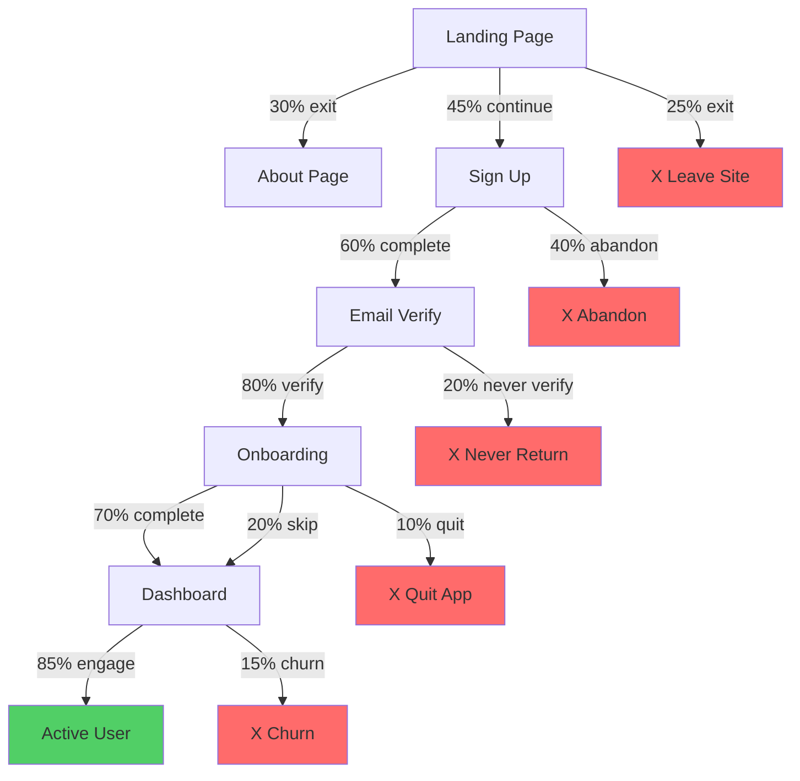

# Optimize User Flow Command

Analyze and improve user experience flows to reduce friction, increase conversion, and enhance satisfaction.

## Command Usage
```bash
clause --project UIDesignOrchestrator/project:optimize-user-flow "flow to optimize"
```

## Flow Analysis Framework

### 1. Current Flow Mapping


### 2. Friction Point Analysis
```javascript
const frictionAnalysis = {
  signUpFlow: {
    current: {
      steps: 5,
      fields: 12,
      averageTime: '4.5 minutes',
      dropOffRate: '40%',
      mainExitPoints: ['Password requirements', 'Phone verification']
    },
    
    issues: [
      {
        severity: 'high',
        location: 'Password creation',
        problem: 'Complex requirements not shown until error',
        impact: '15% abandon here',
        solution: 'Real-time password strength indicator'
      },
      {
        severity: 'medium',
        location: 'Profile setup',
        problem: 'Too many optional fields appear required',
        impact: '8% abandon here',
        solution: 'Progressive disclosure, mark optional clearly'
      }
    ]
  },
  
  onboardingFlow: {
    current: {
      steps: 7,
      completion: '70%',
      timeToValue: '12 minutes',
      skipRate: '20%'
    },
    
    issues: [
      {
        severity: 'high',
        location: 'Feature tour',
        problem: 'Too long, not relevant to user goals',
        impact: '25% skip entirely',
        solution: 'Contextual help instead of upfront tour'
      }
    ]
  }
};
```

### 3. Optimization Strategies

#### Reduce Steps
```javascript
// Before: 5-step signup
const signupV1 = [
  'Enter email',
  'Create password',
  'Enter profile info',
  'Verify email',
  'Complete setup'
];

// After: 2-step signup
const signupV2 = {
  step1: {
    title: 'Create Account',
    fields: ['email', 'password'],
    time: '30 seconds'
  },
  step2: {
    title: 'Personalize (Optional)',
    fields: ['name', 'role'],
    skippable: true,
    time: '15 seconds'
  },
  verification: 'Background process, no blocking'
};

// Implementation
const OptimizedSignup = () => {
  const [step, setStep] = useState(1);
  const [canSkip, setCanSkip] = useState(false);
  
  return (
    <div className="signup-flow">
      {/* Progress indicator showing only 2 steps */}
      <ProgressBar current={step} total={2} />
      
      {step === 1 ? (
        <form className="signup-essentials">
          <h2>Let's get started</h2>
          <input type="email" placeholder="Email" required />
          <input type="password" placeholder="Password" required />
          <PasswordStrength />
          <button type="submit">Continue</button>
          {/* Social login options */}
          <SocialLoginOptions />
        </form>
      ) : (
        <form className="signup-personalize">
          <h2>Almost done! (Optional)</h2>
          <p>Help us personalize your experience</p>
          <input type="text" placeholder="Name" />
          <select>
            <option>Select your role</option>
          </select>
          <button type="submit">Complete Setup</button>
          <button type="button" onClick={skip}>
            Skip for now
          </button>
        </form>
      )}
    </div>
  );
};
```

#### Progressive Disclosure
```javascript
const progressiveOnboarding = {
  immediate: {
    show: 'Core value proposition',
    action: 'One key action to try',
    time: '30 seconds'
  },
  
  contextual: {
    trigger: 'When user needs feature',
    format: 'Tooltip or inline help',
    dismissible: true
  },
  
  advanced: {
    availability: 'In help menu',
    format: 'Video tutorials',
    optional: true
  }
};

// Smart onboarding based on user type
const PersonalizedOnboarding = ({ userType }) => {
  const flows = {
    powerUser: ['Skip intro', 'Advanced features', 'Keyboard shortcuts'],
    casual: ['Visual tour', 'Basic features', 'Success celebration'],
    enterprise: ['Team setup', 'Permissions', 'Integration guide']
  };
  
  return <OnboardingFlow steps={flows[userType]} />;
};
```

#### Reduce Cognitive Load
```javascript
const cognitiveOptimizations = {
  forms: {
    before: '15 fields on one page',
    after: '3-5 fields per step with clear progress',
    
    smartDefaults: {
      country: 'Detect from IP',
      timezone: 'Auto-detect',
      language: 'Browser preference',
      currency: 'Based on country'
    },
    
    inputHelpers: {
      phone: 'Auto-format as typing',
      creditCard: 'Detect card type',
      address: 'Autocomplete API',
      date: 'Natural language parsing'
    }
  },
  
  decisions: {
    before: 'Choose from 12 plan options',
    after: '3 plans with clear differentiation',
    
    recommendation: {
      show: 'Most popular choice',
      highlight: 'Best for your needs',
      comparison: 'Simple feature table'
    }
  },
  
  navigation: {
    before: 'Everything visible at once',
    after: 'Progressive reveal based on user journey',
    
    personalization: {
      frequentActions: 'Surface to top',
      hideUnused: 'After 30 days',
      shortcuts: 'Learn user patterns'
    }
  }
};
```

### 4. Flow Optimization Patterns

#### Checkout Flow
```javascript
const optimizedCheckout = {
  // Single page with progress sections
  layout: 'vertical-sections',
  
  sections: [
    {
      title: 'Delivery',
      fields: ['email', 'address'],
      validation: 'inline',
      autofill: true
    },
    {
      title: 'Payment',
      fields: ['card'],
      security: 'badges-visible',
      express: ['Apple Pay', 'Google Pay']
    },
    {
      title: 'Review',
      editable: 'inline-edit',
      trust: 'guarantees-visible'
    }
  ],
  
  optimizations: [
    'Guest checkout prominent',
    'Auto-save progress',
    'Clear error recovery',
    'Mobile-optimized inputs',
    'Loading states for actions'
  ]
};
```

#### Search Flow
```javascript
const optimizedSearch = {
  instant: {
    trigger: 'On first keystroke',
    debounce: 300,
    predictions: 'Show top 5'
  },
  
  results: {
    loading: 'Skeleton screens',
    empty: 'Helpful suggestions',
    error: 'Fallback to categories'
  },
  
  filters: {
    common: 'Visible immediately',
    advanced: 'Progressive disclosure',
    mobile: 'Bottom sheet pattern'
  },
  
  history: {
    recent: 'Last 5 searches',
    popular: 'Trending searches',
    personal: 'Based on user behavior'
  }
};
```

### 5. A/B Testing Flows
```javascript
const flowExperiments = {
  experiment1: {
    name: 'Simplified Onboarding',
    hypothesis: 'Reducing steps increases completion',
    
    control: {
      steps: 7,
      completion: '70%',
      timeToValue: '12 min'
    },
    
    variant: {
      steps: 3,
      changes: [
        'Removed profile setup',
        'Made tour optional',
        'Added skip option'
      ],
      expected: '85% completion'
    },
    
    metrics: [
      'Completion rate',
      'Time to first value',
      '7-day retention',
      'Feature adoption'
    ]
  },
  
  experiment2: {
    name: 'Social Proof in Flow',
    hypothesis: 'Trust indicators reduce abandonment',
    
    variant: {
      additions: [
        'User count on signup',
        'Security badges visible',
        'Testimonial quotes',
        'Success stories'
      ]
    }
  }
};
```

### 6. Mobile Flow Optimization
```javascript
const mobileOptimizations = {
  touch: {
    targets: 'Minimum 48px',
    spacing: 'Prevent mis-taps',
    gestures: 'Swipe between steps'
  },
  
  input: {
    keyboards: 'Appropriate types',
    autofocus: 'First field only',
    scrolling: 'Smooth to errors'
  },
  
  progress: {
    fixed: 'Sticky header/footer',
    minimal: 'Dots not text',
    clear: 'Current position obvious'
  },
  
  forms: {
    before: 'Desktop form squeezed',
    after: 'Mobile-first redesign',
    
    optimizations: [
      'Single column layout',
      'Larger touch targets',
      'Native date pickers',
      'Camera for card scanning'
    ]
  }
};
```

## Implementation Guide

### Flow Metrics
```javascript
const flowMetrics = {
  quantitative: {
    conversionRate: 'Start to completion %',
    dropOffPoints: 'Where users leave',
    timeToComplete: 'Average duration',
    errorRate: 'Mistakes per user',
    backtrackRate: 'Previous step clicks'
  },
  
  qualitative: {
    userFeedback: 'Survey at completion',
    usabilityTesting: 'Observed sessions',
    supportTickets: 'Common problems',
    heatmaps: 'Interaction patterns'
  },
  
  calculate(before, after) {
    return {
      conversionLift: (after.conversion - before.conversion) / before.conversion,
      timeReduction: before.avgTime - after.avgTime,
      satisfactionGain: after.nps - before.nps
    };
  }
};
```

### Implementation Checklist
```yaml
pre_optimization:
  - [ ] Map current flow completely
  - [ ] Identify all exit points
  - [ ] Collect baseline metrics
  - [ ] User feedback gathered
  - [ ] Stakeholder alignment

optimization:
  - [ ] Reduce unnecessary steps
  - [ ] Simplify complex decisions
  - [ ] Add progress indicators
  - [ ] Improve error handling
  - [ ] Mobile optimization
  - [ ] Accessibility check
  - [ ] Performance impact assessed

post_optimization:
  - [ ] A/B test setup
  - [ ] Metrics tracking confirmed
  - [ ] Rollback plan ready
  - [ ] Documentation updated
  - [ ] Team training complete
```

## Output Format

### Optimization Report
```markdown
# User Flow Optimization Report

## Flow: New User Onboarding
**Date**: 2024-01-20
**Current Performance**: 70% completion, 12 min average

## Recommendations

### 1. Reduce Steps (High Impact)
**Current**: 7 steps
**Proposed**: 3 steps
**Method**: Combine related tasks, defer optional items
**Expected Impact**: +15% completion

### 2. Add Progress Indication (Medium Impact)
**Current**: No visibility of progress
**Proposed**: Step counter with time estimate
**Expected Impact**: +8% completion

### 3. Smart Defaults (Medium Impact)
**Current**: Empty fields
**Proposed**: Pre-fill detectable information
**Expected Impact**: -3 minutes completion time

## Implementation Plan

### Phase 1 (Week 1)
- Implement progress indicator
- Add skip options
- Begin A/B test

### Phase 2 (Week 2-3)
- Combine form steps
- Add smart defaults
- Mobile optimization

### Phase 3 (Week 4)
- Analyze results
- Iterate based on data
- Full rollout

## Success Metrics
- Target: 85% completion rate
- Target: 6 minute average time
- Target: +10 NPS score
```

---

*Optimize User Flow v1.0 | Flow analysis command | Conversion optimization*