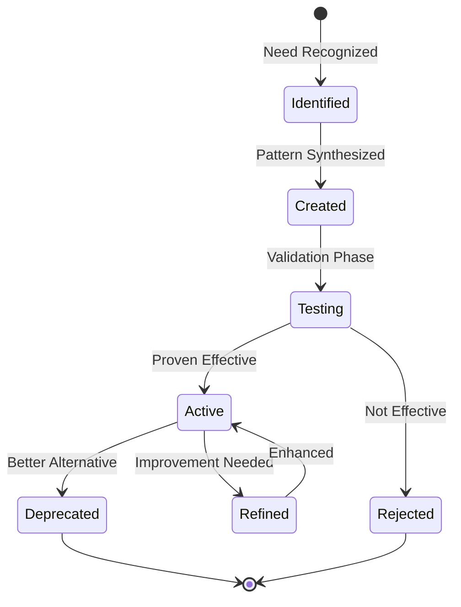

# MetaClaude Core Framework

## Overview

MetaClaude is a meta-cognitive framework that enables AI systems to think about their own thinking, adapt their reasoning patterns, and evolve their capabilities over time.

## Core Principles

### 1. Meta-Cognition
Systems that understand and can modify their own cognitive processes:
- **Self-Awareness**: Understanding current capabilities and limitations
- **Strategy Selection**: Choosing appropriate reasoning patterns
- **Performance Monitoring**: Tracking effectiveness of approaches
- **Adaptive Learning**: Modifying behavior based on outcomes

### 2. Pattern-Based Architecture
Reusable cognitive patterns that can be combined and extended:
- **Composability**: Patterns can be combined for complex reasoning
- **Extensibility**: New patterns can be created as needed
- **Domain Agnostic**: Core patterns work across all domains
- **Context Awareness**: Patterns adapt to situational needs

### 3. Multi-Agent Orchestration
Coordinated specialist agents working together:
- **Specialization**: Each agent has focused expertise
- **Collaboration**: Agents share information and build on each other's work
- **Parallel Processing**: Multiple agents can work simultaneously
- **Result Synthesis**: Intelligent aggregation of agent outputs

## Architecture Layers

### Cognitive Patterns Layer
Reusable thinking frameworks:

```yaml
patterns:
  reasoning:
    - analytical    # Systematic analysis and decomposition
    - creative      # Divergent thinking and innovation
    - strategic     # Long-term planning and systems thinking
    - adaptive      # Context-aware adjustment
    
  memory:
    - working       # Active task context
    - episodic      # Specific experiences
    - semantic      # General knowledge
    - procedural    # How-to knowledge
    
  learning:
    - feedback      # Learning from outcomes
    - transfer      # Applying knowledge across domains
    - synthesis     # Combining insights
    - generation    # Creating new patterns
```

### Orchestration Layer
Coordination and workflow management:

```yaml
orchestration:
  coordination:
    - task_analysis      # Understanding requirements
    - agent_selection    # Choosing specialists
    - work_distribution  # Assigning tasks
    - progress_tracking  # Monitoring execution
    
  execution:
    - sequential         # Ordered task execution
    - parallel           # Concurrent processing
    - iterative          # Cyclical refinement
    - adaptive           # Dynamic adjustment
    
  synthesis:
    - result_aggregation # Combining outputs
    - conflict_resolution # Handling contradictions
    - quality_assurance  # Ensuring standards
    - delivery_formatting # Presenting results
```

### Evolution Layer
Self-improvement capabilities:

```yaml
evolution:
  pattern_generation:
    - need_identification  # Recognizing gaps
    - pattern_synthesis    # Creating new patterns
    - validation_testing   # Ensuring effectiveness
    - integration         # Adding to repertoire
    
  performance_optimization:
    - metric_tracking     # Measuring effectiveness
    - bottleneck_analysis # Finding inefficiencies
    - strategy_refinement # Improving approaches
    - resource_allocation # Optimizing usage
    
  knowledge_accumulation:
    - experience_capture  # Recording interactions
    - insight_extraction  # Learning from data
    - pattern_recognition # Identifying trends
    - wisdom_development  # Building expertise
```

## Implementation Interface

### Core Components Every Implementation Must Provide

```typescript
interface Implementation {
  // Identity
  name: string;
  version: string;
  domain: string;
  description: string;
  
  // Agents
  orchestrator: Orchestrator;
  specialists: Specialist[];
  
  // Workflows
  workflows: Workflow[];
  
  // Integration
  patterns: PatternUsage;
  memory: MemoryConfig;
  evolution: EvolutionConfig;
}

interface Orchestrator {
  analyze(request: string): TaskAnalysis;
  plan(analysis: TaskAnalysis): ExecutionPlan;
  coordinate(plan: ExecutionPlan): CoordinationStrategy;
  synthesize(results: AgentResult[]): FinalOutput;
}

interface Specialist {
  name: string;
  expertise: string[];
  capabilities: Capability[];
  execute(task: Task): Result;
}
```

## Pattern Integration

### Using Core Patterns

```yaml
pattern_usage:
  import:
    - from: "reasoning-patterns"
      patterns: ["PASE", "systems-thinking"]
      
  extend:
    - base: "analytical-reasoning"
      additions:
        - domain_specific_analysis
        - specialized_metrics
        
  combine:
    - patterns: ["creative", "strategic"]
      method: "sequential"
      purpose: "innovation_planning"
```

### Memory Integration

```yaml
memory_config:
  working_memory:
    capacity: "context_window"
    persistence: "session"
    
  long_term_memory:
    storage: "structured_documents"
    retrieval: "semantic_search"
    
  shared_memory:
    between_agents: true
    between_sessions: true
```

## Evolution Mechanisms

### Pattern Lifecycle



### Learning Integration

```yaml
learning_pipeline:
  capture:
    - interaction_logs
    - performance_metrics
    - user_feedback
    
  analyze:
    - pattern_effectiveness
    - failure_modes
    - success_factors
    
  synthesize:
    - new_patterns
    - refined_strategies
    - updated_heuristics
    
  integrate:
    - test_in_sandbox
    - gradual_rollout
    - performance_monitoring
```

## Quality Standards

### Cognitive Quality
- **Coherence**: Reasoning is logical and consistent
- **Completeness**: All aspects are considered
- **Adaptability**: Responds appropriately to context
- **Efficiency**: Achieves goals with minimal resources

### Implementation Quality
- **Modularity**: Clear separation of concerns
- **Reusability**: Components can be shared
- **Maintainability**: Easy to update and extend
- **Documentation**: Comprehensive and clear

### Output Quality
- **Accuracy**: Correct and reliable results
- **Relevance**: Addresses actual needs
- **Clarity**: Easy to understand
- **Actionability**: Provides practical value

## Usage Guidelines

### For Users
1. Describe your needs in natural language
2. Specify implementation if multiple options
3. Provide context and constraints
4. Iterate based on results

### For Developers
1. Understand core patterns
2. Define domain specialists
3. Create workflows
4. Integrate with framework
5. Test thoroughly
6. Document clearly

## Future Directions

### Near Term
- Cross-implementation collaboration
- Enhanced pattern generation
- Improved memory systems
- Better explainability

### Long Term
- Autonomous goal setting
- Creative problem discovery
- Ethical reasoning integration
- Consciousness modeling