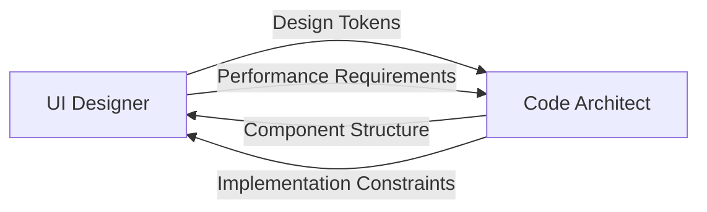
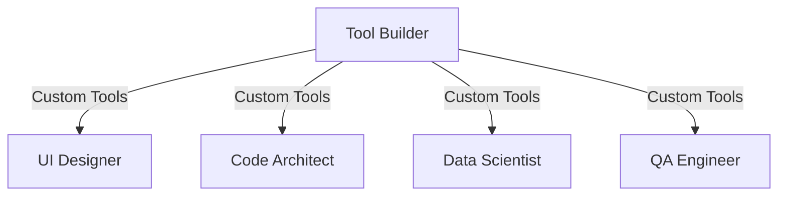

# MetaClaude Specialist Capabilities Reference

## Overview

MetaClaude specialists are domain-focused AI implementations that leverage the universal cognitive framework to provide expert-level assistance across various technical and creative disciplines. Each specialist consists of multiple agents working in orchestrated harmony to deliver comprehensive solutions.

## Capability Matrix

| Specialist | Core Capabilities | Agent Count | Workflow Count | Maturity Level |
|------------|-------------------|-------------|----------------|----------------|
| **UI Designer** | Visual design, UX research, design systems, accessibility | 7 agents | 8 workflows | ✅ Production Ready |
| **Tool Builder** | Dynamic tool creation, integration, validation | 5 agents | 2 workflows | 🔄 In Development |
| **Code Architect** | System design, architecture patterns, performance optimization | 4 agents | 3 workflows | 📋 Planned |
| **Data Scientist** | EDA, ML modeling, statistical analysis, insights | 4 agents | 3 workflows | 📋 Planned |
| **PRD Specialist** | Requirements analysis, user stories, stakeholder alignment | 4 agents | 4 workflows | 📋 Planned |
| **QA Engineer** | Test planning, automation, defect analysis | 4 agents | 3 workflows | 📋 Planned |
| **DevOps Engineer** | CI/CD, IaC, deployment strategies, monitoring | 4 agents | 3 workflows | 📋 Planned |
| **Technical Writer** | Documentation, API docs, diagrams, content management | 4 agents | 3 workflows | 📋 Planned |
| **Security Auditor** | Vulnerability scanning, threat modeling, compliance | 4 agents | 3 workflows | 📋 Planned |

## UI Designer Specialist (Production Ready)

### Capabilities
The UI Designer is a comprehensive design system that can:
- Extract visual DNA from inspiration sources
- Generate multiple design variations in parallel
- Create complete design systems with tokens
- Ensure WCAG AAA accessibility compliance
- Develop user personas and journey maps
- Produce production-ready Tailwind CSS code

### Agents

#### 1. Design Analyst
- **Function**: Visual DNA extraction and pattern recognition
- **Inputs**: Images, URLs, brand guidelines, competitor designs
- **Outputs**: Design tokens, pattern libraries, visual analysis reports
- **Key Skills**: Color extraction, typography analysis, gestalt principles

#### 2. Style Guide Expert
- **Function**: Design system creation and token management
- **Inputs**: Design DNA, brand requirements, existing guidelines
- **Outputs**: Component libraries, style documentation, design tokens
- **Key Skills**: Systematic design, consistency management, documentation

#### 3. UI Generator
- **Function**: Screen creation with modern frameworks
- **Inputs**: Design tokens, wireframes, content requirements
- **Outputs**: HTML/CSS code, React components, responsive layouts
- **Key Skills**: Tailwind CSS, responsive design, component architecture

#### 4. UX Researcher
- **Function**: User research and validation
- **Inputs**: User data, market research, competitor analysis
- **Outputs**: Personas, journey maps, usability reports
- **Key Skills**: User psychology, data analysis, empathy mapping

#### 5. Brand Strategist
- **Function**: Identity development and emotional design
- **Inputs**: Brand values, target audience, market position
- **Outputs**: Brand guidelines, emotional design specs, identity systems
- **Key Skills**: Brand psychology, market positioning, storytelling

#### 6. Accessibility Auditor
- **Function**: WCAG compliance and inclusive design
- **Inputs**: UI designs, code implementations, user requirements
- **Outputs**: Accessibility reports, remediation plans, compliance certificates
- **Key Skills**: WCAG standards, assistive technology, inclusive design

#### 7. Design Orchestrator
- **Function**: Coordinate multi-agent design workflows
- **Inputs**: Project requirements, user requests, feedback
- **Outputs**: Orchestrated design deliverables, project timelines
- **Key Skills**: Project management, agent coordination, quality control

### Common Use Cases

1. **Startup MVP Design** (2-3 hours)
   ```
   "Create a modern SaaS dashboard for project management"
   → Generates 3-5 variations with complete design system
   ```

2. **Design System Creation** (4-6 hours)
   ```
   "Build a comprehensive design system for our fintech app"
   → Delivers tokens, components, documentation
   ```

3. **UI Modernization** (1-2 hours)
   ```
   "Update our legacy enterprise UI to modern standards"
   → Provides migration plan and new designs
   ```

4. **Brand Identity Design** (3-4 hours)
   ```
   "Create a complete brand identity for an AI startup"
   → Generates logo concepts, colors, typography, guidelines
   ```

### Command Reference

```bash
# Analysis Commands
/project:extract-design-dna "inspiration_source"
/analyze:visual-patterns "design_reference"
/audit:accessibility "ui_component"

# Generation Commands
/project:generate-mvp-concept "product_description"
/project:create-ui-variations "component_list"
/create:design-system "brand_name"

# Optimization Commands
/project:iterate-designs "feedback"
/project:optimize-user-flow "current_flow"
/enhance:performance "ui_element"

# Export Commands
/project:export-design-system
/export:components "format"
/generate:documentation
```

## Tool Builder Specialist (In Development)

### Capabilities
The Tool Builder enables MetaClaude to:
- Dynamically create new tools based on needs
- Integrate external APIs and services
- Generate custom automation scripts
- Validate and test new tools
- Self-extend MetaClaude's capabilities

### Agents

#### 1. Tool Requirements Analyst
- **Function**: Interpret and clarify tool requests
- **Inputs**: Natural language requests, use cases, constraints
- **Outputs**: Formal specifications, requirements documents
- **Key Skills**: Requirements engineering, API design, user needs analysis

#### 2. Tool Design Architect
- **Function**: Design tool structure and interfaces
- **Inputs**: Requirements, existing tools, integration points
- **Outputs**: Tool architecture, API specifications, integration plans
- **Key Skills**: Software architecture, API design, modularity

#### 3. Tool Code Generator
- **Function**: Generate executable tool code
- **Inputs**: Design specifications, templates, constraints
- **Outputs**: Python scripts, shell commands, API wrappers
- **Key Skills**: Code generation, multiple languages, best practices

#### 4. Tool Integrator
- **Function**: Register and integrate new tools
- **Inputs**: Tool implementations, MetaClaude configuration
- **Outputs**: Updated tool registry, integration documentation
- **Key Skills**: System integration, configuration management

#### 5. Tool Validator
- **Function**: Test and validate new tools
- **Inputs**: Tool implementation, test scenarios, requirements
- **Outputs**: Test results, validation reports, performance metrics
- **Key Skills**: Testing methodologies, error handling, security

### Common Use Cases

1. **API Wrapper Creation**
   ```
   "Create a tool to fetch weather data from OpenWeather API"
   → Generates complete API wrapper with error handling
   ```

2. **Data Processing Tool**
   ```
   "Build a tool to convert CSV files to JSON with validation"
   → Creates script with format conversion and validation
   ```

3. **Automation Script**
   ```
   "Generate a tool to automatically organize project files"
   → Produces file organization utility with customization
   ```

## Integration Patterns

### Cross-Specialist Collaboration

#### UI Designer + Code Architect


#### Tool Builder + All Specialists


### Memory-Driven Coordination
Specialists share context through MetaClaude's memory system:

```yaml
shared_memory:
  project_context:
    brand_guidelines: "stored_by_ui_designer"
    architecture_decisions: "stored_by_code_architect"
    test_scenarios: "stored_by_qa_engineer"
  
  cross_references:
    ui_components: ["button", "form", "modal"]
    api_endpoints: ["/auth", "/users", "/data"]
    test_coverage: "87%"
```

### Workflow Orchestration
Complex projects utilize multiple specialists in sequence:

```bash
# Example: Full Stack Application Development
1. PRD Specialist → Define requirements
2. UI Designer → Create interface designs
3. Code Architect → Design system architecture
4. Tool Builder → Create project-specific tools
5. QA Engineer → Generate test plans
6. DevOps Engineer → Setup deployment pipeline
```

## Performance Characteristics

### Response Times
| Operation | UI Designer | Tool Builder | Code Architect |
|-----------|-------------|--------------|----------------|
| Simple Task | 30-60s | 45-90s | 60-120s |
| Complex Task | 2-5min | 3-8min | 5-10min |
| Full Workflow | 15-60min | 20-45min | 30-90min |

### Resource Requirements
- **Memory**: 2-4GB per active specialist
- **Processing**: Parallel agent execution benefits from multi-core
- **Storage**: 100MB-1GB per project (includes generated assets)
- **Network**: API calls for tool integration and validation

### Scalability
- **Concurrent Specialists**: Up to 5 active simultaneously
- **Agent Parallelism**: 3-8 agents per specialist
- **Project Size**: Tested up to 1000+ component systems

## Command Reference Summary

### Universal Commands
```bash
# Specialist Management
/specialist:list                    # Show available specialists
/specialist:activate <name>         # Activate a specialist
/specialist:status                  # Current specialist status

# Workflow Execution
/workflow:start <workflow_name>     # Begin workflow
/workflow:status                    # Check workflow progress
/workflow:pause|resume|cancel       # Control workflow

# Memory Operations
/memory:store <key> <value>         # Store in shared memory
/memory:retrieve <key>              # Get from memory
/memory:list                        # Show memory contents
```

### Specialist-Specific Commands
Each specialist extends the command set with domain-specific operations. See individual specialist documentation for complete command references.

## Future Enhancement Possibilities

### Near-term (3-6 months)
1. **Enhanced Integration**
   - Direct IDE plugins for all specialists
   - Real-time collaboration features
   - Cloud-based specialist hosting

2. **Advanced Capabilities**
   - Multi-modal input (voice, sketches, gestures)
   - Real-time design-to-code generation
   - Automated A/B testing integration

3. **Performance Optimization**
   - GPU acceleration for design operations
   - Distributed agent processing
   - Intelligent caching strategies

### Long-term (6-12 months)
1. **New Specialists**
   - Business Analyst
   - Marketing Strategist
   - Game Designer
   - Hardware Engineer

2. **Cross-Domain Innovation**
   - AI-powered design critique
   - Automated accessibility remediation
   - Predictive performance optimization

3. **Enterprise Features**
   - Team collaboration workflows
   - Compliance automation
   - Custom specialist creation framework

## Best Practices

### 1. Start with Clear Requirements
```bash
# Good
"Create a modern e-commerce checkout flow with accessibility focus"

# Better
"Design a 3-step checkout flow for mobile e-commerce with WCAG AAA compliance, supporting Apple Pay and guest checkout"
```

### 2. Leverage Memory for Context
```bash
# Store project context early
/memory:store "project_type" "enterprise_saas"
/memory:store "target_users" "financial_analysts"

# Specialists will automatically use this context
```

### 3. Use Appropriate Workflows
- Quick iterations: Use individual commands
- Complete projects: Use full workflows
- Exploration: Combine multiple specialists

### 4. Provide Feedback
```bash
# Iterative improvement
/project:create-ui-variations "dashboard"
# Review output...
/project:iterate-designs "make charts larger, add dark mode"
```

### 5. Export and Version
```bash
# Always export final deliverables
/project:export-design-system
/export:code "react"
/generate:documentation
```

## Troubleshooting

### Common Issues

1. **Slow Response Times**
   - Check available system resources
   - Consider breaking complex tasks into steps
   - Use parallel processing when available

2. **Inconsistent Outputs**
   - Ensure clear requirements
   - Use memory to maintain context
   - Provide specific examples

3. **Integration Failures**
   - Verify API credentials
   - Check network connectivity
   - Review error logs

## Conclusion

MetaClaude specialists represent a new paradigm in AI-assisted development, where domain expertise is encoded into collaborative agent systems. By understanding each specialist's capabilities and optimal use cases, teams can dramatically accelerate their development workflows while maintaining high quality standards.

For detailed implementation guides and advanced usage patterns, refer to individual specialist documentation in their respective directories.