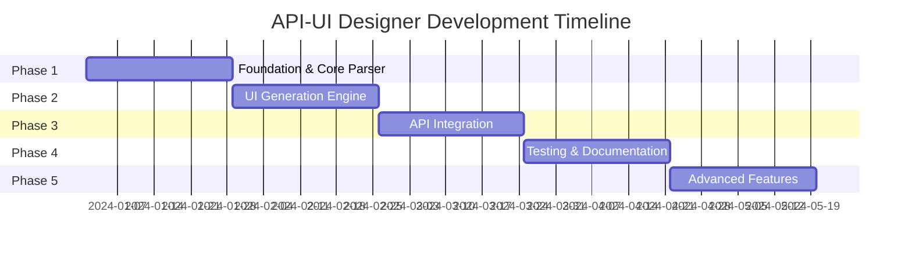

# API-UI Designer Development Plan

## Executive Summary

This document outlines the 5-phase development plan for the API-UI Designer specialist system. The complete implementation is estimated at 16-20 weeks, with the first usable version available in 6 weeks.

## Phase 1: Foundation & Core Parser (Weeks 1-4)

### Objectives
- Establish core architecture and agent framework
- Implement API specification parsers
- Create basic UI pattern matching engine
- Develop initial component generation logic

### Deliverables

#### Week 1-2: Architecture & Setup
- [ ] Core agent framework implementation
- [ ] Message passing system between agents
- [ ] Configuration management system
- [ ] Development environment setup
- [ ] Basic test infrastructure

#### Week 3-4: API Parsing
- [ ] OpenAPI 3.0/3.1 parser
- [ ] Swagger 2.0 compatibility layer
- [ ] GraphQL schema parser
- [ ] REST API documentation parser
- [ ] Unified API model representation

### Success Metrics
- Parse 95% of valid OpenAPI specifications
- Extract all endpoint information accurately
- Support nested data structures up to 5 levels
- Process specifications up to 10MB in under 5 seconds

### Integration Points
- MetaClaude orchestration system hooks
- File system monitoring for API spec changes
- Version control integration for diff detection

## Phase 2: UI Generation Engine (Weeks 5-8)

### Objectives
- Build component generation system
- Implement framework-specific generators
- Create form validation logic
- Develop layout algorithms

### Deliverables

#### Week 5-6: Component Generators
- [ ] React component generator
- [ ] Vue component generator
- [ ] Angular component generator
- [ ] Form field mapping logic
- [ ] Validation rule generator

#### Week 7-8: Advanced Features
- [ ] Nested form support
- [ ] Array/list handling
- [ ] File upload components
- [ ] Rich text editors
- [ ] Custom component plugins

### Success Metrics
- Generate syntactically correct components 100% of the time
- Support 20+ common field types
- Handle complex nested structures
- Generate accessible components (WCAG 2.1 AA)

### Integration Points
- UI Component Library for reusable patterns
- Design System Enforcer for style compliance
- Code formatter integration (Prettier/ESLint)

## Phase 3: API Integration & State Management (Weeks 9-12)

### Objectives
- Generate API client code
- Implement state management patterns
- Create error handling logic
- Build authentication flows

### Deliverables

#### Week 9-10: API Clients
- [ ] Axios-based client generator
- [ ] Fetch API generator
- [ ] GraphQL client generator (Apollo/urql)
- [ ] Request/response type generation
- [ ] Error handling patterns

#### Week 11-12: State Management
- [ ] React Context/Redux integration
- [ ] Vuex/Pinia store generation
- [ ] Angular service generation
- [ ] Optimistic update logic
- [ ] Cache management

### Success Metrics
- Type-safe API calls with 100% coverage
- Automatic retry logic for failed requests
- Response time optimization (caching, batching)
- Proper error boundary implementation

### Integration Points
- Performance Optimizer for API call optimization
- Security Scanner for vulnerability detection
- Network Monitor for debugging support

## Phase 4: Testing & Documentation (Weeks 13-16)

### Objectives
- Generate comprehensive test suites
- Create documentation
- Build example applications
- Implement quality assurance

### Deliverables

#### Week 13-14: Test Generation
- [ ] Unit test generator for components
- [ ] Integration test generator for API calls
- [ ] E2E test scenario generator
- [ ] Mock data factory generator
- [ ] Visual regression test setup

#### Week 15-16: Documentation & Examples
- [ ] Component documentation generator
- [ ] API integration guides
- [ ] Interactive examples
- [ ] Video tutorials
- [ ] Best practices guide

### Success Metrics
- 80%+ code coverage for generated components
- All examples run without errors
- Documentation covers 100% of features
- Load testing shows <100ms generation time per component

### Integration Points
- Test Runner integration (Jest/Vitest/Cypress)
- Documentation system (Storybook/Docusaurus)
- CI/CD pipeline integration

## Phase 5: Advanced Features & Optimization (Weeks 17-20)

### Objectives
- Implement advanced UI patterns
- Optimize performance
- Add enterprise features
- Create plugin system

### Deliverables

#### Week 17-18: Advanced Patterns
- [ ] Real-time data synchronization
- [ ] Offline-first capabilities
- [ ] Collaborative editing support
- [ ] Advanced search/filter UI
- [ ] Data visualization components

#### Week 19-20: Enterprise & Extensibility
- [ ] Plugin architecture
- [ ] Custom template system
- [ ] Multi-tenant support
- [ ] Audit trail generation
- [ ] Compliance templates (HIPAA, GDPR)

### Success Metrics
- Support for 50+ UI patterns
- Plugin system with 10+ official plugins
- Generation time <1s for average API
- Memory usage <100MB for large specifications

### Integration Points
- Plugin marketplace integration
- Enterprise authentication systems
- Cloud deployment platforms
- Monitoring and analytics systems

## Timeline Summary

## Resource Requirements

### Development Team
- 2 Senior Engineers (full-time)
- 1 UI/UX Designer (50%)
- 1 Technical Writer (25%)
- 1 QA Engineer (50%)

### Infrastructure
- Development servers for testing
- CI/CD pipeline
- Documentation hosting
- Example application hosting

## Risk Mitigation

### Technical Risks
1. **API Specification Complexity**
   - Mitigation: Incremental parser development
   - Fallback: Manual override options

2. **Framework Compatibility**
   - Mitigation: Modular generator architecture
   - Fallback: Template-based generation

3. **Performance at Scale**
   - Mitigation: Streaming parser implementation
   - Fallback: Batch processing mode

### Schedule Risks
1. **Parser Development Delays**
   - Mitigation: Use existing parser libraries
   - Buffer: 1 week built into Phase 1

2. **Integration Complexity**
   - Mitigation: Early integration testing
   - Buffer: 2 weeks total across phases

## Success Criteria

### Phase 1 Success
- Successfully parse and model 3 different API specifications
- Generate basic CRUD components for simple endpoints
- Integration with MetaClaude orchestration

### Phase 2 Success
- Generate complete UI for a medium-complexity API (20-30 endpoints)
- Support for all common field types and validations
- Design system compliance validation passing

### Phase 3 Success
- Working API integration with proper error handling
- State management that handles complex scenarios
- Performance metrics meeting targets

### Phase 4 Success
- Test coverage exceeding 80% for generated code
- Complete documentation with examples
- Positive feedback from beta users

### Phase 5 Success
- Production deployment with 5+ real projects
- Plugin ecosystem with community contributions
- Performance handling large-scale APIs (1000+ endpoints)

## Continuous Improvement

### Feedback Loops
- Weekly user feedback sessions
- Automated performance monitoring
- Community feature requests
- Integration partner feedback

### Iteration Cycles
- Bi-weekly releases during development
- Monthly feature releases post-launch
- Quarterly major version updates
- Continuous security patches

## Conclusion

The API-UI Designer represents a significant advancement in development automation. By following this phased approach, we can deliver value early while building toward a comprehensive solution that transforms how teams build user interfaces for APIs.

The modular architecture ensures that each phase delivers standalone value while building toward the complete vision. Integration with the broader MetaClaude ecosystem amplifies the impact by enabling sophisticated workflows that combine multiple AI specialists.

Success will be measured not just by technical metrics, but by the real-world impact on development teams - reducing time-to-market, improving consistency, and allowing developers to focus on innovation rather than repetitive implementation tasks.