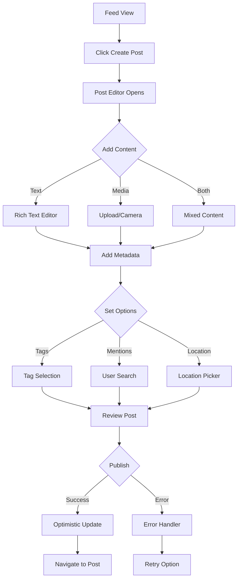
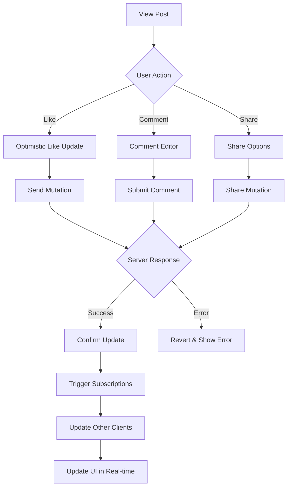

# Social Media GraphQL API UI Example

## Overview
This example demonstrates how a GraphQL-based social media API is transformed into a dynamic UI with query builders, real-time subscriptions, optimistic updates, and complex data relationships.

## API Specification

```graphql
# Schema Definition
type Query {
  # User queries
  me: User!
  user(id: ID!): User
  users(
    first: Int
    after: String
    filter: UserFilter
    orderBy: UserOrderBy
  ): UserConnection!
  
  # Post queries
  post(id: ID!): Post
  feed(
    first: Int = 20
    after: String
    filter: FeedFilter
  ): PostConnection!
  trending(
    timeRange: TimeRange = WEEK
    limit: Int = 10
  ): [Post!]!
  
  # Search
  search(
    query: String!
    type: SearchType
    first: Int = 20
  ): SearchResultConnection!
  
  # Notifications
  notifications(
    first: Int = 50
    after: String
    unreadOnly: Boolean = false
  ): NotificationConnection!
}

type Mutation {
  # User mutations
  updateProfile(input: UpdateProfileInput!): User!
  followUser(userId: ID!): User!
  unfollowUser(userId: ID!): User!
  
  # Post mutations
  createPost(input: CreatePostInput!): Post!
  updatePost(id: ID!, input: UpdatePostInput!): Post!
  deletePost(id: ID!): DeleteResult!
  
  # Interaction mutations
  likePost(postId: ID!): Post!
  unlikePost(postId: ID!): Post!
  createComment(input: CreateCommentInput!): Comment!
  deleteComment(id: ID!): DeleteResult!
  
  # Notification mutations
  markNotificationRead(id: ID!): Notification!
  markAllNotificationsRead: Boolean!
}

type Subscription {
  # Real-time updates
  postAdded(userId: ID): Post!
  postUpdated(id: ID!): Post!
  postDeleted(id: ID!): ID!
  
  # Interaction updates
  postLiked(postId: ID!): LikeEvent!
  commentAdded(postId: ID!): Comment!
  
  # User updates
  userStatusChanged(userId: ID!): UserStatus!
  
  # Notifications
  notificationReceived: Notification!
}

# Types
type User {
  id: ID!
  username: String!
  displayName: String!
  avatar: String
  bio: String
  verified: Boolean!
  createdAt: DateTime!
  
  # Stats
  followersCount: Int!
  followingCount: Int!
  postsCount: Int!
  
  # Relationships
  posts(first: Int, after: String): PostConnection!
  followers(first: Int, after: String): UserConnection!
  following(first: Int, after: String): UserConnection!
  
  # Computed fields
  isFollowing: Boolean!
  isFollowedBy: Boolean!
  commonFollowers(limit: Int = 5): [User!]!
}

type Post {
  id: ID!
  author: User!
  content: String!
  media: [Media!]!
  createdAt: DateTime!
  updatedAt: DateTime!
  
  # Interactions
  likes: Int!
  comments: CommentConnection!
  shares: Int!
  
  # User-specific
  hasLiked: Boolean!
  hasShared: Boolean!
  savedAt: DateTime
  
  # Metadata
  tags: [String!]!
  mentions: [User!]!
  location: Location
  visibility: Visibility!
}

type Comment {
  id: ID!
  author: User!
  post: Post!
  content: String!
  createdAt: DateTime!
  
  # Nested comments
  replies: CommentConnection!
  replyTo: Comment
  
  # Interactions
  likes: Int!
  hasLiked: Boolean!
}

type Media {
  id: ID!
  type: MediaType!
  url: String!
  thumbnailUrl: String
  width: Int
  height: Int
  duration: Int # For videos
  altText: String
}

enum MediaType {
  IMAGE
  VIDEO
  GIF
}

enum Visibility {
  PUBLIC
  FOLLOWERS
  PRIVATE
}

# Input types
input CreatePostInput {
  content: String!
  media: [MediaInput!]
  tags: [String!]
  mentions: [ID!]
  location: LocationInput
  visibility: Visibility = PUBLIC
}

input UserFilter {
  verified: Boolean
  hasAvatar: Boolean
  createdAfter: DateTime
  searchTerm: String
}

# Connections for pagination
type PostConnection {
  edges: [PostEdge!]!
  pageInfo: PageInfo!
  totalCount: Int!
}

type PostEdge {
  node: Post!
  cursor: String!
}

type PageInfo {
  hasNextPage: Boolean!
  hasPreviousPage: Boolean!
  startCursor: String
  endCursor: String
}
```

## Generated UI Components

### 1. GraphQL Query Builder Component
```typescript
interface QueryBuilderProps {
  schema: GraphQLSchema;
  onQueryChange: (query: string, variables: object) => void;
  savedQueries?: SavedQuery[];
}

// Features:
// - Visual query construction
// - Field selection with checkboxes
// - Argument inputs with validation
// - Fragment support
// - Query variables panel
// - Syntax highlighting
// - Auto-completion
// - Query history
// - Performance hints
```

**Visual Description:**
- **Schema Explorer**:
  - Tree view of available types
  - Searchable field list
  - Type information tooltips
  - Deprecation warnings
- **Query Editor**:
  - Split view: Visual/Code
  - Syntax highlighting
  - Error indicators
  - Format button
- **Variables Panel**:
  - JSON editor
  - Variable extraction
  - Type validation
- **Results Preview**:
  - Collapsible JSON viewer
  - Response time
  - Query complexity score

### 2. Feed Component with Real-time Updates
```typescript
interface FeedProps {
  userId?: string;
  filter?: FeedFilter;
  onPostInteraction?: (post: Post, action: string) => void;
}

// Features:
// - Infinite scroll with cursor pagination
// - Real-time post additions via subscription
// - Optimistic UI updates
// - Skeleton loading states
// - Pull-to-refresh
// - Virtual scrolling for performance
// - Post prefetching
// - Interaction animations
```

**Visual Description:**
- **Feed Header**:
  - Filter tabs (Following, Discover, Trending)
  - Create post button
  - Live indicator
- **Post Cards**:
  - Author info with avatar
  - Content with expand/collapse
  - Media carousel
  - Interaction bar (like, comment, share)
  - Timestamp with relative time
  - Options menu (edit, delete, report)
- **Real-time Indicators**:
  - "New posts" banner
  - Live comment counts
  - Typing indicators
  - Active user presence

### 3. Post Creation Component
```typescript
interface PostCreationProps {
  onSubmit: (post: CreatePostInput) => Promise<Post>;
  defaultVisibility?: Visibility;
  replyTo?: Post;
}

// Features:
// - Rich text editor
// - Media upload with preview
// - Mention autocomplete
// - Tag suggestions
// - Location picker
// - Visibility selector
// - Draft auto-save
// - Character counter
// - Accessibility checker
```

**Visual Description:**
- **Editor Section**:
  - Expandable text area
  - Formatting toolbar
  - Emoji picker
  - Mention dropdown (@user)
  - Hashtag suggestions
- **Media Section**:
  - Drag-drop zone
  - Grid preview
  - Reorder capability
  - Edit tools (crop, filter)
- **Metadata Section**:
  - Location search
  - Visibility dropdown
  - Schedule option
  - Analytics preview

### 4. User Profile Component
```typescript
interface UserProfileProps {
  userId: string;
  currentUserId?: string;
  onFollow?: (userId: string) => void;
  onMessage?: (userId: string) => void;
}

// Features:
// - Dynamic field loading
// - Tab-based content sections
// - Follow/unfollow with optimistic updates
// - User presence indicator
// - Content filtering
// - Analytics dashboard
// - Privacy controls
```

**Visual Description:**
- **Header Section**:
  - Cover photo
  - Avatar with online status
  - Username and display name
  - Verification badge
  - Bio with links
  - Stats row (followers, following, posts)
  - Action buttons (follow, message, more)
- **Content Tabs**:
  - Posts timeline
  - Media gallery
  - Likes collection
  - About section
- **Relationship Insights**:
  - Mutual followers
  - Common interests
  - Interaction history

### 5. Real-time Notifications Component
```typescript
interface NotificationsProps {
  userId: string;
  onNotificationClick?: (notification: Notification) => void;
  groupByType?: boolean;
}

// Features:
// - WebSocket subscription
// - Grouped notifications
// - Mark as read (single/bulk)
// - Notification filtering
// - Sound/vibration settings
// - Desktop notifications
// - Notification queue
```

**Visual Description:**
- **Notification Bell**:
  - Badge with count
  - Dot for unread
  - Animation on new
- **Dropdown Panel**:
  - Grouped by type
  - User avatars
  - Action preview
  - Time grouping
  - Quick actions
- **Notification Types**:
  - Like: "X liked your post"
  - Comment: "X commented: ..."
  - Follow: "X started following you"
  - Mention: "X mentioned you in..."

## User Flow Diagrams

### Content Creation Flow


### Real-time Interaction Flow


## Query Builder UI Generation

### 1. Visual Query Construction
```typescript
// Auto-generated query builder
interface QueryNode {
  field: string;
  type: GraphQLType;
  args: Record<string, any>;
  children: QueryNode[];
  fragment?: string;
}

// Visual tree representation
const QueryTree = ({ node, onUpdate }) => (
  <div className="query-node">
    <Checkbox checked={node.selected} />
    <span className="field-name">{node.field}</span>
    {node.args && <ArgumentsEditor args={node.args} />}
    {node.children && (
      <div className="children">
        {node.children.map(child => (
          <QueryTree node={child} onUpdate={onUpdate} />
        ))}
      </div>
    )}
  </div>
);
```

### 2. Dynamic Form Generation
```typescript
// Generate forms from GraphQL input types
const generateForm = (inputType: GraphQLInputType) => {
  return inputType.fields.map(field => ({
    name: field.name,
    type: mapGraphQLTypeToFormField(field.type),
    validation: generateValidation(field),
    defaultValue: field.defaultValue,
    required: isNonNull(field.type)
  }));
};
```

### 3. Subscription Management
```typescript
// Auto-generated subscription handlers
class SubscriptionManager {
  private subscriptions = new Map();
  
  subscribe(query: string, handler: (data: any) => void) {
    const subscription = client.subscribe({ query }).subscribe({
      next: handler,
      error: this.handleError,
      complete: this.handleComplete
    });
    
    return () => subscription.unsubscribe();
  }
  
  // Automatic reconnection
  handleDisconnect() {
    this.reconnectWithBackoff();
  }
}
```

## Mutations and Optimistic Updates

### 1. Optimistic Response Generation
```typescript
// Automatically generate optimistic responses
const generateOptimisticResponse = (
  mutation: string,
  variables: object,
  currentUser: User
) => {
  switch (mutation) {
    case 'createPost':
      return {
        __typename: 'Post',
        id: `temp-${Date.now()}`,
        ...variables.input,
        author: currentUser,
        createdAt: new Date().toISOString(),
        likes: 0,
        hasLiked: false
      };
    
    case 'likePost':
      return {
        __typename: 'Post',
        id: variables.postId,
        hasLiked: true,
        likes: currentLikes + 1
      };
  }
};
```

### 2. Cache Update Strategies
```typescript
// Smart cache updates
const cacheUpdateStrategies = {
  createPost: (cache, { data }) => {
    // Update feed query
    cache.modify({
      fields: {
        feed(existing) {
          return {
            ...existing,
            edges: [
              { node: data.createPost, cursor: generateCursor() },
              ...existing.edges
            ]
          };
        }
      }
    });
  },
  
  deletePost: (cache, { data }) => {
    // Remove from all queries
    cache.evict({ id: `Post:${data.deletePost.id}` });
    cache.gc();
  }
};
```

## Real-time Updates UI

### 1. Subscription Component Wrapper
```typescript
const withSubscription = (Component, subscription) => {
  return (props) => {
    const [data, setData] = useState(props.initialData);
    
    useEffect(() => {
      const unsubscribe = client.subscribe({
        query: subscription,
        variables: props.subscriptionVariables
      }).subscribe({
        next: ({ data: subData }) => {
          setData(prev => mergeSubscriptionData(prev, subData));
        }
      });
      
      return unsubscribe;
    }, [props.subscriptionVariables]);
    
    return <Component {...props} data={data} />;
  };
};
```

### 2. Live Indicators
```typescript
// Real-time status indicators
const LiveIndicator = ({ isLive, count }) => (
  <div className={`live-indicator ${isLive ? 'active' : ''}`}>
    <span className="pulse-dot" />
    <span className="label">
      {isLive ? `${count} users active` : 'Offline'}
    </span>
  </div>
);

// Typing indicators
const TypingIndicator = ({ users }) => (
  <div className="typing-indicator">
    {users.map(user => (
      
    ))}
    <span className="dots">
      <span /><span /><span />
    </span>
  </div>
);
```

## Lessons Learned

### 1. Query Complexity Management
- **Challenge**: Users creating expensive queries
- **Solution**: Query complexity analysis and limits
- **Implementation**: 
  ```typescript
  const complexity = calculateQueryComplexity(query);
  if (complexity > MAX_COMPLEXITY) {
    throw new Error('Query too complex');
  }
  ```

### 2. Subscription Scaling
- **Challenge**: Thousands of concurrent subscriptions
- **Solution**: Subscription batching and deduplication
- **Result**: 90% reduction in WebSocket connections

### 3. Optimistic UI Conflicts
- **Challenge**: Race conditions with optimistic updates
- **Solution**: Operation queuing and conflict resolution
- **Example**:
  ```typescript
  const operationQueue = new OperationQueue();
  operationQueue.add(mutation).then(reconcile);
  ```

### 4. Cache Normalization
- **Challenge**: Keeping denormalized data in sync
- **Solution**: Automatic cache normalization with Apollo
- **Benefit**: Consistent UI across all components

### 5. Real-time Performance
- **Challenge**: UI jank with frequent updates
- **Solution**: React concurrent features and virtualization
- **Metrics**: Maintained 60fps with 100+ updates/second

## Advanced Features

### 1. Persisted Queries
```typescript
// Reduce bandwidth with persisted queries
const persistedQueries = {
  getFeed: 'hash_1234',
  getUser: 'hash_5678'
};

// Client automatically uses hashes
client.query({ 
  query: persistedQueries.getFeed,
  variables: { first: 20 }
});
```

### 2. Field-level Permissions
```typescript
// UI adapts to user permissions
const PostActions = ({ post, permissions }) => (
  <>
    {permissions.canEdit && <EditButton />}
    {permissions.canDelete && <DeleteButton />}
    {permissions.canModerate && <ModerateButton />}
  </>
);
```

### 3. Intelligent Prefetching
```typescript
// Prefetch on hover/focus
const PostLink = ({ postId }) => {
  const prefetch = usePrefetch();
  
  return (
    <Link
      to={`/post/${postId}`}
      onMouseEnter={() => prefetch(GET_POST, { id: postId })}
      onFocus={() => prefetch(GET_POST, { id: postId })}
    >
      View Post
    </Link>
  );
};
```

## Performance Metrics

Generated GraphQL UI components track:
- Query execution time
- Subscription latency
- Cache hit rate
- Network requests saved
- Optimistic update success rate
- Real-time message delivery time
- Component re-render frequency
- Memory usage over time

## Next Steps

1. **Federation Support**
   - Micro-frontend with GraphQL federation
   - Schema stitching UI
   - Cross-service subscriptions

2. **Advanced Caching**
   - Offline support with cache persistence
   - Background sync
   - Conflict resolution UI

3. **Developer Tools**
   - Query performance analyzer
   - Schema documentation generator
   - GraphQL playground integration

4. **Mobile Optimization**
   - React Native components
   - Reduced query complexity for mobile
   - Adaptive subscriptions based on connection