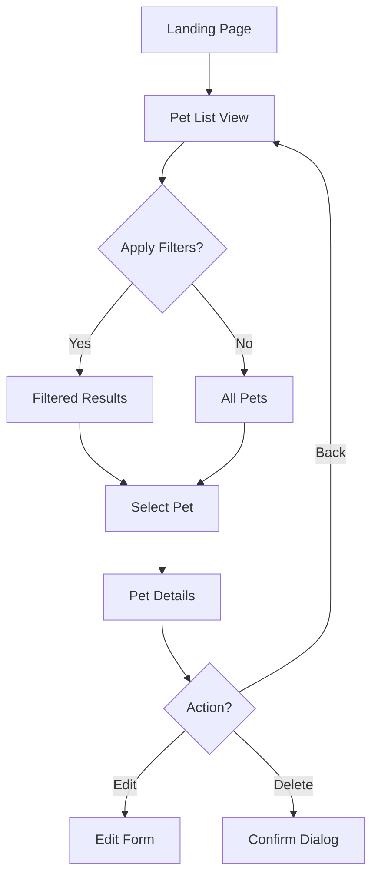
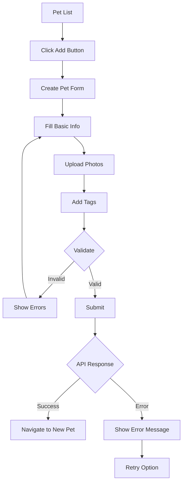

# Petstore API UI Example

## Overview
This example demonstrates the transformation of the classic Petstore OpenAPI specification into a complete UI application with generated components, forms, and error handling.

## API Specification

```yaml
openapi: 3.0.0
info:
  title: Petstore API
  version: 1.0.0
servers:
  - url: https://api.petstore.example.com/v1
paths:
  /pets:
    get:
      summary: List all pets
      operationId: listPets
      parameters:
        - name: limit
          in: query
          schema:
            type: integer
            default: 20
        - name: status
          in: query
          schema:
            type: string
            enum: [available, pending, sold]
      responses:
        '200':
          description: A list of pets
          content:
            application/json:
              schema:
                type: array
                items:
                  $ref: '#/components/schemas/Pet'
    post:
      summary: Create a pet
      operationId: createPet
      requestBody:
        required: true
        content:
          application/json:
            schema:
              $ref: '#/components/schemas/NewPet'
      responses:
        '201':
          description: Pet created
  /pets/{petId}:
    get:
      summary: Get a pet by ID
      operationId: getPet
      parameters:
        - name: petId
          in: path
          required: true
          schema:
            type: integer
      responses:
        '200':
          description: Pet details
          content:
            application/json:
              schema:
                $ref: '#/components/schemas/Pet'
        '404':
          description: Pet not found

components:
  schemas:
    Pet:
      type: object
      properties:
        id:
          type: integer
        name:
          type: string
        category:
          type: string
          enum: [dog, cat, bird, fish, other]
        status:
          type: string
          enum: [available, pending, sold]
        tags:
          type: array
          items:
            type: string
        photoUrls:
          type: array
          items:
            type: string
    NewPet:
      type: object
      required:
        - name
        - category
      properties:
        name:
          type: string
        category:
          type: string
          enum: [dog, cat, bird, fish, other]
        tags:
          type: array
          items:
            type: string
        photoUrls:
          type: array
          items:
            type: string
```

## Generated UI Components

### 1. PetList Component
```typescript
// Generated component structure
interface PetListProps {
  filters?: {
    limit?: number;
    status?: 'available' | 'pending' | 'sold';
  };
  onPetSelect?: (petId: number) => void;
  onCreateNew?: () => void;
}

// Features:
// - Automatic pagination with configurable limit
// - Status filter dropdown
// - Grid layout with pet cards
// - Loading skeleton states
// - Error boundary with retry
// - Empty state with CTA
```

**Visual Description:**
- Card-based grid layout (responsive: 1-4 columns)
- Each card shows: pet photo, name, category badge, status indicator
- Filter bar at top with status dropdown and results count
- Floating action button for "Add New Pet"
- Infinite scroll or pagination controls

### 2. PetDetails Component
```typescript
// Generated component structure
interface PetDetailsProps {
  petId: number;
  onEdit?: (pet: Pet) => void;
  onDelete?: (petId: number) => void;
  onBack?: () => void;
}

// Features:
// - Photo carousel/gallery
// - Editable fields in view mode
// - Tag management
// - Status workflow actions
// - Loading states
// - 404 handling
```

**Visual Description:**
- Hero image section with photo gallery
- Information cards for basic details
- Tag chips with add/remove capability
- Action buttons: Edit, Delete, Change Status
- Breadcrumb navigation

### 3. AddPetForm Component
```typescript
// Generated component structure
interface AddPetFormProps {
  onSubmit?: (pet: NewPet) => void;
  onCancel?: () => void;
  initialValues?: Partial<NewPet>;
}

// Features:
// - Multi-step form wizard
// - Image upload with preview
// - Real-time validation
// - Draft saving
// - Success/error notifications
```

**Visual Description:**
- Step 1: Basic Information (name, category)
- Step 2: Photos (drag-drop upload area)
- Step 3: Tags (tag input with suggestions)
- Progress indicator
- Save draft button
- Form validation messages inline

## User Flow Diagrams

### Browse and Search Flow


### Create Pet Flow


## Error States and Loading Patterns

### Loading States
1. **Initial Load**: Full-page skeleton with animated placeholders
2. **Pagination**: Bottom loader with existing content visible
3. **Detail Load**: Content-specific skeletons matching layout
4. **Form Submit**: Button spinner with disabled form

### Error States
1. **Network Error**: 
   - Icon: WiFi off
   - Message: "Unable to connect to Petstore"
   - Action: "Retry" button

2. **404 Not Found**:
   - Icon: Search/Pet icon
   - Message: "This pet couldn't be found"
   - Action: "Browse all pets" link

3. **Validation Error**:
   - Inline field highlighting
   - Error messages below fields
   - Summary at form top

4. **Server Error**:
   - Icon: Alert triangle
   - Message: "Something went wrong"
   - Action: "Try again" or "Contact support"

## Implementation Details

### API Client Generation
```typescript
// Auto-generated API client
class PetstoreAPI {
  private baseURL = 'https://api.petstore.example.com/v1';
  
  async listPets(params?: ListPetsParams): Promise<Pet[]> {
    // Generated fetch logic with error handling
  }
  
  async createPet(pet: NewPet): Promise<Pet> {
    // Generated POST logic
  }
  
  async getPet(petId: number): Promise<Pet> {
    // Generated GET logic with caching
  }
}
```

### State Management
```typescript
// Generated Redux/Zustand store
interface PetStore {
  pets: Pet[];
  selectedPet: Pet | null;
  filters: PetFilters;
  loading: boolean;
  error: Error | null;
  
  // Actions
  fetchPets: (filters?: PetFilters) => Promise<void>;
  selectPet: (petId: number) => Promise<void>;
  createPet: (pet: NewPet) => Promise<Pet>;
}
```

## Lessons Learned

### 1. Schema-Driven Development
- **Benefit**: Automatic type safety and validation
- **Challenge**: Handling schema extensions and custom fields
- **Solution**: Generated base components with extension points

### 2. Error Handling Patterns
- **Benefit**: Consistent error UX across all endpoints
- **Challenge**: Different error types need different UI
- **Solution**: Error type mapping to UI components

### 3. Form Generation
- **Benefit**: Forms match API schema automatically
- **Challenge**: Complex validation rules and dependencies
- **Solution**: Schema annotations for UI hints

### 4. Performance Optimization
- **Benefit**: Generated code includes best practices
- **Challenge**: Large lists need virtualization
- **Solution**: Automatic pagination and lazy loading

### 5. Accessibility
- **Benefit**: Generated components are WCAG compliant
- **Challenge**: Dynamic content and SPA navigation
- **Solution**: ARIA live regions and focus management

## Customization Points

1. **Theme Override**
```typescript
const customTheme = {
  colors: {
    primary: '#FF6B6B',
    secondary: '#4ECDC4'
  },
  components: {
    PetCard: {
      borderRadius: '12px',
      shadow: 'large'
    }
  }
};
```

2. **Component Extension**
```typescript
// Extend generated component
const CustomPetList = withFeatures(PetList, {
  virtualScroll: true,
  animations: 'spring',
  layout: 'masonry'
});
```

3. **API Middleware**
```typescript
// Add custom headers, retry logic, etc.
apiClient.use(authMiddleware);
apiClient.use(retryMiddleware);
apiClient.use(cacheMiddleware);
```

## Metrics and Analytics

Generated components include automatic tracking for:
- Page views and navigation
- API call performance
- Error rates by endpoint
- User interactions (clicks, form submissions)
- Time to interactive (TTI)

## Next Steps

1. **Advanced Features**
   - Real-time updates via WebSocket
   - Offline support with service workers
   - Advanced search with filters
   - Bulk operations

2. **Mobile Optimization**
   - Touch gestures
   - Native app export
   - Responsive images
   - Reduced data mode

3. **Developer Experience**
   - Hot module reload
   - Component playground
   - Visual regression tests
   - API mocking for development