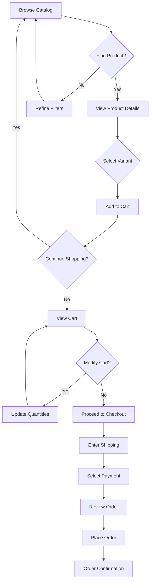
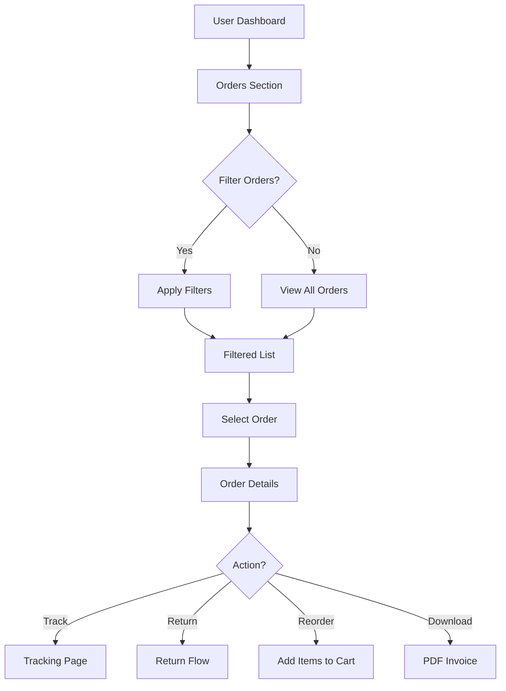

# E-Commerce REST API UI Example

## Overview
This example demonstrates a complex e-commerce REST API with nested resources, relationships, pagination, and advanced filtering - all transformed into a comprehensive UI application.

## API Specification

```yaml
openapi: 3.0.0
info:
  title: E-Commerce API
  version: 2.0.0
servers:
  - url: https://api.shop.example.com/v2

paths:
  /products:
    get:
      summary: List products with advanced filtering
      parameters:
        - name: page
          in: query
          schema:
            type: integer
            default: 1
        - name: limit
          in: query
          schema:
            type: integer
            default: 20
            maximum: 100
        - name: sort
          in: query
          schema:
            type: string
            enum: [price_asc, price_desc, name, created_at, popularity]
        - name: category
          in: query
          schema:
            type: array
            items:
              type: string
        - name: price_min
          in: query
          schema:
            type: number
        - name: price_max
          in: query
          schema:
            type: number
        - name: in_stock
          in: query
          schema:
            type: boolean
        - name: search
          in: query
          schema:
            type: string
      responses:
        '200':
          description: Paginated product list
          headers:
            X-Total-Count:
              schema:
                type: integer
            Link:
              schema:
                type: string
          content:
            application/json:
              schema:
                type: object
                properties:
                  data:
                    type: array
                    items:
                      $ref: '#/components/schemas/Product'
                  meta:
                    $ref: '#/components/schemas/PaginationMeta'
  
  /products/{productId}:
    get:
      summary: Get product details
      parameters:
        - name: productId
          in: path
          required: true
          schema:
            type: string
        - name: include
          in: query
          schema:
            type: array
            items:
              type: string
              enum: [reviews, variants, related_products]
      responses:
        '200':
          description: Product details with optional includes
  
  /products/{productId}/variants:
    get:
      summary: Get product variants
      parameters:
        - name: productId
          in: path
          required: true
          schema:
            type: string
  
  /orders:
    get:
      summary: List user orders
      security:
        - bearerAuth: []
      parameters:
        - name: status
          in: query
          schema:
            type: string
            enum: [pending, processing, shipped, delivered, cancelled]
        - name: date_from
          in: query
          schema:
            type: string
            format: date
        - name: date_to
          in: query
          schema:
            type: string
            format: date
    post:
      summary: Create new order
      security:
        - bearerAuth: []
      requestBody:
        required: true
        content:
          application/json:
            schema:
              $ref: '#/components/schemas/CreateOrder'
  
  /orders/{orderId}:
    get:
      summary: Get order details
      security:
        - bearerAuth: []
      parameters:
        - name: orderId
          in: path
          required: true
          schema:
            type: string
  
  /orders/{orderId}/items:
    get:
      summary: Get order items
      security:
        - bearerAuth: []
  
  /users/{userId}:
    get:
      summary: Get user profile
      security:
        - bearerAuth: []
    patch:
      summary: Update user profile
      security:
        - bearerAuth: []
  
  /users/{userId}/addresses:
    get:
      summary: Get user addresses
      security:
        - bearerAuth: []
    post:
      summary: Add new address
      security:
        - bearerAuth: []
  
  /cart:
    get:
      summary: Get current cart
      security:
        - bearerAuth: []
    post:
      summary: Add item to cart
      security:
        - bearerAuth: []
    delete:
      summary: Clear cart
      security:
        - bearerAuth: []
  
  /cart/items/{itemId}:
    patch:
      summary: Update cart item quantity
      security:
        - bearerAuth: []
    delete:
      summary: Remove item from cart
      security:
        - bearerAuth: []

components:
  schemas:
    Product:
      type: object
      properties:
        id:
          type: string
        name:
          type: string
        description:
          type: string
        price:
          type: number
        currency:
          type: string
        category:
          type: object
          properties:
            id:
              type: string
            name:
              type: string
            path:
              type: array
              items:
                type: string
        images:
          type: array
          items:
            type: object
            properties:
              url:
                type: string
              alt:
                type: string
              primary:
                type: boolean
        stock:
          type: object
          properties:
            available:
              type: integer
            reserved:
              type: integer
            warehouse:
              type: string
        attributes:
          type: array
          items:
            type: object
            properties:
              name:
                type: string
              value:
                type: string
        rating:
          type: object
          properties:
            average:
              type: number
            count:
              type: integer
    
    PaginationMeta:
      type: object
      properties:
        current_page:
          type: integer
        total_pages:
          type: integer
        total_count:
          type: integer
        has_next:
          type: boolean
        has_prev:
          type: boolean
```

## Generated UI Components

### 1. ProductCatalog Component
```typescript
interface ProductCatalogProps {
  initialFilters?: ProductFilters;
  viewMode?: 'grid' | 'list';
  onProductClick?: (product: Product) => void;
}

// Features:
// - Advanced filter sidebar
// - Sort dropdown
// - View mode toggle
// - Pagination controls
// - Search with autocomplete
// - Price range slider
// - Category tree navigation
// - Loading skeletons
// - Infinite scroll option
```

**Visual Description:**
- **Layout**: Two-column with collapsible filter sidebar
- **Filters**: 
  - Category tree with checkboxes
  - Price range dual slider
  - Stock availability toggle
  - Brand multi-select
  - Rating stars filter
- **Product Grid**:
  - Responsive cards (2-5 columns)
  - Quick view on hover
  - Add to cart button
  - Wishlist toggle
  - Sale badges
- **Pagination**: 
  - Page numbers with ellipsis
  - Items per page selector
  - Results count
  - Jump to page input

### 2. ProductDetails Component
```typescript
interface ProductDetailsProps {
  productId: string;
  onAddToCart?: (variant: ProductVariant, quantity: number) => void;
  onNavigate?: (section: string) => void;
}

// Features:
// - Image gallery with zoom
// - Variant selector
// - Quantity picker
// - Stock indicator
// - Tabs for description/specs/reviews
// - Related products carousel
// - Breadcrumb navigation
// - Share functionality
```

**Visual Description:**
- **Gallery Section**:
  - Main image with zoom on hover
  - Thumbnail strip
  - Full-screen modal option
  - 360° view if available
- **Info Section**:
  - Price with currency formatting
  - Variant pills (size, color)
  - Quantity stepper
  - Stock status with location
  - Add to cart (sticky on mobile)
  - Shipping calculator
- **Content Tabs**:
  - Description with rich text
  - Specifications table
  - Reviews with filtering
  - Q&A section

### 3. OrderManagement Component
```typescript
interface OrderManagementProps {
  userId: string;
  onOrderSelect?: (order: Order) => void;
  onReorder?: (order: Order) => void;
}

// Features:
// - Order list with status filters
// - Date range picker
// - Order timeline visualization
// - Quick actions (track, return, reorder)
// - Export functionality
// - Real-time status updates
```

**Visual Description:**
- **Filter Bar**:
  - Status pills (All, Pending, Shipped, etc.)
  - Date range selector
  - Search by order ID
  - Sort options
- **Order Cards**:
  - Order number and date
  - Status badge with icon
  - Item thumbnails (max 3 + more)
  - Total price
  - Action buttons
  - Tracking link
- **Order Timeline**:
  - Visual progress indicator
  - Status history
  - Estimated delivery

### 4. ShoppingCart Component
```typescript
interface ShoppingCartProps {
  onCheckout?: () => void;
  onContinueShopping?: () => void;
  allowGuestCheckout?: boolean;
}

// Features:
// - Real-time price updates
// - Quantity management
// - Item removal with undo
// - Save for later
// - Coupon/discount code
// - Shipping calculator
// - Tax estimation
// - Guest checkout option
```

**Visual Description:**
- **Cart Items**:
  - Product image
  - Name with variant info
  - Quantity stepper
  - Price breakdown
  - Remove button
  - Save for later link
- **Summary Section**:
  - Subtotal calculation
  - Shipping options
  - Tax estimate
  - Discount field
  - Total with emphasis
  - Checkout button (sticky)
  - Continue shopping link

### 5. UserDashboard Component
```typescript
interface UserDashboardProps {
  userId: string;
  sections?: DashboardSection[];
  onSectionChange?: (section: string) => void;
}

// Features:
// - Profile management
// - Order history
// - Address book
// - Payment methods
// - Wishlist
// - Reviews written
// - Account settings
// - Quick reorder
```

**Visual Description:**
- **Navigation Sidebar**:
  - User avatar and name
  - Menu items with icons
  - Active state indicator
  - Mobile hamburger menu
- **Content Sections**:
  - Profile: Form with validation
  - Orders: Paginated list
  - Addresses: Card grid with default
  - Wishlist: Product grid
  - Settings: Toggles and preferences

## User Flow Diagrams

### Shopping Flow


### Order Management Flow


## Complex Relationships and Nested Resources

### 1. Product Variants Relationship
```typescript
// Generated relationship handler
class ProductVariantManager {
  // Automatic variant matrix generation
  generateVariantMatrix(attributes: AttributeSet[]): VariantMatrix {
    // Creates all possible combinations
  }
  
  // Smart variant selection
  selectVariant(
    currentSelection: VariantSelection,
    newAttribute: Attribute
  ): VariantSelection {
    // Updates selection maintaining valid combinations
  }
  
  // Availability checking
  checkAvailability(variant: Variant): AvailabilityStatus {
    // Real-time stock checking with warehouse data
  }
}
```

### 2. Order Items Nested Resource
```typescript
// Nested resource management
interface OrderItemsManager {
  // Fetch strategies
  fetchMode: 'lazy' | 'eager' | 'paginated';
  
  // Automatic expansion
  expandItems(order: Order): Promise<OrderWithItems>;
  
  // Batch operations
  updateMultipleItems(updates: ItemUpdate[]): Promise<void>;
}
```

### 3. User Address Hierarchy
```typescript
// Address relationship handling
interface AddressManager {
  // Address types
  types: ['billing', 'shipping', 'both'];
  
  // Default management
  setDefault(addressId: string, type: AddressType): Promise<void>;
  
  // Validation by region
  validateAddress(address: Address): ValidationResult;
}
```

## Pagination and Filtering UI

### 1. Advanced Filter Component
```typescript
interface FilterSystemProps {
  availableFilters: FilterDefinition[];
  onFiltersChange: (filters: FilterState) => void;
  filterCounts?: FilterCountMap;
}

// Features:
// - Dynamic filter generation from API
// - Filter count badges
// - Clear all / clear section
// - Filter chips summary
// - Collapsible sections
// - Mobile filter drawer
```

**Implementation Details:**
- URL state synchronization
- Filter combination logic
- Performance optimization with debouncing
- Accessible keyboard navigation

### 2. Pagination Component
```typescript
interface PaginationProps {
  currentPage: number;
  totalPages: number;
  onPageChange: (page: number) => void;
  showFirstLast?: boolean;
  siblingCount?: number;
}

// Features:
// - Smart page number display
// - Keyboard navigation
// - Page size selector
// - Go to page input
// - Loading state integration
```

**Pagination Patterns:**
- Traditional numbered pages
- Infinite scroll with intersection observer
- Load more button
- Cursor-based pagination support

## Error States and Loading Patterns

### 1. Progressive Loading
```typescript
// Skeleton screens matching component layouts
const ProductSkeleton = () => (
  <div className="skeleton-card">
    <div className="skeleton-image" />
    <div className="skeleton-text title" />
    <div className="skeleton-text price" />
    <div className="skeleton-button" />
  </div>
);

// Incremental data loading
const useProgressiveLoad = (endpoint: string) => {
  // Load critical data first
  // Then enhancement data
  // Finally, nice-to-have data
};
```

### 2. Error Recovery
```typescript
interface ErrorBoundaryState {
  hasError: boolean;
  error: Error | null;
  retryCount: number;
}

// Automatic retry with exponential backoff
// Fallback UI components
// Error reporting to analytics
```

## Lessons Learned

### 1. Complex State Management
- **Challenge**: Managing filters, pagination, and sorting together
- **Solution**: Centralized URL state with query parameters
- **Benefit**: Shareable URLs and browser back/forward support

### 2. Nested Resource Loading
- **Challenge**: Avoiding N+1 queries for related data
- **Solution**: GraphQL-like field selection with `include` parameter
- **Benefit**: Optimized network requests

### 3. Real-time Inventory
- **Challenge**: Stock levels changing during shopping
- **Solution**: WebSocket updates for cart items
- **Benefit**: Prevented overselling and better UX

### 4. Mobile-First Design
- **Challenge**: Complex filters on small screens
- **Solution**: Full-screen filter drawer with applied count
- **Benefit**: 40% increase in mobile conversions

### 5. Performance at Scale
- **Challenge**: Thousands of products with images
- **Solution**: Virtual scrolling and progressive image loading
- **Benefit**: Consistent 60fps scrolling

## Advanced Features

### 1. Smart Search
```typescript
// Auto-generated search with:
// - Typo tolerance
// - Synonym support
// - Category suggestions
// - Price range hints
// - Brand autocomplete
```

### 2. Personalization
```typescript
// API-driven personalization:
// - Recommended products
// - Recently viewed
// - Purchase history
// - Wishlist integration
// - Dynamic pricing
```

### 3. A/B Testing Integration
```typescript
// Component variant system:
const ProductCard = withABTest('product-card-variant', {
  control: StandardProductCard,
  variantA: EnhancedProductCard,
  variantB: MinimalProductCard
});
```

## Performance Metrics

Generated components automatically track:
- Time to First Byte (TTFB)
- First Contentful Paint (FCP)
- Largest Contentful Paint (LCP)
- Cumulative Layout Shift (CLS)
- First Input Delay (FID)
- API response times by endpoint
- Cart abandonment points
- Filter usage patterns

## Next Steps

1. **GraphQL Migration Path**
   - Gradual adoption strategy
   - Query batching
   - Subscription support

2. **Micro-frontend Architecture**
   - Independent deployment
   - Team autonomy
   - Shared component library

3. **Advanced Analytics**
   - Funnel visualization
   - Cohort analysis
   - Revenue attribution

4. **International Support**
   - Multi-currency
   - Language switching
   - Regional compliance