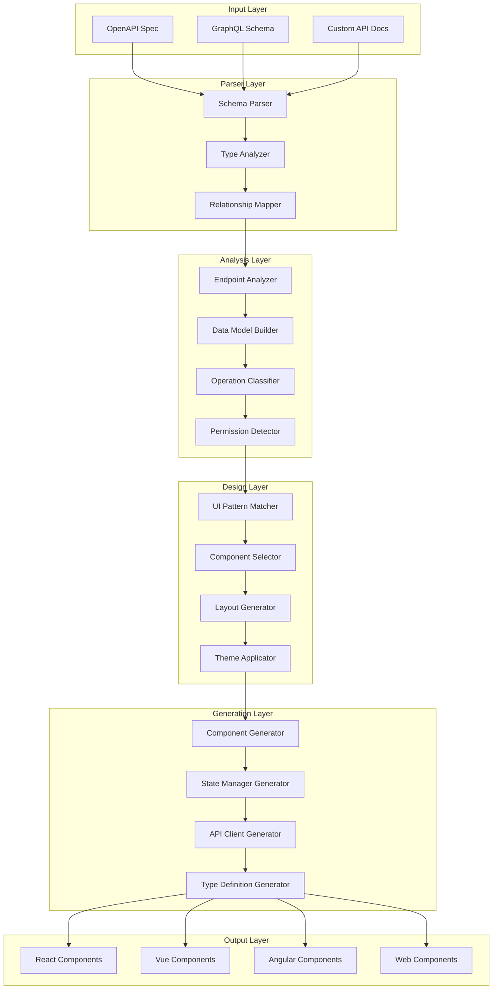
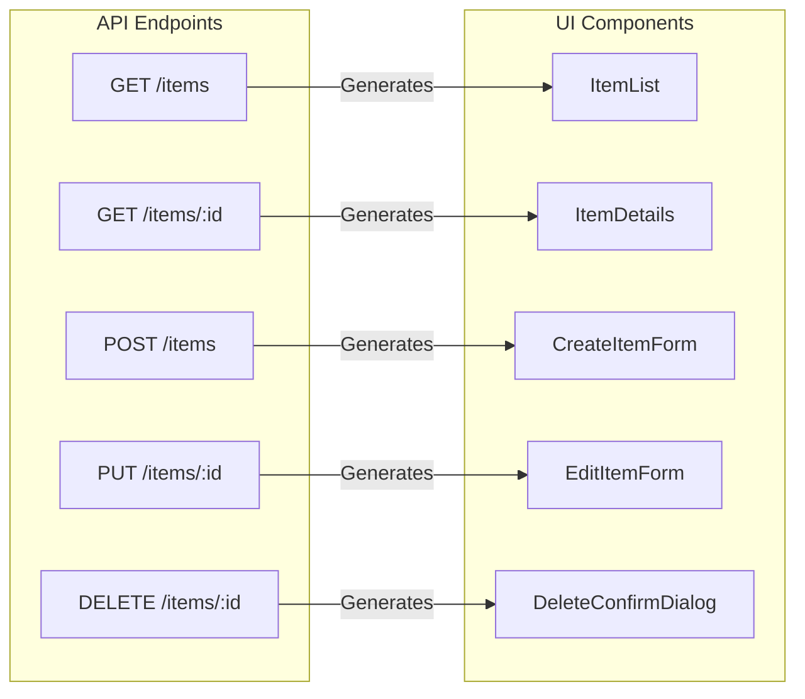
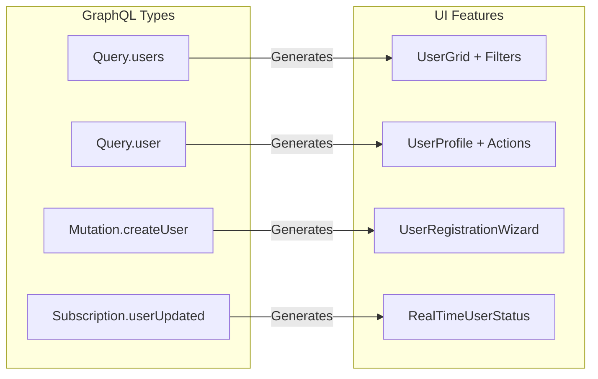
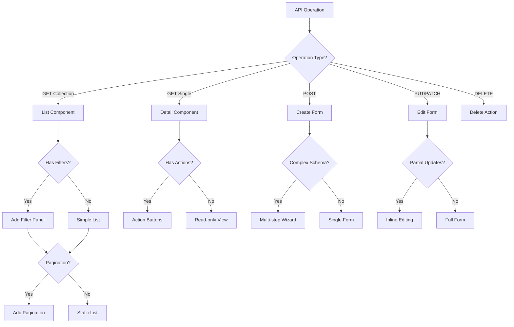
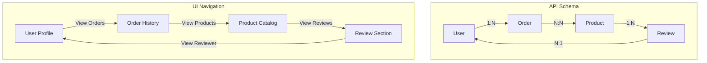
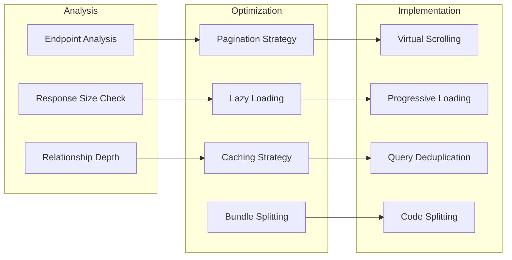
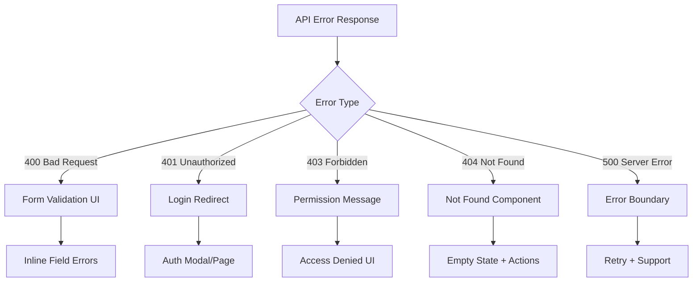
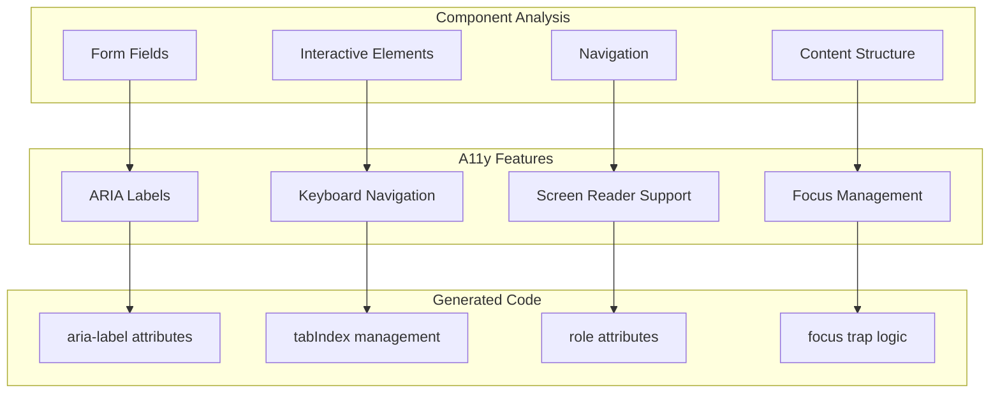

# API to UI Transformation Flow

## Overview
This document visualizes how the API UI Designer transforms API specifications into complete user interfaces.

## Transformation Pipeline



## Pattern Recognition Examples

### REST Endpoint → UI Component Mapping



### GraphQL Type → UI Component Mapping



## Component Generation Decision Tree



## Schema Analysis Example

### Input: OpenAPI Schema
```yaml
paths:
  /products:
    get:
      parameters:
        - name: category
          in: query
          schema:
            type: array
        - name: price_range
          in: query
          schema:
            type: object
            properties:
              min: { type: number }
              max: { type: number }
```

### Analysis Output
```json
{
  "endpoint": "/products",
  "operation": "list",
  "features": {
    "filtering": {
      "enabled": true,
      "filters": [
        {
          "name": "category",
          "type": "multiselect",
          "dataType": "array"
        },
        {
          "name": "price_range",
          "type": "range_slider",
          "dataType": "object",
          "min": 0,
          "max": 10000
        }
      ]
    }
  }
}
```

### Generated UI Structure
```typescript
// Auto-generated component structure
<ProductList>
  <FilterPanel>
    <MultiSelect 
      name="category"
      options={categories}
      onChange={updateFilters}
    />
    <RangeSlider
      name="price"
      min={0}
      max={10000}
      onChange={updateFilters}
    />
  </FilterPanel>
  <ProductGrid>
    {products.map(product => (
      <ProductCard key={product.id} {...product} />
    ))}
  </ProductGrid>
  <Pagination
    currentPage={page}
    totalPages={totalPages}
    onPageChange={setPage}
  />
</ProductList>
```

## Relationship Detection



## State Management Generation

```mermaid
graph TB
    subgraph "API Operations"
        A1[GET /users]
        A2[POST /users]
        A3[PUT /users/:id]
        A4[DELETE /users/:id]
    end
    
    subgraph "Generated Store"
        S1[State]
        S1 --> S2[users: User[]]
        S1 --> S3[selectedUser: User]
        S1 --> S4[loading: boolean]
        S1 --> S5[error: Error]
        
        A6[Actions]
        A6 --> A7[fetchUsers]
        A6 --> A8[createUser]
        A6 --> A9[updateUser]
        A6 --> A10[deleteUser]
        
        M1[Mutations]
        M1 --> M2[SET_USERS]
        M1 --> M3[ADD_USER]
        M1 --> M4[UPDATE_USER]
        M1 --> M5[REMOVE_USER]
    end
    
    A1 -->|"Generates"| A7
    A2 -->|"Generates"| A8
    A3 -->|"Generates"| A9
    A4 -->|"Generates"| A10
```

## Performance Optimization Flow



## Error Handling Strategy



## Accessibility Generation



This transformation flow ensures that every API specification is converted into a fully-functional, accessible, and performant user interface with all the necessary features for a production-ready application.