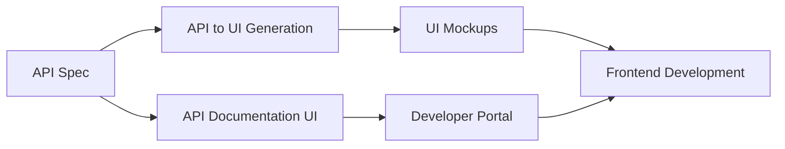
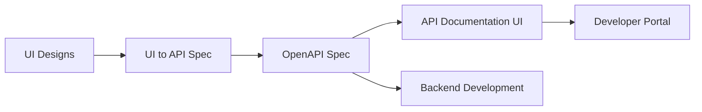
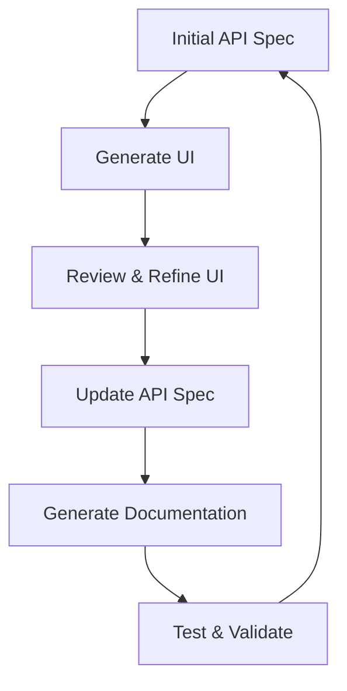

# API-UI Designer Workflows

This directory contains three comprehensive workflows for bidirectional API and UI design integration. Each workflow can operate independently or as part of an integrated development pipeline.

## Workflow Overview

### 1. [API to UI Generation](./api-to-ui-generation.md)
**Purpose**: Transform API specifications into complete UI mockups
- **Input**: OpenAPI/Swagger specifications
- **Output**: High-fidelity UI mockups with component mapping
- **Duration**: 45-60 minutes
- **Key Features**:
  - Automatic CRUD UI generation
  - Smart form building from schemas
  - Responsive design variants
  - Design system integration

### 2. [UI to API Specification](./ui-to-api-spec.md)
**Purpose**: Reverse engineer API specifications from UI designs
- **Input**: UI mockups, wireframes, or existing interfaces
- **Output**: Complete OpenAPI 3.0 specification
- **Duration**: 40-50 minutes
- **Key Features**:
  - Visual recognition of UI patterns
  - Data model inference
  - RESTful endpoint generation
  - Automatic schema creation

### 3. [API Documentation UI](./api-documentation-ui.md)
**Purpose**: Generate interactive API documentation portals
- **Input**: API specifications (OpenAPI, GraphQL, etc.)
- **Output**: Full-featured documentation website
- **Duration**: 45-55 minutes
- **Key Features**:
  - Try-it-out functionality
  - Multi-language code examples
  - Visual flow diagrams
  - Interactive API explorer

## Integrated Workflow Patterns

### Pattern 1: Complete API-First Development


### Pattern 2: Design-First Development


### Pattern 3: Iterative Refinement Cycle


## Parallel Execution Opportunities

### Cross-Workflow Parallelization
```yaml
parallel_execution:
  phase_1:
    - api_analysis
    - ui_asset_preparation
    - documentation_setup
  
  phase_2:
    - component_generation
    - schema_inference
    - example_creation
  
  phase_3:
    - ui_mockup_assembly
    - api_spec_compilation
    - documentation_deployment
```

### Resource Optimization
- Share parsed API models across workflows
- Reuse component libraries
- Cache generated assets
- Coordinate design tokens

## Decision Points

### Choosing the Right Workflow
1. **Have an API spec?** → Start with API to UI Generation
2. **Have UI designs?** → Start with UI to API Specification
3. **Need documentation?** → Run API Documentation UI in parallel
4. **Building from scratch?** → Use iterative pattern with all three

### Quality Gates Between Workflows
```yaml
quality_checkpoints:
  api_to_ui_output:
    - ui_coverage: 100%
    - design_consistency: >90%
    - accessibility: WCAG_AA
  
  ui_to_api_output:
    - endpoint_completeness: >95%
    - schema_accuracy: >90%
    - naming_consistency: enforced
  
  documentation_output:
    - example_coverage: 100%
    - interactive_features: functional
    - search_indexing: complete
```

## Integration with UI Designer System

### Shared Components
- Design tokens
- Component libraries
- Style guides
- Brand guidelines

### Data Exchange Format
```javascript
{
  "workflow_metadata": {
    "source": "api-to-ui-generation",
    "version": "1.0.0",
    "timestamp": "2024-01-15T10:00:00Z"
  },
  "components": [
    {
      "id": "user-form",
      "type": "form",
      "api_binding": {
        "endpoint": "POST /api/users",
        "schema": "#/components/schemas/User"
      },
      "ui_properties": {
        "layout": "vertical",
        "theme": "default",
        "responsive": true
      }
    }
  ],
  "design_system": {
    "tokens": "shared/tokens.json",
    "components": "shared/components.json"
  }
}
```

## Performance Optimization

### Caching Strategy
- API specification parsing: 24-hour cache
- Generated components: Version-based cache
- Documentation builds: Incremental updates

### Parallel Processing
- Use worker threads for heavy computations
- Batch similar operations
- Stream large file processing
- Implement progress tracking

## Monitoring & Metrics

### Workflow Analytics
```yaml
metrics:
  execution:
    - total_duration
    - stage_durations
    - parallel_efficiency
  
  quality:
    - coverage_percentages
    - error_rates
    - manual_corrections
  
  usage:
    - workflow_frequency
    - popular_patterns
    - user_satisfaction
```

### Success Indicators
- Time saved vs manual process: >70%
- First-pass accuracy: >85%
- Developer adoption rate: >80%
- Integration success rate: >95%

## Best Practices

### Before Starting
1. Validate input quality
2. Check system resources
3. Prepare output directories
4. Configure integration points

### During Execution
1. Monitor progress indicators
2. Review intermediate outputs
3. Adjust parameters as needed
4. Document decisions

### After Completion
1. Validate all outputs
2. Run integration tests
3. Collect feedback
4. Update workflow parameters

## Troubleshooting

### Common Issues
1. **Incomplete API specs** → Use UI to API workflow to fill gaps
2. **Complex UI patterns** → Break into smaller components
3. **Performance bottlenecks** → Enable parallel processing
4. **Integration conflicts** → Use standardized data formats

### Support Resources
- Workflow logs: `.claude/logs/workflows/`
- Error reports: `.claude/errors/`
- Debug mode: Add `--debug` flag
- Community forum: `api-ui-designer.community`

## Future Enhancements
- AI-powered pattern learning
- Real-time collaboration features
- Cloud-based processing
- GraphQL native support
- Microservices orchestration