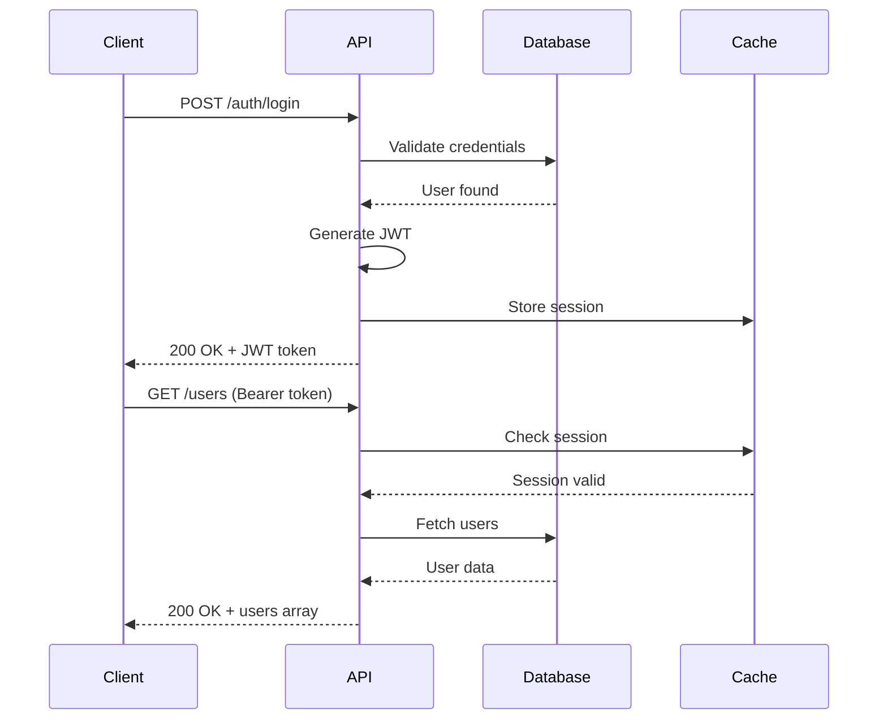

# API Documentation UI Workflow

## Overview
This workflow generates comprehensive, interactive API documentation interfaces with try-it-out functionality, visual request/response flows, code examples, and developer-friendly exploration tools.

## Workflow Stages

### Stage 1: API Specification Analysis
**Objective**: Parse API spec and extract documentation requirements
**Duration**: 3-5 minutes

#### Input Processing
```yaml
supported_specs:
  - openapi: [3.0, 3.1]
  - swagger: [2.0]
  - asyncapi: [2.0]
  - graphql: [sdl, introspection]
  - postman: [collection_v2]
  - raml: [1.0]
```

#### Parallel Analysis Tasks
```
┌─────────────────────────┐  ┌─────────────────────────┐  ┌─────────────────────────┐
│  Endpoint Inventory     │  │  Schema Analysis        │  │  Auth Requirements      │
│  - Group by tags        │  │  - Request models       │  │  - Security schemes     │
│  - Method types         │  │  - Response models      │  │  - OAuth flows          │
│  - Path patterns        │  │  - Shared components    │  │  - API keys            │
└─────────────────────────┘  └─────────────────────────┘  └─────────────────────────┘
```

#### Metadata Extraction
- API title and version
- Server configurations
- Contact information
- License details
- External documentation links

#### Outputs
- Structured API inventory
- Documentation outline
- Component registry
- Authentication matrix

---

### Stage 2: Information Architecture
**Objective**: Design optimal documentation structure and navigation
**Duration**: 5-8 minutes

#### Navigation Hierarchy
```
┌─────────────────────────────────────┐
│          Documentation Root          │
├─────────────────────────────────────┤
│  ├─ Getting Started                 │
│  │   ├─ Introduction               │
│  │   ├─ Authentication             │
│  │   ├─ Quick Start Guide          │
│  │   └─ Rate Limits                │
│  │                                  │
│  ├─ API Reference                   │
│  │   ├─ Users                      │
│  │   │   ├─ List Users             │
│  │   │   ├─ Create User            │
│  │   │   ├─ Get User               │
│  │   │   ├─ Update User            │
│  │   │   └─ Delete User            │
│  │   ├─ Products                   │
│  │   └─ Orders                     │
│  │                                  │
│  ├─ Guides                          │
│  │   ├─ Common Workflows           │
│  │   ├─ Best Practices             │
│  │   └─ Migration Guide            │
│  │                                  │
│  └─ Resources                       │
│      ├─ SDKs & Libraries           │
│      ├─ Postman Collection         │
│      └─ OpenAPI Spec               │
└─────────────────────────────────────┘
```

#### Content Organization
- Group endpoints logically
- Create tutorial sequences
- Build example galleries
- Design search indexes

#### Decision Points
- **API Size?** → Simple list vs. categorized navigation
- **Complexity?** → Basic docs vs. advanced guides
- **Audience?** → Developer-focused vs. business-friendly

---

### Stage 3: Interactive Component Generation
**Objective**: Create interactive UI components for API exploration
**Duration**: 15-20 minutes

#### Core Components

##### 1. Try-It-Out Interface
```javascript
const TryItOutComponent = {
  elements: {
    endpoint_selector: {
      type: 'dropdown',
      options: extractEndpoints(apiSpec)
    },
    parameter_inputs: {
      type: 'dynamic_form',
      fields: generateFromParameters(endpoint)
    },
    request_body_editor: {
      type: 'code_editor',
      language: 'json',
      schema: endpoint.requestBody?.schema
    },
    auth_configurator: {
      type: 'auth_panel',
      schemes: apiSpec.security
    },
    execute_button: {
      type: 'action_button',
      states: ['ready', 'loading', 'success', 'error']
    },
    response_viewer: {
      type: 'tabbed_panel',
      tabs: ['response', 'headers', 'curl', 'metrics']
    }
  }
};
```

##### 2. Request Builder
```yaml
request_builder:
  components:
    - method_selector: [GET, POST, PUT, PATCH, DELETE]
    - url_constructor:
        base_url: editable
        path_params: dynamic_inputs
        query_params: builder_interface
    - headers_editor:
        presets: [JSON, XML, Form-Data]
        custom: key_value_pairs
    - body_editor:
        modes: [raw, form-data, graphql]
        validation: real_time
        examples: context_aware
```

##### 3. Response Visualizer
```javascript
const ResponseVisualizer = {
  view_modes: {
    raw: 'Syntax-highlighted JSON/XML',
    formatted: 'Tree view with expand/collapse',
    table: 'Tabular for array responses',
    chart: 'Graphs for numeric data'
  },
  features: {
    search: 'Find in response',
    export: ['JSON', 'CSV', 'PDF'],
    compare: 'Diff two responses',
    save: 'Response history'
  }
};
```

#### Parallel Component Creation
```
┌─────────────────────────┐  ┌─────────────────────────┐  ┌─────────────────────────┐
│  Form Generators        │  │  Code Example Builders  │  │  Flow Visualizers       │
│  - Parameter forms      │  │  - Language templates   │  │  - Sequence diagrams    │
│  - Request builders     │  │  - SDK snippets        │  │  - State machines       │
│  - Auth configurators   │  │  - CLI commands        │  │  - Data flow charts    │
└─────────────────────────┘  └─────────────────────────┘  └─────────────────────────┘
```

#### Outputs
- Interactive component library
- Widget configurations
- Event handlers
- State management logic

---

### Stage 4: Code Example Generation
**Objective**: Generate code snippets in multiple languages
**Duration**: 10-15 minutes

#### Language Support Matrix
```yaml
languages:
  primary:
    - javascript:
        variants: [fetch, axios, node-fetch]
        frameworks: [react, vue, angular]
    - python:
        variants: [requests, urllib, httpx]
        frameworks: [django, flask, fastapi]
    - java:
        variants: [okhttp, retrofit, apache]
        frameworks: [spring, jersey]
  
  secondary:
    - go: [net/http, resty]
    - ruby: [net/http, faraday]
    - php: [curl, guzzle]
    - csharp: [httpclient, restsharp]
    - swift: [urlsession, alamofire]
    - kotlin: [ktor, okhttp]
  
  shell:
    - curl: [bash, powershell]
    - wget: linux
    - httpie: modern_cli
```

#### Code Generation Templates
```javascript
// Template System
const generateCodeExample = (endpoint, language, options) => {
  const template = templates[language];
  
  return template.render({
    method: endpoint.method,
    url: buildUrl(endpoint, options.params),
    headers: mergeHeaders(endpoint.headers, options.headers),
    body: formatBody(endpoint.requestBody, language),
    auth: generateAuth(endpoint.security, language),
    errorHandling: options.includeErrorHandling,
    asyncAwait: options.useAsync
  });
};

// Example Output - JavaScript/Fetch
const code = `
const response = await fetch('https://api.example.com/users/123', {
  method: 'GET',
  headers: {
    'Authorization': 'Bearer YOUR_TOKEN',
    'Content-Type': 'application/json'
  }
});

if (!response.ok) {
  throw new Error(\`HTTP error! status: \${response.status}\`);
}

const data = await response.json();
console.log(data);
`;
```

#### SDK Integration Examples
- Initialize client
- Configure authentication
- Make requests
- Handle responses
- Error management
- Pagination helpers

---

### Stage 5: Visual Flow Documentation
**Objective**: Create visual representations of API workflows
**Duration**: 10-15 minutes

#### Flow Diagram Types

##### 1. Sequence Diagrams


##### 2. State Diagrams
```yaml
order_states:
  initial: draft
  states:
    draft:
      transitions:
        - submit: pending
        - cancel: cancelled
    pending:
      transitions:
        - approve: processing
        - reject: rejected
    processing:
      transitions:
        - ship: shipped
        - fail: failed
    shipped:
      transitions:
        - deliver: delivered
        - return: returned
  final: [delivered, cancelled, rejected, failed, returned]
```

##### 3. Data Flow Diagrams
- Request transformation
- Response mapping
- Error propagation
- Cache strategies

#### Interactive Features
- Clickable diagram elements
- Animated flow execution
- Step-by-step tutorials
- Embedded code examples

---

### Stage 6: Documentation Assembly & Deployment
**Objective**: Compile all components into deployable documentation
**Duration**: 10-15 minutes

#### Output Formats

##### 1. Static Site Generation
```yaml
static_generators:
  - docusaurus:
      features: [react, mdx, versioning, i18n]
      themes: [classic, custom]
  - mkdocs:
      features: [python, markdown, plugins]
      themes: [material, readthedocs]
  - vuepress:
      features: [vue, markdown, pwa]
      themes: [default, custom]
```

##### 2. Interactive Portals
```javascript
const DocumentationPortal = {
  features: {
    search: {
      type: 'algolia',
      indexes: ['endpoints', 'schemas', 'examples']
    },
    playground: {
      engine: 'monaco-editor',
      languages: supported_languages,
      persistence: 'localStorage'
    },
    analytics: {
      track: ['page_views', 'api_calls', 'errors'],
      dashboard: 'admin_only'
    },
    collaboration: {
      comments: true,
      suggestions: true,
      version_control: 'git'
    }
  }
};
```

##### 3. Developer Hub Components
- API status dashboard
- Changelog feed
- Breaking change alerts
- Migration tools
- Community forum integration

#### Deployment Options
```yaml
deployment:
  self_hosted:
    - docker_container
    - kubernetes_helm
    - static_hosting
  
  managed:
    - github_pages
    - netlify
    - vercel
    - readthedocs
  
  enterprise:
    - confluence_integration
    - sharepoint_embed
    - custom_portal
```

---

## Advanced Features

### Smart Search & Discovery
```javascript
const SearchEngine = {
  indexes: {
    endpoints: weightedSearch(['path', 'summary', 'description']),
    parameters: fuzzySearch(['name', 'description']),
    schemas: semanticSearch(['properties', 'examples']),
    errors: exactMatch(['code', 'message'])
  },
  
  features: {
    autocomplete: true,
    suggestions: true,
    filters: ['method', 'tag', 'auth'],
    history: 'per_user'
  },
  
  ai_features: {
    natural_language: 'How do I create a user?',
    code_search: 'Find examples using pagination',
    error_diagnosis: 'Why am I getting 401?'
  }
};
```

### Version Management
```yaml
versioning:
  strategies:
    - url_path: /v1/, /v2/
    - header: API-Version
    - query_param: version=2
  
  documentation:
    - version_selector: dropdown
    - migration_guides: auto_generated
    - deprecation_warnings: highlighted
    - diff_viewer: version_comparison
```

### Metrics & Analytics
- Endpoint popularity
- Error rate tracking
- Response time graphs
- Usage patterns
- Developer journey analysis

---

## Quality Assurance

### Documentation Completeness
```yaml
quality_checks:
  required:
    - endpoint_description: 100%
    - parameter_descriptions: 100%
    - response_examples: 100%
    - error_responses: 100%
  
  recommended:
    - code_examples: >3 languages
    - tutorials: >5 workflows
    - troubleshooting: common_errors
    - performance_tips: included
```

### Accessibility Standards
- WCAG 2.1 AA compliance
- Keyboard navigation
- Screen reader support
- High contrast themes
- Reduced motion options

### Performance Optimization
- Lazy loading components
- Code splitting
- CDN integration
- Response caching
- Optimized search

---

## Success Metrics

### Developer Experience
- Time to first API call: <5 minutes
- Documentation clarity: >90% satisfaction
- Code example accuracy: 100%
- Search effectiveness: >85% success rate

### Business Impact
- Support ticket reduction: >40%
- Developer onboarding time: -60%
- API adoption rate: +30%
- Integration success rate: >95%

### Technical Metrics
- Page load time: <2 seconds
- Search response: <100ms
- Try-it-out latency: <500ms
- Mobile responsiveness: 100%

---

## Continuous Improvement

### Feedback Integration
1. User feedback widgets
2. Analytics-driven improvements
3. A/B testing documentation
4. Community contributions
5. Regular content audits

### Automation
- Auto-update from API changes
- Regression testing for examples
- Broken link detection
- Performance monitoring
- SEO optimization

### Future Enhancements
- AI-powered chat support
- Video tutorials generation
- AR/VR API visualization
- Voice-controlled navigation
- Predictive error handling