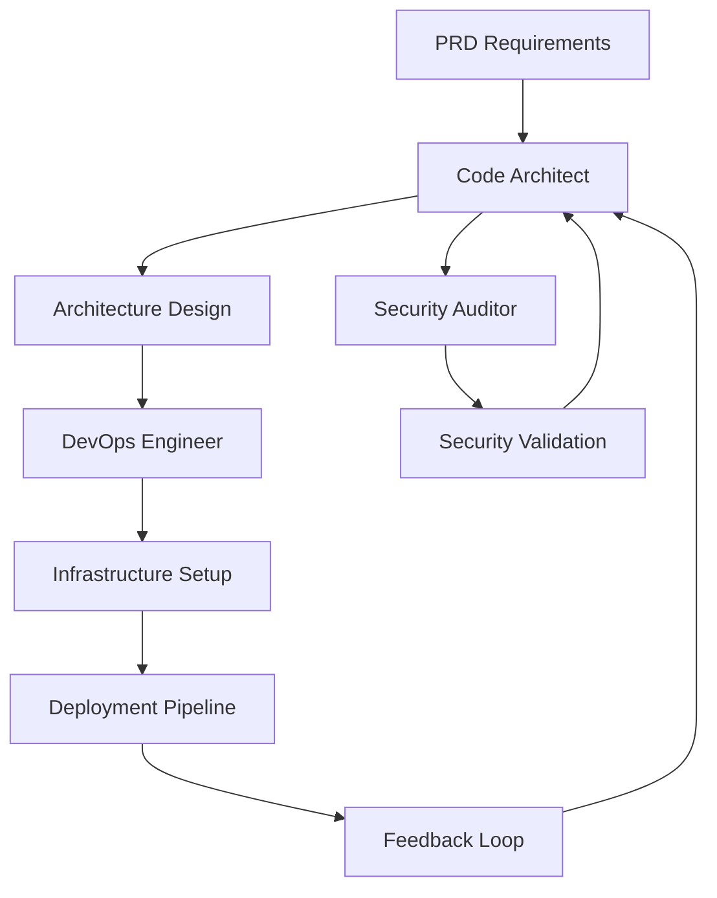

# Code Architect Specialist

## Overview

The Code Architect specialist is a MetaClaude implementation focused on designing software architectures, generating code structures, and optimizing performance. This specialist provides comprehensive architectural guidance and automated code generation capabilities to help teams build robust, scalable, and maintainable software systems.

## Focus Areas

- **Software Architecture Design**: Creating comprehensive architectural blueprints for software systems
- **Code Structure Generation**: Automatically generating boilerplate code and project structures
- **Performance Optimization**: Analyzing and optimizing system performance at the architectural level
- **Pattern Implementation**: Applying industry-standard design patterns and best practices

## Core Capabilities

### Architectural Patterns
- **Microservices Architecture**: Designing distributed systems with independent, scalable services
- **Monolithic Architecture**: Creating unified, single-deployment applications
- **Event-Driven Architecture**: Building reactive systems with asynchronous event processing
- **SOLID Principles**: Ensuring code follows Single Responsibility, Open/Closed, Liskov Substitution, Interface Segregation, and Dependency Inversion principles
- **DRY (Don't Repeat Yourself)**: Minimizing code duplication and promoting reusability

### Design Principles
- Clean Architecture implementation
- Domain-Driven Design (DDD) patterns
- Hexagonal Architecture (Ports and Adapters)
- Test-Driven Development (TDD) support
- Continuous Integration/Continuous Deployment (CI/CD) considerations

## Specialized Agents

### 1. Architecture Analyst
Analyzes requirements and existing systems to recommend optimal architectural approaches.

### 2. Pattern Expert
Identifies and applies appropriate design patterns based on the problem context.

### 3. Code Generator
Generates boilerplate code, project structures, and implementation scaffolding.

### 4. Performance Optimizer
Analyzes architectural decisions for performance implications and suggests optimizations.

## Workflows

### 1. System Design
Complete workflow from requirements analysis to detailed architectural specifications.

### 2. Refactoring
Systematic approach to improving existing code structure without changing functionality.

### 3. Tech Debt Analysis
Identifying and prioritizing technical debt for systematic resolution.

## Integration with Other Specialists

The Code Architect plays a central role in the development lifecycle, establishing the foundation that other specialists build upon:

### Key Integration: Code Architect ↔ DevOps Engineer
This bidirectional relationship ensures architecture is deployment-ready from inception:

```yaml
Architecture → Deployment Pipeline:
- Code Architect designs → DevOps Engineer implements
- Microservice boundaries → Container orchestration
- API contracts → Service mesh configuration
- Database schemas → Infrastructure provisioning

Deployment → Architecture Feedback:
- DevOps metrics → Architecture optimization
- Scaling challenges → Design adjustments
- Cost analysis → Resource efficiency improvements
```

### Integration Patterns

**← Tool Builder**
- Requests custom architecture validation tools
- Needs dependency analysis utilities
- Requires code generation templates
- Uses performance profiling tools

**→ UI Designer**
- Provides frontend architecture patterns
- Defines component communication protocols
- Establishes state management strategies
- Sets API contract specifications

**→ QA Engineer**
- Embeds testability in architecture
- Defines test boundaries and interfaces
- Creates mock service architectures
- Establishes quality gates in design

**← Data Scientist**
- Receives data pipeline architectures
- Gets ML model serving patterns
- Obtains real-time processing designs
- Implements feature store architectures

**← PRD Specialist**
- Translates requirements to technical design
- Maps features to architectural components
- Ensures scalability for future requirements
- Validates technical feasibility

**← Security Auditor**
- Integrates security patterns in design
- Implements zero-trust architectures
- Adds encryption and authentication layers
- Designs audit logging systems

**→ Technical Writer**
- Provides architectural diagrams
- Supplies API documentation structure
- Delivers system design documents
- Creates deployment guides

### Workflow Integration Examples



### Best Practices for Integration
1. **Early Collaboration**: Engage DevOps from initial design phase
2. **Continuous Feedback**: Maintain open channels with all specialists
3. **Documentation First**: Share architectural decisions proactively
4. **Iterative Refinement**: Adjust architecture based on specialist feedback

## Technology Stack Support

- **Languages**: Java, Python, JavaScript/TypeScript, Go, C#, Rust
- **Frameworks**: Spring Boot, Django, Express.js, .NET Core, React, Angular, Vue.js
- **Databases**: PostgreSQL, MySQL, MongoDB, Redis, Elasticsearch
- **Message Brokers**: RabbitMQ, Apache Kafka, AWS SQS
- **Cloud Platforms**: AWS, Azure, Google Cloud Platform
- **Containerization**: Docker, Kubernetes

## Getting Started

1. Review the [Setup Guide](docs/setup-guide.md) for initial configuration
2. Explore [Architectural Patterns](docs/architectural-patterns.md) for pattern documentation
3. Check the [Examples](examples/) directory for sample implementations
4. Consult agent-specific documentation in the [Agents](agents/) directory

## Example Use Cases

- Designing a new microservices-based e-commerce platform
- Refactoring a monolithic application into services
- Optimizing database query performance through architectural changes
- Implementing event-driven processing for real-time data
- Creating a scalable API gateway architecture

## Best Practices

1. **Start with Requirements**: Always begin with clear business and technical requirements
2. **Consider Trade-offs**: Document architectural decisions and their trade-offs
3. **Design for Change**: Build flexibility into the architecture for future modifications
4. **Performance from the Start**: Consider performance implications early in the design
5. **Security by Design**: Integrate security considerations into the architecture

## Documentation

- [Development Plan](development-plan.md) - Detailed 5-phase implementation plan
- [Architectural Patterns](docs/architectural-patterns.md) - In-depth pattern documentation
- [Setup Guide](docs/setup-guide.md) - Configuration and setup instructions
- Agent Documentation in [agents/](agents/) directory
- Workflow Documentation in [workflows/](workflows/) directory

## Contributing

This specialist is part of the MetaClaude framework. For contribution guidelines and development standards, refer to the main MetaClaude documentation.