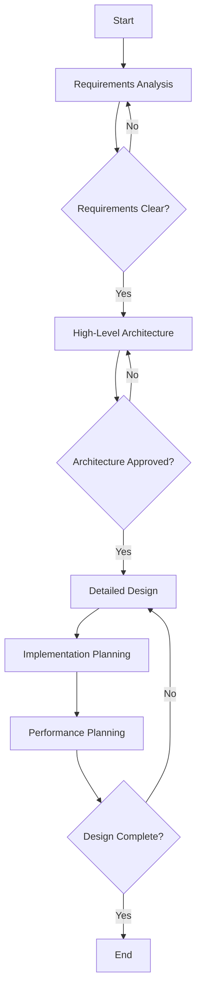

# System Design Workflow

## Overview
The System Design workflow guides the process from initial requirements gathering through to detailed architectural specifications and implementation blueprints. This workflow ensures comprehensive coverage of all architectural concerns while maintaining alignment with business objectives.

## Workflow Stages

### Stage 1: Requirements Analysis
**Duration**: 1-2 weeks  
**Participants**: Architecture Analyst, Stakeholders

#### Activities
1. **Business Requirements Gathering**
   - Conduct stakeholder interviews
   - Document functional requirements
   - Identify business constraints
   - Define success criteria

2. **Technical Requirements Definition**
   - Performance requirements (response time, throughput)
   - Scalability needs (user growth, data volume)
   - Security requirements (authentication, encryption)
   - Compliance requirements (GDPR, HIPAA)

3. **Constraint Identification**
   - Budget limitations
   - Timeline constraints
   - Technology restrictions
   - Team expertise

#### Deliverables
- Business Requirements Document (BRD)
- Technical Requirements Document (TRD)
- Constraints and Assumptions Log
- Initial Risk Register

### Stage 2: High-Level Architecture
**Duration**: 1-2 weeks  
**Participants**: Architecture Analyst, Pattern Expert

#### Activities
1. **Architecture Style Selection**
   ```
   Decision Matrix:
   ┌─────────────────┬───────────┬──────────┬─────────────┐
   │ Criteria        │ Monolithic│ Microservices│ Serverless│
   ├─────────────────┼───────────┼──────────┼─────────────┤
   │ Complexity      │ Low       │ High     │ Medium      │
   │ Scalability     │ Medium    │ High     │ Very High   │
   │ Cost            │ Low       │ High     │ Variable    │
   │ Time to Market  │ Fast      │ Slow     │ Fast        │
   │ Team Size       │ Small     │ Large    │ Small       │
   └─────────────────┴───────────┴──────────┴─────────────┘
   ```

2. **Component Identification**
   - Core business components
   - Supporting services
   - External integrations
   - Data storage requirements

3. **Technology Stack Selection**
   - Programming languages
   - Frameworks and libraries
   - Database technologies
   - Infrastructure platforms

#### Deliverables
- High-Level Architecture Diagram
- Technology Stack Document
- Architecture Decision Records (ADRs)
- Component Interaction Map

### Stage 3: Detailed Design
**Duration**: 2-3 weeks  
**Participants**: All Code Architect Agents

#### Activities
1. **Component Design**
   ```yaml
   Component: User Service
   Type: Microservice
   Responsibilities:
     - User authentication
     - Profile management
     - Authorization
   API:
     - POST /auth/login
     - POST /auth/logout
     - GET /users/{id}
     - PUT /users/{id}
   Database:
     - PostgreSQL
     - Tables: users, sessions, roles
   Dependencies:
     - Email Service
     - Notification Service
   ```

2. **Data Model Design**
   ```sql
   -- User entity
   CREATE TABLE users (
     id UUID PRIMARY KEY DEFAULT gen_random_uuid(),
     email VARCHAR(255) UNIQUE NOT NULL,
     password_hash VARCHAR(255) NOT NULL,
     created_at TIMESTAMP DEFAULT CURRENT_TIMESTAMP,
     updated_at TIMESTAMP DEFAULT CURRENT_TIMESTAMP
   );

   -- Indexes for performance
   CREATE INDEX idx_users_email ON users(email);
   CREATE INDEX idx_users_created_at ON users(created_at);
   ```

3. **API Design**
   ```yaml
   openapi: 3.0.0
   paths:
     /users:
       post:
         summary: Create a new user
         requestBody:
           content:
             application/json:
               schema:
                 $ref: '#/components/schemas/CreateUserRequest'
         responses:
           201:
             description: User created successfully
   ```

4. **Security Design**
   - Authentication mechanisms
   - Authorization strategies
   - Data encryption
   - API security

#### Deliverables
- Detailed Component Specifications
- API Documentation (OpenAPI/Swagger)
- Database Schema Designs
- Security Architecture Document

### Stage 4: Implementation Planning
**Duration**: 1 week  
**Participants**: Code Generator, Performance Optimizer

#### Activities
1. **Code Structure Planning**
   ```
   src/
   ├── api/              # API layer
   │   ├── controllers/
   │   ├── middleware/
   │   └── validators/
   ├── domain/           # Business logic
   │   ├── entities/
   │   ├── services/
   │   └── repositories/
   ├── infrastructure/   # External services
   │   ├── database/
   │   ├── cache/
   │   └── messaging/
   └── shared/          # Shared utilities
   ```

2. **Development Sequence**
   - Phase 1: Core infrastructure
   - Phase 2: Business logic
   - Phase 3: API endpoints
   - Phase 4: Integrations

3. **Testing Strategy**
   - Unit testing approach
   - Integration testing plan
   - Performance testing
   - Security testing

#### Deliverables
- Implementation Roadmap
- Code Generation Templates
- Testing Strategy Document
- CI/CD Pipeline Design

### Stage 5: Performance & Optimization
**Duration**: 1 week  
**Participants**: Performance Optimizer

#### Activities
1. **Performance Baseline**
   - Expected load patterns
   - Response time requirements
   - Resource utilization targets

2. **Optimization Strategies**
   - Caching implementation
   - Database optimization
   - API response optimization
   - Resource pooling

3. **Scalability Planning**
   - Horizontal scaling strategy
   - Auto-scaling policies
   - Load balancing configuration

#### Deliverables
- Performance Requirements Document
- Optimization Strategy Guide
- Scalability Plan
- Monitoring Configuration

## Workflow Execution

### Prerequisites
- Clear project vision and goals
- Identified stakeholders
- Budget approval
- Team allocation

### Input Requirements
- Business case document
- Initial requirements list
- Existing system documentation (if applicable)
- Compliance requirements

### Process Flow


### Quality Gates

#### Gate 1: Requirements Complete
- [ ] All functional requirements documented
- [ ] Non-functional requirements specified
- [ ] Stakeholder sign-off obtained
- [ ] Constraints clearly defined

#### Gate 2: Architecture Approved
- [ ] Architecture addresses all requirements
- [ ] Technology choices justified
- [ ] Risk mitigation strategies defined
- [ ] Cost estimates within budget

#### Gate 3: Design Complete
- [ ] All components fully specified
- [ ] APIs documented
- [ ] Data models finalized
- [ ] Security measures defined

## Best Practices

### Requirements Phase
1. Use structured templates for consistency
2. Include concrete examples
3. Define measurable success criteria
4. Document all assumptions

### Architecture Phase
1. Consider multiple options
2. Document trade-offs explicitly
3. Validate with proof of concepts
4. Get early stakeholder feedback

### Design Phase
1. Follow established patterns
2. Design for testability
3. Consider operational aspects
4. Plan for future extensions

### Implementation Phase
1. Generate consistent code
2. Include comprehensive tests
3. Document as you build
4. Automate repetitive tasks

## Common Pitfalls

### Requirements
- Incomplete stakeholder identification
- Vague or ambiguous requirements
- Missing non-functional requirements
- Unrealistic constraints

### Architecture
- Over-engineering solutions
- Under-estimating complexity
- Ignoring operational concerns
- Technology bias

### Design
- Tight coupling between components
- Insufficient error handling
- Missing security considerations
- Poor API design

### Implementation
- Deviating from design
- Skipping tests
- Inadequate documentation
- Manual processes

## Tools and Templates

### Requirements Tools
- User story templates
- Requirements tracking (JIRA)
- Stakeholder matrix
- RACI charts

### Architecture Tools
- Draw.io for diagrams
- C4 model templates
- ADR templates
- Cost calculators

### Design Tools
- OpenAPI editors
- ER diagram tools
- Sequence diagram creators
- State machine designers

### Implementation Tools
- Code generators
- Scaffolding tools
- Template engines
- Build automation

## Success Metrics

### Process Metrics
- Requirements stability (< 10% change)
- Design review cycles (< 3)
- Stakeholder satisfaction (> 4/5)
- Timeline adherence (± 10%)

### Quality Metrics
- Requirements coverage (100%)
- Design completeness (> 95%)
- Pattern compliance (> 90%)
- Documentation quality (> 4/5)

### Output Metrics
- Generated code quality
- Test coverage achieved
- Performance targets met
- Security standards compliance

## Continuous Improvement

### Retrospectives
- Conduct after each stage
- Document lessons learned
- Update templates and tools
- Share knowledge across teams

### Metrics Tracking
- Monitor success metrics
- Identify improvement areas
- Benchmark against industry
- Set improvement targets

### Process Evolution
- Regular process reviews
- Incorporate new practices
- Update tool selections
- Refine quality gates