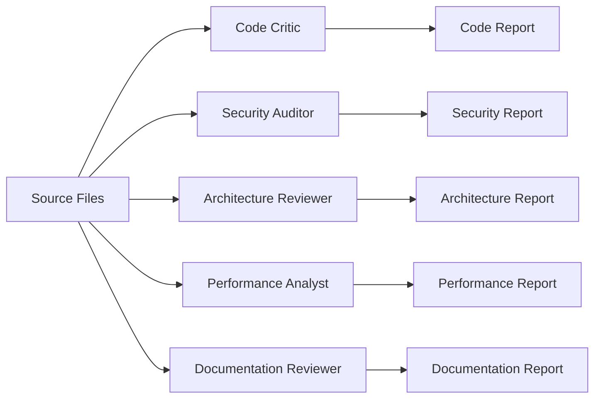

# Comprehensive Review Workflow

## Purpose
Perform a complete analysis of Claude-generated code, covering all quality aspects including code structure, security, performance, architecture, and documentation.

## Workflow Steps

### 1. Initial Setup
```yaml
input:
  - source_files: [List of files to review]
  - project_context: [Project description]
  - review_scope: [Full/Partial]
  - priority_areas: [Optional focus areas]

output:
  - comprehensive_report: reports/reviews/[timestamp]-comprehensive.md
  - individual_reports: reports/[type]/[timestamp]-[aspect].md
```

### 2. Parallel Analysis Phase

All agents work simultaneously on the same codebase:



### 3. Agent Coordination

#### Code Critic Tasks
- Analyze code structure and quality
- Identify patterns and anti-patterns
- Score maintainability
- Flag areas for other agents

#### Security Auditor Tasks
- Scan for vulnerabilities
- Check authentication/authorization
- Assess data protection
- Review configuration security

#### Architecture Reviewer Tasks
- Evaluate design patterns
- Assess system structure
- Review scalability approach
- Identify technical debt

#### Performance Analyst Tasks
- Analyze algorithmic complexity
- Identify bottlenecks
- Review resource usage
- Assess scalability limits

#### Documentation Reviewer Tasks
- Check documentation coverage
- Assess clarity and completeness
- Review examples and guides
- Identify documentation gaps

### 4. Report Aggregation

```yaml
aggregation_process:
  1. collect_individual_reports
  2. identify_cross_cutting_concerns
  3. resolve_conflicting_assessments
  4. prioritize_findings
  5. generate_executive_summary
```

### 5. Comprehensive Report Structure

```markdown
# Comprehensive Review Report
Date: [timestamp]
Project: [name]
Files Reviewed: [count]

## Executive Summary
- Overall Score: X/10
- Critical Issues: X
- Key Strengths: [List]
- Major Concerns: [List]

## Scores by Category
| Category | Score | Trend |
|----------|-------|-------|
| Code Quality | X/10 | ↑↓→ |
| Security | X/10 | ↑↓→ |
| Architecture | X/10 | ↑↓→ |
| Performance | X/10 | ↑↓→ |
| Documentation | X/10 | ↑↓→ |

## Critical Issues (Must Fix)
[Aggregated critical findings from all agents]

## High Priority Findings
[Important issues requiring attention]

## Detailed Analysis
[Section for each agent's findings]

## Recommendations
### Immediate Actions
[Top 5 things to fix now]

### Short-term Improvements
[Next 10 improvements]

### Long-term Strategy
[Architectural and strategic changes]

## Positive Aspects
[What's working well]

## Appendices
- Individual agent reports
- Detailed metrics
- Code examples
```

### 6. Execution Script

```bash
#!/bin/bash
# comprehensive-review.sh

PROJECT="$1"
TIMESTAMP=$(date +%Y%m%d_%H%M%S)
REPORT_DIR="reports/reviews/$TIMESTAMP"

echo "🔍 Starting Comprehensive Review for $PROJECT"
mkdir -p "$REPORT_DIR"

# Run all agents in parallel
echo "📊 Running parallel analysis..."
(
  gemini-critic analyze "$PROJECT" --agent code-critic > "$REPORT_DIR/code.md" &
  gemini-critic analyze "$PROJECT" --agent security-auditor > "$REPORT_DIR/security.md" &
  gemini-critic analyze "$PROJECT" --agent architecture-reviewer > "$REPORT_DIR/architecture.md" &
  gemini-critic analyze "$PROJECT" --agent performance-analyst > "$REPORT_DIR/performance.md" &
  gemini-critic analyze "$PROJECT" --agent documentation-reviewer > "$REPORT_DIR/documentation.md" &
  wait
)

# Aggregate reports
echo "📋 Aggregating findings..."
gemini-critic aggregate "$REPORT_DIR/*.md" > "$REPORT_DIR/comprehensive.md"

echo "✅ Review complete: $REPORT_DIR/comprehensive.md"
```

## Quality Gates

### Pass Criteria
- No critical security issues
- Code quality score ≥ 6/10
- Architecture score ≥ 6/10
- Performance score ≥ 5/10
- Documentation coverage ≥ 60%

### Warning Criteria
- High priority issues < 10
- Technical debt manageable
- Performance acceptable
- Security risks documented

### Fail Criteria
- Critical security vulnerabilities
- Major architectural flaws
- Severe performance issues
- Less than 40% documentation

## Integration Points

### With CI/CD
```yaml
ci_integration:
  trigger: [push, pull_request]
  stages:
    - comprehensive_review
    - quality_gate_check
    - report_generation
    - notification
```

### With Development Workflow
- Pre-merge reviews
- Sprint retrospectives
- Release readiness
- Technical debt tracking

## Best Practices

1. **Regular Reviews**: Run comprehensive reviews weekly
2. **Track Trends**: Monitor score improvements over time
3. **Action Items**: Create tickets from findings
4. **Team Review**: Discuss reports in team meetings
5. **Continuous Improvement**: Update criteria based on learnings

---

*The Comprehensive Review workflow provides complete quality assessment through coordinated multi-agent analysis.*