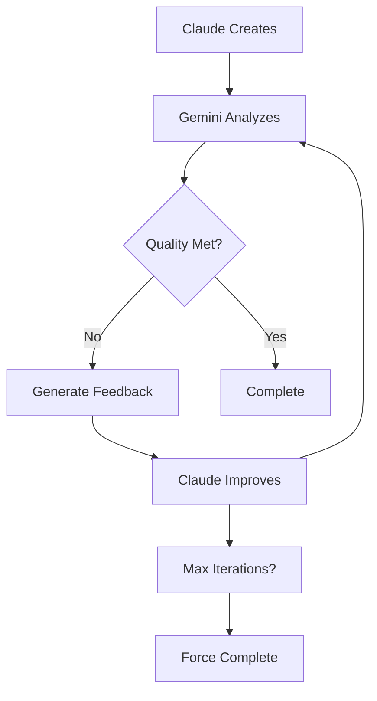

# Iterative Improvement Workflow

## Purpose
Create a continuous feedback loop between Claude's implementations and Gemini's analysis, driving quality improvements through multiple iterations until standards are met.

## Workflow Overview



## Configuration

```yaml
workflow_config:
  max_iterations: 5
  quality_threshold: 7.0
  focus_areas:
    - code_quality
    - security
    - performance
  stop_on_critical: true
  improvement_strategy: progressive
```

## Iteration Process

### 1. Initial Analysis
```bash
# First iteration - comprehensive analysis
iteration_1:
  input: original_implementation
  analysis: full_comprehensive
  output: 
    - detailed_critique
    - improvement_priorities
    - quality_scores
```

### 2. Improvement Cycle
```yaml
for each iteration:
  1. read_previous_critique
  2. identify_top_issues
  3. claude_implements_fixes
  4. gemini_analyzes_changes
  5. compare_with_previous
  6. check_quality_gates
```

### 3. Progressive Focusing
Each iteration narrows focus to remaining issues:
- Iteration 1: All aspects
- Iteration 2: Critical + High priority
- Iteration 3: Remaining High + Medium
- Iteration 4: Fine-tuning
- Iteration 5: Final polish

## Quality Tracking

### Metrics Dashboard
```markdown
## Iteration Progress
| Iteration | Overall | Code | Security | Performance | Documentation |
|-----------|---------|------|----------|-------------|---------------|
| 0 (Initial) | 4.2 | 5.0 | 3.0 | 4.0 | 4.5 |
| 1 | 5.8 | 6.5 | 5.0 | 5.5 | 6.0 |
| 2 | 7.1 | 7.5 | 7.0 | 6.8 | 7.0 |
| 3 | 7.8 | 8.0 | 8.0 | 7.5 | 7.5 |

## Issues Resolved
- Critical: 3/3 ✓
- High: 8/10
- Medium: 5/15
- Low: 2/20
```

## Iteration Templates

### Iteration Report
```markdown
# Iteration [N] Analysis
Date: [timestamp]
File: [filename]
Previous Score: X.X → Current Score: Y.Y

## Improvements Made
✓ [Fixed issue 1]
✓ [Fixed issue 2]
✓ [Fixed issue 3]

## Remaining Issues
### High Priority
1. [Issue description]
   - Impact: [explanation]
   - Suggestion: [approach]

### Medium Priority
[Listed issues]

## Quality Assessment
- Progress: [Improving/Stagnant/Regressing]
- Estimated Iterations Remaining: [N]
- Blocking Issues: [Any critical problems]

## Next Steps
[Specific improvements for next iteration]
```

## Implementation Script

```bash
#!/bin/bash
# iterative-improvement.sh

FILE="$1"
MAX_ITERATIONS=${2:-5}
QUALITY_THRESHOLD=${3:-7.0}
WORK_DIR="iterations/$(date +%Y%m%d_%H%M%S)"

mkdir -p "$WORK_DIR"
cp "$FILE" "$WORK_DIR/version_0.js"

echo "🔄 Starting Iterative Improvement Process"
echo "📄 File: $FILE"
echo "🎯 Target Quality: $QUALITY_THRESHOLD"
echo "🔢 Max Iterations: $MAX_ITERATIONS"

CURRENT_FILE="$WORK_DIR/version_0.js"
ITERATION=0

while [ $ITERATION -lt $MAX_ITERATIONS ]; do
    ITERATION=$((ITERATION + 1))
    echo -e "\n=== Iteration $ITERATION ==="
    
    # Gemini analyzes current version
    CRITIQUE_FILE="$WORK_DIR/critique_$ITERATION.md"
    gemini-critic analyze "$CURRENT_FILE" \
        --comprehensive \
        --output "$CRITIQUE_FILE"
    
    # Extract quality score
    SCORE=$(grep "Overall Score:" "$CRITIQUE_FILE" | awk '{print $3}' | cut -d'/' -f1)
    echo "Current Score: $SCORE"
    
    # Check if quality threshold met
    if (( $(echo "$SCORE >= $QUALITY_THRESHOLD" | bc -l) )); then
        echo "✅ Quality threshold met!"
        break
    fi
    
    # Check for critical issues
    if grep -q "CRITICAL" "$CRITIQUE_FILE"; then
        echo "⚠️  Critical issues found - must fix"
    fi
    
    # Claude implements improvements
    NEW_FILE="$WORK_DIR/version_$ITERATION.js"
    echo "🔧 Implementing improvements..."
    claude improve "$CURRENT_FILE" \
        --critique "$CRITIQUE_FILE" \
        --output "$NEW_FILE"
    
    # Generate comparison report
    COMPARE_FILE="$WORK_DIR/comparison_$ITERATION.md"
    gemini-critic compare \
        "$CURRENT_FILE" \
        "$NEW_FILE" \
        --output "$COMPARE_FILE"
    
    CURRENT_FILE="$NEW_FILE"
done

# Generate final report
echo -e "\n📊 Generating Final Report..."
cat > "$WORK_DIR/final_report.md" << EOF
# Iterative Improvement Summary
Date: $(date)
File: $FILE
Iterations: $ITERATION
Final Score: $SCORE

## Quality Evolution
$(grep "Overall Score:" $WORK_DIR/critique_*.md | awk '{print "- Iteration " NR-1 ": " $3}')

## Improvements Applied
$(grep -h "✓" $WORK_DIR/comparison_*.md 2>/dev/null || echo "See individual reports")

## Final Status
$([ $(echo "$SCORE >= $QUALITY_THRESHOLD" | bc -l) -eq 1 ] && echo "✅ Quality standards met" || echo "⚠️  Below quality threshold")

## Artifacts
- Original: version_0.js
- Final: version_$ITERATION.js
- Reports: critique_*.md, comparison_*.md
EOF

echo "✅ Process complete. Final report: $WORK_DIR/final_report.md"
```

## Improvement Strategies

### Progressive Enhancement
```yaml
strategy: progressive
priorities:
  1: [critical_security, crashes]
  2: [high_security, major_bugs]
  3: [performance_bottlenecks]
  4: [code_quality, maintainability]
  5: [documentation, minor_issues]
```

### Focused Improvement
```yaml
strategy: focused
target: security  # or performance, quality, etc.
iterations:
  - deep_security_fixes
  - security_hardening
  - security_polish
```

### Balanced Approach
```yaml
strategy: balanced
each_iteration:
  - top_issue_per_category
  - maintain_other_scores
  - prevent_regressions
```

## Success Criteria

### Completion Conditions
1. **Quality Met**: All scores ≥ threshold
2. **No Critical Issues**: Zero critical findings
3. **Iteration Limit**: Max iterations reached
4. **Stagnation**: No improvement for 2 iterations
5. **Manual Override**: User intervention

### Quality Gates
```yaml
must_pass:
  - no_critical_security_issues
  - no_crash_bugs
  - core_functionality_intact

should_pass:
  - code_quality >= 6
  - performance >= 5
  - documentation >= 5

nice_to_have:
  - all_scores >= 7
  - zero_high_priority_issues
```

## Integration Examples

### With Development Workflow
```bash
# Pre-commit hook
.git/hooks/pre-commit:
  iterative-improvement.sh "$FILE" 3 6.0

# Pull request check
ci/pr-check.yml:
  - run: iterative-improvement.sh src/ 5 7.0
```

### With Other Specialists
```yaml
collaboration:
  - ui_designer: creates_initial
  - critic_analyst: iterative_improvement
  - qa_engineer: validates_final
  - devops: deploys_if_passed
```

## Best Practices

1. **Set Realistic Thresholds**: Start with 6.0, increase over time
2. **Limit Iterations**: 3-5 is usually optimal
3. **Track Patterns**: Learn from common improvements
4. **Cache Results**: Reuse analysis for efficiency
5. **Human Review**: Final human check recommended

---

*The Iterative Improvement workflow ensures continuous quality enhancement through automated Claude-Gemini collaboration cycles.*