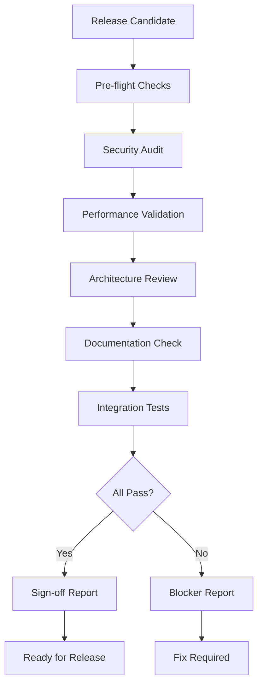

# Pre-Release Audit Workflow

## Purpose
Perform a final, comprehensive quality gate check before any release, ensuring code meets all production standards for security, performance, reliability, and documentation.

## Workflow Overview



## Audit Checklist

### 🔒 Security Requirements
- [ ] No critical vulnerabilities
- [ ] No high-risk issues unmitigated
- [ ] Authentication properly implemented
- [ ] Data encryption in place
- [ ] No secrets in code
- [ ] Security headers configured
- [ ] Input validation complete
- [ ] OWASP Top 10 compliance

### ⚡ Performance Standards
- [ ] Response time < 1s (95th percentile)
- [ ] No memory leaks detected
- [ ] Database queries optimized
- [ ] Caching strategy implemented
- [ ] Load testing passed
- [ ] Resource usage acceptable
- [ ] Scalability verified

### 🏗️ Architecture Compliance
- [ ] Design patterns correctly implemented
- [ ] No circular dependencies
- [ ] Proper error handling
- [ ] Logging implemented
- [ ] Monitoring hooks in place
- [ ] Backup/recovery capable
- [ ] Configuration externalized

### 📚 Documentation Complete
- [ ] README up to date
- [ ] API documentation complete
- [ ] Deployment guide present
- [ ] Configuration documented
- [ ] Troubleshooting guide
- [ ] Change log updated
- [ ] Architecture diagrams current

## Execution Process

### 1. Pre-flight Checks
```bash
# pre-flight.sh
echo "🔍 Running pre-flight checks..."

# Check dependencies
npm audit
pip check
gem audit

# License compliance
license-checker

# Code coverage
npm test -- --coverage
```

### 2. Security Deep Scan
```yaml
security_audit:
  tools:
    - gemini_security_auditor
    - dependency_scanner
    - secret_scanner
    - sast_tools
  
  checks:
    - authentication_flow
    - authorization_matrix
    - data_protection
    - api_security
    - infrastructure_security
```

### 3. Performance Validation
```yaml
performance_tests:
  load_test:
    users: [100, 500, 1000, 5000]
    duration: 30m
    success_criteria:
      - response_time_p95 < 1000ms
      - error_rate < 0.1%
      - cpu_usage < 80%
      - memory_stable: true
  
  stress_test:
    ramp_up: gradual
    break_point: identify
    recovery: measure
```

### 4. Release Report Template

```markdown
# Pre-Release Audit Report
Date: [timestamp]
Version: [version]
Auditor: Gemini Critic-Analyst

## Executive Summary
- **Release Decision**: [GO/NO-GO]
- **Risk Level**: [Low/Medium/High]
- **Blockers**: [Count]
- **Warnings**: [Count]

## Audit Results

### 🔒 Security Assessment
- **Status**: [PASS/FAIL]
- **Score**: X/10
- **Critical Issues**: 0
- **High Issues**: X (mitigated)
- **Recommendations**: [List]

### ⚡ Performance Validation
- **Status**: [PASS/FAIL]
- **Load Test**: [PASS/FAIL]
- **Response Time (p95)**: Xms
- **Peak Capacity**: X users
- **Resource Usage**: [Acceptable/Concerns]

### 🏗️ Architecture Review
- **Status**: [PASS/FAIL]
- **Technical Debt**: [Low/Medium/High]
- **Scalability**: [Ready/Concerns]
- **Maintainability**: X/10

### 📚 Documentation Audit
- **Status**: [PASS/FAIL]
- **Coverage**: X%
- **Quality**: [Excellent/Good/Needs Work]
- **Missing**: [List]

## Blockers (Must Fix)
[Critical issues preventing release]

## Warnings (Should Fix)
[Important issues to address soon]

## Recommendations
[Improvements for next release]

## Sign-off
- [ ] Security Team
- [ ] Architecture Team
- [ ] Operations Team
- [ ] Product Owner

## Appendices
- Detailed test results
- Security scan reports
- Performance graphs
- Coverage reports
```

### 5. Automation Script

```bash
#!/bin/bash
# pre-release-audit.sh

VERSION="$1"
RELEASE_DIR="releases/$VERSION"
AUDIT_DIR="$RELEASE_DIR/audit"

echo "🚀 Pre-Release Audit for Version $VERSION"
mkdir -p "$AUDIT_DIR"

# Function to check status
check_status() {
    local name="$1"
    local command="$2"
    local output="$3"
    
    echo -n "Checking $name... "
    if $command > "$output" 2>&1; then
        echo "✅ PASS"
        return 0
    else
        echo "❌ FAIL"
        return 1
    fi
}

# Run all checks
FAILED=0

# Security audit
check_status "Security" \
    "gemini-critic audit --security --comprehensive" \
    "$AUDIT_DIR/security.log" || ((FAILED++))

# Performance validation
check_status "Performance" \
    "./scripts/performance-test.sh" \
    "$AUDIT_DIR/performance.log" || ((FAILED++))

# Architecture review
check_status "Architecture" \
    "gemini-critic review --architecture src/" \
    "$AUDIT_DIR/architecture.log" || ((FAILED++))

# Documentation check
check_status "Documentation" \
    "gemini-critic analyze --documentation ." \
    "$AUDIT_DIR/documentation.log" || ((FAILED++))

# Integration tests
check_status "Integration" \
    "npm run test:integration" \
    "$AUDIT_DIR/integration.log" || ((FAILED++))

# Generate report
echo "📊 Generating audit report..."
gemini-critic generate-report \
    --type pre-release \
    --input "$AUDIT_DIR/*.log" \
    --output "$AUDIT_DIR/pre-release-audit.md"

# Decision
if [ $FAILED -eq 0 ]; then
    echo "✅ All checks passed - READY FOR RELEASE"
    echo "GO" > "$AUDIT_DIR/decision.txt"
else
    echo "❌ $FAILED checks failed - BLOCKED"
    echo "NO-GO" > "$AUDIT_DIR/decision.txt"
fi

echo "📄 Full report: $AUDIT_DIR/pre-release-audit.md"
```

## Quality Gates

### Hard Requirements (Blockers)
```yaml
blockers:
  security:
    - no_critical_vulnerabilities
    - no_unmitigated_high_risks
    - authentication_working
    - no_exposed_secrets
  
  performance:
    - response_time_p95 < 2000ms
    - no_memory_leaks
    - error_rate < 1%
  
  functionality:
    - all_tests_passing
    - no_regression_bugs
    - core_features_working
```

### Soft Requirements (Warnings)
```yaml
warnings:
  code_quality:
    - maintainability >= 6
    - test_coverage >= 70%
    - no_complex_functions
  
  documentation:
    - readme_complete
    - api_docs_current
    - examples_provided
  
  operations:
    - monitoring_configured
    - logging_adequate
    - backup_tested
```

## Integration Points

### CI/CD Pipeline
```yaml
pipeline:
  stages:
    - build
    - test
    - pre_release_audit
    - approval_gate
    - deploy
  
  pre_release_audit:
    script: ./pre-release-audit.sh $VERSION
    artifacts:
      - releases/$VERSION/audit/*
    only:
      - tags
      - release/*
```

### Release Management
```yaml
release_process:
  1. tag_release_candidate
  2. run_pre_release_audit
  3. review_audit_report
  4. fix_blockers_if_any
  5. get_sign_offs
  6. create_release
  7. deploy_to_production
```

## Escalation Process

### Blocker Found
1. Stop release process
2. Create priority tickets
3. Assign to relevant teams
4. Fix and re-audit
5. Document lessons learned

### Warning Handling
1. Document in release notes
2. Create follow-up tickets
3. Plan for next sprint
4. Monitor in production

## Best Practices

1. **Automate Everything**: Full automation prevents human error
2. **No Exceptions**: Never bypass audit for "emergencies"
3. **Track Metrics**: Monitor audit pass rates over time
4. **Learn from Failures**: Update checks based on production issues
5. **Keep Current**: Regularly update audit criteria

---

*The Pre-Release Audit workflow ensures production readiness through comprehensive final validation.*