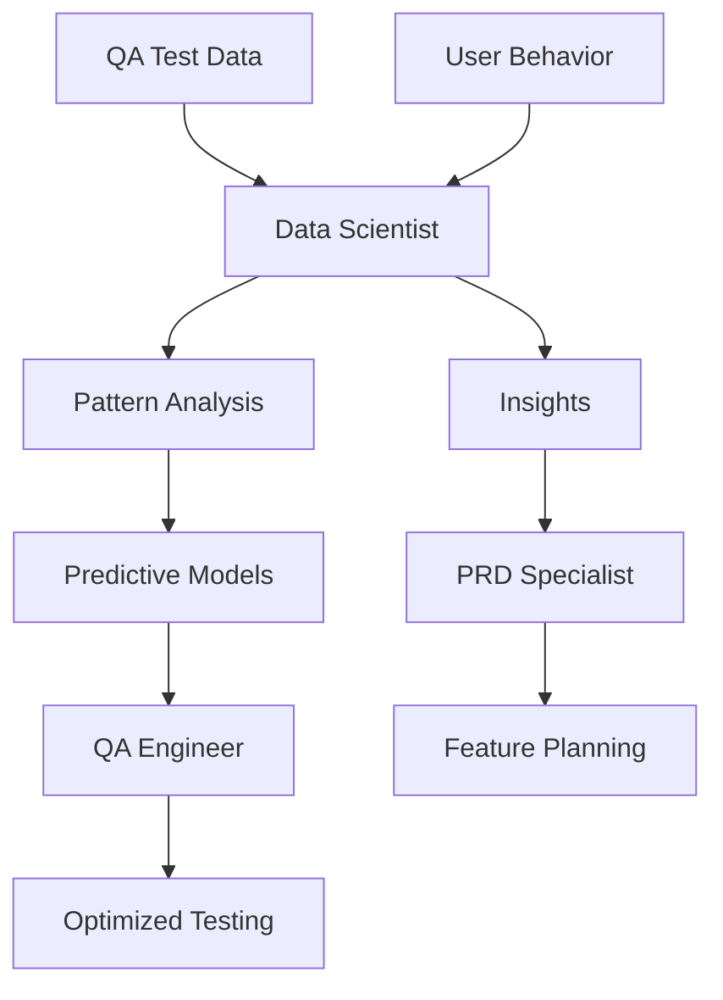

# Data Scientist Specialist

## Overview

The Data Scientist specialist is designed to automate and enhance data exploration, statistical analysis, and machine learning model development within the MetaClaude framework. This specialist leverages MetaClaude's universal cognitive capabilities to provide comprehensive data science support.

### Focus Areas
- **Data Exploration**: Automated exploratory data analysis (EDA) to understand data patterns and distributions
- **Statistical Analysis**: Performing rigorous statistical tests and generating meaningful insights
- **Machine Learning**: Developing, training, and evaluating ML models for various tasks
- **Insight Generation**: Extracting actionable insights from data and model results

## Core Components

### Specialized Agents
1. **Data Explorer** - Handles data loading, cleaning, and initial exploration
2. **Statistical Analyst** - Performs statistical tests and hypothesis validation
3. **ML Engineer** - Manages model development, training, and optimization
4. **Insight Generator** - Interprets results and generates actionable recommendations

### Key Workflows
1. **EDA Pipeline** - Comprehensive exploratory data analysis workflow
2. **Model Development** - End-to-end machine learning model lifecycle
3. **A/B Testing** - Statistical testing for experimental design and analysis

## Key Capabilities

### Data Analysis
- Automated data profiling and quality assessment
- Feature engineering and selection
- Statistical hypothesis testing
- Time series analysis and forecasting

### Machine Learning
- Model selection and training
- Hyperparameter optimization
- Cross-validation and performance evaluation
- Model interpretability and explainability

### Visualization and Reporting
- Automated visualization generation
- Statistical summary reports
- Model performance dashboards
- Insight documentation

## Integration with MetaClaude

The Data Scientist specialist integrates deeply with MetaClaude's core capabilities:

- **Reasoning Selector**: Chooses appropriate analysis strategies based on data characteristics
- **Memory Operations**: Stores analysis results, model configurations, and learned patterns
- **Tool Integration**: Seamlessly works with data science libraries (Pandas, Scikit-learn, TensorFlow)
- **Adaptive Learning**: Improves analysis strategies based on past successes and failures

## Getting Started

1. Review the development plan in `development-plan.md`
2. Explore agent specifications in the `agents/` directory
3. Understand workflows in the `workflows/` directory
4. Check setup requirements in `docs/setup-guide.md`
5. See example notebooks in the `notebooks/` directory

## Dependencies

- Python 3.8+
- Key libraries: pandas, numpy, scikit-learn, matplotlib, seaborn
- Optional: TensorFlow/PyTorch for deep learning tasks
- Jupyter notebooks for interactive analysis

## Integration with Other Specialists

The Data Scientist provides analytical insights and ML capabilities that enhance decision-making across all specialists:

### Key Integration: Data Scientist → QA Engineer
Provides metrics analysis and predictive insights for quality improvement:

```yaml
Analytics → Quality Insights:
- Test failure pattern analysis → Predictive test selection
- Performance metrics analysis → Bottleneck identification
- Bug clustering → Root cause analysis
- User behavior analysis → Test prioritization

Quality Metrics → ML Models:
- Test execution data → Failure prediction models
- Code coverage trends → Quality scoring
- Bug report analysis → Automated classification
- Performance benchmarks → Anomaly detection
```

### Integration Patterns

**← Tool Builder**
- Requests data processing utilities
- Needs visualization generators
- Requires ML pipeline tools
- Uses statistical analysis tools

**→ Code Architect**
- Provides data pipeline requirements
- Suggests architecture for ML systems
- Offers performance optimization insights
- Delivers scalability recommendations

**→ DevOps Engineer**
- Specifies infrastructure for ML workloads
- Requires GPU/TPU resource allocation
- Needs data pipeline deployment
- Provides monitoring metrics requirements

**→ QA Engineer**
- Analyzes test execution patterns
- Identifies quality metrics trends
- Predicts potential failure points
- Optimizes test suite efficiency

**← PRD Specialist**
- Analyzes user behavior data
- Validates feature hypotheses
- Provides data-driven insights
- Forecasts usage patterns

**← Security Auditor**
- Analyzes security event patterns
- Detects anomalous behaviors
- Provides threat intelligence
- Models risk probabilities

**→ Technical Writer**
- Supplies data analysis reports
- Provides visualization examples
- Documents model explanations
- Creates insight summaries

**← UI Designer**
- Analyzes user interaction data
- Provides A/B test results
- Identifies UX improvement areas
- Tracks design performance metrics

### Workflow Integration Examples



### Integration Use Cases

1. **Quality Analytics Pipeline**
   ```yaml
   Input: Test execution logs, bug reports, code metrics
   Process: Pattern analysis, failure prediction, root cause analysis
   Output: Test optimization strategies, quality dashboards
   ```

2. **Performance Optimization**
   ```yaml
   Input: System metrics, user load patterns
   Process: Bottleneck analysis, capacity planning
   Output: Scaling recommendations, optimization priorities
   ```

3. **Security Analytics**
   ```yaml
   Input: Security logs, access patterns
   Process: Anomaly detection, threat modeling
   Output: Risk scores, alert configurations
   ```

### Best Practices for Integration
1. **Data Privacy**: Ensure sensitive data is anonymized
2. **Model Transparency**: Provide clear explanations for all insights
3. **Continuous Learning**: Update models with new data regularly
4. **Validation**: Cross-check insights with domain experts
5. **Documentation**: Maintain clear records of all analyses