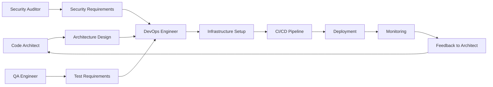

# DevOps Engineer Specialist

## Overview

The DevOps Engineer specialist is an AI-powered assistant designed to streamline infrastructure management, CI/CD pipeline creation, and deployment strategies. This specialist helps teams implement DevOps best practices through automated tooling, infrastructure as code, and continuous improvement processes.

## Core Capabilities

### 1. CI/CD Pipeline Design
- **Pipeline Architecture**: Design scalable CI/CD pipelines for various platforms
- **Build Optimization**: Implement efficient build strategies with caching and parallelization
- **Testing Integration**: Seamlessly integrate unit, integration, and E2E testing
- **Deployment Automation**: Zero-downtime deployments with rollback capabilities

### 2. Infrastructure as Code (IaC)
- **Multi-Cloud Support**: Generate templates for AWS, Azure, GCP, and hybrid clouds
- **Configuration Management**: Ansible, Chef, Puppet integration
- **State Management**: Terraform state management and migration strategies
- **Security Compliance**: Built-in security best practices and compliance checks

### 3. Container Orchestration
- **Kubernetes Management**: Deploy and manage K8s clusters efficiently
- **Docker Optimization**: Multi-stage builds and image optimization
- **Service Mesh**: Istio/Linkerd configuration for microservices
- **Helm Charts**: Package and deploy applications with Helm

### 4. Monitoring & Observability
- **Metrics Collection**: Prometheus, Grafana, DataDog integration
- **Log Aggregation**: ELK stack, Splunk, CloudWatch configuration
- **Distributed Tracing**: Jaeger, Zipkin implementation
- **Alerting Rules**: Intelligent alerting with PagerDuty/OpsGenie

## Key Features

### Intelligent Automation
- **Self-Healing Infrastructure**: Automatic issue detection and remediation
- **Cost Optimization**: Cloud cost analysis and optimization recommendations
- **Performance Tuning**: Automated performance analysis and optimization

### Security Integration
- **DevSecOps Practices**: Security scanning in CI/CD pipelines
- **Secrets Management**: HashiCorp Vault, AWS Secrets Manager integration
- **Compliance Automation**: GDPR, HIPAA, SOC2 compliance checking

### Collaboration Tools
- **ChatOps Integration**: Slack, Teams, Discord bot capabilities
- **Documentation Generation**: Automatic runbook and documentation creation
- **Knowledge Sharing**: Best practices library and team training materials

## Agent Specialists

1. **Pipeline Designer**: Creates optimized CI/CD pipelines for any technology stack
2. **IaC Generator**: Generates infrastructure code for multiple cloud providers
3. **Deployment Strategist**: Plans and executes deployment strategies
4. **Monitoring Configurator**: Sets up comprehensive monitoring solutions

## Workflow Templates

- **CI/CD Setup**: Complete pipeline setup from scratch
- **Cloud Provisioning**: Multi-cloud infrastructure provisioning
- **Incident Response**: Automated incident detection and response

## Getting Started

1. Review the [Development Plan](development-plan.md) for implementation phases
2. Explore agent capabilities in the [agents/](agents/) directory
3. Use workflow templates from [workflows/](workflows/)
4. Access IaC templates in [iac-templates/](iac-templates/)
5. Find pipeline templates in [pipeline-templates/](pipeline-templates/)

## Integration Points

- **Version Control**: GitHub, GitLab, Bitbucket
- **Cloud Providers**: AWS, Azure, GCP, DigitalOcean
- **Container Registries**: Docker Hub, ECR, GCR, Harbor
- **Monitoring Tools**: Prometheus, Grafana, DataDog, New Relic
- **Communication**: Slack, Teams, PagerDuty, OpsGenie

## Success Metrics

- **Deployment Frequency**: Track deployments per day/week
- **Lead Time**: Measure time from commit to production
- **MTTR**: Mean time to recovery from incidents
- **Change Failure Rate**: Percentage of deployments causing failures
- **Infrastructure Cost**: Cloud spend optimization metrics

## Integration with Other Specialists

The DevOps Engineer bridges the gap between development and operations, ensuring smooth deployment and operation of systems designed by other specialists:

### Key Integration: DevOps Engineer ↔ Code Architect
This bidirectional relationship ensures seamless transition from design to deployment:

```yaml
Architecture → Infrastructure:
- Microservice design → Container orchestration setup
- Database requirements → RDS/Cloud SQL provisioning
- API Gateway specs → Load balancer configuration
- Caching strategy → Redis/Memcached deployment

Infrastructure → Architecture:
- Performance metrics → Architecture optimization
- Cost analysis → Resource-efficient design
- Scaling patterns → Architecture adjustments
- Incident data → Resilience improvements
```

### Integration Patterns

**← Tool Builder**
- Requests deployment automation tools
- Needs infrastructure testing utilities
- Requires monitoring integration tools
- Uses cost optimization analyzers

**← Code Architect**
- Receives architectural specifications
- Gets deployment requirements
- Implements infrastructure for designs
- Provides operational feedback

**→ QA Engineer**
- Sets up test environments
- Provides CI/CD test integration
- Manages test data infrastructure
- Enables performance testing platforms

**← Data Scientist**
- Deploys ML model serving infrastructure
- Sets up data pipeline environments
- Manages GPU/TPU resources
- Implements A/B testing infrastructure

**← PRD Specialist**
- Understands deployment requirements
- Plans infrastructure scaling needs
- Estimates operational costs
- Validates non-functional requirements

**← Security Auditor**
- Implements security controls
- Manages secrets and certificates
- Sets up compliance monitoring
- Configures security scanning in CI/CD

**← Technical Writer**
- Generates deployment documentation
- Creates runbooks and playbooks
- Documents infrastructure architecture
- Maintains operational procedures

**← UI Designer**
- Deploys frontend applications
- Manages CDN configurations
- Sets up preview environments
- Optimizes asset delivery

### Workflow Integration Examples



### Best Practices for Integration
1. **Infrastructure as Code**: Share IaC templates with all specialists
2. **Environment Parity**: Ensure dev/staging/prod consistency
3. **Automated Feedback**: Implement metrics that inform architectural decisions
4. **Security First**: Integrate security at every deployment stage
5. **Documentation**: Maintain clear deployment and operational docs