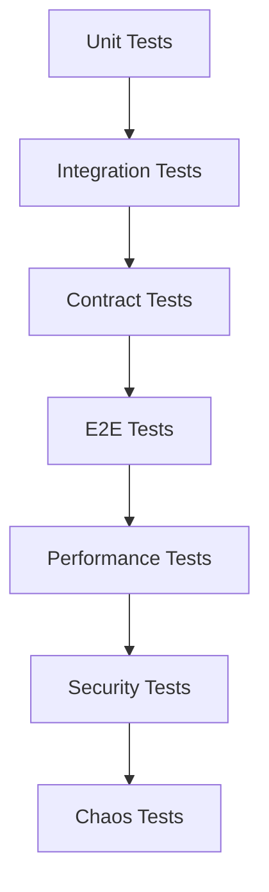

# DevOps Engineering Best Practices

## Overview
This guide outlines best practices for implementing and maintaining DevOps processes, tools, and culture within modern software development organizations.

## Core Principles

### 1. Automation First
- **Infrastructure as Code**: All infrastructure should be defined in code
- **CI/CD Pipelines**: Automate build, test, and deployment processes
- **Configuration Management**: Use tools like Ansible, Puppet, or Chef
- **Monitoring & Alerting**: Automate incident detection and response

### 2. Shift Left Security
- **Security Scanning**: Integrate security checks early in development
- **Policy as Code**: Define security policies that can be automatically enforced
- **Secrets Management**: Never store secrets in code; use vault solutions
- **Compliance Automation**: Automate compliance checking and reporting

### 3. Observability & Monitoring
- **Three Pillars**: Implement metrics, logs, and traces
- **SLI/SLO/SLA**: Define and monitor service level indicators and objectives
- **Proactive Monitoring**: Detect issues before they impact users
- **Centralized Logging**: Aggregate logs from all services and infrastructure

## CI/CD Best Practices

### Pipeline Design
```yaml
# Example: Well-structured pipeline stages
stages:
  - validate      # Syntax checking, linting
  - build        # Compile, package
  - test         # Unit, integration, E2E tests
  - security     # Vulnerability scanning
  - quality      # Code quality gates
  - package      # Container/artifact creation
  - deploy       # Progressive deployment
  - verify       # Post-deployment validation
```

### Build Optimization
1. **Parallel Execution**: Run independent tasks concurrently
2. **Caching Strategy**: Cache dependencies, Docker layers, build artifacts
3. **Fail Fast**: Run quickest checks first
4. **Resource Allocation**: Right-size build agents

### Testing Strategy


## Infrastructure Best Practices

### Cloud Architecture
1. **Multi-Region**: Design for geographic distribution
2. **Auto-Scaling**: Implement both horizontal and vertical scaling
3. **Immutable Infrastructure**: Replace rather than update
4. **Disaster Recovery**: Regular backups and tested recovery procedures

### Container Orchestration
```yaml
# Kubernetes best practices
apiVersion: apps/v1
kind: Deployment
metadata:
  name: best-practice-app
spec:
  replicas: 3  # High availability
  strategy:
    type: RollingUpdate
    rollingUpdate:
      maxSurge: 1
      maxUnavailable: 0  # Zero downtime
  template:
    spec:
      containers:
      - name: app
        resources:  # Resource limits
          requests:
            memory: "256Mi"
            cpu: "250m"
          limits:
            memory: "512Mi"
            cpu: "500m"
        livenessProbe:  # Health checks
          httpGet:
            path: /health
            port: 8080
        readinessProbe:
          httpGet:
            path: /ready
            port: 8080
        securityContext:  # Security hardening
          runAsNonRoot: true
          readOnlyRootFilesystem: true
          allowPrivilegeEscalation: false
```

### Infrastructure as Code
1. **Version Control**: All IaC should be in Git
2. **Code Review**: Peer review infrastructure changes
3. **Testing**: Test infrastructure code before applying
4. **State Management**: Secure and backup Terraform state

## Security Best Practices

### DevSecOps Integration
```bash
# Security scanning at every stage
- Static Application Security Testing (SAST)
- Dynamic Application Security Testing (DAST)
- Software Composition Analysis (SCA)
- Container Security Scanning
- Infrastructure Security Scanning
```

### Access Control
1. **Least Privilege**: Grant minimum necessary permissions
2. **Role-Based Access**: Use RBAC for all systems
3. **Multi-Factor Authentication**: Enforce MFA for all accounts
4. **Regular Audits**: Review and revoke unnecessary access

### Secrets Management
```yaml
# Example: Kubernetes secret usage
apiVersion: v1
kind: Secret
metadata:
  name: app-secrets
type: Opaque
data:
  database-url: <base64-encoded-value>
---
# Reference in deployment
env:
  - name: DATABASE_URL
    valueFrom:
      secretKeyRef:
        name: app-secrets
        key: database-url
```

## Monitoring & Observability

### Metrics Collection
```yaml
# Prometheus configuration example
global:
  scrape_interval: 15s
  evaluation_interval: 15s

scrape_configs:
  - job_name: 'kubernetes-pods'
    kubernetes_sd_configs:
      - role: pod
    relabel_configs:
      - source_labels: [__meta_kubernetes_pod_annotation_prometheus_io_scrape]
        action: keep
        regex: true
```

### Logging Strategy
1. **Structured Logging**: Use JSON format for machine parsing
2. **Correlation IDs**: Track requests across services
3. **Log Levels**: Use appropriate log levels (DEBUG, INFO, WARN, ERROR)
4. **Retention Policies**: Define log retention based on compliance needs

### Alerting Best Practices
```yaml
# Example alert rule
groups:
  - name: application
    rules:
      - alert: HighErrorRate
        expr: rate(http_requests_total{status=~"5.."}[5m]) > 0.05
        for: 5m
        labels:
          severity: critical
          team: backend
        annotations:
          summary: "High error rate detected"
          description: "Error rate is {{ $value | humanizePercentage }}"
          runbook_url: "https://wiki.company.com/runbooks/high-error-rate"
```

## Deployment Strategies

### Progressive Delivery
1. **Blue-Green Deployment**
   - Zero-downtime deployments
   - Quick rollback capability
   - Full environment switch

2. **Canary Deployment**
   - Gradual rollout to subset of users
   - Monitor metrics during rollout
   - Automatic rollback on failures

3. **Feature Flags**
   - Decouple deployment from release
   - A/B testing capabilities
   - Gradual feature rollout

### Rollback Procedures
```bash
#!/bin/bash
# Automated rollback script
DEPLOYMENT=$1
NAMESPACE=$2

# Get previous revision
PREVIOUS_REVISION=$(kubectl rollout history deployment/$DEPLOYMENT -n $NAMESPACE | tail -2 | head -1 | awk '{print $1}')

# Rollback to previous revision
kubectl rollout undo deployment/$DEPLOYMENT -n $NAMESPACE --to-revision=$PREVIOUS_REVISION

# Wait for rollback to complete
kubectl rollout status deployment/$DEPLOYMENT -n $NAMESPACE

# Verify health
kubectl get pods -l app=$DEPLOYMENT -n $NAMESPACE
```

## Cost Optimization

### Resource Management
1. **Right-Sizing**: Monitor and adjust resource allocations
2. **Auto-Scaling**: Scale based on actual demand
3. **Spot Instances**: Use spot/preemptible instances for non-critical workloads
4. **Reserved Instances**: Commit to long-term usage for discounts

### Cost Monitoring
```python
# Example: Cost tracking script
import boto3
from datetime import datetime, timedelta

def get_daily_costs():
    ce_client = boto3.client('ce')
    
    end_date = datetime.now().date()
    start_date = end_date - timedelta(days=30)
    
    response = ce_client.get_cost_and_usage(
        TimePeriod={
            'Start': start_date.isoformat(),
            'End': end_date.isoformat()
        },
        Granularity='DAILY',
        Metrics=['UnblendedCost'],
        GroupBy=[
            {'Type': 'DIMENSION', 'Key': 'SERVICE'},
            {'Type': 'TAG', 'Key': 'Environment'}
        ]
    )
    
    return response['ResultsByTime']
```

## Team Collaboration

### Communication Practices
1. **Documentation**: Maintain up-to-date runbooks and wikis
2. **Incident Management**: Clear escalation procedures
3. **Blameless Post-Mortems**: Focus on improvement, not blame
4. **Knowledge Sharing**: Regular tech talks and documentation

### On-Call Best Practices
```yaml
# PagerDuty schedule example
schedule:
  name: "Platform Team On-Call"
  time_zone: "UTC"
  layers:
    - name: "Primary"
      rotation_type: "weekly"
      users:
        - user1@company.com
        - user2@company.com
        - user3@company.com
    - name: "Secondary"
      rotation_type: "weekly"
      users:
        - lead1@company.com
        - lead2@company.com
```

## Continuous Improvement

### Metrics to Track
1. **Deployment Frequency**: How often code is deployed
2. **Lead Time**: Time from commit to production
3. **MTTR**: Mean Time To Recovery
4. **Change Failure Rate**: Percentage of deployments causing failures

### Regular Reviews
1. **Weekly**: Review incidents and deployments
2. **Monthly**: Analyze trends and metrics
3. **Quarterly**: Strategic planning and tool evaluation
4. **Annually**: Major architecture and process reviews

## Tools Ecosystem

### Essential Tools by Category
```yaml
ci_cd:
  - Jenkins
  - GitLab CI
  - GitHub Actions
  - CircleCI
  - ArgoCD

infrastructure:
  - Terraform
  - CloudFormation
  - Ansible
  - Pulumi

containers:
  - Docker
  - Kubernetes
  - Helm
  - Istio

monitoring:
  - Prometheus
  - Grafana
  - ELK Stack
  - Datadog

security:
  - Vault
  - Falco
  - OPA
  - Trivy
```

## Conclusion

Successful DevOps implementation requires:
- Strong automation culture
- Continuous learning and improvement
- Focus on reliability and security
- Effective collaboration between teams
- Regular measurement and optimization

Remember: DevOps is a journey, not a destination. Continuously evolve your practices based on team needs and industry developments.