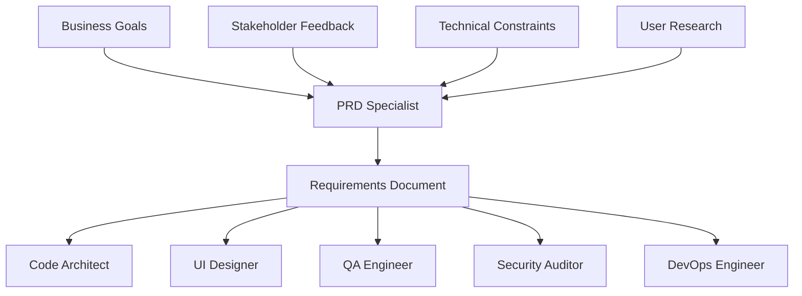

# PRD Specialist

## Overview

The PRD Specialist is an AI-powered tool within the MetaClaude framework designed to automate and enhance the process of defining, refining, and generating comprehensive Product Requirements Documents (PRDs), user stories, acceptance criteria, and feature specifications.

## Core Capabilities

### Focus Areas
- Defining comprehensive Product Requirements Documents
- Refining and validating requirements for completeness and clarity
- Generating user stories with proper format and structure
- Creating detailed acceptance criteria
- Developing feature specifications
- Ensuring stakeholder alignment and requirement consistency

### Specialized Agents

1. **Requirements Analyst**
   - Analyzes and interprets business requirements
   - Identifies gaps and ambiguities in requirements
   - Ensures completeness and consistency

2. **User Story Generator**
   - Creates well-formatted user stories
   - Follows industry-standard templates
   - Ensures stories are testable and valuable

3. **Acceptance Criteria Expert**
   - Develops comprehensive acceptance criteria
   - Ensures criteria are measurable and testable
   - Links criteria to user stories and requirements

4. **Stakeholder Aligner**
   - Manages conflicting requirements
   - Facilitates requirement prioritization
   - Ensures all stakeholder needs are addressed

### Key Workflows

1. **Requirements Gathering**
   - Collecting requirements from various sources
   - Organizing and categorizing requirements
   - Initial validation and clarification

2. **User Story Mapping**
   - Breaking down features into user stories
   - Creating story hierarchies and dependencies
   - Mapping stories to product roadmap

3. **PRD Generation**
   - Automated PRD creation from requirements
   - Template-based document generation
   - Comprehensive feature documentation

4. **Backlog Refinement**
   - Continuous requirement improvement
   - Priority adjustment based on feedback
   - Story estimation and planning

## Integration Points

### MetaClaude Core Integration
- Leverages reasoning-selector.md for decision-making
- Uses memory-operations.md for requirement history
- Integrates feedback-automation.md for continuous refinement
- Employs explainable-ai.md for transparent requirement decisions

### Tool Builder Integration
- Can request specialized tools for:
  - Data extraction from meetings
  - Compliance checklist generation
  - Requirement validation automation
  - Impact analysis tools

## Integration with Other Specialists

The PRD Specialist serves as the source of truth for requirements, ensuring all specialists work from a unified understanding of project goals:

### Key Integration: PRD Specialist → All Specialists
Requirements flow from PRD to guide every aspect of development:

```yaml
Requirements Distribution:
- Business Requirements → Technical Specifications
- User Stories → Implementation Tasks
- Acceptance Criteria → Test Cases
- Feature Specs → Architecture Designs
- Compliance Needs → Security Controls
```

### Integration Patterns

**← Tool Builder**
- Requests requirement parsing tools
- Needs user story generators
- Requires impact analysis utilities
- Uses compliance checkers

**→ Code Architect**
- Provides functional requirements
- Specifies performance criteria
- Defines scalability needs
- Outlines integration requirements

**→ DevOps Engineer**
- Specifies deployment requirements
- Defines availability SLAs
- Outlines monitoring needs
- Sets performance benchmarks

**→ Data Scientist**
- Provides analytics requirements
- Defines KPIs and metrics
- Specifies data collection needs
- Outlines reporting requirements

**→ QA Engineer**
- Delivers acceptance criteria
- Provides test scenarios
- Defines quality standards
- Specifies validation rules

**→ Security Auditor**
- Outlines security requirements
- Defines compliance needs
- Specifies data protection rules
- Sets access control requirements

**→ Technical Writer**
- Provides feature descriptions
- Supplies user scenarios
- Defines documentation scope
- Outlines training needs

**→ UI Designer**
- Delivers user experience requirements
- Provides user personas
- Defines accessibility standards
- Outlines brand guidelines

### Workflow Integration Examples



### Integration Use Cases

1. **Feature Development Flow**
   ```yaml
   PRD Output:
   - Feature specification
   - User stories with acceptance criteria
   - Performance requirements
   - Security constraints
   
   Specialist Actions:
   - Code Architect: Design system architecture
   - UI Designer: Create interface mockups
   - QA Engineer: Develop test plans
   - DevOps: Plan infrastructure needs
   ```

2. **Requirement Validation Loop**
   ```yaml
   Initial Requirements → Technical Review:
   - Code Architect validates feasibility
   - Security Auditor checks compliance
   - DevOps estimates resources
   - Data Scientist confirms metrics
   
   Feedback → Requirement Refinement:
   - PRD Specialist updates specifications
   - Re-validates with stakeholders
   - Distributes updated requirements
   ```

3. **Compliance-Driven Development**
   ```yaml
   Compliance Requirements:
   - Data privacy regulations
   - Industry standards
   - Security protocols
   
   Specialist Implementation:
   - Security Auditor: Define controls
   - Code Architect: Design compliant architecture
   - QA Engineer: Create compliance tests
   - Technical Writer: Document compliance
   ```

### Best Practices for Integration
1. **Living Documentation**: Keep requirements updated as project evolves
2. **Bidirectional Communication**: Accept feedback from all specialists
3. **Clear Traceability**: Link all work items back to requirements
4. **Regular Sync**: Hold cross-specialist requirement reviews
5. **Version Control**: Track requirement changes and impacts

## Getting Started

1. **Initialize PRD Specialist**
   ```bash
   claude-flow sparc prd-specialist init
   ```

2. **Create a New PRD**
   ```bash
   claude-flow sparc prd-specialist create-prd "Feature Name"
   ```

3. **Generate User Stories**
   ```bash
   claude-flow sparc prd-specialist generate-stories "Feature Description"
   ```

4. **Refine Requirements**
   ```bash
   claude-flow sparc prd-specialist refine-requirements "PRD ID"
   ```

## Best Practices

1. **Start with Clear Objectives**
   - Define business goals before requirements
   - Ensure all requirements trace back to objectives

2. **Use Standard Templates**
   - Leverage provided templates for consistency
   - Customize templates for specific domains

3. **Iterate and Refine**
   - Requirements are living documents
   - Regular refinement ensures relevance

4. **Maintain Traceability**
   - Link requirements to user stories
   - Track changes and decisions

5. **Validate Early and Often**
   - Engage stakeholders throughout the process
   - Use acceptance criteria for validation

## Directory Structure

- `agents/` - Individual agent implementations
- `workflows/` - Workflow orchestration logic
- `templates/` - PRD and story templates
- `docs/` - Additional documentation and guides
- `examples/` - Sample PRDs and user stories

## Version

PRD Specialist v1.0.0 - Part of the MetaClaude Framework