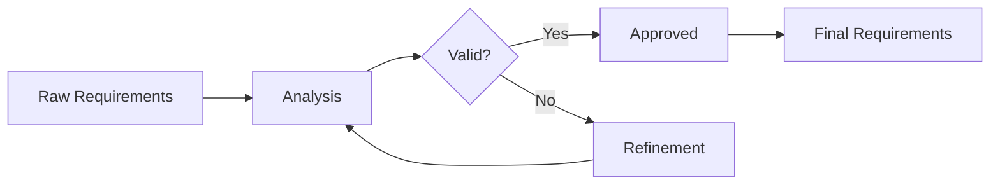

# Requirements Gathering Workflow

## Overview
The Requirements Gathering workflow orchestrates the systematic collection, analysis, and validation of requirements from multiple sources to create a comprehensive requirement set for product development.

## Workflow Stages

### Stage 1: Initiation and Planning
**Duration**: 1-2 days  
**Participants**: Product Owner, Stakeholder Aligner, Requirements Analyst

#### Activities
1. **Stakeholder Identification**
   - Map all relevant stakeholders
   - Define stakeholder categories
   - Establish communication channels
   - Set engagement schedule

2. **Gathering Strategy**
   - Select appropriate techniques
   - Schedule sessions
   - Prepare materials
   - Define success criteria

3. **Tool Preparation**
   - Configure recording tools
   - Set up collaboration platforms
   - Prepare templates
   - Test integrations

#### Outputs
- Stakeholder engagement plan
- Requirements gathering schedule
- Communication matrix
- Tool configuration

### Stage 2: Active Collection
**Duration**: 3-5 days  
**Participants**: All stakeholders, Requirements Analyst, Stakeholder Aligner

#### Collection Methods

##### 1. Stakeholder Interviews
```yaml
Preparation:
  - Interview questions
  - Recording setup
  - Stakeholder briefing
  - Time allocation

Execution:
  - Structured questioning
  - Active listening
  - Clarification seeking
  - Note taking

Follow-up:
  - Transcript review
  - Clarification requests
  - Validation
  - Documentation
```

##### 2. Workshops and Brainstorming
```yaml
Setup:
  - Workshop agenda
  - Facilitation materials
  - Participant preparation
  - Environment setup

Activities:
  - Idea generation
  - Requirement elaboration
  - Priority discussion
  - Consensus building

Outputs:
  - Raw requirements list
  - Priority indicators
  - Dependency notes
  - Action items
```

##### 3. Document Analysis
```yaml
Sources:
  - Existing PRDs
  - Business plans
  - Market research
  - Competitive analysis
  - User feedback
  - Support tickets

Analysis:
  - Requirement extraction
  - Pattern identification
  - Gap analysis
  - Validation needs
```

##### 4. Observation and Shadowing
```yaml
Activities:
  - User observation
  - Process documentation
  - Pain point identification
  - Workflow mapping

Documentation:
  - Observation notes
  - Process diagrams
  - Improvement opportunities
  - User quotes
```

#### Outputs
- Raw requirements inventory
- Stakeholder input logs
- Process documentation
- Initial priority indicators

### Stage 3: Analysis and Organization
**Duration**: 2-3 days  
**Participants**: Requirements Analyst, User Story Generator

#### Activities

1. **Requirement Categorization**
   ```markdown
   Categories:
   - Functional Requirements
     - Core features
     - User interactions
     - System behaviors
   - Non-Functional Requirements
     - Performance
     - Security
     - Usability
     - Scalability
   - Constraints
     - Technical
     - Business
     - Regulatory
   - Assumptions
     - User behavior
     - System environment
     - Dependencies
   ```

2. **Requirement Analysis**
   - Completeness check
   - Consistency validation
   - Feasibility assessment
   - Dependency mapping

3. **Pattern Recognition**
   - Common requirement patterns
   - Implicit requirements
   - Missing elements
   - Improvement opportunities

#### Tools and Techniques
- Affinity mapping
- Mind mapping
- Requirement matrices
- Traceability tools

#### Outputs
- Categorized requirements
- Analysis reports
- Dependency maps
- Gap identification

### Stage 4: Validation and Refinement
**Duration**: 2-3 days  
**Participants**: All agents, Key stakeholders

#### Validation Activities

1. **Stakeholder Review**
   - Requirement presentation
   - Clarification sessions
   - Feedback collection
   - Approval tracking

2. **Technical Validation**
   - Feasibility assessment
   - Architecture impact
   - Resource requirements
   - Risk identification

3. **Business Validation**
   - Value assessment
   - ROI analysis
   - Market alignment
   - Strategic fit

#### Refinement Process


#### Outputs
- Validated requirements
- Refinement log
- Approval records
- Risk register

### Stage 5: Documentation and Handoff
**Duration**: 1-2 days  
**Participants**: All agents

#### Documentation Standards

1. **Requirement Specification**
   ```markdown
   ID: REQ-001
   Title: User Authentication
   Description: System shall provide secure user authentication
   Type: Functional
   Priority: High
   Source: Security Team
   Dependencies: REQ-002, REQ-003
   Acceptance Criteria: [Link to criteria]
   Status: Approved
   Version: 1.0
   ```

2. **Traceability Matrix**
   - Requirement to source mapping
   - Requirement to user story mapping
   - Requirement to test case mapping
   - Change history tracking

3. **Supporting Documentation**
   - Meeting minutes
   - Decision logs
   - Assumption records
   - Risk documentation

#### Handoff Process
1. Final review with stakeholders
2. Sign-off collection
3. Distribution to development teams
4. Knowledge transfer sessions

#### Outputs
- Complete requirement specification
- Traceability documentation
- Handoff package
- Training materials

## Integration Points

### Tool Integration
- **Input Tools**
  - Meeting recording systems
  - Survey platforms
  - Document repositories
  - Collaboration tools

- **Processing Tools**
  - Requirements management systems
  - Analysis tools
  - Validation platforms
  - Documentation generators

- **Output Tools**
  - Project management systems
  - Development platforms
  - Testing tools
  - Reporting dashboards

### Agent Coordination
```yaml
Requirements Analyst:
  - Leads analysis activities
  - Validates completeness
  - Identifies gaps
  - Refines requirements

Stakeholder Aligner:
  - Manages stakeholder engagement
  - Resolves conflicts
  - Facilitates consensus
  - Tracks approvals

User Story Generator:
  - Prepares for story creation
  - Identifies story boundaries
  - Maps requirements to stories
  - Estimates complexity

Acceptance Criteria Expert:
  - Reviews for testability
  - Suggests criteria elements
  - Validates measurability
  - Identifies test scenarios
```

## Quality Gates

### Gate 1: Collection Completeness
- All stakeholders engaged ✓
- All sources reviewed ✓
- Critical areas covered ✓
- Documentation complete ✓

### Gate 2: Analysis Quality
- Requirements categorized ✓
- Dependencies mapped ✓
- Gaps identified ✓
- Patterns recognized ✓

### Gate 3: Validation Success
- Stakeholder approval ✓
- Technical feasibility ✓
- Business alignment ✓
- Risk assessment ✓

### Gate 4: Documentation Standard
- Complete specifications ✓
- Traceability established ✓
- Approvals documented ✓
- Handoff ready ✓

## Metrics and Monitoring

### Process Metrics
- Collection coverage: >95%
- Stakeholder participation: >90%
- Requirement clarity: >85%
- First-pass approval: >80%

### Quality Metrics
- Requirement completeness: 100%
- Validation success rate: >95%
- Stakeholder satisfaction: >85%
- Rework rate: <10%

### Time Metrics
- Average gathering time: 8-10 days
- Analysis efficiency: 20 requirements/hour
- Validation cycles: <3
- Documentation time: <2 days

## Best Practices

### Do's
1. Engage stakeholders early and often
2. Use multiple gathering techniques
3. Document everything
4. Validate continuously
5. Maintain traceability

### Don'ts
1. Skip stakeholder groups
2. Make assumptions without validation
3. Rush the analysis phase
4. Ignore conflicts
5. Forget non-functional requirements

## Troubleshooting

### Common Issues
- **Stakeholder Unavailability**: Use asynchronous methods
- **Conflicting Requirements**: Escalate to Stakeholder Aligner
- **Scope Creep**: Enforce change management
- **Ambiguous Requirements**: Request clarification sessions
- **Technical Infeasibility**: Early technical validation

### Recovery Strategies
- Backup gathering methods
- Escalation procedures
- Change management process
- Clarification protocols
- Risk mitigation plans