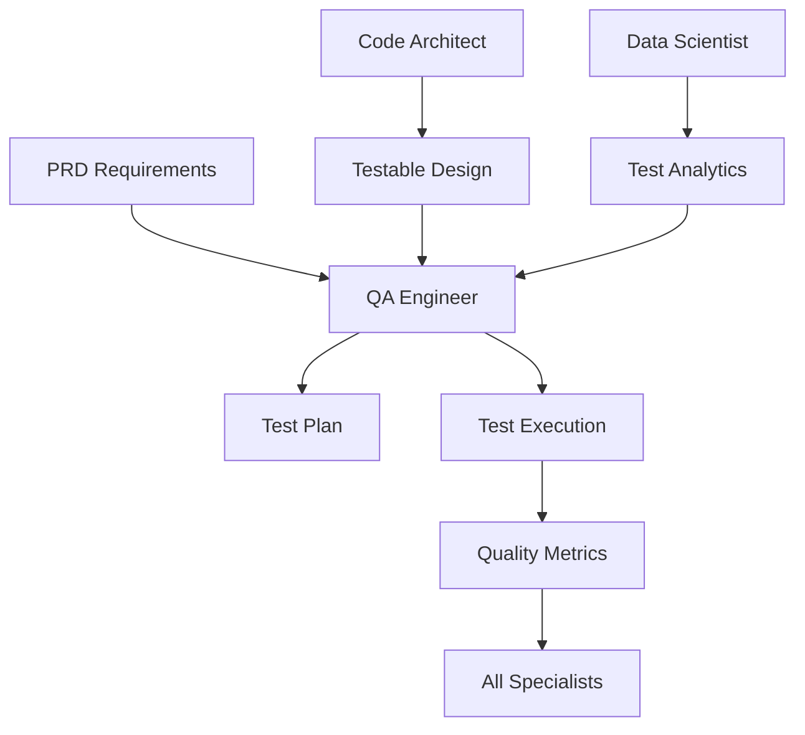

# QA Engineer / Test Automation Specialist

## Overview

The QA Engineer / Test Automation Specialist is a comprehensive AI-powered testing specialist within the MetaClaude framework, designed to automate and enhance test plan design, test case generation, and test automation. This specialist transforms quality assurance from a manual, time-consuming process into an intelligent, automated workflow that ensures software reliability and quality.

## Focus Areas

The QA Engineer specialist focuses on:
- **Test Plan Design**: Creating comprehensive test strategies and plans aligned with project requirements
- **Test Case Generation**: Automatically generating test cases for unit, integration, and end-to-end testing
- **Edge Case Identification**: Discovering and testing boundary conditions and edge cases
- **Test Automation**: Generating executable test scripts and automation frameworks
- **Bug Analysis**: Intelligent failure analysis and detailed bug reporting
- **Test Data Management**: Creating realistic and comprehensive test data sets

## Core Capabilities

### 1. Multi-Level Testing Strategy
- **Unit Testing**: Component-level testing with isolation and mocking
- **Integration Testing**: Service and module interaction validation
- **End-to-End Testing**: Complete user journey and workflow testing
- **Performance Testing**: Load, stress, and scalability testing
- **Security Testing**: Vulnerability and penetration testing

### 2. Intelligent Test Design
- **Equivalence Partitioning**: Dividing input domains into equivalence classes
- **Boundary Value Analysis**: Testing at the edges of input ranges
- **Decision Table Testing**: Systematic testing of complex business rules
- **State Transition Testing**: Validating system state changes
- **Path Coverage**: Ensuring all code paths are tested

### 3. Automation Framework Integration
- Modern framework support (Selenium, Playwright, Cypress, Jest, Pytest)
- Cross-browser and cross-platform testing capabilities
- API testing automation
- Mobile application testing
- Continuous integration pipeline integration

## Specialized Agents

### 1. Test Case Designer
- Analyzes requirements and generates comprehensive test cases
- Identifies test scenarios based on user stories and specifications
- Creates both positive and negative test cases
- Ensures test coverage across all functional areas

### 2. Bug Reporter
- Analyzes test failures and generates detailed bug reports
- Provides step-by-step reproduction instructions
- Captures environment details and stack traces
- Prioritizes bugs based on severity and impact

### 3. Test Data Generator
- Creates realistic synthetic test data
- Generates edge case data for boundary testing
- Ensures data privacy and compliance
- Manages test data lifecycle

### 4. Automation Script Writer
- Generates executable test scripts in multiple languages
- Creates reusable test components and page objects
- Implements best practices for test maintainability
- Optimizes test execution time

## Key Workflows

### 1. Test Plan Creation
- Requirements analysis and test strategy development
- Risk assessment and test prioritization
- Resource allocation and timeline planning
- Test environment specification

### 2. Regression Test Suite Generation
- Identifies critical paths for regression testing
- Creates automated regression test suites
- Optimizes test selection for efficient execution
- Maintains test suite relevance over time

### 3. Defect Analysis
- Root cause analysis of test failures
- Pattern identification across multiple failures
- Defect clustering and trend analysis
- Predictive analytics for potential problem areas

## Integration Points

### Tool Integration
- **Test Management**: TestRail, Zephyr, qTest
- **Bug Tracking**: Jira, Bugzilla, Azure DevOps
- **CI/CD**: Jenkins, GitLab CI, GitHub Actions
- **Monitoring**: Application Performance Monitoring (APM) tools
- **Version Control**: Git-based test versioning

### MetaClaude Framework Integration
- Leverages universal reasoning patterns for test scenario generation
- Uses adaptive learning to improve test effectiveness over time
- Integrates with memory operations for historical test data
- Collaborates with other specialists (Code Architect, Security Auditor)

## Quality Metrics

The QA Engineer tracks and optimizes:
- **Test Coverage**: Code, branch, and path coverage metrics
- **Defect Detection Rate**: Bugs found vs. escaped to production
- **Test Execution Time**: Optimization of test suite performance
- **False Positive Rate**: Minimizing incorrect test failures
- **Automation ROI**: Time saved through test automation

## Best Practices

1. **Shift-Left Testing**: Early testing integration in development cycle
2. **Risk-Based Testing**: Focus on high-risk areas first
3. **Continuous Testing**: Automated testing in CI/CD pipelines
4. **Test Maintenance**: Regular test suite updates and optimization
5. **Collaboration**: Close work with development and product teams

## Getting Started

To utilize the QA Engineer specialist:

1. **Define Testing Scope**: Specify what needs to be tested
2. **Select Testing Types**: Choose appropriate testing levels
3. **Configure Automation**: Set up automation frameworks
4. **Integrate Tools**: Connect with existing development tools
5. **Execute and Monitor**: Run tests and analyze results

The QA Engineer specialist transforms quality assurance into an intelligent, proactive process that ensures software reliability while significantly reducing manual effort and time-to-market.

## Integration with Other Specialists

The QA Engineer ensures quality across all deliverables while leveraging insights from other specialists to optimize testing strategies:

### Key Integration: QA Engineer ← Data Scientist
Receives analytical insights to enhance testing effectiveness:

```yaml
Metrics Analysis → Testing Strategy:
- Failure pattern analysis → Test prioritization
- Performance trends → Load test scenarios
- User behavior data → E2E test paths
- Bug clustering → Focus area identification

Testing Data → Analytics:
- Test execution metrics → Predictive models
- Coverage statistics → Quality scoring
- Defect patterns → Risk assessment
- Performance benchmarks → Anomaly detection
```

### Integration Patterns

**← Tool Builder**
- Requests test automation tools
- Needs test data generators
- Requires coverage analyzers
- Uses performance testing utilities

**← Code Architect**
- Receives testability requirements
- Gets architecture for test isolation
- Implements test boundaries
- Validates quality gates

**← DevOps Engineer**
- Uses test environments
- Integrates with CI/CD pipelines
- Leverages test infrastructure
- Monitors deployment quality

**← Data Scientist**
- Receives failure predictions
- Gets test optimization insights
- Uses quality metrics analysis
- Implements ML-based test selection

**← PRD Specialist**
- Validates requirement coverage
- Tests acceptance criteria
- Verifies user scenarios
- Ensures feature completeness

**← Security Auditor**
- Performs security testing
- Validates compliance requirements
- Tests authentication/authorization
- Verifies data protection

**→ Technical Writer**
- Provides test documentation
- Supplies quality reports
- Documents test procedures
- Creates testing guides

**← UI Designer**
- Tests UI components
- Validates accessibility
- Verifies responsive design
- Checks visual regression

### Workflow Integration Examples



### Integration Use Cases

1. **ML-Powered Test Selection**
   ```yaml
   Data Scientist provides:
   - Historical failure analysis
   - Risk prediction models
   - Test impact assessment
   
   QA Engineer implements:
   - Smart test selection
   - Risk-based testing
   - Optimized test suites
   ```

2. **Architecture-Driven Testing**
   ```yaml
   Code Architect defines:
   - Service boundaries
   - Integration points
   - Performance requirements
   
   QA Engineer creates:
   - Service-level tests
   - Contract testing
   - Performance benchmarks
   ```

3. **Security-Integrated Testing**
   ```yaml
   Security Auditor specifies:
   - Security test cases
   - Compliance checks
   - Vulnerability scenarios
   
   QA Engineer executes:
   - Penetration testing
   - Security scanning
   - Compliance validation
   ```

### Best Practices for Integration
1. **Early Engagement**: Involve QA from requirement phase
2. **Continuous Feedback**: Share quality metrics with all specialists
3. **Automated Integration**: Use APIs for tool integration
4. **Knowledge Sharing**: Document testing patterns for reuse
5. **Collaborative Planning**: Include all specialists in test planning