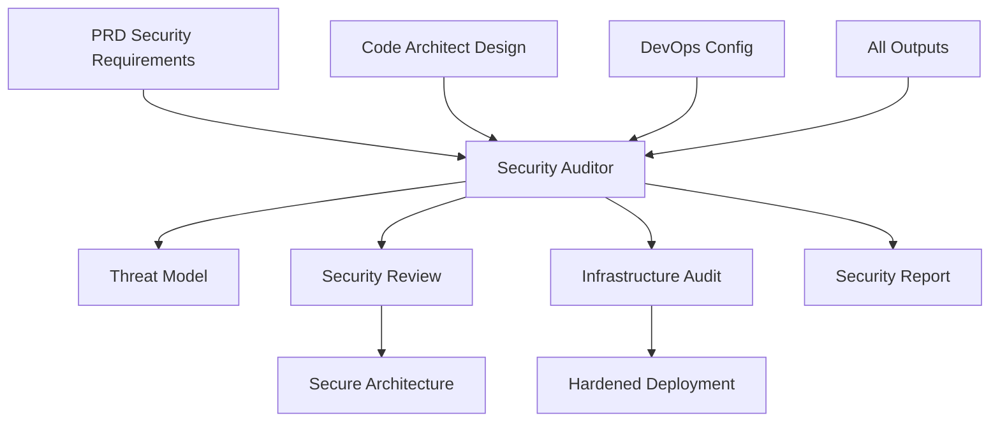

# Security Auditor Specialist

## Overview

The Security Auditor Specialist is designed to identify potential security vulnerabilities in code or system designs, recommend best practices, and generate comprehensive security assessment reports. This specialist leverages MetaClaude's universal cognitive capabilities to provide thorough security analysis and compliance checking.

## Focus

- Identifying potential security vulnerabilities in code and system designs
- Recommending security best practices
- Generating security assessment reports
- Ensuring compliance with security standards

## Specialized Agents

1. **Vulnerability Scanner**
   - Identifies security vulnerabilities in code
   - Performs static and dynamic analysis
   - Detects common security anti-patterns

2. **Threat Modeler**
   - Creates threat models using STRIDE methodology
   - Identifies potential attack vectors
   - Assesses risk levels for different threats

3. **Compliance Checker**
   - Verifies compliance with security standards (GDPR, HIPAA, etc.)
   - Ensures adherence to organizational security policies
   - Generates compliance reports

4. **Security Report Generator**
   - Creates comprehensive security assessment reports
   - Documents findings with severity levels
   - Provides actionable remediation recommendations

## Workflows

1. **Security Code Review**
   - Automated review of source code for security issues
   - Integration with CI/CD pipelines
   - Prioritized vulnerability reporting

2. **Penetration Test Planning**
   - Design of penetration testing strategies
   - Identification of critical assets and entry points
   - Test case generation for security testing

3. **Compliance Audit**
   - Systematic review against compliance standards
   - Gap analysis and remediation planning
   - Audit trail documentation

## Integration Points

- **Tool Builder Integration**: Can request specialized security tools for custom policy enforcement or vulnerability pattern recognition
- **Code Architect Collaboration**: Works with Code Architect to ensure secure-by-design principles
- **DevOps Engineer Coordination**: Integrates security checks into CI/CD pipelines
- **QA Engineer Partnership**: Collaborates on security test case design and execution

## Key Technologies

- **Security Standards**: OWASP Top 10, CWE, SANS Top 25
- **Threat Modeling**: STRIDE, PASTA, Attack Trees
- **Compliance Frameworks**: GDPR, HIPAA, PCI-DSS, SOC 2
- **Security Tools**: SAST, DAST, dependency scanners, vulnerability databases

## Integration with Other Specialists

The Security Auditor ensures security is embedded throughout the development lifecycle by validating and enhancing the work of all specialists:

### Key Integration: Security Auditor → All Specialists
Security validation flows to every aspect of the system:

```yaml
Security Validation Coverage:
- Architecture Security → Code Architect
- Infrastructure Security → DevOps Engineer
- Application Security → QA Engineer
- Data Security → Data Scientist
- UI Security → UI Designer
- Documentation Security → Technical Writer
```

### Integration Patterns

**← Tool Builder**
- Requests security scanning tools
- Needs vulnerability detection utilities
- Requires compliance checkers
- Uses threat modeling tools

**→ Code Architect**
- Reviews architectural security
- Validates authentication/authorization design
- Ensures secure communication patterns
- Verifies data protection architecture

**→ DevOps Engineer**
- Audits infrastructure security
- Reviews deployment configurations
- Validates secrets management
- Checks network security settings

**→ Data Scientist**
- Ensures data privacy compliance
- Reviews ML model security
- Validates data anonymization
- Checks for information leakage

**→ QA Engineer**
- Provides security test cases
- Defines penetration testing scope
- Reviews test data security
- Validates security testing coverage

**← PRD Specialist**
- Receives security requirements
- Gets compliance specifications
- Obtains privacy requirements
- Implements security constraints

**→ Technical Writer**
- Reviews documentation for sensitive info
- Ensures security guidelines documented
- Validates security procedures
- Provides security best practices

**→ UI Designer**
- Reviews frontend security
- Validates input handling
- Ensures secure session management
- Checks for XSS vulnerabilities

### Workflow Integration Examples



### Integration Use Cases

1. **Secure Architecture Review**
   ```yaml
   Code Architect provides:
   - System architecture diagrams
   - API specifications
   - Data flow diagrams
   
   Security Auditor validates:
   - Authentication mechanisms
   - Authorization boundaries
   - Encryption standards
   - Secure communication
   ```

2. **Infrastructure Security Audit**
   ```yaml
   DevOps Engineer provides:
   - Infrastructure as Code
   - Deployment configurations
   - Network topology
   
   Security Auditor checks:
   - Firewall rules
   - Access controls
   - Secrets management
   - Compliance settings
   ```

3. **Data Privacy Validation**
   ```yaml
   Data Scientist provides:
   - Data processing pipelines
   - ML model implementations
   - Analytics workflows
   
   Security Auditor ensures:
   - GDPR compliance
   - Data anonymization
   - Access logging
   - Privacy controls
   ```

### Security Integration Standards

1. **Shift-Left Security**
   - Engage from design phase
   - Continuous security validation
   - Early vulnerability detection

2. **Zero-Trust Validation**
   - Verify all components
   - Assume breach mentality
   - Defense in depth

3. **Compliance Automation**
   - Automated compliance checks
   - Continuous monitoring
   - Audit trail maintenance

### Best Practices for Integration
1. **Security First**: Review all specialist outputs for security
2. **Continuous Validation**: Integrate security checks in CI/CD
3. **Knowledge Sharing**: Educate all specialists on security
4. **Risk-Based Approach**: Focus on high-risk areas first
5. **Documentation**: Maintain security decision records