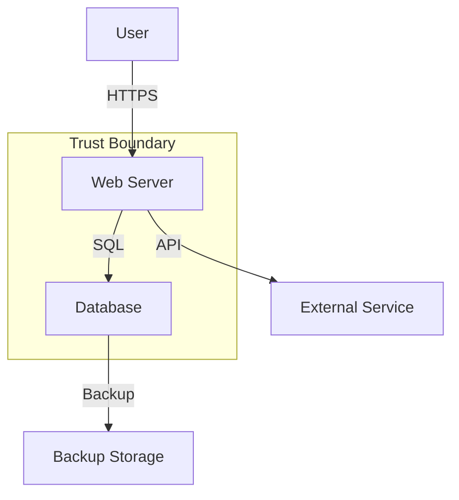

# Threat Modeling Guide

## Introduction

Threat modeling is a structured approach to identifying, assessing, and addressing potential security threats to a system. This guide provides a comprehensive framework for conducting effective threat modeling exercises that integrate seamlessly with the Security Auditor's capabilities.

## Threat Modeling Methodologies

### STRIDE

STRIDE is Microsoft's threat modeling methodology that categorizes threats into six types:

#### Spoofing Identity
- **Definition**: Illegally accessing and using another user's authentication information
- **Examples**:
  - Stolen credentials
  - Session hijacking
  - Man-in-the-middle attacks
- **Mitigations**:
  - Strong authentication mechanisms
  - Multi-factor authentication
  - Certificate pinning

#### Tampering with Data
- **Definition**: Malicious modification of data
- **Examples**:
  - SQL injection
  - Parameter manipulation
  - File system attacks
- **Mitigations**:
  - Input validation
  - Integrity checks
  - Digital signatures

#### Repudiation
- **Definition**: Users denying actions without proof of the contrary
- **Examples**:
  - Claiming not to have performed a transaction
  - Denying receipt of information
- **Mitigations**:
  - Comprehensive audit logging
  - Digital signatures
  - Timestamps

#### Information Disclosure
- **Definition**: Exposing information to unauthorized individuals
- **Examples**:
  - Data breaches
  - Verbose error messages
  - Unencrypted data transmission
- **Mitigations**:
  - Encryption at rest and in transit
  - Access controls
  - Data classification

#### Denial of Service
- **Definition**: Making a system unavailable to legitimate users
- **Examples**:
  - Resource exhaustion
  - Distributed attacks
  - Logic bombs
- **Mitigations**:
  - Rate limiting
  - Resource allocation
  - Redundancy

#### Elevation of Privilege
- **Definition**: Gaining unauthorized access to privileged resources
- **Examples**:
  - Privilege escalation
  - Buffer overflows
  - Improper authorization
- **Mitigations**:
  - Principle of least privilege
  - Input validation
  - Secure coding practices

### PASTA (Process for Attack Simulation and Threat Analysis)

PASTA is a seven-stage threat modeling methodology:

#### Stage 1: Define Objectives
```yaml
business_objectives:
  - identify_critical_assets
  - determine_risk_tolerance
  - establish_security_goals
  - align_with_business_strategy

technical_objectives:
  - system_availability_targets
  - data_confidentiality_requirements
  - integrity_constraints
  - compliance_mandates
```

#### Stage 2: Define Technical Scope
```yaml
technical_scope:
  infrastructure:
    - network_architecture
    - server_infrastructure
    - cloud_services
    - third_party_integrations
  
  applications:
    - web_applications
    - mobile_applications
    - apis
    - backend_services
  
  data_flows:
    - user_interactions
    - system_communications
    - data_storage
    - external_interfaces
```

#### Stage 3: Application Decomposition
```yaml
decomposition_elements:
  components:
    - identify_all_components
    - define_component_boundaries
    - map_dependencies
    - trace_data_flows
  
  trust_boundaries:
    - user_to_application
    - application_to_database
    - internal_to_external
    - privileged_to_unprivileged
  
  entry_points:
    - user_interfaces
    - api_endpoints
    - file_uploads
    - network_services
```

#### Stage 4: Threat Analysis
```yaml
threat_analysis:
  threat_actors:
    external:
      - cybercriminals
      - hacktivists
      - nation_states
      - competitors
    
    internal:
      - malicious_insiders
      - negligent_employees
      - compromised_accounts
  
  threat_intelligence:
    - industry_threats
    - recent_attacks
    - vulnerability_trends
    - exploit_availability
```

#### Stage 5: Vulnerability Analysis
```yaml
vulnerability_identification:
  technical_vulnerabilities:
    - code_vulnerabilities
    - configuration_issues
    - missing_patches
    - weak_cryptography
  
  design_vulnerabilities:
    - architectural_flaws
    - trust_assumptions
    - missing_controls
    - single_points_of_failure
  
  operational_vulnerabilities:
    - process_gaps
    - training_deficiencies
    - monitoring_blind_spots
    - response_capabilities
```

#### Stage 6: Attack Modeling
```yaml
attack_scenarios:
  attack_trees:
    root_goal: "compromise_system"
    paths:
      - credential_theft
      - vulnerability_exploitation
      - social_engineering
      - physical_access
  
  kill_chains:
    - reconnaissance
    - weaponization
    - delivery
    - exploitation
    - installation
    - command_control
    - actions_on_objective
```

#### Stage 7: Risk and Impact Analysis
```yaml
risk_assessment:
  impact_categories:
    - financial_loss
    - reputation_damage
    - regulatory_penalties
    - operational_disruption
  
  likelihood_factors:
    - threat_actor_capability
    - vulnerability_exploitability
    - control_effectiveness
    - detection_probability
  
  risk_calculation:
    formula: "risk = impact × likelihood"
    thresholds:
      critical: "> 20"
      high: "15-20"
      medium: "10-14"
      low: "5-9"
      minimal: "< 5"
```

## Threat Modeling Process

### 1. Preparation Phase

#### Scope Definition
```markdown
## Threat Model Scope

**System Name**: [Application/System Name]
**Version**: [Version Number]
**Date**: [Assessment Date]
**Participants**: [Team Members]

### In Scope:
- Components to be analyzed
- Interfaces to be reviewed
- Data flows to be traced
- Trust boundaries to be evaluated

### Out of Scope:
- Excluded components
- Assumed secure elements
- Third-party dependencies
- Legacy systems
```

#### Information Gathering
```yaml
required_artifacts:
  architecture:
    - system_diagrams
    - network_topology
    - component_inventory
    - technology_stack
  
  documentation:
    - design_documents
    - api_specifications
    - security_policies
    - operational_procedures
  
  code_and_config:
    - source_code_access
    - configuration_files
    - deployment_scripts
    - infrastructure_code
```

### 2. Threat Identification Phase

#### Data Flow Diagramming


#### Asset Identification
```yaml
asset_categories:
  data_assets:
    - user_credentials
    - personal_information
    - payment_data
    - business_intelligence
    - intellectual_property
  
  system_assets:
    - authentication_service
    - payment_processor
    - api_gateway
    - database_server
  
  process_assets:
    - user_registration
    - payment_processing
    - data_analytics
    - report_generation
```

#### Threat Enumeration
```yaml
threat_catalog:
  authentication_threats:
    - brute_force_attacks
    - credential_stuffing
    - session_hijacking
    - password_spraying
  
  data_threats:
    - sql_injection
    - data_exfiltration
    - unauthorized_access
    - data_tampering
  
  system_threats:
    - denial_of_service
    - malware_infection
    - configuration_drift
    - supply_chain_attacks
```

### 3. Threat Analysis Phase

#### Threat Prioritization Matrix
```yaml
prioritization_criteria:
  damage_potential:
    catastrophic: 5
    significant: 4
    moderate: 3
    minor: 2
    minimal: 1
  
  reproducibility:
    automated: 5
    scripted: 4
    manual_easy: 3
    manual_difficult: 2
    theoretical: 1
  
  exploitability:
    no_skill_required: 5
    some_skill_required: 4
    advanced_skill_required: 3
    expert_skill_required: 2
    nation_state_level: 1
  
  affected_users:
    all_users: 5
    most_users: 4
    some_users: 3
    few_users: 2
    individual_users: 1
  
  discoverability:
    publicly_known: 5
    easily_discovered: 4
    requires_effort: 3
    difficult_to_discover: 2
    obscure: 1
```

#### Attack Scenario Development
```markdown
## Attack Scenario: SQL Injection Leading to Data Breach

### Threat Actor
- **Type**: External Attacker
- **Motivation**: Financial Gain
- **Capability**: Intermediate

### Attack Vector
- **Entry Point**: Login Form
- **Vulnerability**: Unsanitized Input
- **Technique**: SQL Injection

### Attack Steps
1. Identify injection point through error messages
2. Enumerate database structure
3. Extract user credentials
4. Escalate privileges
5. Exfiltrate sensitive data

### Impact
- **Confidentiality**: HIGH - User data exposed
- **Integrity**: MEDIUM - Data could be modified
- **Availability**: LOW - Service remains operational

### Existing Controls
- Web Application Firewall (partial protection)
- Database activity monitoring

### Recommended Mitigations
1. Implement parameterized queries
2. Input validation and sanitization
3. Least privilege database access
4. Enhanced monitoring and alerting
```

### 4. Mitigation Planning Phase

#### Control Selection
```yaml
security_controls:
  preventive_controls:
    - input_validation
    - access_controls
    - encryption
    - secure_coding
  
  detective_controls:
    - logging_monitoring
    - intrusion_detection
    - anomaly_detection
    - security_scanning
  
  corrective_controls:
    - incident_response
    - patch_management
    - backup_recovery
    - forensics_capability
```

#### Implementation Roadmap
```yaml
mitigation_timeline:
  immediate_0_30_days:
    - critical_patches
    - configuration_fixes
    - access_control_updates
    - monitoring_enhancements
  
  short_term_30_90_days:
    - code_remediation
    - architecture_improvements
    - process_updates
    - training_programs
  
  long_term_90_plus_days:
    - platform_upgrades
    - architecture_redesign
    - advanced_controls
    - cultural_changes
```

## Integration with Security Auditor

### Automated Threat Identification
```yaml
automation_capabilities:
  vulnerability_correlation:
    - map_vulnerabilities_to_threats
    - identify_attack_paths
    - calculate_exploitability
    - assess_impact
  
  threat_intelligence_integration:
    - current_threat_landscape
    - exploit_availability
    - attack_patterns
    - ioc_matching
  
  continuous_monitoring:
    - configuration_changes
    - new_vulnerabilities
    - threat_evolution
    - control_effectiveness
```

### Threat Model Maintenance
```yaml
maintenance_schedule:
  triggers:
    - major_releases
    - architecture_changes
    - new_threats
    - security_incidents
  
  review_cycle:
    - quarterly_reviews
    - annual_deep_dive
    - continuous_updates
    - ad_hoc_assessments
  
  update_process:
    - change_impact_analysis
    - threat_reassessment
    - control_validation
    - documentation_update
```

## Tools and Resources

### Threat Modeling Tools
```yaml
tool_categories:
  diagramming:
    - microsoft_threat_modeling_tool
    - owasp_threat_dragon
    - irius_risk
    - securicad
  
  automation:
    - pytm
    - threagile
    - tutamen
    - threatspec
  
  integration:
    - jira_plugins
    - azure_devops
    - github_security
    - gitlab_security
```

### Templates and Checklists
```yaml
available_templates:
  - threat_model_template.md
  - data_flow_diagram_template.vsd
  - threat_catalog_template.xlsx
  - risk_matrix_template.xlsx
  - mitigation_tracker_template.xlsx
```

## Best Practices

### Do's
- Start threat modeling early in the development lifecycle
- Involve all stakeholders (developers, architects, security, business)
- Focus on the most critical assets and likely threats
- Keep threat models updated as the system evolves
- Use threat modeling to drive security requirements
- Validate threat models through testing

### Don'ts
- Don't try to model every possible threat
- Don't work in isolation - threat modeling is a team activity
- Don't ignore business context
- Don't treat threat models as one-time exercises
- Don't overcomplicate the process
- Don't skip the mitigation planning phase

## Conclusion

Effective threat modeling is an essential component of a comprehensive security program. By following this guide and leveraging the Security Auditor's automated capabilities, organizations can systematically identify and address security threats before they can be exploited.

Remember that threat modeling is an iterative process that should evolve with your system and the threat landscape. Regular reviews and updates ensure that your security posture remains strong against emerging threats.