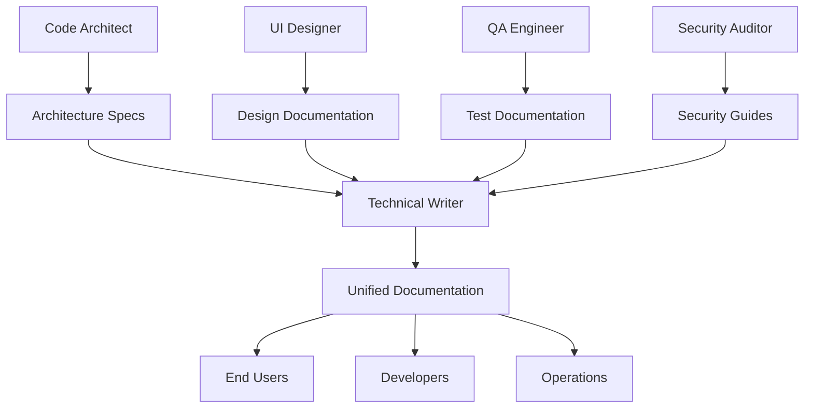

# Technical Writer Specialist

## Overview

The Technical Writer specialist is designed to automate and enhance the creation, maintenance, and quality of technical documentation within the MetaClaude framework. This specialist leverages AI-powered agents to generate various forms of documentation while ensuring clarity, accuracy, and consistency across all content.

## Focus Areas

- **API Documentation**: Automated generation of comprehensive API documentation from code signatures and specifications
- **User Manuals**: Creation of user-friendly guides tailored to different audience levels
- **README Files**: Automated README generation from project metadata and structure
- **Architectural Diagrams**: Visual representation of system architectures using diagramming tools
- **Content Management**: Maintaining documentation consistency and quality across projects

## Core Capabilities

### Documentation Standards
- Support for multiple formats (Markdown, reStructuredText, HTML)
- Adherence to industry-standard documentation practices
- Integration with documentation generators (Sphinx, JSDoc)
- Style guide enforcement and consistency checking

### Audience Analysis
- Content tailored to specific user roles and technical levels
- Context-aware documentation generation
- Progressive disclosure of technical details
- Accessible writing for diverse audiences

### Quality Assurance
- Automated accuracy checks against code and system behavior
- Grammar and style consistency enforcement
- Readability scoring and improvement suggestions
- Cross-reference validation and link checking

## Specialized Agents

1. **Documentation Structurer**
   - Organizes content hierarchy
   - Creates logical information architecture
   - Manages document relationships

2. **API Doc Generator**
   - Extracts API information from code
   - Generates comprehensive endpoint documentation
   - Creates interactive API examples

3. **User Guide Writer**
   - Develops step-by-step tutorials
   - Creates task-oriented documentation
   - Writes troubleshooting guides

4. **Diagramming Assistant**
   - Generates system architecture diagrams
   - Creates flowcharts and sequence diagrams
   - Maintains diagram-code synchronization

## Key Workflows

### Documentation Generation
- Automated content creation from source code
- Template-based document generation
- Multi-format output support

### Content Review & Update
- Continuous documentation validation
- Version control integration
- Change tracking and history

### Knowledge Base Management
- Centralized documentation repository
- Search optimization
- Content categorization and tagging

## Integration Points

### MetaClaude Core
- Leverages `reasoning-selector.md` for content decisions
- Uses `memory-operations.md` for documentation history
- Integrates `feedback-automation.md` for content improvement
- Employs `explainable-ai.md` for transparent documentation choices

### Tool Builder Integration
- Can request specialized documentation tools
- Custom content extraction utilities
- Format conversion tools
- Cross-reference generators

## Integration with Other Specialists

The Technical Writer serves as the documentation hub, capturing and communicating the work of all specialists to various audiences:

### Key Integration: Technical Writer → All Specialists
Documentation flows from every specialist's output:

```yaml
Documentation Sources:
- Architecture Designs → System Documentation
- UI Mockups → User Interface Guides
- Test Plans → Testing Documentation
- Security Audits → Security Guidelines
- Deployment Configs → Operations Manuals
- ML Models → Analytics Documentation
```

### Integration Patterns

**← Tool Builder**
- Requests documentation generators
- Needs content extraction tools
- Requires diagram creators
- Uses documentation validators

**← Code Architect**
- Documents system architecture
- Creates API specifications
- Writes design patterns guide
- Maintains architecture decisions

**← DevOps Engineer**
- Documents deployment procedures
- Creates runbooks and playbooks
- Writes infrastructure guides
- Maintains operational docs

**← Data Scientist**
- Documents ML models and algorithms
- Creates data analysis reports
- Writes methodology guides
- Explains statistical results

**← QA Engineer**
- Documents test strategies
- Creates test case documentation
- Writes quality reports
- Maintains testing guides

**← PRD Specialist**
- Transforms requirements to user docs
- Creates feature documentation
- Writes release notes
- Maintains product guides

**← Security Auditor**
- Documents security procedures
- Creates compliance guides
- Writes security best practices
- Maintains incident response docs

**← UI Designer**
- Documents design systems
- Creates UI component guides
- Writes accessibility documentation
- Maintains style guides

### Workflow Integration Examples



### Integration Use Cases

1. **System Documentation Suite**
   ```yaml
   Inputs from specialists:
   - Code Architect: Architecture diagrams
   - DevOps: Deployment topology
   - Security: Threat model
   - QA: Test coverage
   
   Technical Writer produces:
   - System overview document
   - Architecture guide
   - Deployment manual
   - Security guidelines
   ```

2. **API Documentation**
   ```yaml
   Code Architect provides:
   - API specifications
   - Data models
   - Integration patterns
   
   Technical Writer creates:
   - API reference documentation
   - Integration guides
   - Code examples
   - Troubleshooting guides
   ```

3. **User Documentation**
   ```yaml
   UI Designer provides:
   - User flows
   - Interface mockups
   - Interaction patterns
   
   PRD Specialist provides:
   - Feature descriptions
   - Use cases
   - User personas
   
   Technical Writer delivers:
   - User manuals
   - Quick start guides
   - Video tutorials
   - FAQ sections
   ```

### Documentation Standards

1. **Single Source of Truth**
   - Centralized documentation repository
   - Version-controlled content
   - Automated synchronization

2. **Multi-Audience Support**
   - Technical documentation for developers
   - User guides for end users
   - Operations manuals for DevOps
   - Executive summaries for stakeholders

3. **Living Documentation**
   - Continuous updates from all specialists
   - Automated change detection
   - Real-time synchronization

### Best Practices for Integration
1. **Automated Collection**: Set up pipelines to collect documentation from all specialists
2. **Consistent Formatting**: Apply unified style guides across all content
3. **Cross-Referencing**: Link related documentation across specialties
4. **Review Cycles**: Regular validation with source specialists
5. **Feedback Integration**: Incorporate user feedback to improve documentation

## Benefits

1. **Consistency**: Maintains uniform documentation standards across all projects
2. **Efficiency**: Reduces manual documentation effort by 80%
3. **Accuracy**: Ensures documentation stays synchronized with code
4. **Accessibility**: Creates content suitable for various technical levels
5. **Maintainability**: Automated updates keep documentation current

## Getting Started

1. Review the [Development Plan](development-plan.md) for implementation phases
2. Explore individual [agent documentation](agents/) for detailed capabilities
3. Check [workflow guides](workflows/) for operational procedures
4. Use provided [templates](templates/) for consistent documentation
5. Follow [style guides](style-guides/) for writing standards

## Success Metrics

- Documentation coverage: >90% of public APIs documented
- Readability scores: Flesch Reading Ease >60
- Update latency: Documentation updated within 24 hours of code changes
- User satisfaction: >85% find documentation helpful
- Error rate: <5% inaccuracies reported by users