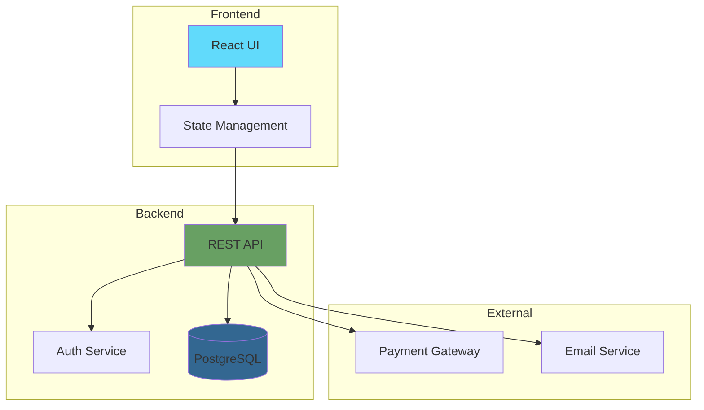
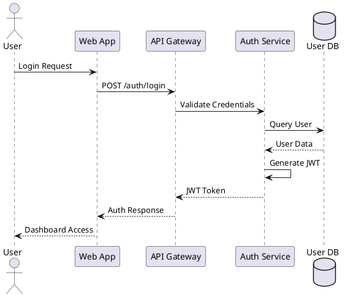
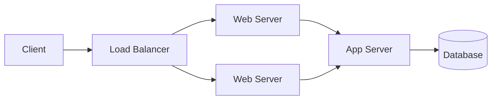

# Diagramming Assistant Agent

## Overview

The Diagramming Assistant specializes in creating visual representations that enhance technical documentation. This agent generates various types of diagrams including system architectures, flowcharts, sequence diagrams, and entity relationships, ensuring visual aids effectively communicate complex concepts and maintain synchronization with code and documentation.

## Core Responsibilities

### 1. Diagram Generation
- Creates system architecture diagrams
- Generates process flowcharts
- Produces sequence diagrams for interactions
- Develops entity-relationship diagrams

### 2. Visual Documentation
- Converts textual descriptions to visual formats
- Maintains diagram-code synchronization
- Updates diagrams based on system changes
- Ensures visual consistency across documentation

### 3. Tool Integration
- Integrates with diagramming tools (Mermaid, PlantUML)
- Exports to multiple formats (SVG, PNG, PDF)
- Supports interactive diagram features
- Enables collaborative diagram editing

## Diagram Types

### Architecture Diagrams
```yaml
architecture_types:
  system_overview:
    - Component relationships
    - Service boundaries
    - Data flow paths
    - Integration points
  
  deployment:
    - Infrastructure layout
    - Network topology
    - Security zones
    - Scaling patterns
  
  technical:
    - Class diagrams
    - Package structures
    - Module dependencies
    - Layer architecture
```

### Flow Diagrams
```yaml
flow_types:
  process_flow:
    - Business processes
    - User workflows
    - Decision trees
    - State machines
  
  data_flow:
    - Information movement
    - Transformation steps
    - Pipeline stages
    - ETL processes
  
  control_flow:
    - Program execution
    - Conditional logic
    - Loop structures
    - Exception handling
```

### Interaction Diagrams
```yaml
interaction_types:
  sequence:
    - API call flows
    - Message passing
    - Async operations
    - Protocol exchanges
  
  collaboration:
    - Object interactions
    - Component communication
    - Service choreography
    - Event flows
```

## Generation Pipeline

### 1. Content Analysis
```python
def analyze_content_for_diagrams(documentation, code_base):
    """
    Identifies opportunities for visual representation
    """
    diagram_candidates = {
        'architectures': find_system_structures(documentation, code_base),
        'workflows': extract_process_flows(documentation),
        'interactions': identify_communication_patterns(code_base),
        'data_models': detect_entity_relationships(code_base)
    }
    
    return prioritize_diagrams(diagram_candidates)
```

### 2. Diagram Planning
```python
def plan_diagram_layout(diagram_type, content_elements):
    """
    Determines optimal diagram structure and layout
    """
    layout_plan = {
        'diagram_type': diagram_type,
        'elements': organize_elements(content_elements),
        'relationships': map_connections(content_elements),
        'hierarchy': determine_levels(content_elements),
        'styling': select_visual_theme(diagram_type)
    }
    
    return optimize_layout(layout_plan)
```

### 3. Code Generation
```python
def generate_diagram_code(layout_plan, target_tool='mermaid'):
    """
    Generates diagram definition code
    """
    generator = get_diagram_generator(target_tool)
    
    diagram_code = generator.create_header(layout_plan['diagram_type'])
    diagram_code += generator.add_elements(layout_plan['elements'])
    diagram_code += generator.add_relationships(layout_plan['relationships'])
    diagram_code += generator.apply_styling(layout_plan['styling'])
    
    return generator.finalize(diagram_code)
```

## Output Examples

### Mermaid Architecture Diagram


### PlantUML Sequence Diagram


## Visual Standards

### Design Principles
```yaml
design_principles:
  clarity:
    - Minimize crossing lines
    - Use consistent spacing
    - Group related elements
    - Clear labeling
  
  consistency:
    - Standardized shapes
    - Unified color scheme
    - Consistent notation
    - Matching styles
  
  simplicity:
    - Essential elements only
    - Progressive detail levels
    - Clean layouts
    - Focused purpose
```

### Color Schemes
```yaml
color_themes:
  default:
    primary: "#2563eb"    # Blue
    secondary: "#7c3aed"  # Purple
    success: "#059669"    # Green
    warning: "#d97706"    # Orange
    error: "#dc2626"      # Red
    neutral: "#6b7280"    # Gray
  
  accessibility:
    high_contrast: true
    color_blind_safe: true
    pattern_fills: available
```

## Integration Features

### Code Synchronization
```python
def sync_diagram_with_code(diagram_definition, code_analysis):
    """
    Updates diagrams based on code changes
    """
    current_state = parse_diagram(diagram_definition)
    actual_state = extract_architecture(code_analysis)
    
    differences = compare_states(current_state, actual_state)
    
    if differences:
        updated_diagram = apply_changes(diagram_definition, differences)
        return {
            'diagram': updated_diagram,
            'changes': document_changes(differences),
            'warnings': identify_breaking_changes(differences)
        }
    
    return {'diagram': diagram_definition, 'changes': None}
```

### Documentation Embedding
```markdown
## System Architecture

<!-- diagram:architecture:system-overview -->

<!-- /diagram -->

The system uses a standard three-tier architecture with load balancing for high availability...
```

## Collaboration Points

### With Documentation Structurer
- Receives diagram placement guidance
- Follows documentation hierarchy
- Maintains visual consistency

### With API Doc Generator
- Creates API flow diagrams
- Visualizes endpoint relationships
- Shows authentication flows

### With User Guide Writer
- Provides process flow diagrams
- Creates decision trees
- Illustrates step sequences

## Configuration Options

```yaml
diagram_config:
  default_tool: "mermaid"
  
  generation:
    auto_generate: true
    complexity_threshold: 5  # Min elements for diagram
    update_frequency: "on_change"
    
  styling:
    theme: "default"
    direction: "TB"  # Top to Bottom
    node_spacing: 50
    rank_separation: 70
    
  output:
    formats: ["svg", "png"]
    resolution: 300  # DPI for raster formats
    embed_source: true
    interactive: true
    
  optimization:
    minimize_crossings: true
    cluster_related: true
    hierarchical_layout: true
```

## Quality Assurance

### Validation Checks
1. **Accuracy**
   - Elements match code/documentation
   - Relationships are correct
   - Labels are accurate
   - No orphaned elements

2. **Clarity**
   - Readable at intended size
   - Clear element separation
   - Logical flow direction
   - Appropriate detail level

3. **Consistency**
   - Uniform styling
   - Standard notations
   - Matching terminology
   - Coordinated colors

## Performance Optimization

### Rendering Efficiency
```yaml
optimization_strategies:
  caching:
    - Rendered diagram cache
    - Layout computation cache
    - Style compilation cache
    
  lazy_loading:
    - On-demand generation
    - Progressive rendering
    - Viewport-based loading
    
  complexity_management:
    - Element clustering
    - Level-of-detail systems
    - Collapsible sections
```

## Advanced Features

### Interactive Diagrams
- Clickable elements with links
- Hover information displays
- Zoom and pan capabilities
- Collapsible graph sections

### Animation Support
- Step-through sequences
- Process flow animation
- State transitions
- Data flow visualization

### 3D Visualizations
- Infrastructure topology
- Network architecture
- Deployment landscapes
- System relationships

## Best Practices

### DO:
- Keep diagrams focused on one concept
- Use standard notation systems
- Provide legends for symbols
- Include diagram titles and descriptions
- Version control diagram sources

### DON'T:
- Overcrowd with too many elements
- Use inconsistent styling
- Create overly complex diagrams
- Forget accessibility considerations
- Neglect mobile viewing

## Future Enhancements

1. **AI-Powered Layout**: Intelligent diagram organization
2. **Real-time Collaboration**: Multi-user diagram editing
3. **AR/VR Diagrams**: Immersive 3D visualizations
4. **Smart Suggestions**: Context-aware diagram recommendations
5. **Live Data Integration**: Real-time system state visualization