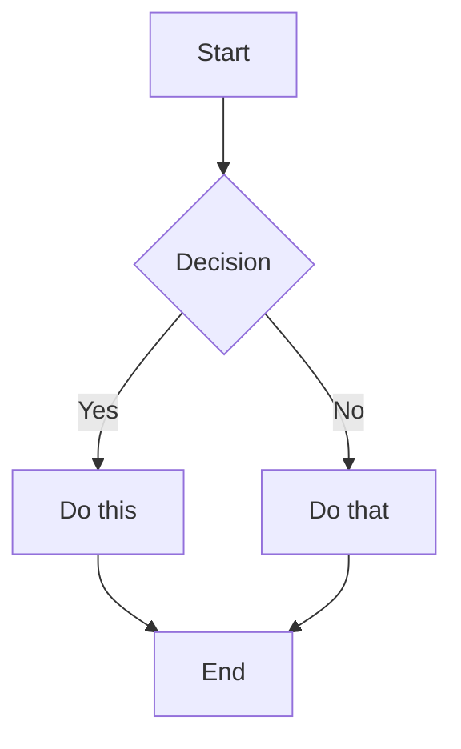
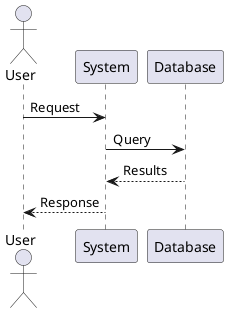

# Documentation Formatting Guide

This guide establishes formatting standards for technical documentation to ensure visual consistency and optimal readability across all documentation types.

## Table of Contents

1. [Document Structure](#document-structure)
2. [Markdown Standards](#markdown-standards)
3. [Code Formatting](#code-formatting)
4. [Visual Elements](#visual-elements)
5. [Tables and Lists](#tables-and-lists)
6. [Cross-References](#cross-references)
7. [File Organization](#file-organization)
8. [Version Control](#version-control)
9. [Output Formats](#output-formats)
10. [Templates](#templates)

---

## Document Structure

### Standard Document Layout

```markdown
# Document Title

**Version:** X.X.X  
**Last Updated:** YYYY-MM-DD  
**Status:** Draft|Review|Published

## Table of Contents
[Auto-generated or manual TOC]

## Overview
[Brief introduction and purpose]

## Prerequisites
[What readers need before starting]

## Main Content
[Core documentation content]

## Related Resources
[Links to related documentation]

## Appendix
[Additional reference material]
```

### Page Metadata

```yaml
---
title: "Page Title"
description: "Brief page description"
keywords: ["keyword1", "keyword2", "keyword3"]
author: "Author Name"
date: 2024-01-15
version: 1.0.0
status: published
---
```

### Section Hierarchy

```markdown
# H1: Page Title (one per document)

## H2: Major Sections

### H3: Subsections

#### H4: Sub-subsections (use sparingly)

##### H5: Rarely used

###### H6: Avoid if possible
```

---

## Markdown Standards

### Basic Formatting

#### Emphasis
```markdown
*Italic text* or _italic text_
**Bold text** or __bold text__
***Bold italic*** or ___bold italic___
~~Strikethrough~~
```

#### Line Breaks
- Single line break: Continue on same paragraph
- Double line break: Start new paragraph
- Trailing spaces: Force line break  

#### Horizontal Rules
```markdown
--- (three or more hyphens)
*** (three or more asterisks)
___ (three or more underscores)
```

### Advanced Elements

#### Blockquotes
```markdown
> Single line quote

> Multi-line quote continues
> across multiple lines
> with consistent formatting

> Nested quotes
>> Can be created
>>> With multiple levels
```

#### Footnotes
```markdown
This text has a footnote[^1].

[^1]: This is the footnote content.
```

#### Task Lists
```markdown
- [x] Completed task
- [ ] Incomplete task
- [ ] Another todo item
```

#### Definition Lists
```markdown
Term 1
:   Definition 1

Term 2
:   Definition 2a
:   Definition 2b
```

---

## Code Formatting

### Inline Code

```markdown
Use `backticks` for inline code, commands like `npm install`, 
function names like `getUserData()`, and file names like `config.json`.
```

### Code Blocks

#### Basic Fenced Code Block
````markdown
```
Generic code block without syntax highlighting
```
````

#### Language-Specific Highlighting
````markdown
```javascript
// JavaScript code with syntax highlighting
const greeting = (name) => {
  return `Hello, ${name}!`;
};
```

```python
# Python code with syntax highlighting
def greeting(name):
    return f"Hello, {name}!"
```

```bash
#!/bin/bash
# Shell script with syntax highlighting
echo "Hello, World!"
```
````

#### Code Block with Title
````markdown
```javascript title="utils/greeting.js"
export const greeting = (name) => {
  return `Hello, ${name}!`;
};
```
````

#### Line Highlighting
````markdown
```javascript {2,4-6}
const config = {
  apiUrl: 'https://api.example.com',  // This line is highlighted
  timeout: 5000,
  retries: 3,      // These lines
  debug: false,    // are also
  cache: true      // highlighted
};
```
````

### Command Line Examples

#### Basic Commands
```markdown
```bash
$ npm install package-name
$ cd project-directory
$ git status
```
```

#### Commands with Output
```markdown
```bash
$ node --version
v14.17.0

$ npm list
project@1.0.0
├── express@4.17.1
└── lodash@4.17.21
```
```

#### Multi-line Commands
```markdown
```bash
$ docker run \
  --name myapp \
  --port 3000:3000 \
  --env NODE_ENV=production \
  myimage:latest
```
```

---

## Visual Elements

### Images

#### Basic Image
```markdown

```

#### Image with Title
```markdown

```

#### Image with Link
```markdown
[](https://link.com)
```

#### Image with Caption
```markdown
<figure>
  
  <figcaption>Image caption goes here</figcaption>
</figure>
```

### Diagrams

#### Mermaid Diagrams
````markdown

````

#### PlantUML Diagrams
````markdown

````

### Icons and Emojis

#### Common Documentation Icons
```markdown
ℹ️ **Note:** Information
⚠️ **Warning:** Caution required  
❌ **Error:** Problem or mistake
✅ **Success:** Correct or complete
💡 **Tip:** Helpful suggestion
🔧 **Configuration:** Settings
📝 **Example:** Code sample
🚀 **Performance:** Speed tip
```

---

## Tables and Lists

### Tables

#### Basic Table
```markdown
| Header 1 | Header 2 | Header 3 |
|----------|----------|----------|
| Cell 1   | Cell 2   | Cell 3   |
| Cell 4   | Cell 5   | Cell 6   |
```

#### Aligned Table
```markdown
| Left | Center | Right |
|:-----|:------:|------:|
| L1   |   C1   |    R1 |
| L2   |   C2   |    R2 |
```

#### Complex Table
```markdown
| Feature | Free | Pro | Enterprise |
|---------|:----:|:---:|:----------:|
| Users | 1 | 5 | Unlimited |
| Storage | 1 GB | 10 GB | 100 GB |
| Support | Community | Email | 24/7 Phone |
| API Access | ❌ | ✅ | ✅ |
| Custom Domain | ❌ | ✅ | ✅ |
| Price | $0 | $10/mo | Contact |
```

### Lists

#### Unordered Lists
```markdown
- First level item
  - Second level item
    - Third level item
  - Another second level
- Back to first level

* Alternative bullet style
  * Can be mixed
    * But stay consistent
```

#### Ordered Lists
```markdown
1. First step
   1. Sub-step A
   2. Sub-step B
2. Second step
   1. Sub-step A
      1. Detail 1
      2. Detail 2
3. Third step
```

#### Mixed Lists
```markdown
1. Ordered item
   - Unordered sub-item
   - Another sub-item
2. Second ordered item
   - Sub-point
     1. Numbered detail
     2. Another detail
```

---

## Cross-References

### Internal Links

#### Section Links
```markdown
See the [Installation](#installation) section.
Refer to [Getting Started](#getting-started).
```

#### Document Links
```markdown
See the [API Reference](./api-reference.md).
Check the [User Guide](../guides/user-guide.md).
```

#### Anchor Links
```markdown
<a name="custom-anchor"></a>
### Section with Custom Anchor

Link to [custom anchor](#custom-anchor).
```

### External Links

#### Basic Links
```markdown
Visit [Example Website](https://example.com).
```

#### Links with Titles
```markdown
Visit [Example Website](https://example.com "Example Site").
```

#### Reference-Style Links
```markdown
Check the [documentation][docs] for more info.
See also the [API reference][api].

[docs]: https://docs.example.com
[api]: https://api.example.com/reference
```

---

## File Organization

### Directory Structure

```
docs/
├── README.md                 # Documentation home
├── getting-started/         # Introductory content
│   ├── installation.md
│   ├── quick-start.md
│   └── first-project.md
├── guides/                  # How-to guides
│   ├── user-guide.md
│   ├── admin-guide.md
│   └── developer-guide.md
├── reference/               # Reference material
│   ├── api/
│   │   ├── endpoints.md
│   │   └── examples.md
│   ├── cli/
│   │   └── commands.md
│   └── configuration.md
├── tutorials/               # Step-by-step tutorials
│   ├── beginner/
│   ├── intermediate/
│   └── advanced/
└── assets/                  # Images and resources
    ├── images/
    ├── diagrams/
    └── downloads/
```

### File Naming Conventions

```yaml
rules:
  - Use lowercase
  - Use hyphens for spaces
  - Be descriptive but concise
  - Include file extensions

examples:
  good:
    - getting-started.md
    - api-reference.md
    - user-guide.md
    - install-windows.md
  
  bad:
    - GettingStarted.md
    - api_reference.md
    - ug.md
    - installwindows
```

---

## Version Control

### Commit Message Format

```
type: Subject line (max 50 chars)

Detailed explanation of changes (wrap at 72 chars).
Include why the change was made and any relevant context.

- Bullet points for multiple changes
- Keep related changes together
- Reference issue numbers: Fixes #123
```

#### Types
- `docs:` Documentation only changes
- `style:` Formatting changes
- `content:` Content additions/updates
- `fix:` Error corrections
- `refactor:` Restructuring

### Branch Naming

```
docs/feature-name
docs/update-api-reference
docs/fix-broken-links
docs/add-tutorial-authentication
```

---

## Output Formats

### HTML Generation

```yaml
html_config:
  theme: "clean-docs"
  syntax_highlighting: true
  table_of_contents:
    depth: 3
    position: "left"
  search:
    enabled: true
    index_content: true
  navigation:
    collapsible: true
    show_breadcrumbs: true
```

### PDF Generation

```yaml
pdf_config:
  page_size: "A4"
  margins:
    top: "2cm"
    bottom: "2cm"
    left: "2.5cm"
    right: "2.5cm"
  font:
    body: "Arial"
    code: "Courier New"
    size: 11pt
  header_footer:
    show_page_numbers: true
    show_chapter_name: true
```

### Multi-Format Export

```bash
# Generate multiple formats
npm run docs:build -- --formats html,pdf,epub

# Custom styling per format
npm run docs:build -- --html-theme dark --pdf-size letter
```

---

## Templates

### API Endpoint Template

```markdown
## GET /api/resource/{id}

Brief description of what this endpoint does.

### Parameters

| Name | Type | In | Required | Description |
|------|------|-----|----------|-------------|
| id | string | path | Yes | Resource ID |
| include | string | query | No | Related data |

### Request Example

```bash
curl -X GET https://api.example.com/api/resource/123 \
  -H "Authorization: Bearer token"
```

### Response

#### Success (200 OK)
```json
{
  "id": "123",
  "name": "Resource Name",
  "created": "2024-01-15T10:00:00Z"
}
```

#### Error (404 Not Found)
```json
{
  "error": "Resource not found"
}
```
```

### Tutorial Template

```markdown
# Tutorial: [Tutorial Title]

## Overview
What you'll learn and build in this tutorial.

## Prerequisites
- Requirement 1
- Requirement 2

## Step 1: [First Action]

### What You'll Do
Brief description of this step's goal.

### Instructions
1. Detailed instruction
2. Another instruction

### Code
```language
// Code for this step
```

### Verify
How to confirm this step worked correctly.

## Step 2: [Next Action]
[Continue pattern...]

## Summary
What you've accomplished and next steps.
```

---

## Quick Reference Card

### Essential Formatting

```markdown
# Heading 1
## Heading 2
### Heading 3

**Bold text**
*Italic text*
`inline code`

[Link text](url)


- Bullet list
1. Numbered list

> Blockquote

---

| Table | Header |
|-------|--------|
| Cell  | Cell   |

```code
Code block
```
```

### Documentation Checklist

- [ ] Clear title and description
- [ ] Table of contents for long docs
- [ ] Consistent heading hierarchy
- [ ] Code examples tested
- [ ] Images have alt text
- [ ] Links verified
- [ ] Mobile-friendly formatting
- [ ] Version information included
- [ ] Last updated date
- [ ] Spell check completed

---

**Last Updated:** January 2024  
**Version:** 1.0  
**Maintained by:** Technical Writing Team