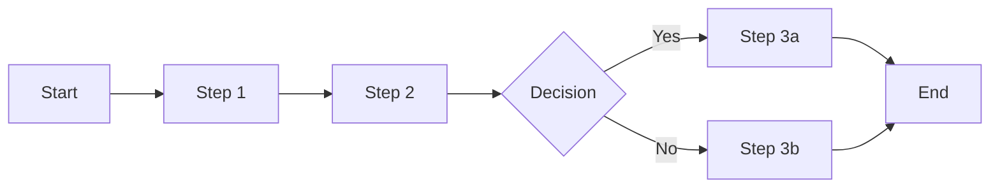

# User Manual Template

This template provides a comprehensive structure for creating user manuals, guides, and product documentation. Customize sections based on your product's specific features and target audience.

---

# [Product Name] User Manual

**Version:** [X.X.X]  
**Last Updated:** [Date]  
**Document ID:** [DOC-XXXX]

## Table of Contents

1. [Welcome](#welcome)
2. [Getting Started](#getting-started)
3. [System Requirements](#system-requirements)
4. [Installation](#installation)
5. [Initial Setup](#initial-setup)
6. [User Interface Overview](#user-interface-overview)
7. [Features & Functions](#features--functions)
8. [Common Tasks](#common-tasks)
9. [Advanced Features](#advanced-features)
10. [Troubleshooting](#troubleshooting)
11. [Maintenance](#maintenance)
12. [Support](#support)
13. [Appendix](#appendix)

---

## Welcome

### About [Product Name]

[Brief introduction to the product, its purpose, and main benefits. Include what problems it solves and who it's designed for.]

### About This Manual

This manual is designed to help you:
- Get started quickly with [Product Name]
- Understand all features and capabilities
- Troubleshoot common issues
- Make the most of your investment

### Document Conventions

| Symbol | Meaning |
|--------|---------|
| ⚠️ **Warning** | Important safety or data loss warning |
| ℹ️ **Note** | Additional helpful information |
| 💡 **Tip** | Best practices and recommendations |
| 🔧 **Technical** | Advanced technical details |

### Target Audience

This manual is written for:
- **End Users:** Day-to-day product usage
- **Administrators:** System setup and management
- **IT Professionals:** Technical configuration

---

## Getting Started

### What's in the Box

- [ ] [Product Name] device/software
- [ ] Quick Start Guide
- [ ] Power adapter (if applicable)
- [ ] USB cable (if applicable)
- [ ] License key/Activation code

### First-Time Users

If you're new to [Product Name], we recommend:
1. Reading the [Quick Start](#quick-start) section
2. Watching our [video tutorials](link)
3. Trying the [guided tour](#guided-tour)

### Quick Start

1. **Step One: [Action]**
   - [Detailed instruction]
   - [Expected result]

2. **Step Two: [Action]**
   - [Detailed instruction]
   - [Expected result]

3. **Step Three: [Action]**
   - [Detailed instruction]
   - [Expected result]

---

## System Requirements

### Minimum Requirements

#### Hardware
- **Processor:** [Specification]
- **Memory:** [Amount] RAM
- **Storage:** [Amount] available space
- **Display:** [Resolution]
- **Network:** [Connection type]

#### Software
- **Operating System:** 
  - Windows: [Versions]
  - macOS: [Versions]
  - Linux: [Distributions]
- **Dependencies:**
  - [Dependency 1]
  - [Dependency 2]

### Recommended Requirements

[List optimal specifications for best performance]

### Compatibility

#### Supported Browsers (for web applications)
- Chrome (version XX+)
- Firefox (version XX+)
- Safari (version XX+)
- Edge (version XX+)

#### Mobile Devices
- iOS: [Version]+ on [Devices]
- Android: [Version]+ on [Devices]

---

## Installation

### Pre-Installation Checklist

- [ ] System meets minimum requirements
- [ ] Administrator privileges available
- [ ] Backup important data
- [ ] Close other applications
- [ ] Disable antivirus temporarily (if needed)

### Windows Installation

1. **Download the installer**
   - Visit [download link]
   - Select Windows version
   - Save to Downloads folder

2. **Run the installer**
   ```
   Double-click Setup.exe
   ```
   
3. **Follow installation wizard**
   - Accept license agreement
   - Choose installation directory
   - Select components
   
   

4. **Complete installation**
   - Click "Install"
   - Wait for progress bar
   - Click "Finish"

### macOS Installation

1. **Download the DMG file**
   ```bash
   curl -O https://example.com/download/mac/product.dmg
   ```

2. **Mount and install**
   - Double-click the DMG file
   - Drag [Product Name] to Applications folder
   - Eject the DMG

3. **First launch**
   - Open from Applications
   - Approve security prompt if needed
   - Complete initial setup

### Linux Installation

#### Ubuntu/Debian
```bash
# Add repository
sudo add-apt-repository ppa:example/product

# Update package list
sudo apt update

# Install
sudo apt install product-name
```

#### Fedora/RHEL
```bash
# Add repository
sudo dnf config-manager --add-repo https://example.com/repo

# Install
sudo dnf install product-name
```

### Docker Installation
```bash
# Pull the image
docker pull example/product:latest

# Run container
docker run -d -p 8080:8080 --name product example/product:latest
```

### Post-Installation Steps

1. **Verify installation**
   ```bash
   product --version
   ```

2. **Initial configuration**
   - Launch the application
   - Enter license key
   - Set preferences

3. **Update to latest version**
   - Check for updates
   - Install if available

---

## Initial Setup

### First Launch

When you first open [Product Name]:

1. **Welcome Screen**
   - Choose language
   - Select region/timezone
   - Accept terms of service

2. **Account Setup**
   - Create new account or sign in
   - Verify email address
   - Set security preferences

3. **Configuration Wizard**
   
   
   
   - **Step 1: Basic Settings**
     - Display preferences
     - Notification settings
     - Default locations
   
   - **Step 2: Feature Selection**
     - Enable/disable modules
     - Set feature preferences
     - Configure integrations
   
   - **Step 3: Data Import**
     - Import from previous version
     - Connect to cloud services
     - Restore from backup

### User Profile Setup

1. **Personal Information**
   - Name and contact details
   - Profile picture
   - Time zone

2. **Preferences**
   - Theme selection
   - Language settings
   - Accessibility options

3. **Security Settings**
   - Password requirements
   - Two-factor authentication
   - Security questions

---

## User Interface Overview

### Main Window


1. **Menu Bar**
   - File menu
   - Edit menu
   - View menu
   - Tools menu
   - Help menu

2. **Toolbar**
   - Quick access buttons
   - Search bar
   - User profile

3. **Navigation Panel**
   - Main sections
   - Favorites
   - Recent items

4. **Work Area**
   - Content display
   - Active documents
   - Preview pane

5. **Status Bar**
   - System status
   - Progress indicators
   - Quick settings

### Keyboard Shortcuts

| Action | Windows/Linux | macOS |
|--------|---------------|-------|
| New | Ctrl+N | ⌘+N |
| Open | Ctrl+O | ⌘+O |
| Save | Ctrl+S | ⌘+S |
| Copy | Ctrl+C | ⌘+C |
| Paste | Ctrl+V | ⌘+V |
| Undo | Ctrl+Z | ⌘+Z |
| Find | Ctrl+F | ⌘+F |
| Settings | Ctrl+, | ⌘+, |

[View complete shortcuts list](shortcuts.md)

---

## Features & Functions

### Core Features

#### Feature 1: [Feature Name]

**Purpose:** [What this feature does]

**How to use:**
1. Navigate to [Location]
2. Click [Button/Option]
3. Configure settings:
   - Option A: [Description]
   - Option B: [Description]
4. Click "Apply"

**Example:**
```
[Show practical example or screenshot]
```

💡 **Tip:** [Best practice for using this feature]

#### Feature 2: [Feature Name]

[Repeat structure for each major feature]

### Settings & Preferences

#### General Settings

**Access:** Menu > Settings > General

- **Appearance**
  - Theme: Light/Dark/Auto
  - Font size: Small/Medium/Large
  - Color scheme: [Options]

- **Behavior**
  - Startup options
  - Default actions
  - Confirmation prompts

#### Advanced Settings

⚠️ **Warning:** Changing advanced settings may affect system stability

[Document advanced configuration options]

---

## Common Tasks

### Task 1: [Common Task Name]

**Objective:** [What user wants to accomplish]

**Steps:**
1. **Prepare**
   - [Prerequisite 1]
   - [Prerequisite 2]

2. **Execute**
   ```
   Step-by-step instructions with screenshots
   ```

3. **Verify**
   - Check [Result 1]
   - Confirm [Result 2]

**Troubleshooting:**
- If [Problem], then [Solution]
- If [Problem], then [Solution]

### Task 2: [Common Task Name]

[Repeat structure for each common task]

### Workflows

#### Workflow: [Workflow Name]

**Overview:** [Description of complete process]



**Detailed Steps:**
[Provide detailed walkthrough]

---

## Advanced Features

### Power User Features

#### Feature: [Advanced Feature Name]

**Prerequisites:**
- [Required knowledge/setup]
- [Required permissions]

**Configuration:**
```json
{
  "advanced_feature": {
    "enabled": true,
    "option1": "value1",
    "option2": "value2"
  }
}
```

**Usage Guide:**
[Detailed instructions for advanced users]

### Automation

#### Scripting Support

**Supported Languages:**
- JavaScript
- Python
- Shell/Bash

**Example Script:**
```python
# Automate common task
import product_api

def automate_task():
    # Connect to product
    client = product_api.Client()
    
    # Perform operations
    result = client.execute_task(
        parameters={
            'option': 'value'
        }
    )
    
    return result
```

### API Integration

[Document API usage for advanced integrations]

---

## Troubleshooting

### Common Issues

#### Issue: [Product won't start]

**Symptoms:**
- [Symptom 1]
- [Symptom 2]

**Solutions:**
1. **Check system requirements**
   - Verify minimum specifications
   - Update operating system

2. **Clear cache**
   ```bash
   product --clear-cache
   ```

3. **Reinstall**
   - Uninstall current version
   - Download latest version
   - Install fresh

#### Issue: [Performance problems]

[Continue with common issues and solutions]

### Error Messages

| Error Code | Message | Solution |
|------------|---------|----------|
| ERR_001 | Connection failed | Check network settings |
| ERR_002 | Invalid license | Verify license key |
| ERR_003 | File not found | Check file path |

### Diagnostic Tools

#### Built-in Diagnostics
```
Menu > Help > Run Diagnostics
```

#### Log Files
- **Windows:** `C:\Users\[Username]\AppData\Product\Logs`
- **macOS:** `~/Library/Logs/Product`
- **Linux:** `~/.config/product/logs`

#### Debug Mode
```bash
product --debug --verbose
```

---

## Maintenance

### Regular Maintenance

#### Daily
- [ ] Check for updates
- [ ] Review error logs
- [ ] Verify backups

#### Weekly
- [ ] Clear temporary files
- [ ] Update plugins/extensions
- [ ] Review performance metrics

#### Monthly
- [ ] Full system backup
- [ ] Database optimization
- [ ] Security audit

### Updates

#### Automatic Updates
1. Go to Settings > Updates
2. Enable "Automatic Updates"
3. Set update schedule

#### Manual Updates
```bash
# Check for updates
product --check-updates

# Install updates
product --update
```

### Backup & Recovery

#### Creating Backups
1. **Manual Backup**
   - File > Backup > Create Backup
   - Choose location
   - Include settings/preferences

2. **Automated Backup**
   ```
   Settings > Backup > Schedule
   ```

#### Restoring from Backup
1. File > Restore
2. Select backup file
3. Choose restore options
4. Confirm restoration

---

## Support

### Getting Help

#### Self-Service Resources
- **Knowledge Base:** https://support.example.com/kb
- **Video Tutorials:** https://example.com/tutorials
- **Community Forum:** https://forum.example.com
- **FAQ:** https://example.com/faq

#### Contact Support

**Email Support**
- General: support@example.com
- Technical: technical@example.com
- Sales: sales@example.com

**Phone Support**
- US: 1-800-XXX-XXXX
- EU: +44-XXXX-XXXXXX
- Hours: Monday-Friday, 9 AM - 5 PM EST

**Live Chat**
Available on website during business hours

#### Support Ticket

When contacting support, provide:
1. Product version
2. Operating system
3. Error messages
4. Steps to reproduce
5. Screenshots (if applicable)

### License Information

#### Viewing License
```
Help > About > License Details
```

#### License Types
- **Personal:** Single user, non-commercial
- **Professional:** Single user, commercial
- **Enterprise:** Multiple users, advanced features

---

## Appendix

### A. Glossary

| Term | Definition |
|------|------------|
| [Term 1] | [Definition] |
| [Term 2] | [Definition] |
| [Term 3] | [Definition] |

### B. File Formats

#### Supported Import Formats
- .xlsx (Excel)
- .csv (Comma-separated)
- .json (JavaScript Object Notation)
- .xml (Extensible Markup Language)

#### Supported Export Formats
- .pdf (Portable Document Format)
- .docx (Word Document)
- .html (Web Page)
- .png/.jpg (Images)

### C. Regulatory Compliance

- **GDPR:** Data protection compliance
- **HIPAA:** Healthcare data compliance
- **SOC 2:** Security compliance
- **ISO 27001:** Information security

### D. Version History

| Version | Release Date | Major Changes |
|---------|--------------|---------------|
| 3.0.0 | 2024-01-15 | New UI, API integration |
| 2.5.0 | 2023-10-01 | Performance improvements |
| 2.0.0 | 2023-06-15 | Major feature update |

### E. Legal Information

**Copyright © [Year] [Company Name]. All rights reserved.**

[Product Name] is a trademark of [Company Name].

**License Agreement:** [Link to full license]

**Privacy Policy:** [Link to privacy policy]

**Terms of Service:** [Link to terms]

---

## Index

[Alphabetical index of topics covered in the manual]

A | B | C | D | E | F | G | H | I | J | K | L | M | N | O | P | Q | R | S | T | U | V | W | X | Y | Z

---

**Document Version:** 1.0  
**Last Modified:** [Date]  
**Next Review:** [Date]  
**Feedback:** documentation@example.com