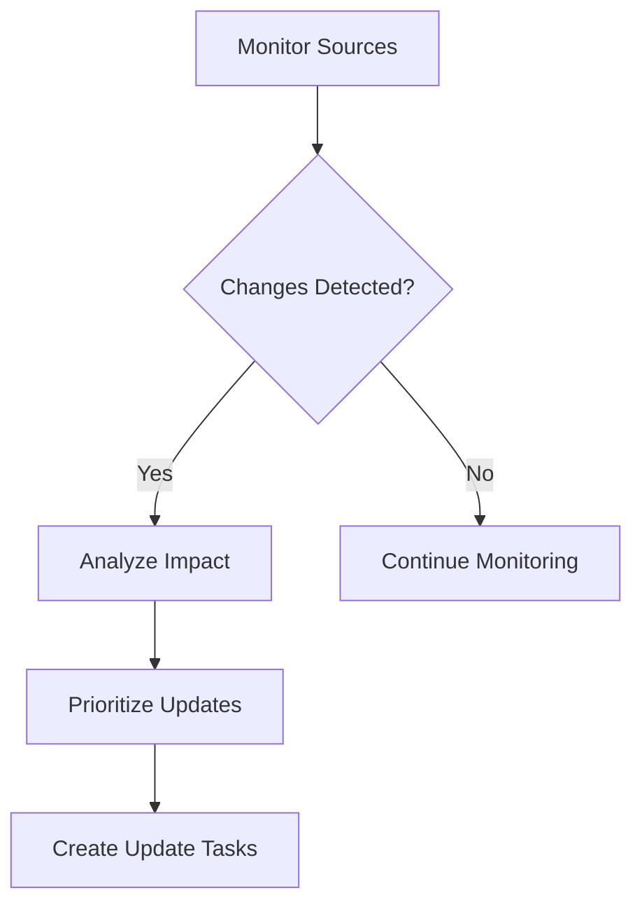

# Content Review & Update Workflow

## Overview

The Content Review & Update workflow ensures documentation remains accurate, relevant, and high-quality over time. This workflow coordinates continuous validation, updates based on system changes, and incorporates user feedback to maintain documentation excellence.

## Workflow Components

### Review Triggers
```yaml
trigger_events:
  code_changes:
    - API modifications
    - Feature additions
    - Bug fixes
    - Deprecations
    
  scheduled_reviews:
    - Weekly accuracy checks
    - Monthly comprehensiveness review
    - Quarterly style guide compliance
    - Annual full audit
    
  user_feedback:
    - Error reports
    - Confusion indicators
    - Enhancement requests
    - Usage analytics
    
  system_events:
    - Version releases
    - Breaking changes
    - Security updates
    - Performance improvements
```

## Review Process Stages

### Stage 1: Change Detection


**Change Detection System:**
```python
def detect_documentation_changes(sources):
    """
    Monitors multiple sources for documentation-affecting changes
    """
    changes = {
        'code': analyze_code_diff(sources['repository']),
        'api': compare_api_signatures(sources['api_specs']),
        'config': check_configuration_changes(sources['configs']),
        'dependencies': scan_dependency_updates(sources['packages'])
    }
    
    return filter_relevant_changes(changes)
```

### Stage 2: Impact Analysis
```python
def analyze_change_impact(detected_changes):
    """
    Determines which documentation needs updating
    """
    impact_map = {}
    
    for change in detected_changes:
        affected_docs = find_affected_documentation(change)
        severity = assess_change_severity(change)
        
        impact_map[change.id] = {
            'documents': affected_docs,
            'severity': severity,
            'priority': calculate_priority(severity, affected_docs),
            'estimated_effort': estimate_update_effort(change)
        }
    
    return prioritize_updates(impact_map)
```

### Stage 3: Content Validation
```yaml
validation_checks:
  accuracy:
    - Code example verification
    - API endpoint testing
    - Configuration validation
    - Command execution checks
    
  completeness:
    - Coverage analysis
    - Missing section detection
    - Broken link identification
    - Image availability
    
  consistency:
    - Terminology verification
    - Style guide compliance
    - Format standardization
    - Version alignment
    
  quality:
    - Readability scoring
    - Grammar checking
    - Clarity assessment
    - Technical accuracy
```

### Stage 4: Update Execution
```python
async def execute_documentation_updates(update_tasks):
    """
    Performs documentation updates based on priority
    """
    update_queue = PriorityQueue(update_tasks)
    results = []
    
    while not update_queue.empty():
        task = update_queue.get()
        
        # Assign to appropriate agent
        agent = select_update_agent(task.type)
        
        # Execute update
        result = await agent.update_documentation(task)
        
        # Validate update
        if validate_update(result):
            results.append(result)
        else:
            update_queue.put(retry_task(task))
    
    return consolidate_results(results)
```

### Stage 5: Review & Approval
```yaml
review_process:
  automated_review:
    - Syntax validation
    - Link checking
    - Format verification
    - Example testing
    
  peer_review:
    - Technical accuracy
    - Clarity assessment
    - Completeness check
    - Best practices
    
  stakeholder_review:
    - Business alignment
    - User perspective
    - Legal compliance
    - Brand consistency
```

## Update Strategies

### Incremental Updates
```python
def perform_incremental_update(document, changes):
    """
    Updates specific sections without full regeneration
    """
    updated_sections = []
    
    for change in changes:
        section = locate_affected_section(document, change)
        
        if section:
            updated_content = update_section_content(section, change)
            validate_section_update(updated_content)
            updated_sections.append(updated_content)
    
    return merge_updates(document, updated_sections)
```

### Full Regeneration
```python
def perform_full_regeneration(document_config):
    """
    Completely regenerates documentation when incremental updates insufficient
    """
    # Preserve custom content
    custom_content = extract_manual_additions(document_config)
    
    # Regenerate base documentation
    new_documentation = generate_documentation(document_config)
    
    # Reintegrate custom content
    final_documentation = merge_custom_content(
        new_documentation, 
        custom_content
    )
    
    return final_documentation
```

## Quality Assurance

### Automated Testing
```yaml
test_suite:
  code_examples:
    - Syntax validation
    - Execution testing
    - Output verification
    - Error handling
    
  api_documentation:
    - Endpoint availability
    - Parameter validation
    - Response format checking
    - Authentication testing
    
  user_guides:
    - Step sequence validation
    - Command verification
    - Screenshot currency
    - Link functionality
```

### Metrics Tracking
```python
def track_review_metrics(review_cycle):
    """
    Monitors documentation quality over time
    """
    metrics = {
        'accuracy_score': calculate_accuracy_rate(review_cycle),
        'update_latency': measure_update_time(review_cycle),
        'error_rate': count_documentation_errors(review_cycle),
        'user_satisfaction': aggregate_feedback_scores(review_cycle),
        'coverage_percentage': assess_documentation_coverage(review_cycle)
    }
    
    return generate_quality_report(metrics)
```

## Feedback Integration

### User Feedback Processing
```python
def process_user_feedback(feedback_item):
    """
    Converts user feedback into actionable updates
    """
    analysis = {
        'type': classify_feedback(feedback_item),
        'urgency': assess_urgency(feedback_item),
        'impact': estimate_user_impact(feedback_item),
        'solution': propose_documentation_fix(feedback_item)
    }
    
    if analysis['urgency'] == 'high':
        return create_immediate_update_task(analysis)
    else:
        return queue_for_next_review_cycle(analysis)
```

### Analytics-Driven Updates
```yaml
analytics_sources:
  search_queries:
    - Track unfound searches
    - Identify missing content
    - Improve findability
    
  page_analytics:
    - High bounce rate pages
    - Time on page metrics
    - Navigation patterns
    
  support_tickets:
    - Common questions
    - Confusion points
    - Documentation gaps
```

## Version Control Integration

### Change Tracking
```bash
# Documentation change commit
git add docs/
git commit -m "docs: Update API documentation for v2.0"

# Review branch creation
git checkout -b docs/review-cycle-2024-01
npm run review-docs
git add docs/
git commit -m "docs: Quarterly documentation review updates"
```

### Diff Analysis
```python
def analyze_documentation_diff(old_version, new_version):
    """
    Analyzes changes between documentation versions
    """
    diff_analysis = {
        'added_sections': find_additions(old_version, new_version),
        'modified_sections': find_modifications(old_version, new_version),
        'removed_sections': find_deletions(old_version, new_version),
        'moved_content': track_relocations(old_version, new_version)
    }
    
    return generate_change_summary(diff_analysis)
```

## Collaboration Features

### Multi-Agent Coordination
```yaml
agent_collaboration:
  documentation_structurer:
    - Validates information architecture
    - Suggests reorganization
    - Maintains navigation integrity
    
  api_doc_generator:
    - Updates API changes
    - Regenerates examples
    - Validates endpoints
    
  user_guide_writer:
    - Revises procedures
    - Updates screenshots
    - Improves clarity
    
  diagramming_assistant:
    - Updates visual assets
    - Regenerates diagrams
    - Maintains accuracy
```

### Review Assignment
```python
def assign_review_tasks(review_items):
    """
    Distributes review work among available agents
    """
    assignments = {}
    
    for item in review_items:
        best_agent = select_optimal_reviewer(item)
        workload = calculate_agent_workload(best_agent)
        
        if workload < MAX_WORKLOAD:
            assignments[best_agent] = item
        else:
            assignments[find_alternative_agent(item)] = item
    
    return optimize_assignments(assignments)
```

## Monitoring & Reporting

### Dashboard Metrics
```yaml
review_dashboard:
  real_time:
    - Active reviews
    - Update progress
    - Error alerts
    - Agent status
    
  historical:
    - Review frequency
    - Update volumes
    - Quality trends
    - Time metrics
    
  predictive:
    - Upcoming reviews
    - Resource needs
    - Quality forecasts
    - Workload planning
```

### Reporting Templates
```python
def generate_review_report(cycle_data):
    """
    Creates comprehensive review cycle report
    """
    report = {
        'executive_summary': create_summary(cycle_data),
        'changes_implemented': list_all_updates(cycle_data),
        'quality_metrics': compile_quality_scores(cycle_data),
        'user_feedback': summarize_feedback(cycle_data),
        'recommendations': generate_recommendations(cycle_data)
    }
    
    return format_report(report)
```

## Best Practices

### DO:
- Schedule regular review cycles
- Prioritize user-reported issues
- Maintain change logs
- Test all updates thoroughly
- Keep stakeholders informed

### DON'T:
- Skip validation steps
- Ignore minor inaccuracies
- Delay critical updates
- Make breaking changes without notice
- Forget version compatibility

## Future Enhancements

1. **AI-Powered Review**: Intelligent change detection and impact analysis
2. **Predictive Updates**: Anticipate documentation needs before changes
3. **Real-time Synchronization**: Instant documentation updates
4. **Collaborative Review**: Multi-stakeholder review platforms
5. **Automated Remediation**: Self-healing documentation systems