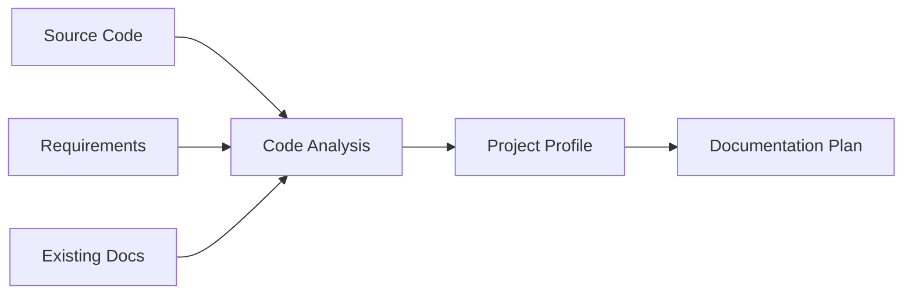
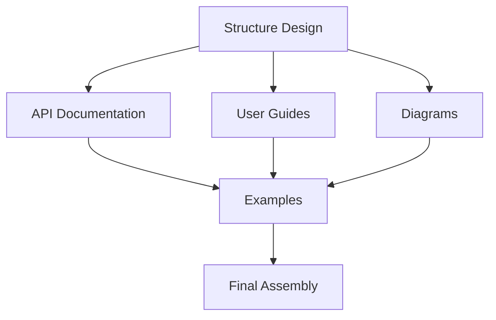

# Documentation Generation Workflow

## Overview

The Documentation Generation workflow orchestrates the creation of comprehensive technical documentation by coordinating all Technical Writer agents. This workflow transforms source code, specifications, and requirements into well-structured, accurate, and user-friendly documentation across multiple formats.

## Workflow Stages

### Stage 1: Project Analysis


**Activities:**
- Scan project structure and codebase
- Identify documentation needs
- Analyze target audience
- Determine documentation scope
- Create documentation roadmap

**Outputs:**
- Project analysis report
- Documentation requirements matrix
- Audience profiles
- Content outline

### Stage 2: Structure Design
```yaml
structure_design:
  documentation_structurer:
    - Analyze project architecture
    - Design information hierarchy
    - Create navigation structure
    - Define document relationships
    
  outputs:
    - Documentation site map
    - Navigation tree
    - Content categories
    - Cross-reference map
```

### Stage 3: Content Generation
```yaml
parallel_generation:
  api_doc_generator:
    - Extract API endpoints
    - Generate endpoint documentation
    - Create code examples
    - Produce API specifications
    
  user_guide_writer:
    - Create getting started guides
    - Write feature tutorials
    - Develop troubleshooting guides
    - Generate FAQ sections
    
  diagramming_assistant:
    - Generate architecture diagrams
    - Create flow charts
    - Produce sequence diagrams
    - Design visual aids
```

### Stage 4: Integration & Assembly
```python
def integrate_documentation(components):
    """
    Assembles all documentation components into cohesive output
    """
    integrated_docs = {
        'structure': components['structure'],
        'api_reference': components['api_docs'],
        'user_guides': components['guides'],
        'diagrams': components['visuals']
    }
    
    # Cross-link related content
    integrated_docs = create_cross_references(integrated_docs)
    
    # Apply consistent formatting
    integrated_docs = apply_style_guide(integrated_docs)
    
    # Generate navigation elements
    integrated_docs = build_navigation(integrated_docs)
    
    return integrated_docs
```

### Stage 5: Quality Assurance
```yaml
quality_checks:
  automated:
    - Link validation
    - Code example testing
    - Format consistency
    - Completeness verification
    
  manual_review:
    - Technical accuracy
    - Clarity assessment
    - User experience
    - Brand compliance
```

## Process Flow

### 1. Initialization
```python
def initialize_documentation_generation(project_path, config):
    """
    Sets up the documentation generation process
    """
    context = {
        'project': analyze_project(project_path),
        'config': load_configuration(config),
        'agents': initialize_agents(),
        'templates': load_templates()
    }
    
    return create_workflow_context(context)
```

### 2. Parallel Processing
```python
async def generate_documentation_parallel(context):
    """
    Runs documentation generation tasks in parallel
    """
    tasks = [
        generate_api_docs(context),
        create_user_guides(context),
        produce_diagrams(context),
        extract_code_examples(context)
    ]
    
    results = await asyncio.gather(*tasks)
    return combine_results(results)
```

### 3. Post-Processing
```python
def post_process_documentation(raw_docs):
    """
    Applies final processing steps
    """
    processed_docs = raw_docs
    
    # Apply formatting
    processed_docs = format_documentation(processed_docs)
    
    # Optimize for search
    processed_docs = add_search_metadata(processed_docs)
    
    # Generate indexes
    processed_docs = create_indexes(processed_docs)
    
    # Create multiple formats
    return export_formats(processed_docs)
```

## Coordination Mechanisms

### Agent Communication
```yaml
agent_coordination:
  message_passing:
    - Request/response patterns
    - Event notifications
    - Status updates
    - Resource sharing
    
  shared_resources:
    - Code analysis cache
    - Terminology glossary
    - Style guide rules
    - Template library
```

### Dependency Management


## Configuration

### Workflow Settings
```yaml
workflow_config:
  generation_mode: "full"  # full, incremental, selective
  
  parallelism:
    max_workers: 4
    chunk_size: 100  # files per chunk
    
  quality_gates:
    coverage_threshold: 90  # percentage
    accuracy_checks: true
    style_compliance: true
    
  output_options:
    formats: ["html", "pdf", "markdown"]
    languages: ["en", "es", "fr"]
    versions: ["latest", "stable"]
```

### Agent Configuration
```yaml
agent_settings:
  documentation_structurer:
    max_depth: 4
    grouping_threshold: 5
    
  api_doc_generator:
    include_private: false
    example_languages: ["curl", "python", "javascript"]
    
  user_guide_writer:
    default_level: "intermediate"
    include_videos: true
    
  diagramming_assistant:
    default_tool: "mermaid"
    auto_generate: true
```

## Error Handling

### Recovery Strategies
```python
def handle_generation_error(error, context):
    """
    Implements error recovery strategies
    """
    if error.type == "parsing_error":
        return fallback_parsing(context)
    
    elif error.type == "generation_timeout":
        return retry_with_smaller_chunks(context)
    
    elif error.type == "resource_exhaustion":
        return queue_for_batch_processing(context)
    
    else:
        log_error(error)
        return partial_documentation(context)
```

### Validation Points
1. **Input Validation**
   - Source code accessibility
   - Configuration completeness
   - Template availability

2. **Process Validation**
   - Agent health checks
   - Resource availability
   - Progress monitoring

3. **Output Validation**
   - Content completeness
   - Format correctness
   - Quality metrics

## Performance Optimization

### Caching Strategy
```yaml
caching:
  levels:
    - AST cache for code parsing
    - Template compilation cache
    - Rendered content cache
    - Export format cache
    
  invalidation:
    - File change detection
    - Dependency tracking
    - Time-based expiry
    - Manual refresh
```

### Scalability Features
- Distributed processing support
- Incremental generation
- Lazy loading of resources
- Stream processing for large projects

## Monitoring & Metrics

### Key Metrics
```yaml
metrics:
  performance:
    - Generation time per component
    - Resource utilization
    - Cache hit rates
    - Error rates
    
  quality:
    - Documentation coverage
    - Link validity
    - Example accuracy
    - User feedback scores
    
  productivity:
    - Pages generated per hour
    - Automation percentage
    - Manual intervention rate
    - Update frequency
```

### Monitoring Dashboard
```python
def create_monitoring_dashboard():
    """
    Sets up real-time monitoring for documentation generation
    """
    dashboard = {
        'status': track_workflow_status(),
        'progress': monitor_generation_progress(),
        'quality': assess_documentation_quality(),
        'alerts': configure_alert_thresholds()
    }
    
    return dashboard
```

## Integration Points

### CI/CD Integration
```yaml
ci_cd_integration:
  triggers:
    - Code commits
    - Pull requests
    - Release tags
    - Schedule
    
  actions:
    - Generate documentation
    - Validate changes
    - Deploy updates
    - Notify stakeholders
```

### Version Control
```bash
# Documentation as code
git add docs/
git commit -m "docs: Update API documentation"
git push origin main

# Automated documentation PR
git checkout -b docs/auto-update
npm run generate-docs
git add .
git commit -m "docs: Automated documentation update"
gh pr create --title "Documentation Update" --body "Automated documentation generation"
```

## Best Practices

### DO:
- Run generation in CI/CD pipeline
- Cache intermediate results
- Validate before publishing
- Monitor generation metrics
- Keep configuration versioned

### DON'T:
- Generate during peak hours
- Skip validation steps
- Ignore generation errors
- Mix manual and auto content
- Forget about accessibility

## Future Enhancements

1. **Smart Generation**: AI-driven content optimization
2. **Real-time Updates**: Live documentation updates
3. **Multi-modal Output**: Voice, video, AR documentation
4. **Collaborative Generation**: Multi-agent collaboration
5. **Predictive Documentation**: Anticipate documentation needs