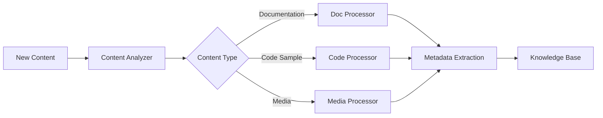

# Knowledge Base Management Workflow

## Overview

The Knowledge Base Management workflow orchestrates the organization, maintenance, and optimization of centralized documentation repositories. This workflow ensures that technical knowledge is easily discoverable, properly categorized, and continuously improved based on usage patterns and user needs.

## Core Components

### Knowledge Base Architecture
```yaml
kb_structure:
  content_types:
    - API Documentation
    - User Guides
    - Tutorials
    - Troubleshooting
    - Best Practices
    - Architecture Docs
    - Release Notes
    - FAQs
    
  organization:
    - Hierarchical categories
    - Tag-based classification
    - Cross-references
    - Related content
    - Version tracking
    
  access_layers:
    - Public documentation
    - Internal knowledge
    - Partner resources
    - Premium content
```

## Workflow Stages

### Stage 1: Content Ingestion


**Ingestion Pipeline:**
```python
def ingest_content(content_source):
    """
    Processes new content for knowledge base inclusion
    """
    content = {
        'raw': extract_content(content_source),
        'type': identify_content_type(content_source),
        'metadata': extract_metadata(content_source),
        'quality': assess_content_quality(content_source)
    }
    
    # Process based on type
    processed_content = process_by_type(content)
    
    # Enrich with metadata
    enriched_content = enrich_metadata(processed_content)
    
    # Generate relationships
    content_relationships = identify_relationships(enriched_content)
    
    return prepare_for_storage(enriched_content, content_relationships)
```

### Stage 2: Content Classification
```python
def classify_content(content):
    """
    Applies multi-dimensional classification to content
    """
    classification = {
        'primary_category': determine_main_category(content),
        'subcategories': identify_subcategories(content),
        'tags': generate_content_tags(content),
        'audience_level': assess_complexity_level(content),
        'content_stage': determine_lifecycle_stage(content),
        'relevance_score': calculate_relevance(content)
    }
    
    # Apply ML-based classification
    ml_tags = apply_ml_classification(content)
    classification['ml_suggestions'] = ml_tags
    
    return validate_classification(classification)
```

### Stage 3: Search Optimization
```yaml
search_optimization:
  indexing:
    - Full-text search
    - Semantic search
    - Code search
    - Fuzzy matching
    
  metadata_enrichment:
    - Synonyms
    - Related terms
    - Common misspellings
    - Acronym expansion
    
  ranking_factors:
    - Content freshness
    - Usage frequency
    - User ratings
    - Update recency
    - Relevance score
```

**Search Implementation:**
```python
def optimize_for_search(content):
    """
    Enhances content for improved searchability
    """
    search_data = {
        'title': optimize_title(content.title),
        'description': create_search_description(content),
        'keywords': extract_keywords(content),
        'semantic_terms': generate_semantic_terms(content),
        'code_snippets': index_code_blocks(content)
    }
    
    # Create search indexes
    indexes = {
        'primary': create_primary_index(search_data),
        'semantic': create_semantic_index(search_data),
        'code': create_code_index(search_data)
    }
    
    return apply_search_optimization(content, indexes)
```

### Stage 4: Content Relationships
```python
def manage_content_relationships(content_item):
    """
    Establishes and maintains relationships between content pieces
    """
    relationships = {
        'prerequisites': find_prerequisite_content(content_item),
        'related': discover_related_content(content_item),
        'next_steps': suggest_next_content(content_item),
        'alternatives': identify_alternative_approaches(content_item),
        'updates': track_superseded_content(content_item)
    }
    
    # Build relationship graph
    graph = build_content_graph(relationships)
    
    # Optimize navigation paths
    optimized_paths = optimize_learning_paths(graph)
    
    return create_relationship_metadata(optimized_paths)
```

### Stage 5: Analytics & Insights
```yaml
analytics_tracking:
  usage_metrics:
    - Page views
    - Time on page
    - Bounce rate
    - Search queries
    - Download counts
    
  user_behavior:
    - Navigation patterns
    - Search refinements
    - Content ratings
    - Feedback submissions
    - Sharing frequency
    
  content_performance:
    - Helpfulness scores
    - Problem resolution rate
    - Update frequency
    - Error reports
    - Gap identification
```

## Content Lifecycle Management

### Version Control
```python
def manage_content_versions(content_id, new_version):
    """
    Handles content versioning and history
    """
    version_control = {
        'current': get_current_version(content_id),
        'new': new_version,
        'changes': diff_versions(current, new_version),
        'impact': assess_change_impact(changes)
    }
    
    # Archive previous version
    archive_version(version_control['current'])
    
    # Update with new version
    update_content(content_id, new_version)
    
    # Notify affected users
    notify_subscribers(content_id, version_control['changes'])
    
    return version_control
```

### Content Retirement
```yaml
retirement_process:
  criteria:
    - Age threshold exceeded
    - Technology deprecated
    - Low usage metrics
    - Superseded by newer content
    
  steps:
    - Mark for review
    - Validate retirement decision
    - Redirect to alternatives
    - Archive for historical reference
    - Remove from active index
```

## Search & Discovery

### Advanced Search Features
```python
def execute_advanced_search(query, filters):
    """
    Performs sophisticated content search
    """
    search_strategy = {
        'text_search': perform_text_search(query),
        'semantic_search': perform_semantic_search(query),
        'filter_application': apply_search_filters(filters),
        'personalization': apply_user_preferences(user_context)
    }
    
    # Combine search results
    combined_results = merge_search_results(search_strategy)
    
    # Rank results
    ranked_results = rank_by_relevance(combined_results)
    
    # Enhance with snippets
    enhanced_results = add_preview_snippets(ranked_results)
    
    return format_search_results(enhanced_results)
```

### Recommendation Engine
```python
def generate_content_recommendations(user_context):
    """
    Provides personalized content recommendations
    """
    recommendations = {
        'based_on_history': analyze_view_history(user_context),
        'similar_users': find_similar_user_patterns(user_context),
        'trending': get_trending_content(),
        'personalized': apply_ml_recommendations(user_context)
    }
    
    # Blend recommendation strategies
    blended = blend_recommendations(recommendations)
    
    # Filter by user preferences
    filtered = apply_user_filters(blended)
    
    return rank_recommendations(filtered)
```

## Quality Management

### Content Quality Metrics
```yaml
quality_metrics:
  accuracy:
    - Technical correctness
    - Code validity
    - Information currency
    - Link integrity
    
  completeness:
    - Topic coverage
    - Example sufficiency
    - Edge case handling
    - Prerequisites listed
    
  clarity:
    - Readability score
    - Structure quality
    - Visual aid usage
    - Language simplicity
    
  engagement:
    - User ratings
    - Time on page
    - Completion rate
    - Return visits
```

### Continuous Improvement
```python
def improve_content_quality(content_analytics):
    """
    Implements continuous improvement based on analytics
    """
    improvements = []
    
    # Identify improvement opportunities
    if content_analytics['bounce_rate'] > THRESHOLD:
        improvements.append(improve_introduction(content))
    
    if content_analytics['search_exits'] > THRESHOLD:
        improvements.append(enhance_keywords(content))
    
    if content_analytics['low_ratings']:
        improvements.append(clarify_explanations(content))
    
    # Apply improvements
    updated_content = apply_improvements(content, improvements)
    
    # Measure impact
    return track_improvement_impact(updated_content)
```

## Integration Features

### API Access
```python
@api.route('/kb/search', methods=['POST'])
def knowledge_base_api():
    """
    Provides API access to knowledge base
    """
    query = request.json.get('query')
    filters = request.json.get('filters', {})
    
    results = search_knowledge_base(query, filters)
    
    return jsonify({
        'results': results,
        'total': len(results),
        'facets': generate_facets(results),
        'suggestions': generate_suggestions(query)
    })
```

### Export Capabilities
```yaml
export_formats:
  structured:
    - JSON
    - XML
    - YAML
    
  documents:
    - PDF
    - EPUB
    - DOCX
    
  static_sites:
    - HTML
    - Markdown
    - reStructuredText
    
  integrations:
    - Confluence
    - SharePoint
    - GitHub Wiki
```

## Collaboration Features

### Contribution Management
```python
def manage_contributions(contribution):
    """
    Handles user contributions to knowledge base
    """
    validation = validate_contribution(contribution)
    
    if validation['status'] == 'approved':
        # Process approved contribution
        processed = process_contribution(contribution)
        
        # Integrate into knowledge base
        integrated = integrate_content(processed)
        
        # Reward contributor
        reward_contributor(contribution.author)
        
        return integrated
    else:
        # Request revisions
        return request_revisions(contribution, validation['issues'])
```

### Expert Network
```yaml
expert_network:
  roles:
    - Content Authors
    - Technical Reviewers
    - Subject Matter Experts
    - Community Moderators
    
  activities:
    - Content creation
    - Peer review
    - Q&A support
    - Content curation
```

## Performance Optimization

### Caching Strategy
```yaml
caching_layers:
  edge_cache:
    - Static content
    - Popular searches
    - Common queries
    
  application_cache:
    - Search results
    - Recommendations
    - User preferences
    
  database_cache:
    - Frequently accessed content
    - Relationship graphs
    - Analytics data
```

### Scalability Architecture
```python
def scale_knowledge_base(load_metrics):
    """
    Implements auto-scaling for knowledge base
    """
    scaling_decision = {
        'search_nodes': calculate_search_capacity(load_metrics),
        'storage_nodes': calculate_storage_needs(load_metrics),
        'cache_layers': optimize_cache_distribution(load_metrics)
    }
    
    # Apply scaling
    apply_infrastructure_scaling(scaling_decision)
    
    # Rebalance content
    rebalance_content_distribution()
    
    return monitor_scaling_impact()
```

## Best Practices

### DO:
- Maintain consistent categorization
- Regular content audits
- Monitor search analytics
- Encourage user feedback
- Keep content up-to-date

### DON'T:
- Over-categorize content
- Ignore user search patterns
- Neglect content relationships
- Skip quality checks
- Allow stale content

## Future Enhancements

1. **AI-Powered Curation**: Intelligent content organization
2. **Natural Language Q&A**: Conversational knowledge access
3. **Augmented Reality Guides**: AR-enhanced documentation
4. **Predictive Content**: Anticipate user needs
5. **Knowledge Graph**: Visual knowledge representation