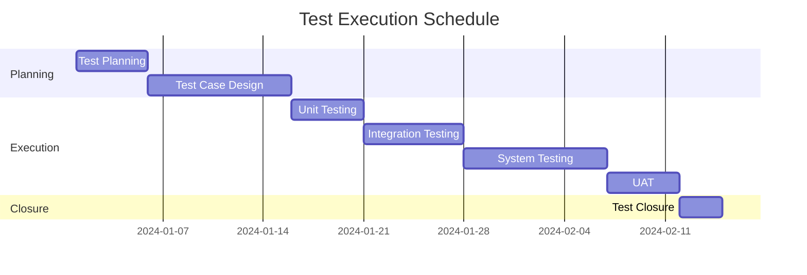

# Test Plan Template

## Document Information
- **Document Title**: [Project Name] Test Plan
- **Version**: 1.0
- **Date**: [YYYY-MM-DD]
- **Author**: [Name]
- **Reviewers**: [Names]
- **Approval**: [Name, Title]

## Table of Contents
1. [Introduction](#introduction)
2. [Test Objectives](#test-objectives)
3. [Test Scope](#test-scope)
4. [Test Strategy](#test-strategy)
5. [Test Environment](#test-environment)
6. [Test Schedule](#test-schedule)
7. [Resource Requirements](#resource-requirements)
8. [Test Deliverables](#test-deliverables)
9. [Risk Analysis](#risk-analysis)
10. [Test Execution](#test-execution)
11. [Exit Criteria](#exit-criteria)

## 1. Introduction

### 1.1 Purpose
[Describe the purpose of this test plan document]

### 1.2 Project Overview
[Brief description of the project/system under test]

### 1.3 Stakeholders
| Role | Name | Responsibility |
|------|------|----------------|
| Project Manager | [Name] | [Responsibility] |
| Test Lead | [Name] | [Responsibility] |
| Development Lead | [Name] | [Responsibility] |
| Business Analyst | [Name] | [Responsibility] |

## 2. Test Objectives

### Primary Objectives
- [ ] Validate all functional requirements are met
- [ ] Ensure system performance meets SLA requirements
- [ ] Verify security compliance
- [ ] Confirm user experience meets expectations
- [ ] [Additional objectives]

### Success Criteria
- Test coverage: ≥ 95%
- Critical defects: 0
- High priority defects: ≤ 5
- Test execution: 100% of planned tests
- [Additional criteria]

## 3. Test Scope

### 3.1 In Scope
- **Features to be tested**:
  - [ ] User Authentication and Authorization
  - [ ] Core Business Logic
  - [ ] API Endpoints
  - [ ] User Interface
  - [ ] [Additional features]

- **Test Types**:
  - [ ] Unit Testing
  - [ ] Integration Testing
  - [ ] System Testing
  - [ ] User Acceptance Testing
  - [ ] Performance Testing
  - [ ] Security Testing

### 3.2 Out of Scope
- [Feature/component not included]
- [Test type not performed]
- [Environmental limitations]

## 4. Test Strategy

### 4.1 Test Approach
```yaml
approach:
  methodology: "Risk-based testing"
  automation_target: "70%"
  manual_testing: "30%"
  
  levels:
    - level: "Unit"
      responsibility: "Developers"
      coverage_target: "80%"
      
    - level: "Integration"
      responsibility: "Test Team"
      coverage_target: "90%"
      
    - level: "System"
      responsibility: "Test Team"
      coverage_target: "95%"
      
    - level: "UAT"
      responsibility: "Business Users"
      coverage_target: "100% critical paths"
```

### 4.2 Test Techniques
- Boundary Value Analysis
- Equivalence Partitioning
- Decision Table Testing
- State Transition Testing
- Use Case Testing
- [Additional techniques]

### 4.3 Test Prioritization
| Priority | Description | Examples |
|----------|-------------|----------|
| Critical | Core functionality, showstoppers | Login, Payment processing |
| High | Important features | User profile, Search |
| Medium | Standard features | Reports, Settings |
| Low | Nice-to-have features | Themes, Advanced filters |

## 5. Test Environment

### 5.1 Hardware Requirements
| Environment | Specifications | Purpose |
|-------------|----------------|---------|
| Dev/Test | 4 CPU, 8GB RAM, 100GB SSD | Development testing |
| Staging | 8 CPU, 16GB RAM, 500GB SSD | Pre-production testing |
| Performance | 16 CPU, 32GB RAM, 1TB SSD | Load testing |

### 5.2 Software Requirements
- **Operating System**: [OS details]
- **Database**: [DB type and version]
- **Application Server**: [Server details]
- **Browser Support**: Chrome (latest), Firefox (latest), Safari (latest), Edge (latest)
- **Mobile**: iOS 14+, Android 10+

### 5.3 Test Data Requirements
```yaml
test_data:
  users:
    - type: "Admin"
      count: 2
      characteristics: "Full permissions"
    - type: "Standard User"
      count: 10
      characteristics: "Limited permissions"
    - type: "Guest"
      count: 5
      characteristics: "Read-only access"
      
  products:
    - category: "Electronics"
      count: 100
    - category: "Clothing"
      count: 200
      
  transactions:
    - type: "Successful"
      count: 1000
    - type: "Failed"
      count: 100
```

## 6. Test Schedule

### 6.1 Timeline


### 6.2 Milestones
| Milestone | Date | Deliverables |
|-----------|------|--------------|
| Test Plan Approval | [Date] | Approved test plan |
| Test Cases Ready | [Date] | Complete test suite |
| Test Environment Ready | [Date] | Configured environments |
| Test Execution Complete | [Date] | All tests executed |
| Test Sign-off | [Date] | Final test report |

## 7. Resource Requirements

### 7.1 Human Resources
| Role | Name | Allocation | Duration |
|------|------|------------|----------|
| Test Lead | [Name] | 100% | Full project |
| Senior Tester | [Name] | 100% | Execution phase |
| Test Engineer | [Name] | 80% | Full project |
| Automation Engineer | [Name] | 60% | Design + Execution |

### 7.2 Tools and Licenses
- **Test Management**: [Tool name] - [X licenses]
- **Automation**: [Framework] - [License type]
- **Performance**: [Tool name] - [X licenses]
- **Defect Tracking**: [Tool name] - [X licenses]

## 8. Test Deliverables

### 8.1 Before Testing
- [ ] Test Plan Document
- [ ] Test Cases/Scripts
- [ ] Test Data
- [ ] Test Environment Setup

### 8.2 During Testing
- [ ] Test Execution Logs
- [ ] Defect Reports
- [ ] Daily Status Reports
- [ ] Test Metrics

### 8.3 After Testing
- [ ] Test Summary Report
- [ ] Defect Analysis Report
- [ ] Test Coverage Report
- [ ] Lessons Learned Document

## 9. Risk Analysis

### 9.1 Risk Matrix
| Risk | Probability | Impact | Mitigation Strategy |
|------|-------------|--------|---------------------|
| Late delivery of code | High | High | Daily sync, prioritized testing |
| Test environment instability | Medium | High | Backup environment, monitoring |
| Resource unavailability | Low | Medium | Cross-training, backup resources |
| Requirement changes | Medium | High | Agile approach, regular reviews |

### 9.2 Contingency Plans
- **Schedule Slippage**: Prioritize critical tests, extend timeline
- **Blocking Defects**: Escalation process, workaround documentation
- **Resource Issues**: Contractor support, overtime approval

## 10. Test Execution

### 10.1 Entry Criteria
- [ ] Test plan approved
- [ ] Test cases reviewed and approved
- [ ] Test environment ready
- [ ] Test data prepared
- [ ] Code deployed to test environment
- [ ] Smoke tests passed

### 10.2 Test Execution Process
1. **Daily Activities**
   - Execute planned test cases
   - Log defects in tracking system
   - Update test execution status
   - Attend daily stand-up

2. **Weekly Activities**
   - Test progress review
   - Defect triage meeting
   - Risk assessment update
   - Stakeholder communication

### 10.3 Defect Management
```yaml
defect_process:
  severity_levels:
    critical: "System crash, data loss, security breach"
    high: "Major functionality broken"
    medium: "Minor functionality issues"
    low: "Cosmetic issues"
    
  sla:
    critical: "Fix within 4 hours"
    high: "Fix within 24 hours"
    medium: "Fix within 3 days"
    low: "Fix in next release"
    
  workflow:
    - "New"
    - "Assigned"
    - "In Progress"
    - "Fixed"
    - "Verified"
    - "Closed"
```

## 11. Exit Criteria

### 11.1 Test Completion Criteria
- [ ] All planned test cases executed
- [ ] Pass rate ≥ 95%
- [ ] No open critical defects
- [ ] All high priority defects resolved
- [ ] Performance benchmarks met
- [ ] Security scan passed

### 11.2 Suspension Criteria
Testing may be suspended if:
- Critical defects block > 30% of test cases
- Test environment unavailable > 2 days
- Major requirement changes
- Resource availability < 50%

### 11.3 Resumption Requirements
- Blocking issues resolved
- Environment stable
- Resources available
- Updated test cases for changes

## Appendices

### A. Test Case Summary
[Link to detailed test cases]

### B. Requirements Traceability Matrix
[Link to RTM]

### C. Test Tools Setup Guide
[Link to setup documentation]

### D. Contact Information
[Team contact details]

---

**Document Approval**

| Role | Name | Signature | Date |
|------|------|-----------|------|
| Test Manager | | | |
| Project Manager | | | |
| Development Lead | | | |
| Business Owner | | | |