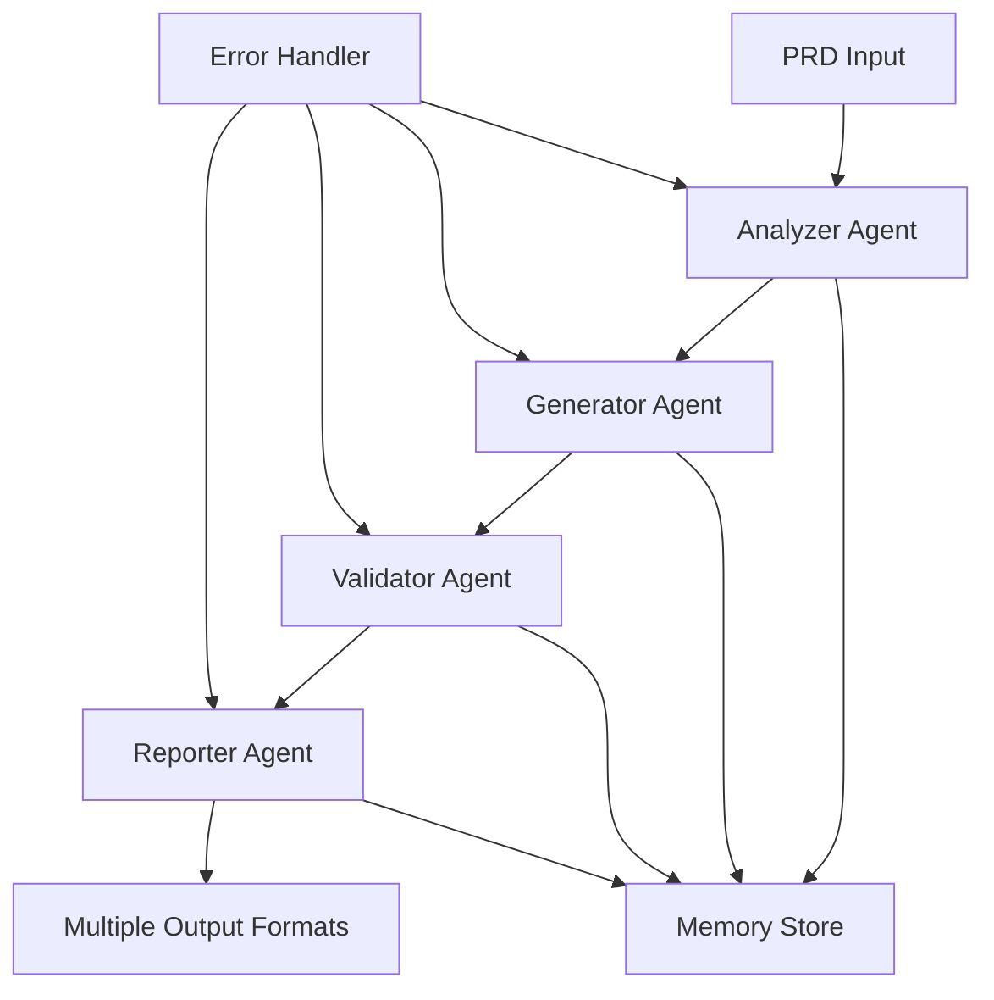

# PRD to Test Plan Workflow

## Overview

This comprehensive workflow transforms Product Requirement Documents (PRDs) into complete test plans by orchestrating four specialized agents in a coordinated sequence. It handles large documents with pagination, performs quality validation at each stage, and generates multiple output formats including JSON, Markdown, and Gherkin.

## Workflow Architecture



## Agent Coordination Sequence

### Phase 1: Analysis (Analyzer Agent)
**Duration**: 15-20 minutes for standard PRDs
**Purpose**: Deep analysis of PRD content and extraction of testable requirements

```bash
# Initiate PRD analysis with pagination support
./claude-flow agent spawn analyzer \
  --input "prd-v2.0.md" \
  --mode "deep-analysis" \
  --pagination "enabled" \
  --chunk-size "10MB" \
  --output "analysis-results.json"
```

### Phase 2: Generation (Generator Agent)
**Duration**: 30-45 minutes for comprehensive test generation
**Purpose**: Create test cases, scenarios, and edge cases based on analysis

```bash
# Generate comprehensive test artifacts
./claude-flow agent spawn generator \
  --analysis "analysis-results.json" \
  --formats "json,markdown,gherkin" \
  --coverage "comprehensive" \
  --parallel "true" \
  --batch-size "50"
```

### Phase 3: Validation (Validator Agent)
**Duration**: 20-30 minutes for full validation
**Purpose**: Validate test completeness, consistency, and coverage

```bash
# Validate generated test artifacts
./claude-flow agent spawn validator \
  --test-cases "generated-tests.json" \
  --requirements "analysis-results.json" \
  --validation-rules "strict" \
  --coverage-threshold "95%"
```

### Phase 4: Reporting (Reporter Agent)
**Duration**: 10-15 minutes for report generation
**Purpose**: Create formatted reports in multiple output formats

```bash
# Generate final reports
./claude-flow agent spawn reporter \
  --validated-tests "validated-tests.json" \
  --formats "json,markdown,gherkin,html,pdf" \
  --include-metrics "true" \
  --visualization "enabled"
```

## Complete Workflow Configuration

```yaml
workflow:
  name: "PRD to Test Plan"
  version: "2.0"
  description: "Comprehensive PRD analysis and test plan generation"
  
  settings:
    max_prd_size: "100MB"
    pagination_enabled: true
    chunk_size: "10MB"
    parallel_processing: true
    error_recovery: true
    
  agents:
    - analyzer:
        class: "TestCaseAnalyzer"
        timeout: "30m"
        retries: 3
        memory_allocation: "4GB"
        capabilities:
          - requirement_extraction
          - dependency_mapping
          - risk_assessment
          - pagination_handling
          
    - generator:
        class: "TestCaseGenerator"
        timeout: "60m"
        retries: 2
        parallel_workers: 4
        capabilities:
          - test_case_creation
          - scenario_building
          - edge_case_discovery
          - multi_format_output
          
    - validator:
        class: "TestCaseValidator"
        timeout: "30m"
        retries: 2
        validation_levels:
          - syntax
          - completeness
          - coverage
          - consistency
          - traceability
          
    - reporter:
        class: "TestCaseReporter"
        timeout: "20m"
        retries: 2
        output_formats:
          - json
          - markdown
          - gherkin
          - html
          - pdf
          - jira
          - excel
          
  quality_checks:
    - coverage_analysis:
        minimum_coverage: 95
        requirement_mapping: mandatory
        
    - consistency_check:
        naming_conventions: true
        duplicate_detection: true
        
    - completeness_check:
        all_requirements_covered: true
        edge_cases_included: true
        negative_scenarios: true
        
  error_handling:
    - retry_strategy:
        max_retries: 3
        backoff_multiplier: 2
        
    - recovery_checkpoints:
        after_analysis: true
        after_generation: true
        after_validation: true
        
    - fallback_options:
        partial_completion: allowed
        manual_intervention: prompt
```

## Execution Commands

### Standard Execution
```bash
# Run complete workflow with default settings
./claude-flow workflow execute prd-to-test-plan \
  --input "product-requirements.md" \
  --output-dir "./test-plans" \
  --monitor
```

### Advanced Execution with Options
```bash
# Run with all advanced features
./claude-flow workflow execute prd-to-test-plan \
  --input "large-prd.pdf" \
  --output-dir "./test-plans" \
  --formats "json,markdown,gherkin,html" \
  --pagination "auto" \
  --parallel \
  --validate "strict" \
  --coverage-threshold "98" \
  --error-recovery "automatic" \
  --checkpoint-interval "5m" \
  --memory-optimize \
  --monitor
```

### Using SPARC Orchestration
```bash
# High-level orchestration
./claude-flow sparc "Generate comprehensive test plan from enterprise-prd.pdf with all validation checks and multiple output formats"
```

### Swarm Mode for Large PRDs
```bash
# Distributed processing for very large PRDs
./claude-flow swarm "Process 500-page PRD and generate complete test suite" \
  --strategy "analysis" \
  --mode "distributed" \
  --max-agents 10 \
  --parallel \
  --monitor \
  --output "json,markdown,gherkin"
```

## Input Handling

### Supported Input Formats
- Markdown (.md)
- PDF (.pdf)
- Word Documents (.docx)
- HTML (.html)
- Confluence Export (.xml)
- JIRA Export (.json)

### Large PRD Pagination
```javascript
// Pagination configuration for large documents
const paginationConfig = {
  enabled: true,
  chunkSize: "10MB",
  overlapSize: "1MB",
  processingMode: "sequential", // or "parallel"
  memoryOptimization: true,
  tempStoragePath: "/tmp/prd-chunks",
  cleanupAfterProcessing: true
};

// Automatic chunking for documents > 50MB
if (documentSize > 50 * 1024 * 1024) {
  enablePagination(paginationConfig);
}
```

## Output Formats

### 1. JSON Format (test-plan.json)
```json
{
  "metadata": {
    "version": "2.0",
    "generated": "2024-01-15T10:30:00Z",
    "source_prd": "product-requirements.md",
    "total_requirements": 156,
    "total_test_cases": 423,
    "coverage_percentage": 96.5
  },
  "test_suites": [
    {
      "id": "TS-001",
      "name": "User Authentication Suite",
      "test_cases": [
        {
          "id": "TC-001",
          "title": "Valid user login with correct credentials",
          "requirement_ids": ["REQ-AUTH-001", "REQ-SEC-002"],
          "priority": "Critical",
          "type": "Functional",
          "preconditions": ["User account exists", "User is not logged in"],
          "steps": [
            {
              "step": 1,
              "action": "Navigate to login page",
              "expected": "Login form is displayed"
            },
            {
              "step": 2,
              "action": "Enter valid username and password",
              "expected": "Credentials are accepted"
            }
          ],
          "postconditions": ["User is logged in", "Session is created"],
          "test_data": {
            "username": "testuser@example.com",
            "password": "SecurePass123!"
          }
        }
      ]
    }
  ],
  "traceability_matrix": {
    "requirements": [
      {
        "id": "REQ-AUTH-001",
        "description": "Users must be able to log in",
        "test_cases": ["TC-001", "TC-002", "TC-003"],
        "coverage": "Complete"
      }
    ]
  },
  "metrics": {
    "total_test_cases": 423,
    "by_priority": {
      "Critical": 89,
      "High": 156,
      "Medium": 134,
      "Low": 44
    },
    "by_type": {
      "Functional": 312,
      "Performance": 45,
      "Security": 66
    },
    "estimated_execution_time": "16.5 hours"
  }
}
```

### 2. Markdown Format (test-plan.md)
```markdown
# Test Plan: [Product Name]
Generated: 2024-01-15 10:30:00 UTC

## Executive Summary
- **Total Requirements**: 156
- **Total Test Cases**: 423
- **Coverage**: 96.5%
- **Estimated Execution Time**: 16.5 hours

## Test Strategy
### Risk-Based Testing Approach
- Critical features tested first
- Security testing integrated throughout
- Performance benchmarks at key points

## Test Suites

### 1. User Authentication Suite (TS-001)
**Priority**: Critical
**Test Cases**: 25
**Estimated Duration**: 2 hours

#### TC-001: Valid user login with correct credentials
- **Requirements**: REQ-AUTH-001, REQ-SEC-002
- **Priority**: Critical
- **Type**: Functional

**Preconditions**:
- User account exists in the system
- User is not currently logged in

**Test Steps**:
1. Navigate to login page
   - *Expected*: Login form is displayed
2. Enter valid username and password
   - *Expected*: Credentials are accepted
3. Click "Login" button
   - *Expected*: User is redirected to dashboard

**Postconditions**:
- User is successfully logged in
- Valid session is created
```

### 3. Gherkin Format (test-scenarios.feature)
```gherkin
# Generated from: product-requirements.md
# Date: 2024-01-15
# Coverage: 96.5%

@authentication @critical
Feature: User Authentication
  As a registered user
  I want to log into the system
  So that I can access my personalized content

  Background:
    Given the authentication service is available
    And test user accounts exist in the system

  @smoke @happy-path
  Scenario: Successful login with valid credentials
    Given I am on the login page
    When I enter "testuser@example.com" as username
    And I enter "SecurePass123!" as password
    And I click the "Login" button
    Then I should be redirected to the dashboard
    And I should see "Welcome, Test User" message
    And a valid session token should be created

  @security @negative-test
  Scenario: Failed login with invalid password
    Given I am on the login page
    When I enter "testuser@example.com" as username
    And I enter "WrongPassword" as password
    And I click the "Login" button
    Then I should remain on the login page
    And I should see "Invalid credentials" error message
    And no session token should be created

  @edge-case @security
  Scenario Outline: Password validation edge cases
    Given I am on the login page
    When I enter "testuser@example.com" as username
    And I enter "<password>" as password
    And I click the "Login" button
    Then I should see "<error_message>" error message

    Examples:
      | password           | error_message                    |
      | ""                | Password is required             |
      | "a"               | Password too short               |
      | "password123"     | Password must contain uppercase  |
      | "PASSWORD123"     | Password must contain lowercase  |
      | "Pass word 123!"  | Password cannot contain spaces   |
```

## Validation Steps

### 1. Requirement Coverage Validation
```javascript
// Automated coverage check
const validationRules = {
  requirementCoverage: {
    minimum: 95,
    criticalRequirements: 100,
    checkOrphanedTests: true,
    checkMissingRequirements: true
  }
};

// Validation execution
validateCoverage(testPlan, requirements, validationRules);
```

### 2. Test Case Quality Validation
- Completeness check (all fields populated)
- Consistency check (naming conventions)
- Duplication detection
- Dependency validation
- Test data validation

### 3. Cross-Format Consistency
- Ensure all formats contain same test cases
- Verify requirement mappings match
- Validate execution estimates align

## Error Handling and Recovery

### 1. Checkpoint System
```yaml
checkpoints:
  - name: "post-analysis"
    data: ["requirements.json", "risk-assessment.json"]
    retention: "7 days"
    
  - name: "post-generation"
    data: ["raw-test-cases.json", "scenarios.json"]
    retention: "7 days"
    
  - name: "post-validation"
    data: ["validated-tests.json", "coverage-report.json"]
    retention: "7 days"
```

### 2. Error Recovery Procedures
```javascript
// Automatic recovery from common errors
const errorRecovery = {
  "MEMORY_EXCEEDED": {
    action: "enable_pagination",
    retry: true,
    notification: "warn"
  },
  "TIMEOUT": {
    action: "resume_from_checkpoint",
    retry: true,
    max_retries: 3
  },
  "VALIDATION_FAILED": {
    action: "generate_error_report",
    retry: false,
    notification: "error"
  },
  "FORMAT_ERROR": {
    action: "fallback_to_json",
    retry: true,
    notification: "info"
  }
};
```

### 3. Manual Intervention Points
- Ambiguous requirements flagged for review
- Coverage below threshold requires approval
- Conflicting test cases need resolution

## Performance Optimization

### 1. Parallel Processing
```bash
# Enable parallel processing for large PRDs
./claude-flow workflow execute prd-to-test-plan \
  --parallel \
  --workers 8 \
  --batch-size 50 \
  --memory-limit "8GB"
```

### 2. Incremental Generation
```bash
# Add new requirements to existing test plan
./claude-flow workflow execute prd-to-test-plan \
  --mode "incremental" \
  --base-plan "existing-test-plan.json" \
  --new-requirements "updated-prd-section.md"
```

### 3. Caching Strategy
- Cache analyzed requirements for 24 hours
- Store generated test templates
- Reuse validation results when possible

## Integration Examples

### CI/CD Pipeline Integration
```yaml
# GitHub Actions Example
name: Generate Test Plan
on:
  push:
    paths:
      - 'docs/requirements/*.md'
      
jobs:
  generate-test-plan:
    runs-on: ubuntu-latest
    steps:
      - uses: actions/checkout@v3
      
      - name: Setup Claude Flow
        run: |
          npm install -g @anthropic/claude-flow
          claude-flow auth --token ${{ secrets.CLAUDE_API_KEY }}
          
      - name: Generate Test Plan
        run: |
          claude-flow workflow execute prd-to-test-plan \
            --input "docs/requirements/prd.md" \
            --output-dir "test-plans" \
            --formats "json,markdown,gherkin" \
            --validate "strict"
            
      - name: Upload Test Artifacts
        uses: actions/upload-artifact@v3
        with:
          name: test-plans
          path: test-plans/
          retention-days: 30
          
      - name: Update Test Management System
        run: |
          claude-flow sparc "Upload test plan to TestRail project ${{ env.TESTRAIL_PROJECT }}"
```

### Monitoring and Metrics
```bash
# Real-time monitoring during execution
./claude-flow monitor \
  --workflow "prd-to-test-plan" \
  --metrics "progress,memory,errors" \
  --update-interval "10s"

# Post-execution analysis
./claude-flow analyze \
  --workflow-run "run-12345" \
  --report "detailed" \
  --export "metrics.json"
```

## Example Usage

### Basic Usage
```bash
# Simple PRD to test plan conversion
./claude-flow workflow execute prd-to-test-plan \
  --input "simple-prd.md" \
  --output-dir "./output"
```

### Enterprise Usage
```bash
# Complex enterprise PRD with all features
./claude-flow workflow execute prd-to-test-plan \
  --input "enterprise-system-prd.pdf" \
  --output-dir "./enterprise-tests" \
  --formats "all" \
  --pagination "auto" \
  --parallel \
  --workers 16 \
  --memory-limit "32GB" \
  --validate "strict" \
  --coverage-threshold "99" \
  --include-performance-tests \
  --include-security-tests \
  --include-accessibility-tests \
  --checkpoint-interval "2m" \
  --error-recovery "automatic" \
  --notification-webhook "$SLACK_WEBHOOK" \
  --monitor
```

### Batch Processing
```bash
# Process multiple PRDs in batch
for prd in ./prds/*.md; do
  ./claude-flow workflow execute prd-to-test-plan \
    --input "$prd" \
    --output-dir "./test-plans/$(basename $prd .md)" \
    --formats "json,markdown" \
    --parallel \
    --quiet
done
```

## Best Practices

### 1. PRD Preparation
- Use clear, testable language in requirements
- Include acceptance criteria for all user stories
- Document edge cases and constraints
- Specify performance requirements quantitatively

### 2. Workflow Optimization
- Enable pagination for PRDs > 50MB
- Use parallel processing for faster execution
- Set appropriate coverage thresholds (95%+ recommended)
- Review validation reports before finalizing

### 3. Output Management
- Version control all generated test plans
- Archive previous versions before regeneration
- Use consistent naming conventions
- Integrate with test management tools

### 4. Continuous Improvement
- Monitor execution metrics
- Analyze failed validations
- Update templates based on feedback
- Refine validation rules over time

## Troubleshooting Guide

### Common Issues and Solutions

1. **Out of Memory Errors**
   ```bash
   # Enable pagination and increase memory limit
   --pagination "auto" --memory-limit "16GB"
   ```

2. **Timeout Errors**
   ```bash
   # Increase timeout and enable checkpoints
   --timeout "120m" --checkpoint-interval "5m"
   ```

3. **Low Coverage Warnings**
   - Review PRD for vague requirements
   - Check for missing acceptance criteria
   - Verify requirement extraction accuracy

4. **Format Generation Failures**
   ```bash
   # Fallback to essential formats only
   --formats "json,markdown" --skip-on-error
   ```

5. **Validation Failures**
   - Review validation report for specific issues
   - Adjust validation rules if too strict
   - Manually review flagged test cases

## Version History

- **v2.0** - Added four-agent orchestration, pagination, multiple formats
- **v1.5** - Introduced validation agent and quality checks
- **v1.0** - Initial three-agent workflow

---

*For additional support, consult the Test Case Generator documentation or run `./claude-flow help test-generator`*