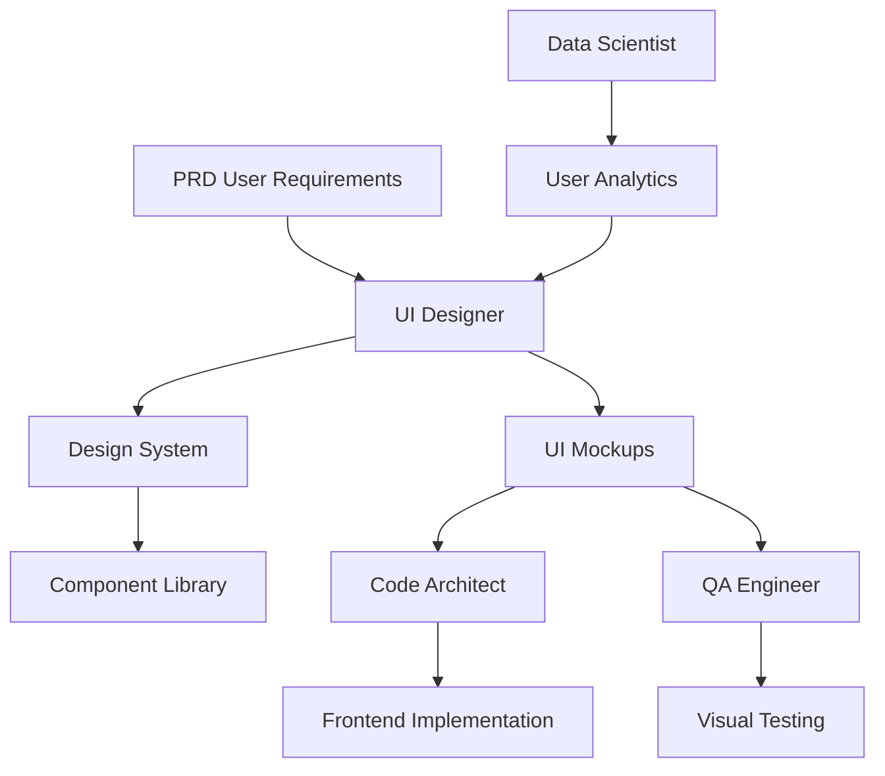

# UI Designer Implementation

A comprehensive UI/UX design assistant implementation for MetaClaude, featuring multi-agent orchestration, vibe design methodology, and complete design system generation.

## Features

- **6 Specialized Design Agents**: From brand strategy to accessibility auditing
- **Vibe Design Integration**: Sean Kochel's visual DNA extraction methodology
- **Parallel Processing**: Generate 3-5 design variations simultaneously
- **Design System First**: Token-based design with Tailwind CSS integration
- **Natural Language Interface**: Describe your vision, get professional designs
- **Persistent Memory**: Evolving design intelligence across sessions

## Specialists

### Design Analyst
Visual DNA extraction and pattern recognition specialist
- Analyzes inspiration images for design patterns
- Extracts color palettes, typography, spacing systems
- Identifies visual hierarchy and composition rules
- Creates design DNA documentation

### Style Guide Expert
Design system creation and token management
- Generates comprehensive design tokens
- Creates component libraries
- Manages design consistency
- Produces style documentation

### UI Generator
Screen creation with Tailwind CSS & Lucide icons
- Generates complete UI screens
- Creates responsive layouts
- Implements design tokens
- Produces production-ready markup

### UX Researcher
User personas, journey mapping, and validation
- Develops user personas
- Maps customer journeys
- Conducts usability analysis
- Provides research insights

### Brand Strategist
Identity development and emotional design
- Creates brand identities
- Develops brand guidelines
- Manages emotional design aspects
- Ensures brand consistency

### Accessibility Auditor
WCAG compliance and inclusive design
- Audits for accessibility compliance
- Suggests inclusive design improvements
- Validates contrast ratios
- Ensures keyboard navigation

## Workflows

### Complete UI Project
Full 7-week design process from research to delivery
```
"Run a complete UI project workflow for [project description]"
```

### Design Sprint
Rapid 5-day design sprint for quick validation
```
"Execute a design sprint for [concept]"
```

### MVP Rapid Design
Fast MVP design in 72 hours
```
"Create an MVP design for [product idea]"
```

### Design System Creation
Build comprehensive design system
```
"Create a design system for [brand/product]"
```

### Legacy UI Modernization
Update outdated interfaces
```
"Modernize the UI for [legacy application]"
```

## Commands

| Command | Description |
|---------|-------------|
| `extract-design-dna` | Analyze inspiration images, create design tokens |
| `generate-mvp-concept` | Structure app concept with features and flows |
| `fuse-style-concept` | Combine visual DNA with app concept |
| `create-ui-variations` | Generate multiple UI approaches |
| `iterate-designs` | Focused improvements based on feedback |
| `audit-accessibility` | Comprehensive a11y review |
| `optimize-user-flow` | Improve UX flows and interactions |
| `export-design-system` | Generate complete design documentation |

## Usage Examples

### Extract Design DNA
```
"I have some inspiration images I'd like to analyze for design patterns and visual DNA"
```

### Generate MVP Concept
```
"Create an MVP concept for a fitness tracking app with social features"
```

### Create UI Variations
```
"Design 5 variations for an e-commerce checkout flow"
```

### Full Project
```
"Create a modern SaaS dashboard design using the UI Designer Claude system"
```

## Implementation Details

The UI Designer implementation leverages MetaClaude's cognitive patterns with specialized design focus:

- **Pattern Matching**: Visual pattern recognition for design inspiration
- **Parallel Processing**: Multiple design variations generated simultaneously
- **Memory Integration**: Design decisions persist across sessions
- **Tool Coordination**: Seamless handoff between specialist agents
- **Feedback Loops**: Iterative improvement based on user input

## Documentation

- [Setup Guide](docs/setup-guide.md) - Installation and configuration
- [Workflow Examples](docs/workflow-examples.md) - Common design scenarios
- [Customization](docs/customization.md) - Extend and modify the system

## Examples

- [Mobile App](examples/mobile-app-example/) - Complete mobile design project
- [Web Dashboard](examples/web-dashboard-example/) - SaaS dashboard design
- [Design System](examples/design-system-example/) - Token-based system creation

## Integration with Other Specialists

The UI Designer creates user experiences that connect with all aspects of the system, ensuring aesthetic excellence meets functional requirements:

### Integration Patterns

**← Tool Builder**
- Requests design automation tools
- Needs color palette generators
- Requires accessibility checkers
- Uses component analyzers

**← Code Architect**
- Receives frontend architecture patterns
- Gets component structure guidelines
- Implements state management design
- Follows API integration specs

**→ DevOps Engineer**
- Provides static assets for deployment
- Specifies CDN requirements
- Defines build optimization needs
- Sets performance budgets

**← Data Scientist**
- Receives user behavior analytics
- Gets A/B test results
- Uses heatmap data
- Implements personalization insights

**← QA Engineer**
- Provides UI components for testing
- Defines visual regression tests
- Specifies accessibility requirements
- Creates interaction test scenarios

**← PRD Specialist**
- Receives user experience requirements
- Gets persona definitions
- Implements feature specifications
- Follows brand guidelines

**← Security Auditor**
- Implements secure UI patterns
- Follows input validation rules
- Ensures secure session handling
- Prevents XSS vulnerabilities

**→ Technical Writer**
- Provides UI documentation assets
- Supplies component usage guides
- Creates design pattern library
- Delivers style guide content

### Workflow Integration Examples



### Integration Use Cases

1. **Data-Driven Design**
   ```yaml
   Data Scientist provides:
   - User interaction heatmaps
   - Conversion funnel analysis
   - A/B test results
   - Engagement metrics
   
   UI Designer implements:
   - Optimized layouts
   - Improved CTAs
   - Personalized experiences
   - Data visualization components
   ```

2. **Accessible Architecture**
   ```yaml
   Code Architect defines:
   - Component hierarchy
   - State management patterns
   - API contracts
   - Performance requirements
   
   UI Designer creates:
   - Accessible components
   - Responsive layouts
   - Progressive enhancement
   - Optimized assets
   ```

3. **Secure UI Patterns**
   ```yaml
   Security Auditor specifies:
   - Input validation rules
   - Session management requirements
   - Content security policies
   - Authentication flows
   
   UI Designer implements:
   - Secure form components
   - Protected routes UI
   - Security status indicators
   - Safe error messaging
   ```

### Design System Integration

1. **Token Distribution**
   - Design tokens shared with all specialists
   - Consistent theming across applications
   - Centralized design updates

2. **Component Library**
   - Reusable components for developers
   - Documented patterns for writers
   - Testable units for QA

3. **Asset Pipeline**
   - Optimized assets for DevOps
   - Accessible resources for all teams
   - Version-controlled design files

### Best Practices for Integration
1. **Design Tokens First**: Share design system tokens with all teams
2. **Component Documentation**: Provide clear usage guidelines
3. **Accessibility Standards**: Ensure WCAG compliance in all outputs
4. **Performance Metrics**: Work with DevOps on optimization
5. **User Feedback Loop**: Integrate analytics for continuous improvement