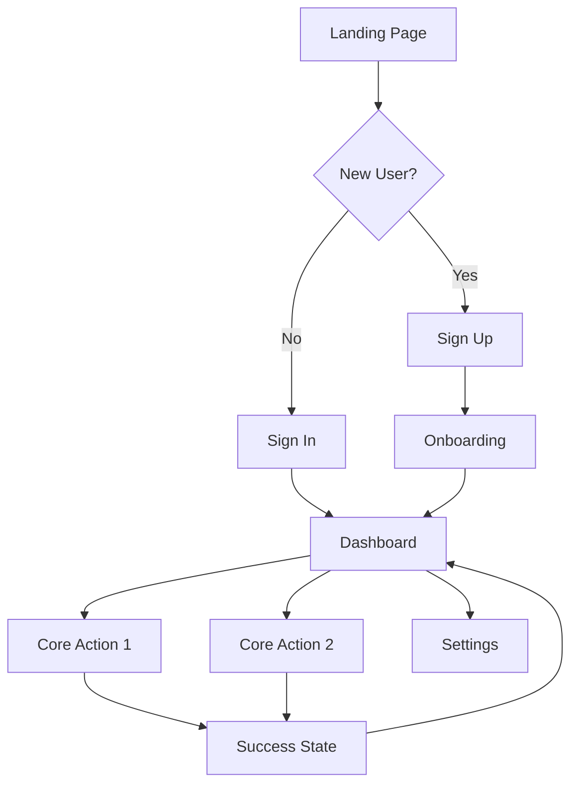

# Generate MVP Concept Command

Structure comprehensive app concepts with elevator pitches, core features, and user flows for rapid MVP development.

## Command Usage
```bash
clause --project UIDesignOrchestrator/project:generate-mvp-concept "app description"
```

## Process Flow

### 1. Concept Crystallization
```yaml
mvp_definition:
  elevator_pitch: |
    [Product Name] helps [target users] achieve [core value]
    by [unique approach] unlike [alternatives].
    
  example: |
    TaskFlow helps busy professionals manage their workload
    by using AI to automatically prioritize and schedule tasks
    unlike traditional to-do apps that require manual organization.
    
  constraints:
    - Maximum 25 words
    - Clear value proposition
    - Specific target audience
    - Unique differentiator
```

### 2. Feature Prioritization
```javascript
const mvpFeatures = {
  core: {
    // Absolutely essential for MVP
    priority: "P0",
    features: [
      {
        name: "User Authentication",
        description: "Secure sign-up/login with email",
        effort: "S",
        impact: "Critical"
      },
      {
        name: "Core Workflow",
        description: "Primary value-delivering functionality",
        effort: "L",
        impact: "Critical"
      },
      {
        name: "Basic Dashboard",
        description: "Central hub for user actions",
        effort: "M",
        impact: "Critical"
      }
    ]
  },
  
  nice_to_have: {
    // Enhance experience but not critical
    priority: "P1",
    features: [
      {
        name: "Advanced Filters",
        description: "Refined data viewing options",
        effort: "M",
        impact: "High"
      },
      {
        name: "Integrations",
        description: "Third-party service connections",
        effort: "L",
        impact: "Medium"
      }
    ]
  },
  
  future: {
    // Post-MVP roadmap
    priority: "P2",
    features: [
      {
        name: "AI Recommendations",
        description: "Smart suggestions based on usage",
        effort: "XL",
        impact: "High"
      }
    ]
  }
};
```

### 3. User Flow Mapping


### 4. Screen Inventory
```javascript
const screenMap = {
  marketing: {
    landing: {
      purpose: "Convert visitors to users",
      elements: ["Hero", "Features", "Testimonials", "CTA"],
      conversion_points: 3
    },
    pricing: {
      purpose: "Clear value communication",
      elements: ["Plan comparison", "FAQs", "Guarantee"],
      conversion_points: 2
    }
  },
  
  authentication: {
    signup: {
      fields: ["Email", "Password", "Name"],
      validations: ["Email format", "Password strength"],
      social_options: ["Google", "GitHub"]
    },
    signin: {
      fields: ["Email", "Password"],
      features: ["Remember me", "Forgot password"],
      security: "2FA optional"
    }
  },
  
  application: {
    dashboard: {
      widgets: ["Stats overview", "Recent activity", "Quick actions"],
      personalization: "User preference based",
      refresh_rate: "Real-time"
    },
    core_feature: {
      layout: "Focus on primary action",
      guidance: "Inline help and tooltips",
      states: ["Empty", "Loading", "Active", "Error"]
    }
  }
};
```

### 5. Technical Considerations
```yaml
technical_requirements:
  platforms:
    primary: "Responsive Web"
    secondary: "Mobile Web"
    future: "Native Apps"
    
  performance:
    initial_load: "< 3 seconds"
    interaction: "< 100ms response"
    offline: "Basic functionality"
    
  scale:
    initial_users: 1000
    growth_target: "10x in 6 months"
    architecture: "Scalable from day 1"
    
  integrations:
    authentication: "Auth0 or Firebase"
    payments: "Stripe"
    analytics: "Mixpanel + Google Analytics"
    support: "Intercom"
```

### 6. Success Metrics
```javascript
const successMetrics = {
  acquisition: {
    metric: "Sign-up conversion",
    target: "5%",
    measurement: "Landing to registration"
  },
  
  activation: {
    metric: "First core action",
    target: "80% within 24h",
    measurement: "Time to value"
  },
  
  retention: {
    metric: "7-day active",
    target: "60%",
    measurement: "Daily active users"
  },
  
  revenue: {
    metric: "Trial to paid",
    target: "15%",
    measurement: "Conversion rate"
  },
  
  referral: {
    metric: "User invites",
    target: "20% send invites",
    measurement: "Viral coefficient"
  }
};
```

## Output Structure

### Complete MVP Blueprint
```markdown
# MVP Concept: [App Name]

## Executive Summary
**Elevator Pitch**: [25-word pitch]
**Target Launch**: 8 weeks
**Core Value**: [Primary user benefit]

## User Personas
### Primary: [Persona Name]
- Demographics: [Age, role, location]
- Pain Points: [Top 3 problems]
- Goals: [What they want to achieve]
- Current Solutions: [What they use now]

## Feature Set
### MVP (Week 1-8)
- [ ] User authentication
- [ ] Core feature 1
- [ ] Core feature 2
- [ ] Basic dashboard

### Phase 2 (Week 9-16)
- [ ] Enhanced features
- [ ] Integrations
- [ ] Advanced analytics

## User Journey
1. **Discovery**: How users find the app
2. **Onboarding**: First experience flow
3. **Activation**: Path to first value
4. **Habit Formation**: Daily/weekly usage
5. **Expansion**: Growing usage

## Technical Architecture
- Frontend: [Framework choice]
- Backend: [API approach]
- Database: [Data structure]
- Hosting: [Infrastructure]

## Design Direction
- Style: [Modern, minimal, playful, etc.]
- Colors: [Primary palette]
- Typography: [Font choices]
- Key Patterns: [UI patterns to use]

## Go-to-Market
- Launch Strategy: [Soft launch, beta, public]
- Marketing Channels: [Primary acquisition]
- Pricing Model: [Freemium, trial, etc.]

## Success Criteria
- Week 1: 100 signups
- Month 1: 1,000 active users
- Month 3: 15% paid conversion
- Month 6: Break even
```

### Interactive Prototype Map
```javascript
const prototypeFlow = {
  entryPoints: ["Landing", "Direct invite", "App store"],
  
  criticalPath: [
    "Landing",
    "Sign up",
    "Onboarding (3 steps)",
    "Dashboard",
    "First action",
    "Success feedback"
  ],
  
  branches: {
    "Returning user": ["Sign in", "Dashboard"],
    "Power user": ["Dashboard", "Advanced feature"],
    "Error recovery": ["Error state", "Help", "Resolution"]
  }
};
```

## Integration with Other Commands

### DNA Application
```bash
# Apply extracted design DNA to MVP
clause --project UIDesignOrchestrator/project:fuse-style-concept
```

### Screen Generation
```bash
# Generate UI variations for MVP screens
clause --project UIDesignOrchestrator/project:create-ui-variations "dashboard, onboarding, core-feature"
```

## Advanced Options

### Industry Templates
```javascript
const industryTemplates = {
  saas: {
    features: ["Dashboard", "Analytics", "Team management"],
    metrics: ["MRR", "Churn", "CAC"]
  },
  marketplace: {
    features: ["Listings", "Search", "Transactions"],
    metrics: ["GMV", "Take rate", "Liquidity"]
  },
  social: {
    features: ["Profiles", "Feed", "Messaging"],
    metrics: ["DAU", "Engagement", "K-factor"]
  }
};
```

## Tool Integration

| Step | Action | Tool to Use | Purpose |
|------|--------|-------------|----------|
| 1. Research domain | Understand context | `search_file_content("similar")` | Find existing patterns |
| 2. Generate concept | Create MVP structure | None (internal) | Build concept model |
| 3. Present concept | Show in response | None | Display MVP definition |
| 4. Save concept | Store definition | `write_file("mvp-concept.json")` (if requested) | Persist concept |
| 5. Create roadmap | Generate timeline | `write_file("roadmap.md")` (if requested) | Project planning |
| 6. Init structure | Create folders | `run_shell_command("mkdir -p")` | Setup project |

### Tool Usage Examples
```javascript
// Step 1: Research existing patterns
const existingProjects = search_file_content("dashboard", "src/");
const hasimilarFeatures = analyzeSimilarProjects(existingProjects);

// Step 2-3: Generate and present concept
const mvpConcept = generateMVPConcept({
  description: userDescription,
  existingPatterns: similarFeatures,
  constraints: projectConstraints
});
presentMVPConcept(mvpConcept);

// Step 4: Save concept definition
if (userWantsSave) {
  write_file("project/mvp-concept.json", JSON.stringify(mvpConcept, null, 2));
  write_file("project/mvp-summary.md", generateConceptSummary(mvpConcept));
}

// Step 6: Initialize project structure
if (userWantsInit) {
  run_shell_command("mkdir -p src/components src/screens src/services");
  write_file("src/screens/index.js", generateScreenIndex(mvpConcept.screens));
}
```

### Complexity Levels
```yaml
mvp_complexity:
  simple:
    screens: 5-10
    features: 3-5
    timeline: 4-6 weeks
    
  moderate:
    screens: 10-20
    features: 5-10
    timeline: 6-10 weeks
    
  complex:
    screens: 20+
    features: 10+
    timeline: 10-16 weeks
```

---

*Generate MVP Concept v1.0 | Product definition command | Rapid conceptualization*