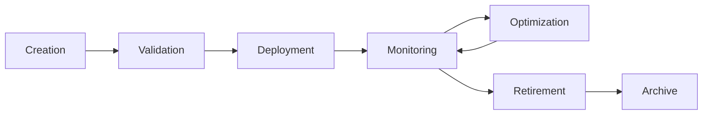

# Pattern Lifecycle Management

Comprehensive lifecycle management system for AI reasoning patterns, designed to handle hundreds of patterns efficiently with automated optimization and maintenance.

## Lifecycle Overview



## Lifecycle Stages

### 1. Pattern Creation

```javascript
const patternCreation = {
  // Pattern factory with validation
  createPattern: async (definition) => {
    const pattern = {
      id: generatePatternId(definition.name),
      version: '1.0.0',
      created: Date.now(),
      status: 'draft',
      metadata: {
        author: definition.author,
        domain: definition.domain,
        complexity: definition.complexity,
        tags: definition.tags || [],
        dependencies: definition.dependencies || []
      },
      content: definition.content,
      performance: {
        baseline: null,
        current: null,
        history: []
      }
    };
    
    // Validate pattern structure
    const validation = await validatePattern(pattern);
    if (!validation.valid) {
      throw new Error(`Pattern validation failed: ${validation.errors.join(', ')}`);
    }
    
    // Initialize performance baseline
    pattern.performance.baseline = await establishBaseline(pattern);
    
    return pattern;
  },
  
  // Pattern templates for common use cases
  templates: {
    simpleTask: {
      structure: 'linear',
      steps: ['analyze', 'execute', 'verify'],
      complexity: 'low'
    },
    complexAnalysis: {
      structure: 'iterative',
      steps: ['discover', 'analyze', 'synthesize', 'validate'],
      complexity: 'high'
    },
    multiAgent: {
      structure: 'parallel',
      steps: ['distribute', 'coordinate', 'merge', 'finalize'],
      complexity: 'very-high'
    }
  }
};
```

### 2. Pattern Validation

```javascript
const patternValidation = {
  // Multi-level validation system
  validators: {
    structural: (pattern) => {
      const required = ['id', 'version', 'content', 'metadata'];
      const missing = required.filter(field => !pattern[field]);
      return {
        valid: missing.length === 0,
        errors: missing.map(field => `Missing required field: ${field}`)
      };
    },
    
    performance: async (pattern) => {
      const testResults = await runPerformanceTests(pattern);
      const thresholds = getPerformanceThresholds(pattern.metadata.complexity);
      
      return {
        valid: testResults.executionTime < thresholds.maxTime &&
               testResults.memoryUsage < thresholds.maxMemory,
        metrics: testResults,
        errors: []
      };
    },
    
    compatibility: (pattern) => {
      const conflicts = [];
      
      // Check for conflicting patterns
      for (const dep of pattern.metadata.dependencies) {
        const depPattern = patternRegistry.get(dep);
        if (depPattern && hasConflict(pattern, depPattern)) {
          conflicts.push(`Conflict with dependency: ${dep}`);
        }
      }
      
      return {
        valid: conflicts.length === 0,
        errors: conflicts
      };
    }
  },
  
  // Automated validation pipeline
  validatePattern: async (pattern) => {
    const results = {
      structural: patternValidation.validators.structural(pattern),
      performance: await patternValidation.validators.performance(pattern),
      compatibility: patternValidation.validators.compatibility(pattern)
    };
    
    return {
      valid: Object.values(results).every(r => r.valid),
      results,
      score: calculateValidationScore(results)
    };
  }
};
```

### 3. Pattern Deployment

```javascript
const patternDeployment = {
  // Staged deployment system
  deploymentStages: {
    canary: {
      traffic: 0.05,  // 5% of traffic
      duration: '1h',
      rollbackThreshold: 0.1  // 10% error rate
    },
    beta: {
      traffic: 0.20,  // 20% of traffic
      duration: '24h',
      rollbackThreshold: 0.05
    },
    production: {
      traffic: 1.0,   // 100% of traffic
      duration: 'permanent',
      rollbackThreshold: 0.02
    }
  },
  
  // Deployment orchestrator
  deploy: async (pattern, stage = 'canary') => {
    const deployment = {
      patternId: pattern.id,
      version: pattern.version,
      stage: stage,
      startTime: Date.now(),
      metrics: {
        requests: 0,
        errors: 0,
        avgResponseTime: 0
      }
    };
    
    // Register deployment
    await deploymentRegistry.register(deployment);
    
    // Configure traffic routing
    await trafficRouter.configure({
      pattern: pattern.id,
      percentage: patternDeployment.deploymentStages[stage].traffic
    });
    
    // Schedule health checks
    scheduleHealthChecks(deployment);
    
    // Set up automatic promotion/rollback
    scheduleStageTransition(deployment);
    
    return deployment;
  },
  
  // Blue-green deployment for zero downtime
  blueGreenDeploy: async (pattern) => {
    // Deploy to green environment
    const greenDeployment = await deployToEnvironment('green', pattern);
    
    // Run smoke tests
    const smokeTestResults = await runSmokeTests(greenDeployment);
    
    if (smokeTestResults.passed) {
      // Switch traffic
      await trafficRouter.switchToGreen();
      
      // Monitor for issues
      const monitoring = await monitorDeployment(greenDeployment, '5m');
      
      if (monitoring.healthy) {
        // Make green the new blue
        await promoteGreenToBlue();
      } else {
        // Rollback
        await trafficRouter.switchToBlue();
      }
    }
    
    return greenDeployment;
  }
};
```

### 4. Pattern Monitoring

```javascript
const patternMonitoring = {
  // Real-time metrics collection
  metrics: {
    performance: {
      executionTime: new CircularBuffer(1000),
      throughput: new CircularBuffer(1000),
      latency: new CircularBuffer(1000),
      errorRate: new CircularBuffer(1000)
    },
    
    resource: {
      cpuUsage: new CircularBuffer(1000),
      memoryUsage: new CircularBuffer(1000),
      diskIO: new CircularBuffer(1000),
      networkIO: new CircularBuffer(1000)
    },
    
    quality: {
      userSatisfaction: new CircularBuffer(100),
      taskCompletionRate: new CircularBuffer(100),
      patternSwitchRate: new CircularBuffer(100)
    }
  },
  
  // Monitoring dashboards
  dashboards: {
    overview: {
      updateInterval: 1000,  // 1 second
      widgets: [
        'activePatterns',
        'requestsPerSecond',
        'averageLatency',
        'errorRate'
      ]
    },
    
    detailed: {
      updateInterval: 5000,  // 5 seconds
      widgets: [
        'patternPerformanceMatrix',
        'resourceUtilization',
        'qualityMetrics',
        'alertsAndWarnings'
      ]
    }
  },
  
  // Anomaly detection
  anomalyDetection: {
    algorithms: {
      statistical: (metrics) => {
        const mean = calculateMean(metrics);
        const stdDev = calculateStdDev(metrics);
        const threshold = mean + (3 * stdDev);
        
        return metrics.filter(m => m > threshold);
      },
      
      machineLeaning: (metrics) => {
        return anomalyModel.predict(metrics);
      },
      
      rulebased: (metrics) => {
        const rules = [
          { metric: 'errorRate', operator: '>', value: 0.05 },
          { metric: 'latency', operator: '>', value: 2000 },
          { metric: 'memoryUsage', operator: '>', value: 0.9 }
        ];
        
        return checkRules(metrics, rules);
      }
    },
    
    detectAnomalies: (pattern) => {
      const metrics = collectMetrics(pattern);
      const anomalies = [];
      
      for (const [algorithm, detector] of Object.entries(anomalyDetection.algorithms)) {
        const detected = detector(metrics);
        if (detected.length > 0) {
          anomalies.push({ algorithm, detected });
        }
      }
      
      return anomalies;
    }
  },
  
  // Alerting system
  alerting: {
    channels: ['email', 'slack', 'pagerduty'],
    
    rules: [
      {
        name: 'HighErrorRate',
        condition: 'errorRate > 0.05',
        severity: 'critical',
        channels: ['pagerduty', 'slack']
      },
      {
        name: 'HighLatency',
        condition: 'p99Latency > 5000',
        severity: 'warning',
        channels: ['slack']
      },
      {
        name: 'LowThroughput',
        condition: 'throughput < 100',
        severity: 'info',
        channels: ['email']
      }
    ],
    
    sendAlert: async (alert) => {
      for (const channel of alert.channels) {
        await alertChannels[channel].send({
          pattern: alert.pattern,
          rule: alert.rule,
          severity: alert.severity,
          metrics: alert.metrics,
          timestamp: Date.now()
        });
      }
    }
  }
};
```

### 5. Pattern Retirement

```javascript
const patternRetirement = {
  // Retirement criteria
  criteria: {
    performance: {
      consecutiveFailures: 10,
      errorRateThreshold: 0.2,
      underutilizationDays: 30
    },
    
    quality: {
      userSatisfactionThreshold: 2.0,  // out of 5
      replacementAvailable: true
    },
    
    maintenance: {
      lastUpdateDays: 180,
      securityVulnerabilities: 0,
      deprecatedDependencies: 0
    }
  },
  
  // Retirement process
  retirePattern: async (pattern, reason) => {
    const retirement = {
      patternId: pattern.id,
      version: pattern.version,
      reason: reason,
      startDate: Date.now(),
      status: 'pending'
    };
    
    // Phase 1: Mark as deprecated
    pattern.status = 'deprecated';
    await notifyUsers(pattern, 'Pattern will be retired in 30 days');
    
    // Phase 2: Redirect traffic
    await scheduleTask(7 * 24 * 60 * 60 * 1000, async () => {
      await trafficRouter.redirectPattern(pattern.id, pattern.replacement);
    });
    
    // Phase 3: Disable pattern
    await scheduleTask(30 * 24 * 60 * 60 * 1000, async () => {
      pattern.status = 'retired';
      await disablePattern(pattern.id);
    });
    
    // Phase 4: Archive
    await scheduleTask(90 * 24 * 60 * 60 * 1000, async () => {
      await archivePattern(pattern);
      await cleanupResources(pattern);
    });
    
    return retirement;
  },
  
  // Graceful migration
  migrateUsers: async (oldPattern, newPattern) => {
    const migration = {
      from: oldPattern.id,
      to: newPattern.id,
      startTime: Date.now(),
      progress: 0
    };
    
    // Get active users
    const activeUsers = await getActiveUsers(oldPattern.id);
    
    // Migrate in batches
    const batchSize = 100;
    for (let i = 0; i < activeUsers.length; i += batchSize) {
      const batch = activeUsers.slice(i, i + batchSize);
      
      await Promise.all(batch.map(user => 
        migrateUser(user, oldPattern.id, newPattern.id)
      ));
      
      migration.progress = (i + batchSize) / activeUsers.length;
      await updateMigrationStatus(migration);
    }
    
    return migration;
  }
};
```

## Performance Metrics & Thresholds

```javascript
const performanceMetrics = {
  // Metric definitions
  metrics: {
    latency: {
      unit: 'ms',
      aggregations: ['p50', 'p95', 'p99', 'max'],
      thresholds: {
        good: { p50: 100, p95: 500, p99: 1000 },
        acceptable: { p50: 200, p95: 1000, p99: 2000 },
        poor: { p50: 500, p95: 2000, p99: 5000 }
      }
    },
    
    throughput: {
      unit: 'requests/second',
      aggregations: ['avg', 'peak'],
      thresholds: {
        good: { avg: 1000, peak: 5000 },
        acceptable: { avg: 500, peak: 2000 },
        poor: { avg: 100, peak: 500 }
      }
    },
    
    errorRate: {
      unit: 'percentage',
      aggregations: ['avg', 'max'],
      thresholds: {
        good: { avg: 0.001, max: 0.01 },
        acceptable: { avg: 0.01, max: 0.05 },
        poor: { avg: 0.05, max: 0.1 }
      }
    },
    
    resourceEfficiency: {
      unit: 'score',
      calculation: 'throughput / (cpu + memory)',
      thresholds: {
        good: 0.8,
        acceptable: 0.5,
        poor: 0.2
      }
    }
  },
  
  // SLA management
  sla: {
    targets: {
      availability: 0.999,      // 99.9%
      latencyP99: 1000,        // 1 second
      errorRate: 0.001         // 0.1%
    },
    
    calculateCompliance: (metrics) => {
      const compliance = {
        availability: metrics.uptime / metrics.totalTime,
        latency: metrics.latencyP99 <= sla.targets.latencyP99,
        errors: metrics.errorRate <= sla.targets.errorRate
      };
      
      compliance.overall = Object.values(compliance).every(v => v === true);
      return compliance;
    }
  },
  
  // Performance scoring
  scorePattern: (pattern, metrics) => {
    const weights = {
      latency: 0.3,
      throughput: 0.3,
      errorRate: 0.2,
      efficiency: 0.2
    };
    
    const scores = {
      latency: calculateLatencyScore(metrics.latency),
      throughput: calculateThroughputScore(metrics.throughput),
      errorRate: calculateErrorScore(metrics.errorRate),
      efficiency: calculateEfficiencyScore(metrics)
    };
    
    return Object.entries(weights).reduce((total, [metric, weight]) => 
      total + (scores[metric] * weight), 0
    );
  }
};
```

## Load Balancing Strategies

```javascript
const loadBalancing = {
  // Load balancing algorithms
  algorithms: {
    // Round-robin with weights
    weightedRoundRobin: {
      weights: new Map(),
      current: 0,
      
      selectPattern: (patterns) => {
        const weighted = [];
        
        for (const pattern of patterns) {
          const weight = loadBalancing.algorithms.weightedRoundRobin.weights.get(pattern.id) || 1;
          for (let i = 0; i < weight; i++) {
            weighted.push(pattern);
          }
        }
        
        const selected = weighted[loadBalancing.algorithms.weightedRoundRobin.current % weighted.length];
        loadBalancing.algorithms.weightedRoundRobin.current++;
        
        return selected;
      },
      
      updateWeights: (metrics) => {
        for (const [patternId, patternMetrics] of metrics) {
          const score = performanceMetrics.scorePattern(patternId, patternMetrics);
          const weight = Math.ceil(score * 10);
          loadBalancing.algorithms.weightedRoundRobin.weights.set(patternId, weight);
        }
      }
    },
    
    // Least connections
    leastConnections: {
      connections: new Map(),
      
      selectPattern: (patterns) => {
        let minConnections = Infinity;
        let selected = null;
        
        for (const pattern of patterns) {
          const connections = loadBalancing.algorithms.leastConnections.connections.get(pattern.id) || 0;
          if (connections < minConnections) {
            minConnections = connections;
            selected = pattern;
          }
        }
        
        // Increment connection count
        loadBalancing.algorithms.leastConnections.connections.set(
          selected.id, 
          minConnections + 1
        );
        
        return selected;
      },
      
      releaseConnection: (patternId) => {
        const current = loadBalancing.algorithms.leastConnections.connections.get(patternId) || 0;
        loadBalancing.algorithms.leastConnections.connections.set(patternId, Math.max(0, current - 1));
      }
    },
    
    // Adaptive load balancing
    adaptive: {
      history: new Map(),
      
      selectPattern: (patterns, task) => {
        const scores = new Map();
        
        for (const pattern of patterns) {
          // Calculate composite score
          const performanceScore = calculateRecentPerformance(pattern.id);
          const affinityScore = calculateTaskAffinity(pattern, task);
          const loadScore = calculateCurrentLoad(pattern.id);
          
          const totalScore = (performanceScore * 0.4) + 
                           (affinityScore * 0.4) + 
                           ((1 - loadScore) * 0.2);
          
          scores.set(pattern, totalScore);
        }
        
        // Select pattern with highest score
        return Array.from(scores.entries())
          .sort((a, b) => b[1] - a[1])[0][0];
      }
    }
  },
  
  // Circuit breaker for pattern health
  circuitBreaker: {
    states: new Map(),  // patternId -> { state, failures, lastFailure }
    
    thresholds: {
      failureCount: 5,
      failureWindow: 60000,    // 1 minute
      halfOpenDelay: 30000     // 30 seconds
    },
    
    checkHealth: (patternId) => {
      const state = loadBalancing.circuitBreaker.states.get(patternId) || 
                    { state: 'closed', failures: 0, lastFailure: 0 };
      
      if (state.state === 'open') {
        // Check if we should try half-open
        if (Date.now() - state.lastFailure > loadBalancing.circuitBreaker.thresholds.halfOpenDelay) {
          state.state = 'half-open';
        }
      }
      
      return state.state !== 'open';
    },
    
    recordSuccess: (patternId) => {
      const state = loadBalancing.circuitBreaker.states.get(patternId);
      if (state) {
        state.failures = 0;
        state.state = 'closed';
      }
    },
    
    recordFailure: (patternId) => {
      const state = loadBalancing.circuitBreaker.states.get(patternId) || 
                    { state: 'closed', failures: 0, lastFailure: 0 };
      
      state.failures++;
      state.lastFailure = Date.now();
      
      if (state.failures >= loadBalancing.circuitBreaker.thresholds.failureCount) {
        state.state = 'open';
      }
      
      loadBalancing.circuitBreaker.states.set(patternId, state);
    }
  }
};
```

## Pattern Versioning & Migration

```javascript
const versioningSystem = {
  // Semantic versioning
  version: {
    parse: (version) => {
      const [major, minor, patch] = version.split('.').map(Number);
      return { major, minor, patch };
    },
    
    compare: (v1, v2) => {
      const p1 = versioningSystem.version.parse(v1);
      const p2 = versioningSystem.version.parse(v2);
      
      if (p1.major !== p2.major) return p1.major - p2.major;
      if (p1.minor !== p2.minor) return p1.minor - p2.minor;
      return p1.patch - p2.patch;
    },
    
    increment: (version, type = 'patch') => {
      const parsed = versioningSystem.version.parse(version);
      
      switch (type) {
        case 'major':
          return `${parsed.major + 1}.0.0`;
        case 'minor':
          return `${parsed.major}.${parsed.minor + 1}.0`;
        case 'patch':
          return `${parsed.major}.${parsed.minor}.${parsed.patch + 1}`;
      }
    }
  },
  
  // Version compatibility matrix
  compatibility: {
    rules: [
      { from: '1.x.x', to: '2.0.0', compatible: false, migration: 'required' },
      { from: '1.2.x', to: '1.3.0', compatible: true, migration: 'optional' },
      { from: '1.x.x', to: '1.x.y', compatible: true, migration: 'none' }
    ],
    
    checkCompatibility: (currentVersion, targetVersion) => {
      for (const rule of versioningSystem.compatibility.rules) {
        if (matchesVersionPattern(currentVersion, rule.from) &&
            matchesVersionPattern(targetVersion, rule.to)) {
          return rule;
        }
      }
      
      return { compatible: false, migration: 'unknown' };
    }
  },
  
  // Migration strategies
  migration: {
    strategies: {
      inPlace: async (pattern, fromVersion, toVersion) => {
        // Update pattern in place
        const migrated = await applyMigration(pattern, fromVersion, toVersion);
        migrated.version = toVersion;
        await savePattern(migrated);
        return migrated;
      },
      
      sideBySide: async (pattern, fromVersion, toVersion) => {
        // Create new version alongside old
        const newPattern = { ...pattern };
        newPattern.id = `${pattern.id}_v${toVersion}`;
        newPattern.version = toVersion;
        
        await applyMigration(newPattern, fromVersion, toVersion);
        await savePattern(newPattern);
        
        // Gradual traffic shift
        await scheduleTrafficShift(pattern.id, newPattern.id, '7d');
        
        return newPattern;
      },
      
      blueGreen: async (pattern, fromVersion, toVersion) => {
        // Full environment switch
        const newPattern = await versioningSystem.migration.strategies.sideBySide(
          pattern, fromVersion, toVersion
        );
        
        // Immediate switch after validation
        await validatePattern(newPattern);
        await switchTraffic(pattern.id, newPattern.id);
        
        return newPattern;
      }
    },
    
    // Migration execution
    executeMigration: async (pattern, targetVersion) => {
      const compatibility = versioningSystem.compatibility.checkCompatibility(
        pattern.version, targetVersion
      );
      
      if (!compatibility.compatible && compatibility.migration === 'required') {
        const strategy = selectMigrationStrategy(pattern, targetVersion);
        return await versioningSystem.migration.strategies[strategy](
          pattern, pattern.version, targetVersion
        );
      }
      
      return pattern;
    }
  }
};
```

## Garbage Collection

```javascript
const garbageCollection = {
  // GC configuration
  config: {
    runInterval: 24 * 60 * 60 * 1000,  // Daily
    retentionPeriods: {
      active: Infinity,
      deprecated: 90 * 24 * 60 * 60 * 1000,     // 90 days
      retired: 30 * 24 * 60 * 60 * 1000,        // 30 days
      archived: 365 * 24 * 60 * 60 * 1000       // 1 year
    },
    
    thresholds: {
      unusedPatternDays: 30,
      lowUsageThreshold: 10,  // requests per day
      cacheEvictionSize: 0.8  // 80% capacity
    }
  },
  
  // Pattern usage tracking
  usageTracker: {
    lastUsed: new Map(),
    usageCount: new Map(),
    
    recordUsage: (patternId) => {
      garbageCollection.usageTracker.lastUsed.set(patternId, Date.now());
      const count = garbageCollection.usageTracker.usageCount.get(patternId) || 0;
      garbageCollection.usageTracker.usageCount.set(patternId, count + 1);
    },
    
    getUnusedPatterns: (days) => {
      const threshold = Date.now() - (days * 24 * 60 * 60 * 1000);
      const unused = [];
      
      for (const [patternId, lastUsed] of garbageCollection.usageTracker.lastUsed) {
        if (lastUsed < threshold) {
          unused.push({
            patternId,
            lastUsed,
            daysSinceUse: Math.floor((Date.now() - lastUsed) / (24 * 60 * 60 * 1000))
          });
        }
      }
      
      return unused;
    }
  },
  
  // Cleanup strategies
  cleanup: {
    // Remove unused patterns
    removeUnused: async () => {
      const unused = garbageCollection.usageTracker.getUnusedPatterns(
        garbageCollection.config.thresholds.unusedPatternDays
      );
      
      for (const { patternId, daysSinceUse } of unused) {
        const pattern = await getPattern(patternId);
        
        if (pattern.status === 'active' && daysSinceUse > 30) {
          // Mark as candidate for removal
          await markForReview(pattern, 'unused');
        } else if (pattern.status === 'deprecated' && daysSinceUse > 90) {
          // Retire deprecated patterns
          await patternRetirement.retirePattern(pattern, 'unused');
        }
      }
    },
    
    // Clean up old versions
    cleanVersions: async () => {
      const patterns = await getAllPatterns();
      const versionGroups = groupByBasePattern(patterns);
      
      for (const [baseId, versions] of versionGroups) {
        // Sort by version
        versions.sort((a, b) => 
          versioningSystem.version.compare(b.version, a.version)
        );
        
        // Keep latest 3 versions
        const toRemove = versions.slice(3);
        
        for (const oldVersion of toRemove) {
          if (oldVersion.status === 'retired') {
            await archivePattern(oldVersion);
          }
        }
      }
    },
    
    // Memory cache management
    manageCaches: async () => {
      const cacheStats = {
        patternCache: getCacheStats('patterns'),
        indexCache: getCacheStats('indexes'),
        metricsCache: getCacheStats('metrics')
      };
      
      // Evict based on LRU when approaching threshold
      for (const [cacheName, stats] of Object.entries(cacheStats)) {
        if (stats.usage > garbageCollection.config.thresholds.cacheEvictionSize) {
          const evictionTarget = Math.floor(stats.size * 0.2);  // Evict 20%
          await evictLRU(cacheName, evictionTarget);
        }
      }
    },
    
    // Archive old data
    archiveHistorical: async () => {
      const archives = [
        { type: 'metrics', retention: 30 },
        { type: 'logs', retention: 7 },
        { type: 'traces', retention: 3 }
      ];
      
      for (const archive of archives) {
        const cutoff = Date.now() - (archive.retention * 24 * 60 * 60 * 1000);
        await archiveDataOlderThan(archive.type, cutoff);
      }
    }
  },
  
  // GC scheduler
  scheduler: {
    jobs: [
      { name: 'removeUnused', interval: '1d', priority: 'low' },
      { name: 'cleanVersions', interval: '7d', priority: 'medium' },
      { name: 'manageCaches', interval: '1h', priority: 'high' },
      { name: 'archiveHistorical', interval: '1d', priority: 'low' }
    ],
    
    start: () => {
      for (const job of garbageCollection.scheduler.jobs) {
        scheduleJob(job.name, job.interval, () => 
          garbageCollection.cleanup[job.name]()
        );
      }
    }
  }
};
```

## Optimization Algorithms

```javascript
const optimizationAlgorithms = {
  // Pattern selection optimization
  selectionOptimizer: {
    // Genetic algorithm for pattern combination
    genetic: {
      population: [],
      
      evolve: (task, generations = 50) => {
        // Initialize population
        optimizationAlgorithms.selectionOptimizer.genetic.population = 
          generateInitialPopulation(task, 100);
        
        for (let gen = 0; gen < generations; gen++) {
          // Evaluate fitness
          const evaluated = optimizationAlgorithms.selectionOptimizer.genetic.population
            .map(combo => ({
              combo,
              fitness: evaluatePatternCombination(combo, task)
            }))
            .sort((a, b) => b.fitness - a.fitness);
          
          // Select top performers
          const elite = evaluated.slice(0, 20);
          
          // Crossover and mutation
          const newPopulation = [...elite.map(e => e.combo)];
          
          while (newPopulation.length < 100) {
            const parent1 = selectParent(elite);
            const parent2 = selectParent(elite);
            const child = crossover(parent1.combo, parent2.combo);
            
            if (Math.random() < 0.1) {
              mutate(child);
            }
            
            newPopulation.push(child);
          }
          
          optimizationAlgorithms.selectionOptimizer.genetic.population = newPopulation;
        }
        
        return optimizationAlgorithms.selectionOptimizer.genetic.population[0];
      }
    },
    
    // Simulated annealing for local optimization
    simulatedAnnealing: {
      optimize: (currentSolution, task) => {
        let current = currentSolution;
        let currentCost = calculateCost(current, task);
        let temperature = 1000;
        const coolingRate = 0.95;
        
        while (temperature > 1) {
          // Generate neighbor
          const neighbor = generateNeighbor(current);
          const neighborCost = calculateCost(neighbor, task);
          
          // Accept or reject
          const delta = neighborCost - currentCost;
          
          if (delta < 0 || Math.random() < Math.exp(-delta / temperature)) {
            current = neighbor;
            currentCost = neighborCost;
          }
          
          temperature *= coolingRate;
        }
        
        return current;
      }
    }
  },
  
  // Resource allocation optimization
  resourceOptimizer: {
    // Linear programming for resource allocation
    allocateResources: (patterns, constraints) => {
      const model = {
        optimize: 'performance',
        opType: 'max',
        constraints: {
          memory: { max: constraints.totalMemory },
          cpu: { max: constraints.totalCPU },
          patterns: { max: constraints.maxPatterns }
        },
        variables: {}
      };
      
      // Define variables for each pattern
      patterns.forEach(pattern => {
        model.variables[pattern.id] = {
          performance: pattern.performanceScore,
          memory: pattern.memoryUsage,
          cpu: pattern.cpuUsage,
          patterns: 1
        };
      });
      
      // Solve
      const solution = solver.Solve(model);
      
      return Object.entries(solution)
        .filter(([key, value]) => key !== 'feasible' && key !== 'result' && value > 0)
        .map(([patternId, allocation]) => ({ patternId, allocation }));
    }
  }
};
```

## Integration Points

```javascript
const integrationPoints = {
  // API endpoints for lifecycle management
  api: {
    '/patterns/create': { method: 'POST', handler: patternCreation.createPattern },
    '/patterns/:id/deploy': { method: 'POST', handler: patternDeployment.deploy },
    '/patterns/:id/metrics': { method: 'GET', handler: patternMonitoring.getMetrics },
    '/patterns/:id/retire': { method: 'POST', handler: patternRetirement.retirePattern },
    '/patterns/gc/run': { method: 'POST', handler: garbageCollection.runCleanup }
  },
  
  // Event hooks
  hooks: {
    beforeCreate: [],
    afterCreate: [],
    beforeDeploy: [],
    afterDeploy: [],
    onPerformanceThreshold: [],
    onRetirement: []
  },
  
  // Metrics export
  exporters: {
    prometheus: {
      endpoint: '/metrics',
      format: 'prometheus'
    },
    cloudwatch: {
      namespace: 'PatternLifecycle',
      dimensions: ['PatternId', 'Version', 'Stage']
    }
  }
};
```

---

*Pattern Lifecycle Management v1.0 | Scalable pattern orchestration | Enterprise-grade lifecycle automation*