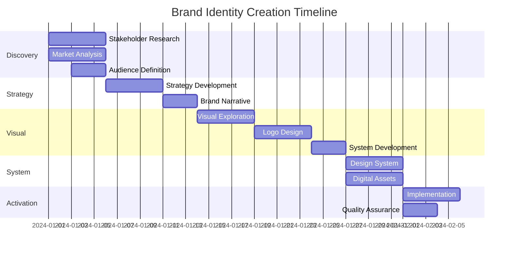

# Brand Identity Creation Workflow

Comprehensive brand development process from strategy to visual identity, creating cohesive brand systems with multi-agent orchestration.

## Workflow Overview

```
DISCOVERY → STRATEGY → VISUAL IDENTITY → SYSTEM → ACTIVATION
```

## Phase 1: Brand Discovery (Week 1)

### Stakeholder Research
```javascript
const brandDiscovery = {
  lead: 'brand-strategist',
  support: ['ux-researcher', 'design-analyst'],
  
  stakeholderInterviews: {
    participants: [
      'Founders/Leadership',
      'Key employees',
      'Current customers',
      'Target customers',
      'Partners/Investors'
    ],
    
    questions: {
      vision: [
        'What inspired this company?',
        'Where do you see it in 5 years?',
        'What change do you want to create?'
      ],
      values: [
        'What principles guide decisions?',
        'What would you never compromise?',
        'How should people feel about the brand?'
      ],
      differentiation: [
        'What makes you unique?',
        'Why choose you over alternatives?',
        'What do you do differently?'
      ]
    },
    
    process: async () => {
      const interviews = await conductInterviews();
      const themes = await extractThemes(interviews);
      
      // Check for conflicting visions among stakeholders
      const conflicts = conflictResolver.analyzeStakeholderPerspectives(themes);
      
      const insights = await synthesizeInsights(themes, conflicts);
      
      // Generate transparency report
      const explanation = explainableAI.explainBrandInsights({
        themes: themes,
        conflicts: conflicts,
        synthesis: insights,
        methodology: 'Thematic analysis with conflict resolution',
        confidence: 0.88
      });
      
      return {
        coreThemes: themes,
        brandInsights: insights,
        stakeholderAlignment: assessAlignment(insights),
        conflicts: conflicts,
        explanation: explanation
      };
    }
  },
  
  marketAnalysis: {
    specialist: 'design-analyst',
    command: 'extract-design-dna',
    
    research: {
      competitive: {
        direct: 'Direct competitors (5-10)',
        indirect: 'Indirect competitors (5-10)',
        aspirational: 'Best-in-class brands (5)'
      },
      
      analysis: async (competitors) => {
        // Suggest appropriate tools for competitive analysis
        const suggestedTools = toolSuggestionPatterns.recommend({
          task: 'Competitive brand analysis',
          context: { analysisType: 'visual-positioning', competitorCount: competitors.length }
        });
        
        const visualDNA = await extractDesignDNA(competitors, { tools: suggestedTools });
        const positioning = await mapPositioning(competitors);
        const opportunities = await identifyGaps(positioning);
        
        // Explain opportunity identification rationale
        const opportunityExplanation = explainableAI.explainOpportunities({
          gaps: opportunities,
          rationale: 'Unoccupied positioning spaces with audience appeal',
          viability: assessViability(opportunities),
          confidence: 0.82
        });
        
        return {
          competitiveLandscape: positioning,
          visualTrends: visualDNA,
          whiteSpace: opportunities,
          explanation: opportunityExplanation
        };
      }
    }
  },
  
  audienceDefinition: {
    specialist: 'ux-researcher',
    
    segmentation: {
      primary: 'Core target audience',
      secondary: 'Growth audience',
      tertiary: 'Future opportunity'
    },
    
    personas: async () => {
      const research = await gatherAudienceData();
      const segments = await defineSegments(research);
      const personas = await createPersonas(segments);
      
      return {
        audienceSegments: segments,
        detailedPersonas: personas,
        psychographics: extractPsychographics(personas)
      };
    }
  }
};
```

### Phase 1 Reflection
```
*Reflect on Brand Discovery:*

Discovery Depth (Score each 1-5):
- Authenticity Level: Did we uncover genuine brand truths? [Score: __/5]
- Evidence Quality: Are insights fact-based or assumed? [Score: __/5]
- Uniqueness Found: What distinctive aspects emerged? [Score: __/5]
Depth Score: [Average]/5

Stakeholder Alignment (Score each 1-5):
- Leadership Agreement: Is there consensus on findings? [Score: __/5]
- Vision Clarity: Have we resolved conflicting views? [Score: __/5]
- Expectation Reality: Are goals achievable? [Score: __/5]
Alignment Score: [Average]/5

Research Quality (Score each 1-5):
- Interview Insights: How revealing were conversations? [Score: __/5]
- Market Understanding: Clear competitive landscape? [Score: __/5]
- Audience Definition: Well-defined target personas? [Score: __/5]
Research Score: [Average]/5

Overall Phase 1 Score: [Total Average]/5
```

## Phase 2: Brand Strategy (Week 2)

### Strategy Development
```javascript
const brandStrategy = {
  lead: 'brand-strategist',
  
  components: {
    purpose: {
      mission: 'What we do and why',
      vision: 'Where we\'re going',
      values: 'How we behave'
    },
    
    positioning: {
      statement: async () => {
        const template = `For [target audience] who [need],
                         [brand] is the [category] that [benefit]
                         because [reason to believe].`;
        
        return generatePositioning(template, discovery);
      },
      
      pillars: [
        'Unique value proposition',
        'Key differentiators',
        'Proof points'
      ]
    },
    
    personality: {
      archetype: selectArchetype([
        'Hero', 'Sage', 'Explorer', 'Innocent',
        'Everyman', 'Jester', 'Lover', 'Caregiver',
        'Ruler', 'Creator', 'Magician', 'Rebel'
      ]),
      
      traits: defineTraits({
        primary: '3 core traits',
        secondary: '2-3 supporting traits',
        never: 'What we\'re not'
      }),
      
      voice: {
        principles: 'How we communicate',
        tone: 'Contextual variations',
        examples: 'Real applications'
      }
    }
  },
  
  synthesis: async () => {
    const strategy = await synthesizeStrategy({
      discovery: brandDiscovery,
      purpose: components.purpose,
      positioning: components.positioning,
      personality: components.personality
    });
    
    return createBrandPlatform(strategy);
  }
};
```

### Brand Narrative
```javascript
const brandNarrative = {
  specialist: 'brand-strategist',
  collaboration: 'ux-researcher',
  
  storyElements: {
    origin: 'Where we came from',
    challenge: 'Problem we solve',
    transformation: 'Change we create',
    vision: 'Future we see'
  },
  
  messaging: {
    elevator: {
      length: '30 seconds',
      focus: 'Core value prop'
    },
    
    about: {
      length: '200 words',
      elements: ['Purpose', 'Approach', 'Impact']
    },
    
    manifesto: {
      length: '500 words',
      tone: 'Inspirational',
      structure: 'Belief statements'
    }
  },
  
  taglines: async () => {
    const options = await generateTaglines({
      count: 20,
      based_on: brandStrategy,
      criteria: ['Memorable', 'Unique', 'True']
    });
    
    return rankTaglines(options);
  }
};
```

### Phase 2 Reflection
```
*Reflect on Brand Strategy:*

Strategic Clarity (Score each 1-5):
- Differentiation Level: Is positioning truly unique? [Score: __/5]
- Business Alignment: Does strategy support goals? [Score: __/5]
- Audience Resonance: Will it connect with targets? [Score: __/5]
Clarity Score: [Average]/5

Narrative Power (Score each 1-5):
- Story Compelling: Is the brand narrative engaging? [Score: __/5]
- Authenticity Check: Does it feel genuine? [Score: __/5]
- Internal Buy-in: Can employees champion it? [Score: __/5]
Narrative Score: [Average]/5

Strategy Components (Score each 1-5):
- Purpose Definition: Clear mission and vision? [Score: __/5]
- Personality Fit: Right archetype and traits? [Score: __/5]
- Voice Consistency: Defined communication style? [Score: __/5]
Components Score: [Average]/5

Overall Phase 2 Score: [Total Average]/5
```

## Phase 3: Visual Identity (Week 3-4)

### Visual Exploration
```javascript
const visualIdentity = {
  lead: 'design-analyst',
  pattern: 'vibe-design-workflow',
  
  moodBoarding: {
    themes: extractThemes(brandStrategy),
    
    boards: [
      {
        name: 'Conservative Direction',
        keywords: ['Trustworthy', 'Established', 'Professional'],
        palette: 'Blues, grays, traditional'
      },
      {
        name: 'Progressive Direction',
        keywords: ['Innovative', 'Fresh', 'Dynamic'],
        palette: 'Bold colors, gradients'
      },
      {
        name: 'Balanced Direction',
        keywords: ['Modern', 'Approachable', 'Clear'],
        palette: 'Refined, selective color'
      }
    ],
    
    process: async () => {
      const moodBoards = await createMoodBoards(boards);
      const dnaExtraction = await extractDesignDNA(moodBoards);
      const synthesis = await synthesizeVisualDirection(dnaExtraction);
      
      return {
        explorations: moodBoards,
        extractedDNA: dnaExtraction,
        recommendedDirection: synthesis
      };
    }
  },
  
  logoDesign: {
    specialist: 'ui-generator',
    command: 'create-ui-variations',
    
    exploration: {
      concepts: [
        'Wordmark variations',
        'Lettermark options',
        'Abstract symbols',
        'Combination marks'
      ],
      
      process: async () => {
        const concepts = await generateLogoConcepts({
          count: 20,
          styles: ['Minimal', 'Geometric', 'Organic', 'Classic'],
          based_on: visualDirection
        });
        
        const refined = await refineTopConcepts(concepts, 5);
        
        return presentLogoOptions(refined);
      }
    },
    
    refinement: {
      selected: 'Client chosen concept',
      variations: [
        'Typography refinement',
        'Proportion adjustment',
        'Detail optimization'
      ],
      testing: [
        'Various sizes',
        'Black and white',
        'Different backgrounds'
      ]
    }
  }
};
```

### Visual System Development
```javascript
const visualSystem = {
  specialist: 'style-guide-expert',
  pattern: 'design-system-first',
  
  colorPalette: {
    primary: {
      base: 'Main brand color',
      variations: generateColorScale(base)
    },
    
    secondary: {
      complementary: 'Supporting colors',
      count: '2-3 colors max'
    },
    
    neutrals: {
      range: 'Full grayscale',
      warm_cool: 'Temperature decision'
    },
    
    semantic: {
      success: 'Positive feedback',
      warning: 'Caution states',
      error: 'Error states',
      info: 'Informational'
    },
    
    applications: {
      print: 'CMYK values',
      digital: 'RGB/HEX values',
      physical: 'Pantone matches'
    }
  },
  
  typography: {
    selection: async () => {
      const options = await selectTypefaces({
        primary: 'Main brand typeface',
        secondary: 'Supporting typeface',
        criteria: ['Readability', 'Personality', 'Versatility']
      });
      
      return {
        typefaces: options,
        hierarchy: defineHierarchy(options),
        usage: createUsageGuidelines(options)
      };
    }
  },
  
  graphicElements: {
    patterns: 'Repeatable brand patterns',
    icons: 'Custom icon style',
    illustrations: 'Illustration approach',
    photography: 'Photo style guide'
  }
};
```

### Phase 3 Reflection
```
*Reflect on Visual Identity:*

Visual Impact (Score each 1-5):
- Market Distinction: Does it stand out competitively? [Score: __/5]
- Memorability Factor: Is it instantly recognizable? [Score: __/5]
- Essence Communication: Does it express the brand? [Score: __/5]
Impact Score: [Average]/5

Design Coherence (Score each 1-5):
- Element Harmony: Do all pieces work together? [Score: __/5]
- Language Clarity: Is there consistent visual grammar? [Score: __/5]
- Scalability Test: Works across all applications? [Score: __/5]
Coherence Score: [Average]/5

Creative Excellence (Score each 1-5):
- Logo Strength: Is the mark powerful and versatile? [Score: __/5]
- Color Impact: Does palette support positioning? [Score: __/5]
- Typography Choice: Right personality and function? [Score: __/5]
Excellence Score: [Average]/5

Overall Phase 3 Score: [Total Average]/5
```

## Phase 4: Brand System (Week 5)

### Design System Creation
```javascript
const brandSystem = {
  command: 'export-design-system',
  
  components: {
    core: {
      logos: {
        primary: 'Main logo files',
        variations: 'Alternative versions',
        clearSpace: 'Minimum spacing',
        sizing: 'Minimum sizes'
      },
      
      colors: {
        swatches: 'All color definitions',
        combinations: 'Approved pairings',
        accessibility: 'Contrast ratios'
      },
      
      typography: {
        fonts: 'Font files/links',
        styles: 'Defined text styles',
        specimens: 'Example usage'
      }
    },
    
    applications: {
      businessCards: await generateTemplate('business-card'),
      letterhead: await generateTemplate('letterhead'),
      email: await generateTemplate('email-signature'),
      presentation: await generateTemplate('slide-deck'),
      social: await generateTemplate('social-media')
    }
  },
  
  guidelines: {
    document: async () => {
      const guidelines = await compileBrandGuidelines({
        strategy: brandStrategy,
        visual: visualSystem,
        voice: brandNarrative,
        usage: usageExamples
      });
      
      return {
        format: 'PDF + Web',
        sections: [
          'Brand Foundation',
          'Visual Identity',
          'Voice & Messaging',
          'Applications',
          'Do\'s and Don\'ts'
        ]
      };
    }
  }
};
```

### Digital Assets
```javascript
const digitalAssets = {
  specialist: 'ui-generator',
  
  webAssets: {
    uiKit: {
      components: [
        'Buttons',
        'Forms',
        'Navigation',
        'Cards',
        'Modals'
      ],
      
      process: async () => {
        const kit = await createUIKit({
          brandSystem,
          framework: 'React/Vue/HTML',
          responsive: true
        });
        
        return exportUIKit(kit);
      }
    },
    
    templates: [
      'Landing page',
      'About page',
      'Contact page',
      'Blog template'
    ],
    
    icons: {
      style: 'Consistent with brand',
      set: 'Essential icons (20-30)',
      format: 'SVG optimized'
    }
  },
  
  motionPrinciples: {
    timing: 'Brand-appropriate speed',
    easing: 'Movement personality',
    signature: 'Unique transitions'
  }
};
```

### Phase 4 Reflection
```
*Reflect on Brand System:*

System Completeness (Score each 1-5):
- Touchpoint Coverage: Are all applications addressed? [Score: __/5]
- Guideline Clarity: Are instructions actionable? [Score: __/5]
- Usability Level: Can non-designers implement? [Score: __/5]
Completeness Score: [Average]/5

Flexibility vs Consistency (Score each 1-5):
- Creative Freedom: Room for appropriate expression? [Score: __/5]
- Boundary Definition: Clear do's and don'ts? [Score: __/5]
- Scale Coherence: Will it work as we grow? [Score: __/5]
Balance Score: [Average]/5

Asset Quality (Score each 1-5):
- Template Usefulness: Are templates production-ready? [Score: __/5]
- Documentation Depth: Comprehensive guidelines? [Score: __/5]
- Digital Readiness: Web/app assets complete? [Score: __/5]
Quality Score: [Average]/5

Overall Phase 4 Score: [Total Average]/5
```

## Phase 5: Brand Activation (Week 6)

### Implementation Planning
```javascript
const brandActivation = {
  rollout: {
    internal: {
      training: 'Team brand education',
      tools: 'Asset distribution',
      champions: 'Brand ambassadors'
    },
    
    external: {
      soft: 'Gradual introduction',
      hard: 'Full rebrand launch',
      phased: 'Step-by-step rollout'
    }
  },
  
  touchpoints: {
    priority1: [
      'Website',
      'Business cards',
      'Email signatures'
    ],
    
    priority2: [
      'Social media',
      'Marketing materials',
      'Presentations'
    ],
    
    priority3: [
      'Physical spaces',
      'Merchandise',
      'Packaging'
    ]
  },
  
  measurement: {
    metrics: [
      'Brand recognition',
      'Consistency score',
      'Sentiment analysis',
      'Usage compliance'
    ],
    
    schedule: {
      month1: 'Initial implementation',
      month3: 'First assessment',
      month6: 'Full evaluation'
    }
  }
};
```

### Quality Assurance
```javascript
const brandQA = {
  specialist: 'accessibility-auditor',
  
  checks: {
    accessibility: {
      colorContrast: 'WCAG compliance',
      readability: 'Typography testing',
      usability: 'User testing'
    },
    
    consistency: {
      applications: 'Cross-media check',
      guidelines: 'Rule adherence',
      quality: 'Production standards'
    },
    
    effectiveness: {
      recognition: 'Brand recall tests',
      differentiation: 'Market standing',
      resonance: 'Audience connection'
    }
  }
};
```

## Project Timeline



## Success Metrics

```javascript
const brandSuccess = {
  strategic: {
    differentiation: 'Clear market position',
    consistency: 'Unified brand expression',
    resonance: 'Audience connection'
  },
  
  visual: {
    recognition: 'Instant identification',
    memorability: 'Recall rate > 70%',
    flexibility: 'Works across media'
  },
  
  implementation: {
    adoption: 'Internal usage > 90%',
    consistency: 'Application accuracy > 85%',
    satisfaction: 'Stakeholder NPS > 8'
  }
};
```

## Orchestration Flow

```javascript
async function executeBrandIdentity(brief) {
  // Phase 1: Discovery
  const discovery = await brandDiscovery.execute(brief);
  
  // Phase 2: Strategy
  const strategy = await brandStrategy.develop(discovery);
  const narrative = await brandNarrative.create(strategy);
  
  // Phase 3: Visual Identity
  const visualDirection = await visualIdentity.explore(strategy);
  const logoDesign = await visualIdentity.designLogo(visualDirection);
  const visualSystem = await visualSystem.develop(logoDesign);
  
  // Phase 4: Brand System
  const brandSystem = await createBrandSystem({
    strategy,
    visual: visualSystem,
    narrative
  });
  
  // Phase 5: Activation
  const activation = await planActivation(brandSystem);
  const quality = await performQA(brandSystem);
  
  return {
    brand: brandSystem,
    activation: activation,
    success: measureSuccess(brandSystem)
  };
}
```

### Final Brand Reflection
```
*Comprehensive brand project retrospective:*

Brand Success (Score each 1-5):
- Distinctiveness Achieved: Truly unique identity created? [Score: __/5]
- Authentic Representation: Genuine organizational fit? [Score: __/5]
- Business Impact: Will it drive measurable results? [Score: __/5]
Success Score: [Average]/5

Process Excellence (Score each 1-5):
- Phase Effectiveness: Which stages delivered most value? [Score: __/5]
- Challenge Management: How well did we handle obstacles? [Score: __/5]
- Strategy/Creative Balance: Right mix achieved? [Score: __/5]
Process Score: [Average]/5

Implementation Readiness (Score each 1-5):
- Organizational Preparedness: Ready to live the brand? [Score: __/5]
- Champion Support: Strong internal advocates? [Score: __/5]
- System Infrastructure: Tools for consistency ready? [Score: __/5]
Readiness Score: [Average]/5

Long-term Vision (Score each 1-5):
- Timeless Quality: Will brand age gracefully? [Score: __/5]
- Evolution Capability: Can it grow with business? [Score: __/5]
- Built-in Flexibility: Room for future needs? [Score: __/5]
Vision Score: [Average]/5

Overall Brand Project Score: [Total Average]/5

Key Achievements:
- Strongest Element: ____________
- Biggest Challenge Overcome: ____________
- Most Valuable Learning: ____________
```

## Feedback Interpretation

### Brand Feedback Categories
```javascript
const interpretBrandFeedback = {
  stakeholder: {
    strategic: {
      "doesn't feel like us": { action: "revisit values alignment", severity: "high" },
      "too similar to competitor": { action: "increase differentiation", severity: "high" },
      "missing our essence": { action: "deeper discovery needed", severity: "medium" }
    },
    visual: {
      "too modern/traditional": { action: "adjust aesthetic balance", severity: "medium" },
      "wrong energy level": { action: "refine visual dynamics", severity: "medium" },
      "colors don't work": { action: "explore palette variations", severity: "low" }
    }
  },
  
  audience: {
    perception: {
      "confusing": { action: "simplify messaging", severity: "high" },
      "generic": { action: "add distinctive elements", severity: "high" },
      "appealing": { action: "preserve core elements", severity: "positive" }
    },
    emotional: {
      "doesn't connect": { action: "strengthen emotional hooks", severity: "high" },
      "feels corporate": { action: "humanize expression", severity: "medium" },
      "inspiring": { action: "amplify successful elements", severity: "positive" }
    }
  },
  
  reconcile: (stakeholderFeedback, audienceFeedback) => {
    // Balance internal vision with market perception
    const priorities = {
      both_negative: "Major revision needed",
      stakeholder_negative: "Adjust while maintaining appeal",
      audience_negative: "Educate stakeholders on market needs",
      both_positive: "Minor refinements only"
    };
    
    return determinePath(stakeholderFeedback, audienceFeedback, priorities);
  }
};
```

### Iteration Strategy
```javascript
const brandIterationStrategy = {
  minor: {
    scope: "Color adjustments, typography refinement",
    timeline: "1-2 days",
    approval: "Creative director only"
  },
  
  moderate: {
    scope: "Logo variations, messaging adjustment",
    timeline: "3-5 days",
    approval: "Leadership team"
  },
  
  major: {
    scope: "Strategic repositioning, visual overhaul",
    timeline: "2-3 weeks",
    approval: "Full stakeholder group"
  }
};
```

---

*Brand Identity Creation v1.0 | Complete brand development | Strategic to visual*