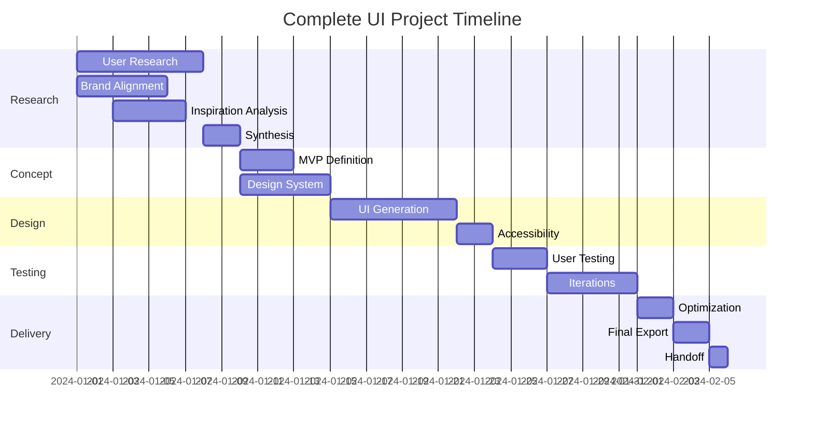

# Complete UI Project Workflow

End-to-end UI/UX design project workflow from initial concept to final deliverables, orchestrating all specialists and commands.

## Workflow Overview

```
RESEARCH → CONCEPT → DESIGN → ITERATE → DELIVER
```

## Project Initialization

```javascript
const initializeProject = {
  input: {
    projectName: 'string',
    projectType: 'web|mobile|desktop',
    description: 'string',
    timeline: 'weeks',
    constraints: ['budget', 'technical', 'brand']
  },
  
  setup: async (input) => {
    // Create project structure
    const project = {
      id: generateProjectId(),
      ...input,
      status: 'active',
      phase: 'research',
      team: assignSpecialists(input),
      memory: initializeMemory(input)
    };
    
    // Store in memory
    await memory.store(`project_${project.id}`, project);
    
    return project;
  }
};
```

## Phase 1: Research & Discovery (Week 1-2)

### Specialist Activation
```javascript
const researchPhase = {
  lead: 'ux-researcher',
  support: ['brand-strategist', 'design-analyst'],
  
  tasks: [
    {
      name: 'User Research',
      specialist: 'ux-researcher',
      activities: [
        'Conduct user interviews (8-12 participants)',
        'Create survey for quantitative data',
        'Analyze existing analytics',
        'Competitive analysis'
      ],
      outputs: [
        'User personas (3-5)',
        'Journey maps',
        'Pain points document',
        'Opportunity areas'
      ]
    },
    {
      name: 'Brand Alignment',
      specialist: 'brand-strategist',
      activities: [
        'Define brand values for project',
        'Establish emotional targets',
        'Create mood boards',
        'Define voice and tone'
      ],
      outputs: [
        'Brand guidelines',
        'Mood boards',
        'Emotional design targets'
      ]
    },
    {
      name: 'Inspiration Analysis',
      specialist: 'design-analyst',
      command: 'extract-design-dna',
      activities: [
        'Gather inspiration sources',
        'Extract visual DNA',
        'Analyze patterns',
        'Create initial direction'
      ],
      outputs: [
        'Design DNA tokens',
        'Pattern library',
        'Visual direction'
      ]
    }
  ]
};
```

### Research Synthesis
```javascript
const synthesizeResearch = async () => {
  const research = await Promise.all([
    uxResearcher.getFindings(),
    brandStrategist.getGuidelines(),
    designAnalyst.getDNA()
  ]);
  
  return {
    insights: mergeInsights(research),
    personas: research[0].personas,
    brandGuidelines: research[1].guidelines,
    designDNA: research[2].tokens,
    recommendations: generateRecommendations(research)
  };
};
```

## Phase 2: Concept Development (Week 2-3)

### MVP Definition
```javascript
const conceptPhase = {
  lead: 'design-orchestrator',
  command: 'generate-mvp-concept',
  
  process: async (researchSynthesis) => {
    // Generate MVP concept
    const mvpConcept = await generateMVPConcept({
      userNeeds: researchSynthesis.insights,
      constraints: project.constraints,
      timeline: project.timeline
    });
    
    // Fuse with design DNA
    const fusedConcept = await fuseStyleConcept({
      concept: mvpConcept,
      designDNA: researchSynthesis.designDNA,
      brand: researchSynthesis.brandGuidelines
    });
    
    return {
      concept: fusedConcept,
      features: prioritizeFeatures(mvpConcept),
      screens: identifyScreens(mvpConcept),
      flows: mapUserFlows(mvpConcept)
    };
  }
};
```

### Design System Creation
```javascript
const createDesignSystem = {
  lead: 'style-guide-expert',
  pattern: 'design-system-first',
  
  tasks: [
    'Generate color palette from DNA',
    'Create typography scale',
    'Define spacing system',
    'Create component tokens',
    'Build base components',
    'Document guidelines'
  ],
  
  outputs: {
    tokens: 'design-tokens.json',
    components: 'component-library/',
    documentation: 'design-system.md'
  }
};
```

## Phase 3: Design Production (Week 3-5)

### Parallel UI Generation
```javascript
const designProduction = {
  pattern: 'parallel-ui-generation',
  command: 'create-ui-variations',
  
  process: async (concept, designSystem) => {
    const screens = concept.screens;
    const variations = [];
    
    // Generate variations for each screen in parallel
    for (const screen of screens) {
      const screenVariations = await createUIVariations({
        screen,
        designSystem,
        count: 5,
        archetypes: ['conservative', 'modern', 'experimental', 'minimal', 'bold']
      });
      
      variations.push({
        screen,
        variations: screenVariations,
        selected: null
      });
    }
    
    return variations;
  },
  
  selection: async (variations) => {
    // Internal review
    const scores = await evaluateVariations(variations);
    
    // Stakeholder review
    const feedback = await gatherStakeholderFeedback(variations);
    
    // Select winners
    return selectWinningVariations(scores, feedback);
  }
};
```

### Accessibility Integration
```javascript
const accessibilityCheck = {
  specialist: 'accessibility-auditor',
  command: 'audit-accessibility',
  
  timing: 'After each design iteration',
  
  process: async (designs) => {
    const audits = await Promise.all(
      designs.map(design => auditAccessibility(design))
    );
    
    return {
      issues: audits.flatMap(a => a.issues),
      recommendations: generateA11yRecommendations(audits),
      requiredFixes: filterCriticalIssues(audits)
    };
  }
};
```

## Phase 4: Testing & Iteration (Week 5-6)

### User Testing
```javascript
const userTesting = {
  lead: 'ux-researcher',
  pattern: 'user-research-driven',
  
  protocol: {
    method: 'Moderated usability testing',
    participants: 8,
    tasks: generateTasksFromFlows(),
    metrics: ['Success rate', 'Time on task', 'Error rate', 'Satisfaction']
  },
  
  process: async (designs) => {
    // Create prototypes
    const prototypes = await createPrototypes(designs);
    
    // Run tests
    const results = await runUsabilityTests(prototypes);
    
    // Analyze findings
    return {
      quantitative: analyzeMetrics(results),
      qualitative: extractInsights(results),
      issues: identifyUsabilityIssues(results),
      recommendations: prioritizeImprovements(results)
    };
  }
};
```

### Design Iteration
```javascript
const iterationPhase = {
  command: 'iterate-designs',
  
  iterations: [
    {
      round: 1,
      focus: 'Critical usability issues',
      duration: '2 days',
      changes: 'Major flow adjustments'
    },
    {
      round: 2,
      focus: 'Visual refinements',
      duration: '2 days',
      changes: 'Polish and consistency'
    },
    {
      round: 3,
      focus: 'Edge cases',
      duration: '1 day',
      changes: 'Error states, empty states'
    }
  ],
  
  process: async (testResults, currentDesigns) => {
    let designs = currentDesigns;
    
    for (const iteration of iterations) {
      designs = await iterateDesigns({
        current: designs,
        feedback: testResults,
        focus: iteration.focus
      });
      
      // Quick validation
      const validation = await validateIteration(designs);
      if (validation.passed) {
        testResults = validation.results;
      }
    }
    
    return designs;
  }
};
```

## Phase 5: Delivery & Handoff (Week 6-7)

### Flow Optimization
```javascript
const optimizeFlows = {
  command: 'optimize-user-flow',
  
  process: async (designs, testResults) => {
    const optimizations = await optimizeUserFlow({
      current: designs,
      analytics: testResults,
      goals: project.successMetrics
    });
    
    return implementOptimizations(designs, optimizations);
  }
};
```

### Final Export
```javascript
const finalDelivery = {
  command: 'export-design-system',
  
  deliverables: {
    designSystem: {
      formats: ['web', 'mobile', 'figma'],
      includes: ['tokens', 'components', 'documentation']
    },
    
    screens: {
      format: 'production-ready',
      responsive: true,
      states: ['default', 'hover', 'active', 'disabled', 'error']
    },
    
    documentation: {
      designDecisions: 'Rationale for key choices',
      userFlows: 'Interactive flow diagrams',
      guidelines: 'Implementation notes'
    },
    
    handoff: {
      specs: 'Developer specifications',
      assets: 'Exported images and icons',
      animations: 'Motion specifications'
    }
  },
  
  process: async () => {
    const exports = await exportDesignSystem({
      format: 'all',
      options: {
        includeComponents: true,
        generateTypes: true,
        darkModeSupport: true
      }
    });
    
    return packageDeliverables(exports);
  }
};
```

## Project Timeline



## Quality Gates

### Phase Transitions
```javascript
const qualityGates = {
  researchToCooncept: {
    criteria: [
      'Minimum 3 personas defined',
      'Journey maps complete',
      'Design DNA extracted',
      'Stakeholder approval'
    ]
  },
  
  conceptToDesign: {
    criteria: [
      'MVP features prioritized',
      'Design system created',
      'User flows mapped',
      'Technical feasibility confirmed'
    ]
  },
  
  designToTesting: {
    criteria: [
      'All screens designed',
      'Accessibility audit passed',
      'Responsive versions complete',
      'Prototype functional'
    ]
  },
  
  testingToDelivery: {
    criteria: [
      'Usability issues resolved',
      'Stakeholder approval',
      'Performance targets met',
      'Documentation complete'
    ]
  }
};
```

## Success Metrics

```javascript
const projectSuccess = {
  quality: {
    designConsistency: '> 95%',
    accessibilityScore: 'WCAG AA minimum',
    usabilityScore: 'SUS > 80'
  },
  
  efficiency: {
    timelineAdherence: 'Within 10% of estimate',
    revisionRounds: '< 3 major revisions',
    reuseRate: '> 70% component reuse'
  },
  
  satisfaction: {
    stakeholder: 'NPS > 8',
    endUser: 'CSAT > 4.5/5',
    team: 'Efficiency rating > 4/5'
  }
};
```

## Orchestration Script

```javascript
async function executeCompleteUIProject(projectBrief) {
  // Initialize
  const project = await initializeProject(projectBrief);
  
  // Phase 1: Research
  updateStatus(project, 'Research Phase');
  const research = await executeResearchPhase(project);
  const synthesis = await synthesizeResearch(research);
  
  // Quality Gate
  await validatePhaseCompletion('research', synthesis);
  
  // Phase 2: Concept
  updateStatus(project, 'Concept Phase');
  const concept = await developConcept(synthesis);
  const designSystem = await createDesignSystem(concept);
  
  // Phase 3: Design
  updateStatus(project, 'Design Phase');
  const designs = await generateDesigns(concept, designSystem);
  const accessibleDesigns = await ensureAccessibility(designs);
  
  // Phase 4: Testing
  updateStatus(project, 'Testing Phase');
  const testResults = await conductUserTesting(accessibleDesigns);
  const finalDesigns = await iterateBasedOnFeedback(testResults);
  
  // Phase 5: Delivery
  updateStatus(project, 'Delivery Phase');
  const optimized = await optimizeFlows(finalDesigns);
  const deliverables = await exportFinalDeliverables(optimized);
  
  // Complete
  return completeProject(project, deliverables);
}
```

---

*Complete UI Project v1.0 | End-to-end workflow | Full orchestration*