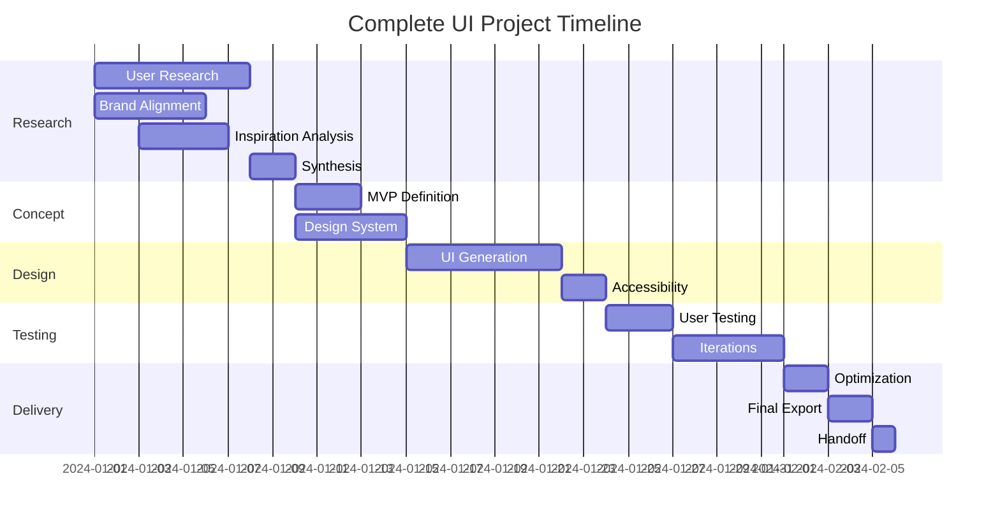

# Complete UI Project Workflow

End-to-end UI/UX design project workflow from initial concept to final deliverables, orchestrating all specialists and commands.

## Workflow Overview

```
RESEARCH → CONCEPT → DESIGN → ITERATE → DELIVER
```

## Project Initialization

```javascript
const initializeProject = {
  input: {
    projectName: 'string',
    projectType: 'web|mobile|desktop',
    description: 'string',
    timeline: 'weeks',
    constraints: ['budget', 'technical', 'brand']
  },
  
  setup: async (input) => {
    // Create project structure
    const project = {
      id: generateProjectId(),
      ...input,
      status: 'active',
      phase: 'research',
      team: assignSpecialists(input),
      memory: initializeMemory(input)
    };
    
    // Store in memory with context scoping
    await memory.store(`project_${project.id}`, project, 'project');
    
    // Generate project setup explanation
    const explanation = explainableAI.generateProjectRationale({
      projectType: input.projectType,
      constraints: input.constraints,
      teamSelection: project.team
    });
    
    return { project, explanation };
  }
};
```

## Phase 1: Research & Discovery (Week 1-2)

### Specialist Activation
```javascript
const researchPhase = {
  lead: 'ux-researcher',
  support: ['brand-strategist', 'design-analyst'],
  
  tasks: [
    {
      name: 'User Research',
      specialist: 'ux-researcher',
      activities: [
        'Conduct user interviews (8-12 participants)',
        'Create survey for quantitative data',
        'Analyze existing analytics',
        'Competitive analysis'
      ],
      outputs: [
        'User personas (3-5)',
        'Journey maps',
        'Pain points document',
        'Opportunity areas'
      ]
    },
    {
      name: 'Brand Alignment',
      specialist: 'brand-strategist',
      activities: [
        'Define brand values for project',
        'Establish emotional targets',
        'Create mood boards',
        'Define voice and tone'
      ],
      outputs: [
        'Brand guidelines',
        'Mood boards',
        'Emotional design targets'
      ]
    },
    {
      name: 'Inspiration Analysis',
      specialist: 'design-analyst',
      command: 'extract-design-dna',
      activities: [
        'Gather inspiration sources',
        'Extract visual DNA',
        'Analyze patterns',
        'Create initial direction'
      ],
      outputs: [
        'Design DNA tokens',
        'Pattern library',
        'Visual direction'
      ]
    }
  ]
};
```

### Research Synthesis
```javascript
const synthesizeResearch = async () => {
  const research = await Promise.all([
    uxResearcher.getFindings(),
    brandStrategist.getGuidelines(),
    designAnalyst.getDNA()
  ]);
  
  // Check for conflicts in research findings
  const conflicts = conflictResolver.analyzeResearchConflicts(research);
  if (conflicts.length > 0) {
    const resolution = await conflictResolver.resolve(conflicts);
    research = resolution.harmonized;
  }
  
  // Generate transparency checkpoint
  const synthesisExplanation = explainableAI.explainSynthesis({
    sources: research,
    conflicts: conflicts,
    resolution: resolution,
    confidence: calculateSynthesisConfidence(research)
  });
  
  return {
    insights: mergeInsights(research),
    personas: research[0].personas,
    brandGuidelines: research[1].guidelines,
    designDNA: research[2].tokens,
    recommendations: generateRecommendations(research),
    explanation: synthesisExplanation
  };
};
```

### Phase 1 Reflection Point
```
*Pause and reflect on Research & Discovery:*

Quality Assessment (Score each 1-5):
- User Needs Depth: Genuine insights uncovered? [Score: __/5]
- Persona Validity: Based on real data? [Score: __/5]
- Visual DNA Authenticity: True to brand vision? [Score: __/5]
Phase Quality Score: [Average]/5

Learning Capture (Rate value 1-5):
- Surprise Insights: What surprised us? [Value: __/5]
- Method Effectiveness: Best yielding approaches? [Score: __/5]
- Process Improvements: What to change? [Actionability: __/5]
Learning Score: [Average]/5

Readiness Check (Yes=5, Partial=3, No=1):
- Clarity to Proceed: Sufficient understanding? [Score: __/5]
- Unknown Risks: Critical gaps addressed? [Score: __/5]
- Team Alignment: Shared vision? [Score: __/5]
Readiness Score: [Average]/5

Overall Phase 1 Score: [Total Average]/5
```

## Phase 2: Concept Development (Week 2-3)

### MVP Definition
```javascript
const conceptPhase = {
  lead: 'design-orchestrator',
  command: 'generate-mvp-concept',
  
  process: async (researchSynthesis) => {
    // Generate MVP concept
    const mvpConcept = await generateMVPConcept({
      userNeeds: researchSynthesis.insights,
      constraints: project.constraints,
      timeline: project.timeline
    });
    
    // Fuse with design DNA
    const fusedConcept = await fuseStyleConcept({
      concept: mvpConcept,
      designDNA: researchSynthesis.designDNA,
      brand: researchSynthesis.brandGuidelines
    });
    
    return {
      concept: fusedConcept,
      features: prioritizeFeatures(mvpConcept),
      screens: identifyScreens(mvpConcept),
      flows: mapUserFlows(mvpConcept)
    };
  }
};
```

### Design System Creation
```javascript
const createDesignSystem = {
  lead: 'style-guide-expert',
  pattern: 'design-system-first',
  
  tasks: [
    'Generate color palette from DNA',
    'Create typography scale',
    'Define spacing system',
    'Create component tokens',
    'Build base components',
    'Document guidelines'
  ],
  
  outputs: {
    tokens: 'design-tokens.json',
    components: 'component-library/',
    documentation: 'design-system.md'
  }
};
```

### Phase 2 Reflection Point
```
*Pause and reflect on Concept Development:*

Concept Validation (Score each 1-5):
- User Need Alignment: MVP addresses core needs? [Score: __/5]
- System Flexibility: Ready for future growth? [Score: __/5]
- Innovation Balance: Novel yet familiar? [Score: __/5]
Validation Score: [Average]/5

Strategic Alignment (Score each 1-5):
- Business Objectives: Supports goals? [Score: __/5]
- Competitive Differentiation: Unique position? [Score: __/5]
- Scope Realism: Achievable with resources? [Score: __/5]
Alignment Score: [Average]/5

Design System Quality (Score each 1-5):
- Token Completeness: Comprehensive yet manageable? [Score: __/5]
- Component Consistency: Enables unified creation? [Score: __/5]
- System Usability: Others can understand/use? [Score: __/5]
System Score: [Average]/5

Overall Phase 2 Score: [Total Average]/5
```

## Phase 3: Design Production (Week 3-5)

### Parallel UI Generation
```javascript
const designProduction = {
  pattern: 'parallel-ui-generation',
  command: 'create-ui-variations',
  
  process: async (concept, designSystem) => {
    const screens = concept.screens;
    const variations = [];
    
    // Generate variations for each screen in parallel
    for (const screen of screens) {
      // Suggest tools based on screen type
      const suggestedTools = toolSuggestionPatterns.recommend({
        task: `Generate ${screen.type} variations`,
        context: { designSystem, screenType: screen.type }
      });
      
      const screenVariations = await createUIVariations({
        screen,
        designSystem,
        count: 5,
        archetypes: ['conservative', 'modern', 'experimental', 'minimal', 'bold'],
        tools: suggestedTools
      });
      
      // Explain variation generation approach
      const variationExplanation = explainableAI.explainVariationStrategy({
        screen: screen,
        archetypes: screenVariations.map(v => v.archetype),
        rationale: 'Coverage of different user preferences and contexts'
      });
      
      variations.push({
        screen,
        variations: screenVariations,
        selected: null,
        explanation: variationExplanation
      });
    }
    
    return variations;
  },
  
  selection: async (variations) => {
    // Internal review
    const scores = await evaluateVariations(variations);
    
    // Stakeholder review
    const feedback = await gatherStakeholderFeedback(variations);
    
    // Select winners
    return selectWinningVariations(scores, feedback);
  }
};
```

### Accessibility Integration
```javascript
const accessibilityCheck = {
  specialist: 'accessibility-auditor',
  command: 'audit-accessibility',
  
  timing: 'After each design iteration',
  
  process: async (designs) => {
    const audits = await Promise.all(
      designs.map(design => auditAccessibility(design))
    );
    
    return {
      issues: audits.flatMap(a => a.issues),
      recommendations: generateA11yRecommendations(audits),
      requiredFixes: filterCriticalIssues(audits)
    };
  }
};
```

### Phase 3 Reflection Point
```
*Pause and reflect on Design Production:*

Design Quality (Score each 1-5):
- Variation Diversity: Genuinely different directions? [Score: __/5]
- Accessibility Integration: Built-in, not bolted-on? [Score: __/5]
- System Consistency: Following design tokens? [Score: __/5]
Quality Score: [Average]/5

Creative Process (Score each 1-5):
- Innovation Level: Pushed boundaries appropriately? [Score: __/5]
- Method Effectiveness: Best generation approach? [Score: __/5]
- Process Efficiency: Parallel processing gains? [Score: __/5]
Process Score: [Average]/5

Stakeholder Alignment (Score each 1-5):
- Expectation Match: Meeting stakeholder vision? [Score: __/5]
- Feedback Quality: Clear patterns emerging? [Score: __/5]
- Approach Validation: On the right track? [Score: __/5]
Alignment Score: [Average]/5

Overall Phase 3 Score: [Total Average]/5
```

## Phase 4: Testing & Iteration (Week 5-6)

### User Testing
```javascript
const userTesting = {
  lead: 'ux-researcher',
  pattern: 'user-research-driven',
  
  protocol: {
    method: 'Moderated usability testing',
    participants: 8,
    tasks: generateTasksFromFlows(),
    metrics: ['Success rate', 'Time on task', 'Error rate', 'Satisfaction']
  },
  
  process: async (designs) => {
    // Create prototypes
    const prototypes = await createPrototypes(designs);
    
    // Run tests
    const results = await runUsabilityTests(prototypes);
    
    // Analyze findings
    return {
      quantitative: analyzeMetrics(results),
      qualitative: extractInsights(results),
      issues: identifyUsabilityIssues(results),
      recommendations: prioritizeImprovements(results)
    };
  }
};
```

### Design Iteration
```javascript
const iterationPhase = {
  command: 'iterate-designs',
  
  iterations: [
    {
      round: 1,
      focus: 'Critical usability issues',
      duration: '2 days',
      changes: 'Major flow adjustments'
    },
    {
      round: 2,
      focus: 'Visual refinements',
      duration: '2 days',
      changes: 'Polish and consistency'
    },
    {
      round: 3,
      focus: 'Edge cases',
      duration: '1 day',
      changes: 'Error states, empty states'
    }
  ],
  
  process: async (testResults, currentDesigns) => {
    let designs = currentDesigns;
    
    for (const iteration of iterations) {
      designs = await iterateDesigns({
        current: designs,
        feedback: testResults,
        focus: iteration.focus
      });
      
      // Quick validation
      const validation = await validateIteration(designs);
      if (validation.passed) {
        testResults = validation.results;
      }
    }
    
    return designs;
  }
};
```

### Phase 4 Reflection Point
```
*Pause and reflect on Testing & Iteration:*

Testing Insights (Score each 1-5):
- Surprise Factor: New discoveries from testing? [Value: __/5]
- Assumption Validation: Predictions accurate? [Score: __/5]
- Behavior Prediction: Anticipated user actions? [Score: __/5]
Insight Score: [Average]/5

Iteration Effectiveness (Score each 1-5):
- Experience Improvement: Meaningful enhancements? [Score: __/5]
- Change Balance: Right mix of polish vs. overhaul? [Score: __/5]
- Priority Accuracy: Fixed the right things? [Score: __/5]
Iteration Score: [Average]/5

Learning for Future (Score each 1-5):
- Method Value: Best testing approaches identified? [Score: __/5]
- Anticipation Skills: Better at predicting needs? [Score: __/5]
- Pattern Recognition: Reusable insights gained? [Score: __/5]
Learning Score: [Average]/5

Overall Phase 4 Score: [Total Average]/5
```

## Feedback Interpretation

### Processing User Test Results
```javascript
const interpretFeedback = {
  categorize: (feedback) => ({
    critical: feedback.filter(f => f.severity === 'blocker'),
    important: feedback.filter(f => f.severity === 'major'),
    nice_to_have: feedback.filter(f => f.severity === 'minor'),
    positive: feedback.filter(f => f.sentiment === 'positive')
  }),
  
  prioritize: (categorized) => {
    // Address critical issues first
    const actionPlan = [
      ...categorized.critical.map(f => ({ ...f, priority: 1 })),
      ...categorized.important.map(f => ({ ...f, priority: 2 })),
      ...categorized.nice_to_have.map(f => ({ ...f, priority: 3 }))
    ];
    
    return actionPlan.sort((a, b) => a.priority - b.priority);
  },
  
  interpret: (feedback) => {
    const patterns = {
      "too complex": { action: "simplify", focus: "reduce cognitive load" },
      "can't find": { action: "improve hierarchy", focus: "navigation clarity" },
      "confusing": { action: "clarify", focus: "better labels and guidance" },
      "slow": { action: "optimize", focus: "performance and perceived speed" },
      "love it": { action: "preserve", focus: "maintain successful elements" }
    };
    
    return matchFeedbackToActions(feedback, patterns);
  }
};
```

### Stakeholder vs User Feedback
```javascript
const balanceFeedback = {
  stakeholder: {
    weight: 0.4,
    focus: ["Business goals", "Brand alignment", "Feature completeness"],
    veto_power: ["Brand violations", "Legal requirements"]
  },
  
  user: {
    weight: 0.6,
    focus: ["Usability", "Task completion", "Satisfaction"],
    veto_power: ["Critical usability issues", "Accessibility failures"]
  },
  
  reconcile: (stakeholderFeedback, userFeedback) => {
    // Find conflicts using enhanced conflict detection
    const conflicts = conflictResolver.identifyFeedbackConflicts(
      stakeholderFeedback, 
      userFeedback
    );
    
    // Apply contextual learning to understand patterns
    const contextualInsights = contextualLearning.analyzeFeedbackContext({
      stakeholder: stakeholderFeedback,
      user: userFeedback,
      projectContext: getCurrentContext()
    });
    
    // Resolve with full transparency
    return conflicts.map(conflict => {
      const resolution = conflictResolver.resolve(conflict, contextualInsights);
      const explanation = explainableAI.explainResolution({
        conflict: conflict,
        resolution: resolution,
        factors: ['user impact', 'business value', 'technical feasibility'],
        confidence: resolution.confidence
      });
      
      return {
        issue: conflict,
        resolution: resolution.decision,
        rationale: explanation,
        confidence: resolution.confidence
      };
    });
  }
};
```

## Phase 5: Delivery & Handoff (Week 6-7)

### Flow Optimization
```javascript
const optimizeFlows = {
  command: 'optimize-user-flow',
  
  process: async (designs, testResults) => {
    const optimizations = await optimizeUserFlow({
      current: designs,
      analytics: testResults,
      goals: project.successMetrics
    });
    
    return implementOptimizations(designs, optimizations);
  }
};
```

### Final Export
```javascript
const finalDelivery = {
  command: 'export-design-system',
  
  deliverables: {
    designSystem: {
      formats: ['web', 'mobile', 'figma'],
      includes: ['tokens', 'components', 'documentation']
    },
    
    screens: {
      format: 'production-ready',
      responsive: true,
      states: ['default', 'hover', 'active', 'disabled', 'error']
    },
    
    documentation: {
      designDecisions: 'Rationale for key choices',
      userFlows: 'Interactive flow diagrams',
      guidelines: 'Implementation notes'
    },
    
    handoff: {
      specs: 'Developer specifications',
      assets: 'Exported images and icons',
      animations: 'Motion specifications'
    }
  },
  
  process: async () => {
    const exports = await exportDesignSystem({
      format: 'all',
      options: {
        includeComponents: true,
        generateTypes: true,
        darkModeSupport: true
      }
    });
    
    return packageDeliverables(exports);
  }
};
```

## Project Timeline



## Quality Gates

### Phase Transitions
```javascript
const qualityGates = {
  researchToCooncept: {
    criteria: [
      'Minimum 3 personas defined',
      'Journey maps complete',
      'Design DNA extracted',
      'Stakeholder approval'
    ]
  },
  
  conceptToDesign: {
    criteria: [
      'MVP features prioritized',
      'Design system created',
      'User flows mapped',
      'Technical feasibility confirmed'
    ]
  },
  
  designToTesting: {
    criteria: [
      'All screens designed',
      'Accessibility audit passed',
      'Responsive versions complete',
      'Prototype functional'
    ]
  },
  
  testingToDelivery: {
    criteria: [
      'Usability issues resolved',
      'Stakeholder approval',
      'Performance targets met',
      'Documentation complete'
    ]
  }
};
```

## Success Metrics

```javascript
const projectSuccess = {
  quality: {
    designConsistency: '> 95%',
    accessibilityScore: 'WCAG AA minimum',
    usabilityScore: 'SUS > 80'
  },
  
  efficiency: {
    timelineAdherence: 'Within 10% of estimate',
    revisionRounds: '< 3 major revisions',
    reuseRate: '> 70% component reuse'
  },
  
  satisfaction: {
    stakeholder: 'NPS > 8',
    endUser: 'CSAT > 4.5/5',
    team: 'Efficiency rating > 4/5'
  }
};
```

## Orchestration Script

```javascript
async function executeCompleteUIProject(projectBrief) {
  // Initialize
  const project = await initializeProject(projectBrief);
  
  // Phase 1: Research
  updateStatus(project, 'Research Phase');
  const research = await executeResearchPhase(project);
  const synthesis = await synthesizeResearch(research);
  
  // Quality Gate
  await validatePhaseCompletion('research', synthesis);
  
  // Phase 2: Concept
  updateStatus(project, 'Concept Phase');
  const concept = await developConcept(synthesis);
  const designSystem = await createDesignSystem(concept);
  
  // Phase 3: Design
  updateStatus(project, 'Design Phase');
  const designs = await generateDesigns(concept, designSystem);
  const accessibleDesigns = await ensureAccessibility(designs);
  
  // Phase 4: Testing
  updateStatus(project, 'Testing Phase');
  const testResults = await conductUserTesting(accessibleDesigns);
  const finalDesigns = await iterateBasedOnFeedback(testResults);
  
  // Phase 5: Delivery
  updateStatus(project, 'Delivery Phase');
  const optimized = await optimizeFlows(finalDesigns);
  const deliverables = await exportFinalDeliverables(optimized);
  
  // Complete
  return completeProject(project, deliverables);
}
```

### Final Project Reflection
```
*Comprehensive project retrospective:*

Overall Success Assessment (Score each 1-5):
- Goal Achievement: Met original objectives? [Score: __/5]
- User Need Fulfillment: Product serves users well? [Score: __/5]
- Business Impact: Measurable value delivered? [Score: __/5]
Success Score: [Average]/5

Process Evaluation (Score each 1-5):
- Phase Execution: Smooth workflow progression? [Score: __/5]
- Challenge Management: Handled obstacles well? [Score: __/5]
- Estimation Accuracy: Time predictions correct? [Score: __/5]
Process Score: [Average]/5

Team & Collaboration (Score each 1-5):
- Specialist Coordination: Effective orchestration? [Score: __/5]
- Communication Quality: Clear and efficient? [Score: __/5]
- Collaboration Synergy: Team worked well together? [Score: __/5]
Team Score: [Average]/5

Key Learnings (Rate value 1-5):
- Technical Insights: Valuable knowledge gained? [Value: __/5]
- Design Patterns: Reusable discoveries? [Value: __/5]
- Process Improvements: Better ways identified? [Value: __/5]
- User Understanding: Deeper empathy achieved? [Value: __/5]
Learning Score: [Average]/5

Future Recommendations (Score clarity 1-5):
- Retrospective Clarity: Know what to change? [Score: __/5]
- Pattern Maturity: Ready to standardize? [Score: __/5]
- Capability Gaps: Skills to develop clear? [Score: __/5]
- Challenge Anticipation: Better prepared? [Score: __/5]
Future Score: [Average]/5

Knowledge Preservation (Score completeness 1-5):
- Component Documentation: Patterns captured? [Score: __/5]
- System Updates: Tokens enhanced? [Score: __/5]
- Decision Records: Rationale documented? [Score: __/5]
- Team Sharing: Knowledge transferred? [Score: __/5]
Preservation Score: [Average]/5

FINAL PROJECT SCORE: [Total Average]/5

Project Performance Dashboard:
├── Highest Scoring Area: [Category - Score]
├── Phase Performance Range: [Lowest] to [Highest]
├── Key Success Factor: [What made the difference]
├── Primary Learning: [Most valuable insight]
└── Next Project Focus: [Top improvement priority]
```

---

*Complete UI Project v1.0 | End-to-end workflow | Full orchestration*