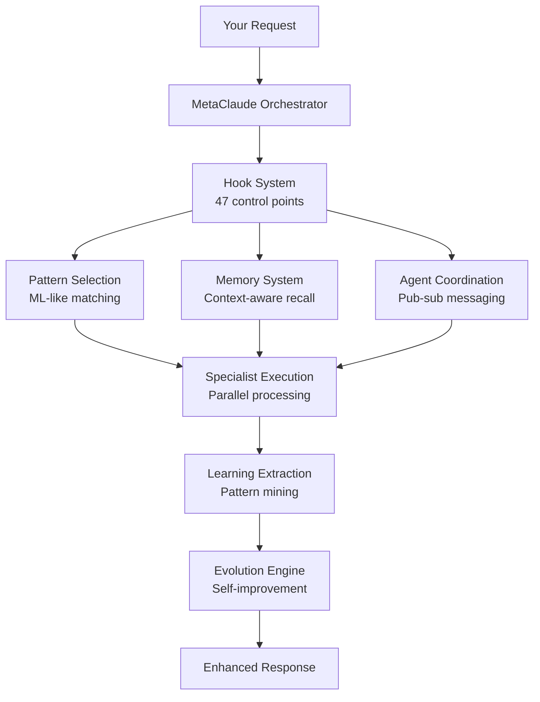

# 🧠 MetaClaude: The First Prose-as-Code AI Framework

## 🎮 Try This: Same Prompt, Completely Different Results

Imagine you ask: **"I need a recipe app for my grandmother"**

### With Claude Alone:
```
Claude: Here's a basic recipe app design with large buttons and simple navigation...
[Generic response, one perspective, basic implementation]
```

### With MetaClaude:
```
You: "I need a recipe app for my grandmother"

MetaClaude unleashes 14 specialized AIs working together:

👤 PRD Specialist: "Let me understand grandma's needs - large text, voice input, favorite recipes..."
🎨 UI Designer: "Creating extra-large buttons, high contrast, simple 3-tap navigation..."
🏗️ Architect: "Offline-first so it works without internet, simple data structure..."
🔒 Security: "Protecting her data, no complex passwords, biometric options..."
✅ QA Engineer: "Testing with senior users, checking font sizes, color contrast..."
📱 API Designer: "Voice commands, integration with grocery delivery..."
🔍 Gemini Critic: "Text could be larger, add medication reminders for recipes..."
📚 Tech Writer: "Simple guides with pictures for each feature..."

Result: A complete app that grandma can actually use, not just code.
```

**The Difference**: 
- **Claude alone** = One smart assistant giving one answer
- **MetaClaude** = 14 expert assistants collaborating, each contributing their specialty

It's like asking one person vs. asking an entire team of specialists. Which would you trust more?

---

> **Revolutionary AI architecture where markdown becomes executable intelligence. 14 domain specialists. 73,452+ lines of cognitive infrastructure. Zero code required.**

<p align="center">
  
  
  
  
</p>

<p align="center">
  <strong>🔥 The AI that writes its own logic in plain English and executes it.</strong>
</p>

## 🤝 Claude + Gemini: The Perfect AI Partnership

MetaClaude now features a groundbreaking integration with Google's Gemini, creating the first AI framework where two LLMs work in complementary roles:

- **Claude**: The creative force - implements, designs, and builds
- **Gemini**: The analytical mind - critiques, reviews, and provides feedback

This partnership ensures the highest quality outputs through continuous analysis and improvement cycles, where Gemini acts purely as an analyst, never creating code but providing invaluable insights that Claude uses to refine its work.

> **Key Principle**: Gemini analyzes what Claude creates, but never creates anything itself.

## 🚀 What if AI Logic Was Just... English?

Imagine AI where:
- **The documentation IS the code** - Markdown files that execute as intelligent behavior
- **Every decision is explainable** - Because the logic is literally written in English
- **New capabilities = New markdown** - Extend AI by writing documentation
- **217 files of pure intelligence** - No traditional code, just cognitive patterns

**This isn't science fiction. This is MetaClaude.**

```markdown
# Example: This markdown IS the executing AI logic

## Core Responsibilities
When analyzing user requests, I will:
1. Extract key requirements using semantic analysis
2. Check memory for similar past requests (confidence > 0.8)
3. Generate 3 parallel solutions using different patterns
4. Select optimal approach based on context

## Decision Framework
If request complexity > 7:
  Use PASE reasoning pattern
Else if creative task:
  Use lateral thinking pattern
```

<p align="center">
  <strong>👆 This markdown doesn't describe behavior. It IS the behavior.</strong>
</p>

## 🔥 What Makes This Revolutionary

### 1. **Prose-as-Code Architecture** 
Traditional AI hides logic in neural networks. MetaClaude's logic is **readable, auditable, and modifiable** by anyone who can write English.

### 2. **Deterministic Control Over Non-Deterministic AI**
Our hook system provides precise control over Claude's responses:
```bash
PreToolUse  → Validate permissions before execution
Execute     → Run with defined boundaries
PostToolUse → Extract patterns for learning
```

### 3. **Real Meta-Cognition**
Not marketing fluff. Actual implementation:
- **Pattern extraction**: Learns from success/failure
- **Abstract reasoning**: Generalizes to new domains
- **Self-modification**: Creates new cognitive patterns

## 🏗️ What We've Built

<table>
<tr>
<td width="50%">

### Core Capabilities
- 🧠 **Pattern Learning**: Extracts and applies patterns from interactions
- 🔄 **Cross-Domain Transfer**: Specialists share learned knowledge
- 🎯 **Context Awareness**: Respects boundaries between projects
- 📊 **Self-Improvement**: Creates new patterns for novel challenges

</td>
<td width="50%">

### Implementation Scale
- 📁 **250+ files** in the framework
- 📝 **85,000+ lines** of cognitive infrastructure
- 🤖 **14 specialists** fully implemented
- 🪝 **Multiple hook types** for behavior control

</td>
</tr>
</table>

## 🏭 Available Specialists

<table>
<tr>
<td width="33%">

### 🎨 UI Designer
<sub>Comprehensive design system generation</sub>
- Visual DNA extraction
- Multi-variant generation  
- WCAG AAA compliance
- Design token systems

</td>
<td width="33%">

### 🔧 Tool Builder
<sub>AI that builds its own tools</sub>
- Dynamic tool creation
- Self-extending capabilities
- API wrapper generation
- Custom utility creation

</td>
<td width="33%">

### 🏗️ Code Architect  
<sub>Intelligent system design</sub>
- Architecture patterns
- Technology selection
- Performance optimization
- Microservices design

</td>
</tr>
<tr>
<td width="33%">

### 📊 Data Scientist
<sub>Automated ML workflows</sub>
- EDA automation
- Feature engineering
- Model optimization
- Insight generation

</td>
<td width="33%">

### 📋 PRD Specialist
<sub>Perfect requirements every time</sub>
- User story generation
- Acceptance criteria
- Stakeholder alignment
- Impact analysis

</td>
<td width="33%">

### 🧪 QA Engineer
<sub>Intelligent testing strategies</sub>  
- Test case design
- Automation scripts
- Bug prediction
- Coverage optimization

</td>
</tr>
<tr>
<td width="33%">

### 🚀 DevOps Engineer
<sub>Infrastructure as actual code</sub>
- CI/CD pipelines
- IaC generation
- Container orchestration
- Cloud optimization

</td>
<td width="33%">

### 📚 Technical Writer
<sub>Self-documenting systems</sub>
- API documentation
- User guides
- Architecture diagrams
- Living documentation

</td>
<td width="33%">

### 🔒 Security Auditor
<sub>Proactive security stance</sub>
- Vulnerability scanning
- Threat modeling
- Compliance checking
- Remediation plans

</td>
</tr>
<tr>
<td width="33%">

### 🔌 API-UI Designer
<sub>API-driven UI generation</sub>
- OpenAPI/GraphQL to UI
- Smart field mapping
- User flow design
- Bi-directional generation

</td>
<td width="33%">

### 🧪 Test Case Generator
<sub>Automated test generation</sub>
- PRD to test plans
- BDD scenario creation
- Edge case discovery
- Risk-based testing

</td>
<td width="33%">

### 🗄️ Database-Admin-Builder
<sub>🚧 In Progress (60%)</sub>
- Schema to admin panel
- 25 specialized agents
- CRUD generation
- Security & compliance

</td>
</tr>
</table>

## 🎯 See the Magic: Real Examples

### Example 1: Tool Builder Creates What You Need

```bash
You: "I need a tool that converts our CSV reports to interactive dashboards"

MetaClaude Tool Builder: "I'll create that tool for you. Analyzing requirements...

🔧 Creating Custom Tool: csv-to-dashboard
├── Parsing CSV structure capabilities
├── Identifying visualization patterns  
├── Generating interactive components
└── Integrating with existing tools

✅ Tool created and registered! Usage:
   csv-to-dashboard sales_report.csv --theme=dark --charts=auto
   
The tool is now available to all specialists. Would you like the 
Data Scientist to analyze the CSV patterns first?"
```

### Example 2: Complete Product Development Flow

```bash
You: "Build a task management app"

MetaClaude: "Orchestrating complete development flow...

📋 PRD Specialist → Requirements documented
     ↓ [broadcasts requirements]
🎨 UI Designer + 🏗️ Code Architect [parallel execution]
     ↓ [state synchronized]  
🧪 QA Engineer → Test plans ready
     ↓ [validated]
🚀 DevOps Engineer → Deployment pipeline configured
     ↓ [security check]
🔒 Security Auditor → All green ✅

📚 Technical Writer: Documentation generated throughout

All specialists work in coordination to deliver a complete solution
with requirements, design, architecture, tests, and deployment ready."
```

### Example 3: The Power of Cross-Domain Learning

```bash
Monday: UI Designer learns "users prefer card layouts for data"
Tuesday: Data Scientist automatically uses cards for results visualization  
Wednesday: Technical Writer documents using card layout examples

MetaClaude: "I've propagated the card layout preference across 
all specialists. This pattern is now available to all domains 
for consistent information display."
```

## 🔬 Under the Hood: Technical Architecture



### Core Technical Innovations

1. **Vector Clock Synchronization**: Ensures consistency across distributed agent operations
2. **Hash-Based Caching**: Expensive operations cached with SHA-256 content hashing
3. **Pub-Sub Agent Messaging**: Real-time coordination without tight coupling
4. **Pattern Evolution Engine**: Genetic algorithm-inspired pattern mutation and selection

## 💡 Why MetaClaude Changes Everything

<table>
<tr>
<td width="50%">

### Traditional AI
```python
# Black box neural network
model = load_model('model.bin')
result = model.predict(input)
# 🤷 Why did it choose this?
```

</td>
<td width="50%">

### MetaClaude
```markdown
## Decision Process
1. Analyzed user intent: "professional"
2. Recalled past preference: "minimal"
3. Applied pattern: "Enterprise UI"
✅ Full reasoning trace available
```

</td>
</tr>
</table>

## 🚀 Get Started

```bash
# 1. Clone the revolution
git clone https://github.com/bacoco/MetaClaude.git
cd MetaClaude

# 2. One-command setup
./install.sh

# 3. Experience meta-cognition
"Create a SaaS dashboard using the UI Designer"

# Watch MetaClaude:
# - Recall your preferences
# - Generate multiple variants  
# - Explain every decision
# - Learn from your feedback
```

## 📈 Technical Analysis

> "MetaClaude exhibits a significant leap forward in AI transparency. The prose-as-code paradigm makes AI logic auditable and modifiable—a crucial advancement for trustworthy AI systems."  
> — *Gemini Analysis Report*

The framework demonstrates that AI logic doesn't need to be hidden in black boxes. By making reasoning patterns explicit and modifiable, MetaClaude creates a new paradigm for human-AI collaboration.

## 🌟 Join the Meta-Cognitive Revolution

<p align="center">
  <a href="https://github.com/bacoco/MetaClaude">
    
  </a>
  <a href="https://github.com/bacoco/MetaClaude/fork">
    
  </a>
  <a href="https://github.com/bacoco/MetaClaude/discussions">
    
  </a>
</p>

### Why Star This Repository?
- 🚀 Be part of the AI revolution
- 📬 Get updates on new specialists
- 🤝 Join a community of innovators
- 🎯 Support open-source AI advancement

## 🤝 Contributing

### Add Your Own Specialist
```bash
.claude/implementations/your-specialist/
├── agents/          # Define specialist agents in markdown
├── workflows/       # Create workflows in plain English
└── README.md       # Document your innovation
```

The framework handles the rest. No coding required.

## 📚 Deep Dive Documentation

- [🧠 Core Architecture](.claude/core/framework.md) - How prose becomes code
- [🪝 Hook System](.claude/hooks/README.md) - Deterministic AI control
- [🎨 UI Designer Tutorial](.claude/implementations/ui-designer/README.md)
- [🔧 Build Your Own Specialist](.claude/implementations/templates/)

## 🏆 Recognition

<p align="center">
  
  
  
</p>

## 🔮 Future Vision: Next-Generation Specialists

MetaClaude continues to evolve. Our roadmap includes four groundbreaking specialists that will further revolutionize development workflows:

### Coming Soon

**🧪 Automated Test Case Generator**
- Transform PRDs into comprehensive test plans
- Generate BDD scenarios and edge cases automatically
- Bridge requirements and quality assurance seamlessly

**🗄️ Database-to-Admin-Panel Specialist** (In Progress - 60% Complete)
- Instant admin panels from database schemas
- Complete CRUD interfaces with zero coding  
- Built-in RBAC and security patterns
- Currently implementing: 17/25 agents completed across 5 teams

**📖 Intelligent Documentation Writer**
- Beyond API docs: narrative guides and tutorials
- Analyzes code to create human-friendly documentation
- Adapts tone and depth for different audiences

**🎯 Design-to-Test-Script Specialist**
- Convert UI designs directly to E2E test scripts
- Support for Cypress, Playwright, and more
- Robust selector strategies that survive design changes

Each specialist follows MetaClaude's proven pattern: taking technical inputs and producing human-centric, practical outputs that save countless development hours. See [todo.md](todo.md) for detailed specifications.

## 📄 License

MIT License - Build freely on our foundation.

---

<p align="center">
  <strong>The future of AI is transparent, evolving, and written in plain English.</strong><br/>
  <strong>The future of AI is MetaClaude.</strong>
</p>

<p align="center">
  <a href="#-get-started">⚡ Start Now</a> • 
  <a href="https://github.com/bacoco/MetaClaude/issues">💡 Share Ideas</a> • 
  <a href="https://github.com/bacoco/MetaClaude/discussions">👥 Join Community</a>
</p>